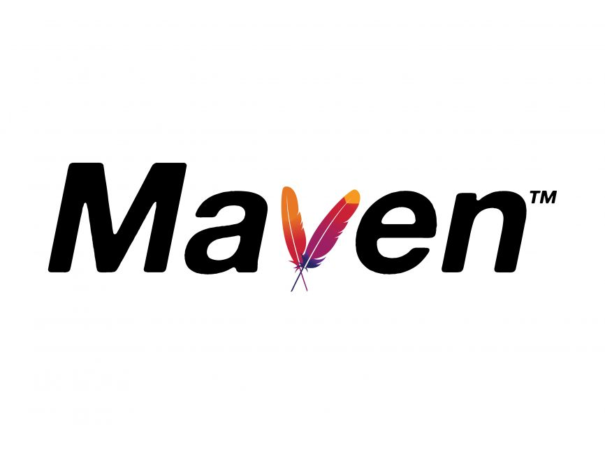
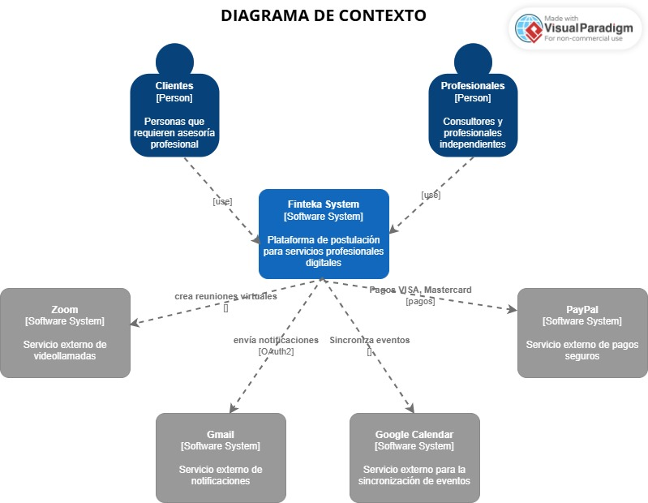
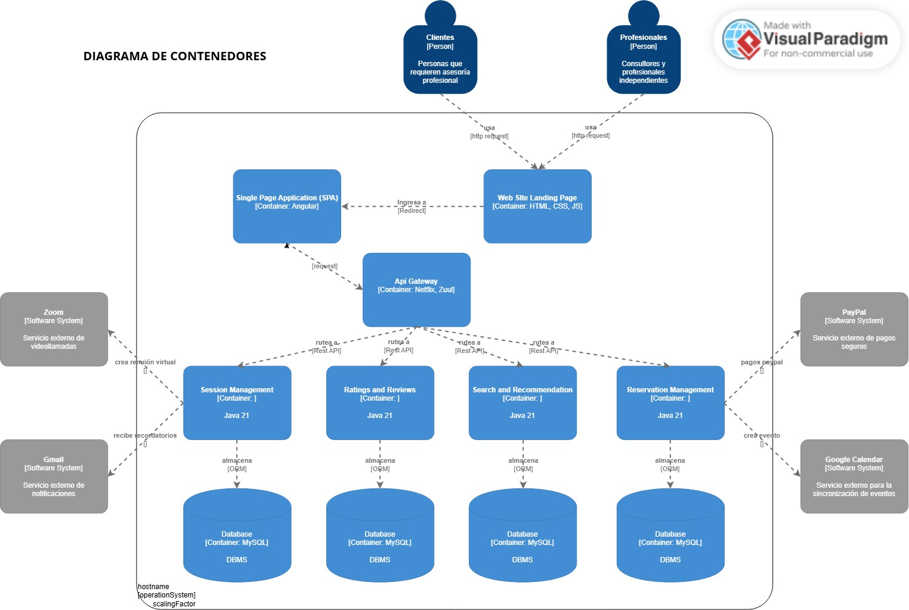
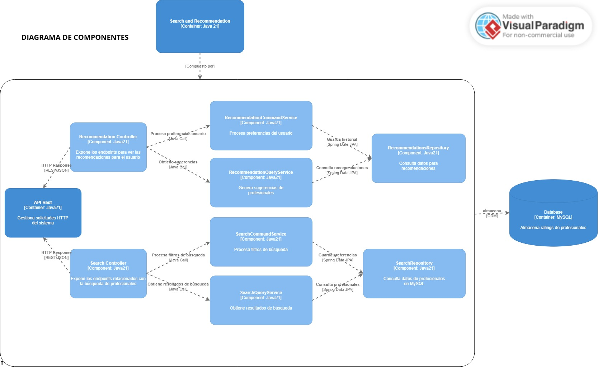
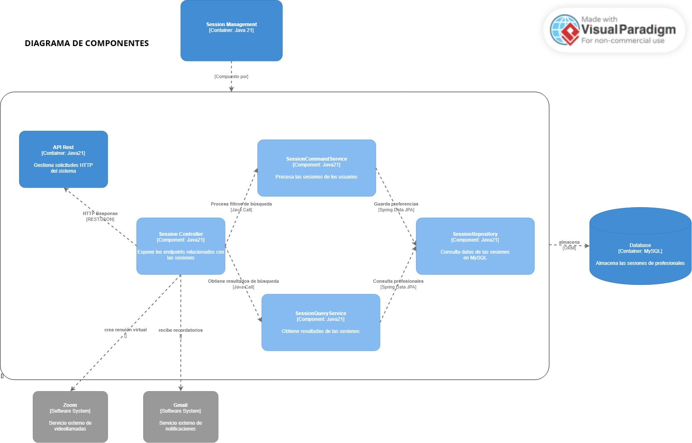
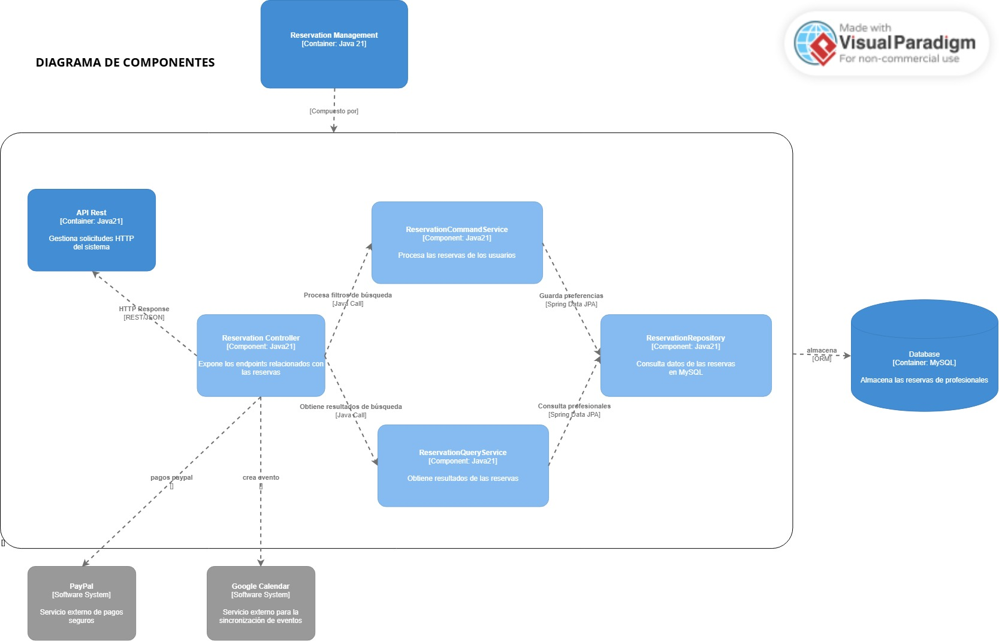
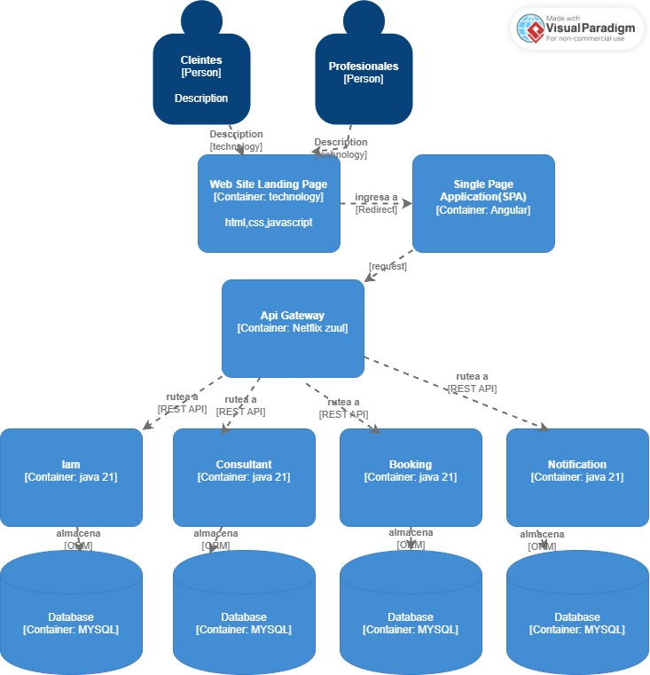
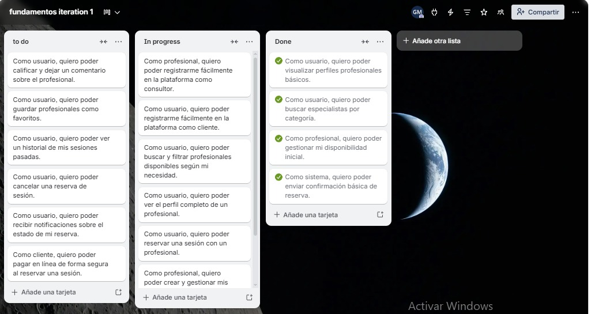

# UNIVERSIDAD PERUANA DE CIENCIAS APLICADAS
### Ingeniería de Software
### 7mo ciclo
### 1ASI0657 - Fundamentos de Arquitectura de Software 
### 202610
### NRC: 7943
### Profesor: Ernesto Ocampo Tello
## Informe de TB2

## Producto:  Finteka

### Relación de integrantes:

| **Código** | **Apellidos y Nombres**               |
| :--------: | :------------------------------------ |
| U202310425 | Aguirre Castillo, Sergio Cesar        |
| U202128264 | Burga Loarte, Anaely Zarely           |
| U202220659 | Mamani Marca, Gabriel Cristian        |
| U20201f846 | Oshiro Yamashita, Daiki Oscar         |
| U202218645 | Montes Maza, Augusto Sebastian        |

  
 
 

### Abril,2026

---

## Registro de Versiones del Informe

<table>
  <thead>
    <tr>
      <th>Versión</th>
      <th>Fecha</th>
      <th>Autor</th>
      <th>Descripción</th>
    </tr>
  </thead>
  <tbody>
    <tr>
      <td rowspan="7" style="text-align: center; vertical-align: middle;"><b>TB1</b></td>
      <td>10/04/2026</td>
      <td>Aguirre Castillo, Sergio Cesar</td>
      <td>Desarrollo del capítulo 3</td>
    </tr>
    <tr>
      <td>12/04/2026</td>
      <td>Burga Loarte, Anaely Zarely</td>
      <td>Desarrollo puntos 2.1, 2.3, 2.3.1</td>
    </tr>
    <tr>
      <td>12/04/2026</td>
      <td>Mamani Marca, Gabriel Cristian</td>
      <td>Desarrollo el capítulo 1 y punto 3.2</td>
    </tr>
    <tr>
      <td>07/04/2026</td>
      <td>Oshiro Yamashita, Daiki Oscar</td>
      <td>Desarrollo de los puntos 2.3.2 a 2.3.5</td>
    </tr>
    <tr>
      <td>12/04/2026</td>
      <td>Oshiro Yamashita, Daiki Oscar</td>
      <td>Revisión general del documento</td>
    </tr>
    <tr>
      <td>14/04/2026</td>
      <td>Montes Maza, Augusto Sebastian</td>
      <td>Desarrollo de conclusiones y recomendaciones del proyecto</td>
    </tr>
    <tr>
      <td>14/04/2026</td>
      <td>Montes Maza, Augusto Sebastian</td>
      <td>Elaborar presentación tras revisión del documento</td>
    </tr>

    <tr>
      <td rowspan="2" style="text-align: center; vertical-align: middle;"><b>TB2</b></td>
      <td> - </td>
      <td>Aguirre Castillo, Sergio Cesar</td>
      <td> - </td>
    </tr>
    <tr>
      <td>23/04/2026</td>
      <td>Oshiro Yamashita, Daiki Oscar</td>
      <td>Desarrollo del punto 4.1.3 y 4.1.4</td>
    </tr>

    <tr>
      <td rowspan="5" style="text-align: center; vertical-align: middle;"><b>TP1</b></td>
      <td> - </td>
      <td>Aguirre Castillo, Sergio Cesar</td>
      <td> - </td>
    </tr>
    <tr>
      <td> - </td>
      <td>Burga Loarte, Anaely Zarely</td>
      <td> - </td>
    </tr>
    <tr>
      <td> - </td>
      <td>Mamani Marca, Gabriel Cristian</td>
      <td> - </td>
    </tr>
    <tr>
      <td> - </td>
      <td>Oshiro Yamashita, Daiki Oscar</td>
      <td> - </td>
    </tr>
    <tr>
      <td> - </td>
      <td>Montes Maza, Augusto Sebastian</td>
      <td> - </td>
    </tr>
  </tbody>
</table>

# Contenido

## Índice

Tabla de contenidos

- [Registro de versiones del informe](#registro-de-versiones-del-informe)

- [Project Report Collaboration Insights](#project-report-collaboration-insights)

- [Contenido](#contenido)

- [Student Outcome](#student-outcome-1)

- [Capítulo I: Introducción](#capitulo-i-introduccion)
  - [1.1. StartUp Profile](#11-startup-profile)
    - [1.1.1. Descripción de la StartUp](#111-descripción-de-la-startup)
    - [1.1.2. Perfiles de Integrantes del equipo](#112-perfiles-de-integrantes-del-equipo)
  - [1.2. Solution Profile](#12-solution-profile)
    - [1.2.1. Antecedentes y Problemática](#121-antecedentes-y-problemática)
    - [1.2.2. Lean UX Process](#122-lean-ux-process)
      - [1.2.2.1. Lean UX Problem Statements](#1221-lean-ux-problem-statements)
      - [1.2.2.2. Lean UX Assumptions](#1222-lean-ux-assumptions)
      - [1.2.2.3. Lean UX Hyphotesis Statements](#1223-lean-ux-hyphotesis-statements)
      - [1.2.2.4. Lean UX Canvas](#1224-lean-ux-canvas)
  - [1.3. Segmentos objetivo](#13-segmentos-objetivo)
- [Capítulo II: Requirements & Analysis]()
  - [2.1. Competidores](#21-competidores)
    - [2.1.1. Análisis competitivo](#211-análisis-competitivo)
    - [2.1.2. Estrategias y tácticas frente a competidores](#212-estrategias-y-tácticas-frente-a-competidores)
  - [2.2. Entrevistas](#22-entrevistas)
    - [2.2.1. Diseño de entrevistas](#221-diseño-de-entrevistas)
    - [2.2.2. Registro de entrevistas](#222-registro-de-entrevistas)
    - [2.2.3. Análisis de entrevistas](#223-análisis-de-entrevistas)
  - [2.3. Needfinding](#23-needfinding)
    - [2.3.1. User Persona](#231-user-persona)
    - [2.3.2. User Task Matrix](#232-user-task-matrix)
    - [2.3.3. Empathy Mapping](#233-empathy-mapping)
    - [2.3.4. As-is Scenario Mapping](#234-as-is-scenario-mapping)
- [Capítulo III: Requirements Specification]()
  - [3.1. To-Be Scenario Mapping](#31-to-be-scenario-mapping)
  - [3.2. Requisitos funcionales y no funcionales](#32-requisitos-funcionales-y-no-funcionales)
      - [3.2.1. Requisitos Funcionales](#321-requisitos-funcionales)
      - [3.2.2. Requisitos no Funcionales](#322-requisitos-no-funcionales)
  - [3.3. User Stories](#33-user-stories)   
  - [3.4. Impact Map](#34-impact-map)
  - [3.5. Product Backlog](#35-product-backlog)
- [Capítulo IV: Product Architecture Design]()
  - [4.1. a](#41-a)
      - [4.1.1. a](#411-a)
      - [4.1.2. a](#412-a)
      - [4.1.3. Context Diagram](#413-context-diagram)
      - [4.1.4. Approach driven ViewPoints Diagrams](#414-approach-driven-viewpoints-diagrams)
- [Conclusiones y Recomendaciones](#conclusiones-y-recomendaciones)
  - [Conclusiones](#conclusiones)
  - [Recomendaciones](#recomendaciones)
- [Referencias Bibliográficas](#referencias-bibliográficas)
- [Anexos](#anexos)

## Student Outcome

Objetivo general, ABET – EAC - Student Outcome 7: Aprendizaje Continuo y Autónomo.

| Criterio específico | Acciones realizadas | Conclusiones |
|---|---|---|
| **Actualiza conceptos y conocimientos necesarios para su desarrollo profesional y en especial para su proyecto en soluciones de software.** | **Daiki Oscar Oshiro Yamashita**  **TB1:** Actualicé y apliqué conocimientos de UX y metodologías ágiles durante el desarrollo de Finteka, elaborando el User Task Matrix, Empathy Mapping, As-is Scenario Mapping y revisando el Product Backlog para mejorar la definición del proyecto.   **TB2:** Apliqué el modelo C4 mediante la elaboración de los diagramas de contexto, contenedores y componentes de Finteka, fortaleciendo la comprensión de la arquitectura del sistema en el desarrollo del proyecto.   **Anaely Burga Loarte**   TB1: Actualicé y apliqué conocimientos de investigación de usuarios mediante la elaboración del análisis de competidores y el desarrollo de Needfinding, lo que permitió identificar oportunidades de mejora en el mercado. Asimismo, diseñé User Personas basadas en datos recolectados para representar de manera precisa a los usuarios objetivo del proyecto Finteka.    **Sergio Aguirre Castillo**   TB1: Actualicé y apliqué conocimientos en desarrollo de software utilizando lenguajes como Python, C++ y C#, participando en la implementación de funcionalidades del proyecto Finteka. Además, reforcé conceptos de estructuras de datos y buenas prácticas de programación para mejorar la calidad del código.    **Gabriel Cristian Mamani Marca**   TB1: Actualicé y apliqué conocimientos de investigación de usuarios mediante la identificación y el análisis detallado de los segmentos objetivo, lo que permitió comprender mejor sus necesidades y características dentro del mercado. Asimismo, elaboré los requisitos funcionales y no funcionales de la aplicación Finteka, asegurando que el sistema responda adecuadamente a las expectativas y condiciones de uso definidas para el proyecto.    **Augusto Sebastian Montes Maza**   TB1: Actualicé y apliqué conocimientos en arquitectura de software y despliegue de soluciones digitales, liderando la estructuración del Lean UX Problem Statement y la definición de hipótesis de negocio para FinTeka. Asimismo, reforcé mis capacidades en el análisis de requerimientos técnicos para asegurar que la propuesta sea escalable y tecnológicamente viable. | **Daiki Oscar Oshiro Yamashita**  **TB1:** La actualización constante de conocimientos permitió mejorar el análisis, organización y planificación del proyecto de software.  **TB2:** La elaboración de los diagramas C4 permitió estructurar y comprender mejor la arquitectura de Finteka, facilitando la identificación de sus componentes, relaciones y el contexto general del sistema.   **Anaely Burga Loarte**   TB1: La actualización de conocimientos en investigación de usuarios permitió comprender mejor el entorno competitivo y las necesidades reales de los usuarios, fortaleciendo la propuesta de valor del proyecto.    **Sergio Aguirre Castillo**   TB1: La actualización de conocimientos técnicos permitió mejorar la calidad del desarrollo, optimizar la implementación de funcionalidades y fortalecer las competencias en programación para el proyecto.    **Gabriel Cristian Mamani Marca**   TB1: La actualización de conocimientos en análisis de segmentos objetivo y definición de requisitos funcionales y no funcionales permitió estructurar de manera clara las necesidades del sistema Finteka, asegurando una mejor alineación entre los requerimientos del usuario y las funcionalidades de la aplicación.    **Augusto Sebastian Montes Maza**   TB1: La actualización de conocimientos en arquitectura y modelos de negocio permitió alinear los objetivos técnicos con las necesidades del mercado, garantizando una base sólida para el desarrollo futuro de la plataforma. |
| **Reconoce la necesidad del aprendizaje permanente para el desempeño profesional y el desarrollo de proyectos en soluciones de software.** | **Daiki Oscar Oshiro Yamashita**  **TB1:** Reconocí la necesidad del aprendizaje continuo al investigar nuevas técnicas de análisis de usuarios, priorización de requerimientos y gestión ágil, aplicándolas en el proyecto Finteka para mejorar la calidad de la solución propuesta.  **TB2:** Reconocí la importancia del aprendizaje permanente al aplicar el modelo C4 en Finteka mediante sus diagramas de contexto, contenedores y componentes.   **Anaely Burga Loarte**   TB1: Reconocí la importancia del aprendizaje continuo al aplicar técnicas de Needfinding y construcción de User Personas, lo que implicó investigar nuevas herramientas y enfoques centrados en el usuario para mejorar la definición del público objetivo en Finteka.    **Sergio Aguirre Castillo**   TB1: Reconocí la importancia del aprendizaje continuo al investigar nuevas tecnologías, frameworks y herramientas de desarrollo, así como buenas prácticas de programación, con el fin de mejorar mi desempeño y aportar de manera más eficiente al proyecto Finteka.    **Gabriel Cristian Mamani Marca**   TB1: Reconocí la necesidad del aprendizaje continuo al investigar y aplicar enfoques para la identificación de segmentos objetivo y la elaboración de requisitos funcionales y no funcionales, incorporando nuevos conocimientos para mejorar la definición del sistema Finteka.    **Augusto Sebastian Montes Maza**   TB1: Reconocí la importancia del aprendizaje permanente al investigar sobre pasarelas de pago seguras, normativas de protección de datos y escalabilidad en la nube, integrando estos conceptos en los supuestos de negocio y características del producto para fortalecer la seguridad y confianza en FinTeka. | **Daiki Oscar Oshiro Yamashita**  **TB1:** El aprendizaje permanente es clave para adaptarse a nuevas metodologías y desarrollar soluciones más eficientes e innovadoras.  **TB2:** El modelo C4 reforzó la necesidad de aprendizaje continuo para comprender mejor la arquitectura del sistema.   **Anaely Burga Loarte**   TB1: El aprendizaje permanente permite desarrollar soluciones más centradas en el usuario, adaptándose a sus necesidades y mejorando la efectividad del diseño del software.    **Sergio Aguirre Castillo**   TB1: El aprendizaje continuo permite mantenerse actualizado en tecnologías y metodologías, facilitando el desarrollo de soluciones más eficientes, escalables y alineadas a las necesidades del proyecto.    **Gabriel Cristian Mamani Marca**   TB1: El aprendizaje permanente permite mejorar la identificación de segmentos objetivo y la correcta definición de requisitos, contribuyendo al desarrollo de soluciones de software más claras, estructuradas y alineadas a las necesidades del usuario.    **Augusto Sebastian Montes Maza**   TB1: El aprendizaje continuo es indispensable en la ingeniería de software para integrar tecnologías emergentes de seguridad y escalabilidad, asegurando que la solución sea competitiva y confiable a largo plazo. |

# Capítulo I: Introducción

## 1.1. Startup Profile

En la presente sección se expone información general relacionada con la startup desarrolladora de la propuesta.

## 1.1.1. Descripción de la Startup

Nova Asesors es una startup tecnológica enfocada en el desarrollo de soluciones digitales para facilitar el acceso a servicios de asesoría profesional. Surge como respuesta a la informalidad y dispersión existente en la postulación de consultores independientes.

Mediante una plataforma web, Nova Asesors busca optimizar el proceso de búsqueda y selección de especialistas, brindando a los usuarios una experiencia ágil, segura y accesible. De esta manera, se promueve una mejor toma de decisiones tanto en el ámbito personal como empresarial, sin intervenir directamente en la ejecución de las actividades del cliente.

La misión de Nova Asesors es brindar acceso eficiente y confiable a servicios de consultoría profesional mediante una plataforma digital que conecte a usuarios con expertos, contribuyendo al desarrollo de proyectos, negocios y objetivos personales.

La visión de Nova Asesors es consolidarse como una de las principales plataformas de consultoría digital en Latinoamérica, reconocida por su innovación tecnológica, calidad de servicio y confianza generada entre usuarios y profesionales afiliados.

El principal producto de la startup es FinTeka, una plataforma digital que conecta usuarios, empresas y profesionales especializados de diversas áreas, permitiendo buscar, comparar y contactar perfiles de manera eficiente. Además, facilita la gestión de agendas, reservas y comunicación dentro de un entorno integrado. FinTeka opera como una plataforma de intermediación orientada a la **postulación** y solicitud de servicios profesionales, donde la contratación final se realiza directamente entre las partes involucradas. Su finalidad es centralizar el acceso a asesoría profesional de forma organizada, confiable y accesible.

### 1.1.2. Perfiles de integrantes del equipo

| Miembros del equipo                                                                                                        | Código Estudiante | Carrera                | Conocimientos / Habilidades                                                                                                                                                                                 |
|----------------------------------------------------------------------------------------------------------------------------|-------------------|------------------------|-------------------------------------------------------------------------------------------------------------------------------------------------------------------------------------------------------------|
| Mamani Marca, Gabriel Cristian       | u202220659        | Ingeniería de Software | Soy estudiante de sexto o séptimo de la carrera de Ingeniería de Software. Durante el camino aprendí lenguajes como C++, Python, Java y .Net. También, sobre  gestores de base de datos como MongoDB y MySQL. |
|  Daiki Oscar Oshiro Yamashita   |U20201F846|Ingeniería de Software|Soy estudiante de la carrera de Ingeniería de Software. Tengo interés en obtener nuevos conocimientos relacionados con mi carrera que me sean de utilidad para el futuro. Cuento con el conocimiento de diversos lenguajes Python, C++, PHP, C#.|
|Sergio Cesar Aguirre Castillo  |U202310425|Ingeniería de Software|Soy estudiante de la carrera de Ingeniería de Software, actualmente cursando el séptimo ciclo. Tengo un gran interés en adquirir nuevos conocimientos relacionados con mi área que me permitan fortalecer mis habilidades y prepararme para los retos del futuro profesional. Cuento con experiencia en diversos lenguajes de programación como Python, C++, PHP, C#, Java y JavaScript, además de conocimientos en desarrollo web utilizando HTML, CSS y manejo básico de bases de datos como MySQL, lo que me permite adaptarme a distintos entornos de desarrollo y seguir aprendiendo nuevas tecnologías.|
|Anaely Burga Loarte   |U202118264|Ingeniería de Software|Soy estudiante de la carrera de Ingeniería de Software, con interés en el análisis de usuarios y el diseño de soluciones centradas en el usuario. Durante mi formación he desarrollado habilidades lo que me permite comprender mejor las necesidades del usuario y proponer soluciones innovadoras. Además, cuento con conocimientos en lenguajes de programación y herramientas tecnológicas que complementan mi perfil, permitiéndome adaptarme a distintos entornos de desarrollo y seguir aprendiendo continuamente.|
|Augusto Sebastian Montes Maza  |U202218645|Ingeniería de Software|Estudiante de Ingeniería de Software con una visión global y capacidad de adaptación demostrada en entornos internacionales. Mi formación académica se complementa con una fuerte orientación al trabajo en equipo y la comunicación efectiva, habilidades potenciadas durante mis experiencias de trabajo y estudio. Me especializo en el diseño de soluciones centradas en el usuario y poseo la agilidad técnica necesaria para integrarme a diversos entornos de desarrollo, manteniendo un compromiso constante con el aprendizaje de nuevas tecnologías.|

 
 

## 1.2 Solution Profile

**Nombre del Producto:** FinTeka

**Descripción del producto:** 

FinTeka es una plataforma web orientada a facilitar el acceso a servicios de asesoría profesional especializada, conectando a usuarios con expertos de diversas áreas de manera rápida, segura y eficiente. La propuesta busca centralizar en un solo entorno digital los principales procesos relacionados con la **postulación**, reduciendo la informalidad y mejorando la experiencia del usuario.

La plataforma permite buscar, comparar y seleccionar especialistas de acuerdo con criterios como categoría, experiencia, disponibilidad y valoraciones previas. Asimismo, ofrece herramientas para reservar sesiones, gestionar pagos y realizar seguimiento de las asesorías.

Del mismo modo, FinTeka incorpora funcionalidades que benefician tanto a los usuarios como a los consultores, tales como gestión de agendas en tiempo real, historial de sesiones, canales de comunicación directa y sistemas de reputación basados en calificaciones. En conjunto, estas características contribuyen a fortalecer la confianza, la organización y la calidad del servicio ofrecido.

**Plan Básico**

* Búsqueda de especialistas por categoría, experiencia y valoraciones.
* Visualización de perfiles profesionales con información relevante.
* Reserva de sesiones según disponibilidad.
* Sistema de calificaciones y comentarios.
* Historial básico de asesorías realizadas.
* Notificaciones de confirmación y recordatorios.

**Plan Premium**:

* Posicionamiento destacado del perfil del consultor dentro de la plataforma.
* Gestión avanzada de agenda con disponibilidad en tiempo real.
* Integración de pagos seguros dentro del sistema.
* Historial completo con seguimiento detallado de sesiones.
* Comunicación directa mediante chat entre usuario y consultor.
* Acceso a métricas de desempeño y reputación profesional.
* Herramientas avanzadas para la gestión de servicios.
* Soporte prioritario y atención extendida.

## 1.2.1. Antecedentes y problemática

**Antecedentes:**

En los últimos años, la transformación digital ha modificado la forma en que las personas y organizaciones acceden a diversos servicios, incluyendo aquellos vinculados con la asesoría profesional. El crecimiento del comercio electrónico, las plataformas colaborativas y los servicios remotos ha incrementado la demanda de soluciones digitales orientadas a facilitar la interacción entre proveedores especializados y potenciales clientes.

En el contexto peruano, el acceso progresivo a internet y el mayor uso de dispositivos móviles han favorecido la adopción de herramientas digitales para actividades comerciales, educativas y financieras. Paralelamente, pequeñas empresas, emprendedores y profesionales independientes requieren con mayor frecuencia orientación especializada en áreas como finanzas, derecho, tecnología, marketing y gestión empresarial.

No obstante, una parte importante de estos servicios continúa ofreciéndose mediante canales informales, como redes sociales, mensajería instantánea o recomendaciones personales. Esta situación dificulta la comparación entre alternativas disponibles, reduce la transparencia en precios y experiencia profesional, y limita la confianza entre las partes involucradas.

En ese sentido, surge la necesidad de implementar plataformas digitales que centralicen la oferta de asesoría profesional, optimicen los procesos de contacto y postulación, y brinden mayores garantías de seguridad, organización y calidad en el servicio.

**Problemáticas:**

Actualmente, muchas personas y organizaciones enfrentan dificultades para acceder a asesoría profesional confiable de manera rápida y ordenada. La búsqueda de especialistas suele realizarse a través de medios dispersos, lo que incrementa el tiempo de selección y dificulta la toma de decisiones informadas.

Asimismo, los profesionales independientes no siempre disponen de herramientas tecnológicas que les permitan gestionar adecuadamente su disponibilidad, reservas, pagos y comunicación con clientes. Como consecuencia, se reducen sus posibilidades de crecimiento y formalización dentro del mercado digital.

De igual manera, la ausencia de sistemas integrados para programar sesiones, procesar pagos y registrar valoraciones genera experiencias poco eficientes tanto para usuarios como para consultores. Esto limita la confianza, disminuye la continuidad del servicio y afecta la percepción de calidad.

Frente a esta situación, resulta pertinente el desarrollo de una solución digital que centralice la interacción entre usuarios y especialistas, simplifique los procesos operativos y fortalezca la transparencia en la postulación de servicios profesionales.

**Aplicación de la técnica 5W y 2H:**

A partir del análisis de los antecedentes y la problemática, se aplica la técnica de las 5W y 2H para estructurar la solución propuesta:

**What (Qué)**  
El problema identificado es la inexistencia de una plataforma centralizada que facilite el acceso a asesoría profesional especializada y que permita a los consultores ofrecer sus servicios de manera estructurada.

**When (Cuándo)**  
La necesidad se presenta de forma recurrente, cada vez que personas, emprendedores o empresas requieren orientación para resolver problemas, tomar decisiones o mejorar sus resultados.

**Where (Dónde)**  
La problemática se manifiesta en entornos personales, académicos y empresariales, especialmente en medios digitales donde la oferta de servicios se encuentra fragmentada.

**Who (Quiénes)**  
Los principales involucrados son usuarios que necesitan asesoría confiable y profesionales independientes que buscan captar clientes y gestionar sus servicios de manera eficiente.

**Why (Por qué)**  
La situación se origina por la falta de herramientas integrales que centralicen la búsqueda de especialistas, la reserva de sesiones, los pagos y la evaluación del servicio.

**How (Cómo)**  
FinTeka propone una plataforma web que integra búsqueda de expertos, perfiles profesionales, reservas, pagos seguros, comunicación directa y sistemas de valoración.

**How Much (Cuánto impacto)**  
La solución puede beneficiar a personas naturales, emprendedores, pequeñas empresas y consultores independientes, incrementando la eficiencia en la postulación de asesorías y ampliando el acceso a servicios especializados.

### 1.2.2 Lean UX Process

#### 1.2.2.1 Lean UX Problem Statement

Actualmente, las personas, emprendedores y empresas que requieren asesoría profesional enfrentan dificultades para identificar especialistas confiables en un mercado altamente fragmentado. Con frecuencia, la búsqueda se realiza mediante recomendaciones informales o redes sociales, donde la información disponible no siempre resulta clara, verificable o suficiente para tomar decisiones adecuadas.

Esta situación genera demoras en la selección del profesional adecuado, escasa transparencia en precios y experiencia, dificultades para coordinar sesiones y limitada seguridad en los procesos de pago. Como consecuencia, la experiencia del usuario suele ser poco eficiente y con altos niveles de incertidumbre.

Por otro lado, los profesionales independientes carecen, en muchos casos, de herramientas digitales que les permitan organizar su disponibilidad, administrar reservas, fortalecer su reputación y ampliar su alcance comercial. Esto restringe sus oportunidades de crecimiento y formalización en entornos digitales.

Frente a esta problemática, FinTeka propone el desarrollo de una plataforma digital orientada a centralizar la relación entre usuarios y consultores, simplificando los procesos de **búsqueda, postulación y seguimiento** del servicio. La propuesta busca validar inicialmente el interés del mercado y, posteriormente, consolidar una solución integral que genere valor para ambas partes.

El principal reto consiste en construir una plataforma que transmita confianza, facilidad de uso, seguridad operativa y calidad en la experiencia ofrecida.

¿Cómo podríamos diseñar una plataforma digital confiable, eficiente e intuitiva que conecte a usuarios con especialistas profesionales, mejorando la experiencia de postulación y generando valor sostenible para clientes y consultores?

#### 1.2.2.2 Lean UX Assumptions

Con el fin de validar la propuesta de valor de FinTeka, se identificaron los principales supuestos relacionados con usuarios, negocio, resultados esperados y funcionalidades clave.

### Business Assumptions

- Existe una demanda creciente por servicios de asesoría profesional postulados mediante canales digitales.
- Los usuarios valoran plataformas que ofrezcan rapidez, seguridad y transparencia durante el proceso de postulación.
- Los consultores independientes están dispuestos a utilizar herramientas digitales para captar clientes y gestionar sus servicios.
- Un modelo basado en comisión por sesión y planes premium resulta viable para monetizar la plataforma.
- Las redes sociales y recomendaciones personales constituyen la principal competencia indirecta.
- Una propuesta especializada permitirá diferenciarse de plataformas genéricas de servicios.
- La generación de confianza inicial será un factor crítico para la adopción temprana del producto.

### User Assumptions

- Los usuarios necesitan encontrar especialistas confiables sin invertir tiempo excesivo en búsquedas informales.
- Las personas comparan experiencia, precio, disponibilidad y valoraciones antes de postular a un servicio.
- Los usuarios prefieren procesos simples de reserva y pago desde un solo entorno digital.
- Los consultores requieren herramientas para administrar agenda, reservas y reputación profesional.
- Tanto clientes como especialistas valoran una comunicación clara y ordenada.
- La facilidad de uso influirá directamente en la permanencia dentro de la plataforma.

### User Outcomes

- Los usuarios tomarán decisiones mejor informadas al contar con perfiles verificables y valoraciones visibles.
- El tiempo necesario para encontrar y contactar asesoría se reducirá significativamente.
- Los clientes percibirán mayor seguridad en pagos y postulación.
- Los consultores incrementarán su visibilidad y acceso a nuevos clientes.
- Ambas partes mejorarán la organización y seguimiento de sesiones programadas.

### Business Outcomes

- Alcanzar una tasa de conversión mínima del 25% de visitantes registrados durante los primeros tres meses.
- Lograr una retención del 60% de usuarios registrados en el primer trimestre.
- Conseguir que al menos el 80% de valoraciones sean positivas.
- Incorporar entre 50 y 100 consultores activos durante los primeros seis meses.
- Establecer entre 3 y 5 alianzas estratégicas iniciales con profesionales o comunidades especializadas.

### Feature Assumptions

- Buscador avanzado con filtros por categoría, precio, experiencia y disponibilidad.
- Perfiles profesionales con experiencia, certificaciones y reseñas.
- Sistema de reservas con calendario integrado.
- Pasarela de pagos segura.
- Historial de sesiones realizadas.
- Dashboard de seguimiento para usuarios.
- Panel administrativo para consultores.
- Sistema de calificaciones y comentarios.
- Notificaciones y recordatorios automáticos.
- Chat entre usuario y consultor.
- Reportes de desempeño para especialistas.
- Opciones premium para destacar perfiles.
- Integración con videollamadas.
- Soporte y atención al cliente.

#### 1.2.2.3. Lean UX Hypothesis Statements

##### Hipótesis 1

Creemos que, si se implementa una plataforma digital que centralice la búsqueda y postulación de especialistas, los usuarios podrán acceder a asesoría profesional de manera más rápida, segura y ordenada. Esto se validará cuando aumente la cantidad de reservas completadas y disminuya el tiempo promedio entre la búsqueda inicial y la contratación del servicio.

- **Business Outcome:** Incremento en la cantidad de sesiones reservadas y en la tasa de conversión de usuarios registrados.  
- **Users:** Personas naturales, emprendedores y pequeñas empresas que requieren asesoría especializada.  
- **User Outcome:** Acceso eficiente a especialistas confiables y mejora en la experiencia de postulación.  
- **Feature:** Buscador por categorías, perfiles profesionales, sistema de reservas y pagos integrados.

##### Hipótesis 2

Creemos que, si se brindan herramientas de gestión para agenda, servicios y clientes dentro de una sola plataforma, los consultores mejorarán su productividad y ampliarán sus oportunidades comerciales. Esto se validará cuando aumente la cantidad de especialistas activos y el promedio de sesiones atendidas por profesional.

- **Business Outcome:** Crecimiento de la red de consultores registrados y mayor actividad dentro de la plataforma.  
- **Users:** Consultores independientes y profesionales especializados.  
- **User Outcome:** Mejor organización operativa, mayor visibilidad y nuevas oportunidades de ingresos.  
- **Feature:** Panel de gestión profesional, calendario de disponibilidad, historial de clientes y métricas de desempeño.

##### Hipótesis 3

Creemos que, si se incorpora un sistema de valoraciones y reseñas verificadas, aumentará la confianza de los usuarios al momento de seleccionar especialistas. Esto se validará cuando mejore la tasa de postulación desde perfiles visitados y aumente la recurrencia de uso.

- **Business Outcome:** Incremento en la conversión de visitas a reservas y mejora en la retención de usuarios.  
- **Users:** Usuarios que buscan asesoría y consultores que ofrecen sus servicios.  
- **User Outcome:** Mayor seguridad al elegir especialistas y fortalecimiento de reputación profesional.  
- **Feature:** Sistema de calificaciones, comentarios verificados y reputación visible en perfiles.

##### Hipótesis 4

Creemos que, si se habilitan canales de comunicación directa y seguimiento posterior a cada sesión, mejorará la continuidad del servicio y la satisfacción general del usuario. Esto se validará cuando aumente la cantidad de sesiones recurrentes con un mismo consultor y las valoraciones positivas posteriores a la atención.

- **Business Outcome:** Mayor tasa de recompra y fortalecimiento de fidelización.  
- **Users:** Usuarios que requieren acompañamiento continuo y especialistas que brindan asesorías periódicas.  
- **User Outcome:** Mejor experiencia de servicio, continuidad en el asesoramiento y relaciones profesionales sostenibles.  
- **Feature:** Chat interno, historial de sesiones, recordatorios y programación de seguimientos.

##### Hipótesis 5

Creemos que, si se ofrecen pagos seguros e integrados dentro de la plataforma, los usuarios percibirán mayor confianza y comodidad al contactar servicios profesionales. Esto se validará cuando disminuya el abandono en el proceso de pago y aumente el porcentaje de transacciones completadas.

- **Business Outcome:** Incremento de ingresos por comisiones y reducción de transacciones inconclusas.  
- **Users:** Usuarios postulantes y consultores afiliados.  
- **User Outcome:** Proceso de pago simple, seguro y confiable.  
- **Feature:** Pasarela de pago integrada, comprobantes automáticos y confirmación inmediata de reservas.

#### 1.2.2.4. Lean UX Canvas

Tablero Miro: https://miro.com/app/board/uXjVGhydm8Q=/?share_link_id=941421721219

**Descripción del Canvas desarrollado:**

- **Business Problem:** dificultad para acceder a asesoría profesional confiable mediante canales digitales organizados.
- **Users and Customers:** personas que requieren asesoría especializada y consultores independientes.
- **User Benefits:** rapidez, confianza, transparencia, acceso a especialistas y facilidad de contacto.
- **Solution Ideas:** buscador de expertos, reservas online, pagos seguros, valoraciones y panel de gestión.
- **Hypotheses:** los usuarios contactarán más asesorías si existe confianza, facilidad de uso y especialistas verificados.
- **Most Important Thing to Learn First:** validar si los usuarios realmente pagarían por asesoría digital en una plataforma centralizada.
- **Least Amount of Work to Learn:** landing page, entrevistas, prototipo navegable y pruebas con usuarios iniciales.
- **Business Outcomes:** crecimiento de usuarios registrados, reservas completadas, retención y satisfacción.

## 1.3. Segmentos objetivo

### Segmento objetivo N.° 1: Personas que requieren asesoría profesional

**Descripción:**  
Este segmento está conformado por personas que necesitan orientación especializada en áreas como finanzas, derecho, tecnología, negocios, empleabilidad o desarrollo personal. Representan la demanda principal de la plataforma, al buscar soluciones confiables que respalden decisiones relevantes en el ámbito personal, académico o laboral.

**Aspectos demográficos:**  
Hombres y mujeres entre 20 y 45 años, pertenecientes principalmente a los niveles socioeconómicos B y C. Incluye estudiantes universitarios, profesionales jóvenes, emprendedores y trabajadores independientes con acceso frecuente a internet.

**Aspectos geográficos:**  
Ubicados principalmente en zonas urbanas del Perú, con mayor concentración en Lima Metropolitana, Arequipa, Trujillo, Chiclayo y otras ciudades con alta adopción digital.

**Aspectos psicográficos:**  
Valoran la eficiencia, la practicidad y el acceso rápido a información confiable. Buscan herramientas que simplifiquen procesos complejos y les permitan tomar decisiones con menor nivel de incertidumbre.

**Necesidades:**  
- Encontrar especialistas confiables según su necesidad.  
- Recibir asesoría personalizada y oportuna.  
- Contar con procesos claros de reserva y pago.  
- Acceder a una experiencia segura y transparente.

**Requisitos:**  
- Plataforma intuitiva y de fácil navegación.  
- Compatibilidad con dispositivos móviles y computadoras.  
- Información clara sobre experiencia, tarifas y disponibilidad.  
- Métodos de pago seguros.

**Objetivo:**  
Resolver necesidades específicas, optimizar tiempo y mejorar la calidad de sus decisiones mediante acceso rápido a conocimiento especializado.

### Segmento objetivo N.° 2: Consultores y profesionales independientes

**Descripción:**  
Este segmento está integrado por profesionales que brindan servicios de asesoría en áreas como derecho, contabilidad, psicología, finanzas, tecnología, marketing, recursos humanos y coaching. Utilizan la plataforma como canal de captación de clientes y herramienta de gestión operativa.

**Aspectos demográficos:**  
Hombres y mujeres entre 25 y 55 años, con formación técnica o universitaria, experiencia laboral previa y orientación al trabajo independiente o complementario.

**Aspectos geográficos:**  
Principalmente ubicados en Lima Metropolitana y capitales de región, aunque también incluye profesionales que prestan servicios remotos desde otras ciudades.

**Aspectos psicográficos:**  
Valoran la autonomía profesional, la generación de ingresos y el uso de tecnología para ampliar oportunidades comerciales. Buscan posicionamiento, eficiencia y crecimiento sostenido.

**Necesidades:**  
- Captar nuevos clientes de forma constante.  
- Gestionar agenda y reservas en un solo entorno.  
- Recibir pagos de manera segura.  
- Construir reputación mediante valoraciones verificadas.

**Requisitos:**  
- Plataforma confiable y profesional.  
- Herramientas de administración simples.  
- Visibilidad del perfil frente a potenciales clientes.  
- Reportes de actividad e ingresos.

**Objetivo:**  
Incrementar ingresos, optimizar la gestión de servicios y ampliar alcance profesional mediante canales digitales.

# Capítulo II: Requirements Elicitation & Analysis

En este capítulo se realizará el proceso de Análisis competitivo y Needfinding necesario para la identificación de las necesidades de nuestro segmento objetivo.

## 2.1. Competidores

### 2.1.1. Análisis Competitivo
# Competitive Analysis Landscape
| **¿Por qué llevar a cabo este análisis?** | ¿Nuestro servicio tiene lo necesario para poder salir adelante ante sus competidores más conocidos? |
|                       |  **Nova Asesors** |  **Clarity.fm** |  **Superpeer** |  **Maven** |
|-----------------------|-----------------------------------------------------------|---------------------------------------------|-------------------------------------------|--------------------------------------|
| **Perfil / Overview** | Plataforma que conecta expertos con usuarios para sesiones 1 a 1, pagos seguros, y perfiles verificados. Áreas: salud, tecnología, negocios y más. | Plataforma para contratar expertos para llamadas 1 a 1. Pago por minuto. Áreas: tecnología, marketing, negocios. | Videollamadas 1 a 1, eventos en vivo, suscripciones. Enfocado en creadores de contenido. | Cursos en vivo con expertos. Enfoque en aprendizaje colaborativo en temas técnicos y profesionales. |
| **Ventaja Competitiva** | Facilidad de uso, verificación rigurosa, pagos seguros, interfaz elegante. Proceso intuitivo para agendar y pagar. | Comunidad de expertos consolidada. Modelo flexible de pago por minuto. Integración con redes como LinkedIn. | Monetización con suscripciones. Fuerte en branding personal y creación de comunidad. | Experiencia de aprendizaje estructurada en cohortes. Foco en formación continua. |
| **Mercado Objetivo** | Personas y empresas que buscan asesoría profesional rápida. Especialmente pymes y usuarios individuales. | Emprendedores, freelancers y startups que buscan asesorías específicas y breves. | Creadores de contenido, coaches y expertos con audiencia propia. | Profesionales, empresas y universidades interesados en educación técnica y profesional. |
| **Estrategias de Marketing** | SEO, marketing en redes sociales, alianzas con universidades y cámaras de comercio. | SEO, contenido dirigido a comunidad emprendedora, campañas en Google y LinkedIn. | Promociones en redes sociales, branding de creadores, creación de comunidad activa. | Webinars, email marketing, alianzas con universidades y expertos reconocidos. |
| **Productos y Servicios** | Asesorías personalizadas, citas agendadas, pagos seguros, historial de sesiones, recomendaciones según preferencias. | Llamadas con expertos, cobro por minuto. Sin necesidad de sesiones largas. | Videollamadas, eventos en vivo, suscripciones mensuales para contenido exclusivo. | Cursos en vivo por cohortes, acceso a materiales y sesiones interactivas. |
| **Precios y Costos** | Comisión por sesión. Planes especiales para expertos frecuentes. Estructura de precios transparente. | Pago por minuto definido por el experto. Puede ser caro para sesiones largas. | Comisión por transacción + suscripciones mensuales opcionales. | Precio por curso (premium). Incluye materiales y acceso a sesiones. |
| **Canales de Distribución** | Web y aplicación móvil. Acceso intuitivo desde cualquier dispositivo. | Principalmente vía web. | Web y app móvil para mayor flexibilidad. | Solo vía web. Experiencia optimizada para aprendizaje. |
| **SWOT - Fortalezas** | Plataforma integral, experiencia fluida, verificación de expertos, interfaz intuitiva. | Comunidad de expertos establecida, pago flexible, integración profesional. | Monetización diversificada, enfoque en comunidad y branding personal. | Educación estructurada, interacción colaborativa, calidad en cohortes. |
| **SWOT - Debilidades** | Sin comunidad consolidada, alta dependencia de SEO/redes, recursos de marketing limitados. | Modelo puede ser costoso en consultas largas. Limitado a llamadas. | Requiere base de seguidores. Difícil para creadores nuevos. | Enfocado solo en educación profesional. Público limitado. |
| **SWOT - Oportunidades** | Alianzas institucionales, expansión a empresas, crecimiento en demanda remota. | Expandir servicios más allá de llamadas. Alta demanda en asesorías rápidas. | Ampliar a más mercados y formatos. Alianzas educativas. | Aumento del interés en educación digital, posibles alianzas. |
| **SWOT - Amenazas** | Competencia consolidada con base leal, marketing agresivo de expertos ya establecidos. | Plataformas como LinkedIn y Upwork. Red más amplia de profesionales. | Competencia con Patreon y otras plataformas de monetización. | Plataformas grandes como Coursera y edX. |
| **¿Tiene lo necesario para competir?** | Sí. Con su enfoque claro en asesorías profesionales, interfaz simple, y verificación rigurosa, Nova Asesors puede posicionarse como una alternativa sólida. Requiere reforzar comunidad y marketing inicial para destacarse. |

### 2.1.2. Estrategias y tácticas frente a competidores

## 1. Aprovechar la Fortaleza: Verificación de Expertos y Asesoría Profesional Personalizada

### Estrategia
Diferenciar la plataforma mediante un sistema de verificación más riguroso de los expertos y la oferta de asesorías personalizadas de alta calidad.

### Tácticas
- **Resaltar la verificación de expertos**:  
  Destacar el proceso de selección y verificación de los profesionales, asegurando que solo los más calificados estén disponibles, diferenciándose de plataformas como Clarity.fm.

- **Promocionar la asesoría personalizada**:  
  Desarrollar campañas de marketing que subrayen las soluciones específicas y adaptadas que ofrece la plataforma, en contraste con ofertas más generales de competidores.

### Valor Añadido
- Generar confianza entre los usuarios.  
- Incrementar la tasa de retención y fidelización.

---

## 2. Aprovechar la Oportunidad: Crecimiento de la Demanda de Asesoría Remota

### Estrategia
Posicionar la plataforma como una solución clave para la asesoría remota, capitalizando el aumento de la demanda post-pandemia.

### Tácticas
- **Campañas educativas sobre asesoría remota**:  
  Crear contenido en redes sociales, blogs y webinars destacando los beneficios de la plataforma.

- **Alianzas con empresas y asociaciones profesionales**:  
  Establecer relaciones estratégicas con colegios profesionales, asociaciones y empresas para ofrecer servicios constantes y generar ingresos adicionales.

- **Incorporar herramientas interactivas de alta calidad**:  
  Implementar funciones como videoconferencias, mensajería en tiempo real y un sistema de pago seguro para garantizar una experiencia eficiente y profesional.

---

## 3. Afrontar la Amenaza de Competidores Consolidados con Base de Usuarios Grandes

### Estrategia
Aplicar un enfoque de marketing centrado en la seguridad, confianza y valor agregado de la plataforma frente a competidores consolidados.

### Tácticas
- **Resaltar la seguridad de la plataforma**:  
  Comunicar que los usuarios contactan servicios seguros y de alta calidad gracias al sistema de verificación de expertos.

- **Modelo freemium para atraer usuarios**:  
  Ofrecer una versión básica gratuita con opción a características premium mediante suscripciones, atrayendo usuarios indecisos de competidores.

- **Segmentación y personalización de servicios**:  
  Ofrecer servicios especializados en sectores como asesoría legal, empresarial y financiera, diferenciándose de competidores más generalistas.

---

## 4. Aprovechar la Debilidad de la Dependencia de Posicionamiento en Buscadores (SEO) y la Visibilidad Inicial

### Estrategia
Implementar estrategias de marketing digital avanzadas para aumentar la visibilidad y atraer usuarios rápidamente.

### Tácticas
- **Marketing de contenido de valor**:  
  Crear artículos, videos y estudios de caso prácticos que resuelvan problemas comunes en la industria de asesoría, atrayendo tráfico orgánico.

- **Publicidad dirigida y marketing en redes sociales**:  
  Desarrollar campañas específicas para profesionales y empresas en sectores clave como tecnología, salud, derecho y negocios.

- **SEO local y alianzas estratégicas**:  
  Optimizar el sitio para búsquedas locales y colaborar con colegios profesionales e instituciones clave para aumentar la visibilidad en nichos específicos.

## 2.2. Entrevistas

### 2.2.1. Diseño de entrevistas

**Preguntas Generales**

- ¿Cuál es su nombre?
- ¿Cuántos años tiene usted?
- ¿En qué ciudad y distrito reside? ¿Es un área urbana o rural?
- ¿A qué se dedica profesionalmente y qué tipo de asesoría está buscando?

**Preguntas Específicas**

##### 1. Personas Naturales (Usuarios en búsqueda de asesoría profesional)

**Preguntas principales:**

- Imagina que pudieras pedirle consejo a un experto en cualquier área de tu vida profesional, ¿qué área elegirías y qué te gustaría lograr con ese consejo?

- Si tuvieras que escoger entre una asesoría puntual para resolver un problema específico o un acompañamiento continuo a largo plazo, ¿cuál elegirías y por qué?

- Cuando necesitas encontrar un experto para una asesoría, ¿te sientes más cómodo buscando opiniones de otros usuarios (reseñas, recomendaciones) o prefieres confiar en las credenciales profesionales del asesor? ¿Por qué?

- Si pudieras personalizar una plataforma de asesoría profesional (como la facilidad de navegación, opciones de pago, o comunicación), ¿qué características tendría para que te sintieras cómodo usándola?

- En tus propias palabras, ¿cómo describirías la “experiencia ideal” al recibir asesoría online? ¿Qué elementos no pueden faltar en la plataforma o en la interacción con el asesor?

- ¿Qué tipo de indicadores o resultados específicos considerarías para determinar si una asesoría fue efectiva y valió la pena?

  
- En cuanto a la relación con tu asesor, ¿prefieres que sea más formal y profesional, o buscas una relación más cercana y personal, como la de un mentor?

- En una escala del 1 al 10, ¿qué tan importante es para ti que la plataforma te brinde recomendaciones sobre qué expertos son los más adecuados para tu consulta, siendo 1 nada importante y 10 extremadamente importante?

- Si tuvieras que elegir entre una plataforma con muchas funciones tecnológicas avanzadas o una más sencilla de usar pero con menos funcionalidades, ¿cuál preferirías? ¿Por qué?

- Piensa en la última vez que buscaste un experto para resolver un problema profesional o personal. ¿Qué te molestó más del proceso y qué características o mejoras te habrían facilitado la búsqueda de ese experto?

##### 2. Consultores y Profesionales (Proveedores de asesoría)

**Preguntas principales:**

- Si pudieras organizar tu negocio de asesoría de la manera más eficiente posible, ¿qué herramientas o procesos específicos usarías para atraer clientes y organizar las sesiones de manera efectiva?

- ¿Qué tipo de información sobre el cliente necesitas tener antes de la sesión para ofrecer el mejor servicio posible?

- ¿Qué te hace sentir más cómodo en una plataforma que gestiona tu agenda y pagos? ¿Prefieres una interfaz sencilla que solo cumpla con lo esencial o herramientas avanzadas que te permitan personalizar tu negocio de manera flexible?

- Si pudieras optimizar el proceso de pagos a través de una plataforma, ¿qué funcionalidades específicas te harían la vida más fácil (pago por sesión, suscripciones, facturación automática, etc.)?

- Cuando piensas en promocionar tus servicios de asesoría, ¿qué tipo de marketing digital te gustaría que la plataforma ofreciera para atraer nuevos clientes?

- Si un cliente te solicitara una consulta urgente, ¿qué tan fácil sería para ti gestionar y responder esa solicitud a través de una plataforma digital?

- Imagina que puedes organizar eventos grupales en tu especialidad (por ejemplo, seminarios o masterclasses). ¿Cómo te gustaría que la plataforma te ayudara a crear estos eventos?

- Si tuvieras que presentar una propuesta de asesoría a un nuevo cliente en línea, ¿qué elementos visuales o interactivos serían importantes para ti incluir en esa presentación?

- ¿¿Cómo prefieres que la plataforma te ayude a gestionar las interacciones posteriores a la asesoría, como el seguimiento con los clientes o la retroalimentación?

- Imagina que puedes ofrecer descuentos o promociones especiales a tus clientes a través de la plataforma. ¿Qué tipo de ofertas te gustaría ofrecer y cómo te gustaría gestionarlas?

### 2.2.2. Registro de entrevistas

- Segmento 1: Personas Naturales
- Entrevista 1:
- Nombre: Sara Giovanna Qwistgaard Horna
- Edad: 53
- Distrito: San Miguel
  

**Link: https://acortar.link/RWaCr0**

En la entrevista, la señora Sara Qwistgaard menciona que busca asesoría en el área de marketing. Además, nos cuenta cómo le gustaría su página de asesoría ideal y su mayor problema con las asesorías en general: los horarios. 

- Entrevista 2:
- Nombre: Orlando Romero Flores
- Edad: 59
- Distrito: San Miguel
  

**Link: https://acortar.link/WrhkQL**

El entrevistado Orlando Romero, quien busca asesoría para administración de equipos de redes, nos relata cómo le gustaría que fuera su experiencia con asesorías online y con la plataforma en general, además de explicar cómo debería funcionar el foco principal de la plataforma.

- Entrevista 3:
- Nombre: Ingrid Noelia Zabala Lasso
- Edad: 33
- Distrito: San Miguel

**Link: Link: https://acortar.link/WyeuS7**

La entrevistada busca asesoría en el área de defensoría médica para el tema legal de las prácticas médicas, y a partir de la entrevista nos da su punto de vista sobre lo indispensable de una asesoría en línea y cuál es el mayor problema que se tiene con los asesores en general.

- Segmento 2: Consultores y Profesionales
- Entrevista 1:
- Nombre: Augusto Montes
- Edad: 20
- Distrito: Jesus Maria
  

**Link: https://acortar.link/NfWGsQ**

La entrevista con Augusto Montes muestra que, para optimizar su negocio de asesoría profesional, busca una plataforma que combine la generación de leads cualificados con una agenda automatizada, lo que permitiría una reserva sin fricciones y recordatorios automáticos. Prefiere una interfaz equilibrada entre simplicidad y personalización, que permita etiquetar clientes, editar notas privadas y realizar integraciones con otras aplicaciones. En cuanto a pagos, valora la flexibilidad de contar con diferentes modalidades como pago por sesión, suscripciones recurrentes, facturación automática y pagos multimoneda para facilitar transacciones globales. Además, considera importante un sistema de marketing digital basado en referidos para atraer nuevos clientes. Para gestionar solicitudes urgentes, le gustaría contar con una opción de disponibilidad inmediata y la posibilidad de cobrar tarifas premium por consultas urgentes. También está interesado en organizar eventos grupales como seminarios o masterclasses, lo que podría generar más interacción y demanda para sus servicios.

- Entrevista 2:
- Nombre: Maria Fernanda Castillo Espinoza
- Edad: 22
- Distrito: Los olivos
  

**Link:  https://acortar.link/TErjgY**

La entrevista con María Fernanda Castillo destaca sus necesidades para optimizar su negocio de asesoría profesional. Busca una plataforma automatizada que permita a los clientes encontrar su perfil, ver disponibilidad en tiempo real y agendar directamente. Para ofrecer el mejor servicio, necesita conocer el tema que el cliente desea tratar, sus objetivos, si ha tenido asesorías previas y cualquier material relevante. Prefiere una interfaz sencilla, pero con opciones de personalización si es necesario. En cuanto al proceso de pagos, valora opciones como pago por sesión, suscripciones mensuales y facturación automática, con la prioridad de que los pagos se depositen rápidamente en su cuenta. Además, le gustaría que la plataforma ofreciera herramientas de marketing digital, como publicidad segmentada, posicionamiento en buscadores, creación de contenido y analítica de rendimiento. Para consultas urgentes, necesita una plataforma que permita ver y gestionar solicitudes en tiempo real, aceptar o reagendar desde su celular y recibir notificaciones eficientes. También está interesada en organizar eventos grupales como seminarios o masterclasses.

- Entrevista 3:
- Nombre: Julio Castro Alejos
- Edad: 24
- Distrito: Pueblo libre
  

**Link: https://acortar.link/EQVuW5**

Julio Castro busca una plataforma para gestionar eficientemente su negocio de asesorías. Identifica la necesidad de filtros que faciliten encontrar clientes adecuados y organizar sesiones con datos claros como fechas, duración y métodos de pago. Prefiere una interfaz sencilla pero con opciones avanzadas para personalizar su experiencia. Valora funcionalidades como pagos por sesión y suscripciones, además de integración con herramientas de marketing como Facebook Ads y YouTube. También destaca la utilidad de notificaciones para evitar conflictos de agenda y opciones para crear y gestionar eventos como seminarios. Finalmente, menciona la importancia de incluir elementos visuales como videos y portafolios para presentar propuestas a nuevos clientes.

### 2.2.3. Análisis de entrevistas

| Nombre                            | Preferencias y Recomendaciones |
|----------------------------------|--------------------------------|
| Sara Giovanna Qwistgaard Horna   | Prefiere basarse en el currículum y recomendaciones específicas de los asesores. Sugiere incluir recursos didácticos (artículos, fotos), asesorías más personales, rápidas y puntuales, y una plataforma sencilla de usar. Se queja de la falta de funcionalidad de búsqueda, que retrasó una cita. |
| Orlando Romero Flores             | Confía más en el currículum del asesor. Propone un sistema de recomendaciones personalizadas y recursos interactivos. Busca mayor formalidad profesional y mejor coordinación de horarios con el asesor, pues tuvo problemas de sincronización en su experiencia anterior. |
| Ingrid Noelia Zabala Lasso       | Da prioridad al currículum del asesor. Valora recursos como artículos, fotos e interactividad, además de una plataforma personalizada y fácil de usar. Experimentó dificultades para localizar al asesor, lo que generó desconfianza. |
| Augusto Montes                   | Requiere automatización para generar clientes cualificados y gestionar la agenda. Desea información detallada del cliente antes de la sesión. Interesado en funciones como pagos por sesión, suscripciones, facturación automática, y herramientas de marketing digital. |
| María Fernanda Castillo Espinoza | Busca una plataforma que facilite la generación de clientes y gestión de sesiones. Valora sistemas de pagos y suscripciones, además de herramientas para organizar eventos (seminarios, masterclasses) y realizar campañas segmentadas para promocionar sus servicios. |
| Julio Castro Alejos              | Desea gestión eficiente del negocio de asesoría, incluyendo organización de sesiones, promoción a través de redes sociales y YouTube, y una agenda flexible. Interesado en materiales visuales e interactivos para mejorar el atractivo de sus servicios. |

## 2.3. Needfinding

En esta sección se presenta el proceso de análisis de la información recolectada a partir de entrevistas y observación de usuarios potenciales. El objetivo es identificar necesidades, comportamientos, motivaciones y principales puntos de dolor, con el fin de sustentar el diseño de la solución.

Como resultado del proceso de needfinding, se desarrollan y presentan los siguientes artefactos de análisis:

- **User Personas:** representación de los perfiles de usuarios clave identificados, describiendo sus características, objetivos, necesidades y frustraciones.
- **User Task Matrix:** matriz que permite priorizar y analizar las tareas más relevantes que los usuarios realizan dentro del contexto del problema.
- **User Journey Maps:** mapeo de la experiencia del usuario a lo largo de su interacción con el servicio, identificando puntos de contacto, emociones y oportunidades de mejora.
- **Empathy Mapping:** herramienta que permite profundizar en lo que el usuario piensa, siente, dice y hace, facilitando una comprensión más humana de sus necesidades.
- **As-Is Scenario Mapping:** análisis del escenario actual del usuario antes de la solución, permitiendo identificar problemas, ineficiencias y oportunidades de innovación.

Este conjunto de artefactos permite construir una visión clara y estructurada del usuario, sirviendo como base fundamental para el diseño de la solución propuesta.

### 2.3.1. User Personas

A continuación, se presentan las fichas de **User Personas** elaboradas a partir del análisis de las entrevistas realizadas. Estas representaciones sintetizan los principales perfiles de usuarios identificados, sus necesidades, objetivos, motivaciones y principales puntos de dolor dentro del contexto de la solución.

---

#### Segmento #1: Solicitante de Servicios

Este perfil representa a los usuarios que buscan contactar servicios de asesoría o apoyo profesional de manera rápida, confiable y personalizada. Generalmente, son personas que valoran la eficiencia, la facilidad de uso de la plataforma y la seguridad al momento de seleccionar a un experto.

Sus principales necesidades se centran en encontrar profesionales calificados, reducir el tiempo de búsqueda y contar con una experiencia de servicio clara y sin fricciones. Entre sus principales frustraciones destacan la falta de confianza en plataformas poco verificadas y la dificultad para identificar expertos realmente confiables.

---

#### Segmento #2: Proveedores de Servicios

Este perfil corresponde a profesionales o expertos que ofrecen sus servicios dentro de la plataforma. Su principal objetivo es monetizar su conocimiento, ampliar su alcance y conectar con clientes potenciales de forma eficiente.

Entre sus necesidades destacan contar con una plataforma que les brinde visibilidad, un sistema de pagos seguro y herramientas que faciliten la gestión de sus servicios. Sus principales frustraciones incluyen la baja visibilidad en plataformas saturadas, la competencia elevada y la dificultad para captar clientes de calidad.

---

Estos dos segmentos permiten comprender de manera clara las dos partes fundamentales del ecosistema de la plataforma, facilitando el diseño de una solución equilibrada tanto para usuarios solicitantes como para proveedores de servicios.
  
### 2.3.2. User Task Matrix

A continuación se muestra el proceso para la realizacion del User Task Matrix para comprender las tareas que realizan los User Persona para cumplir sus objetivos.

**Segmento #1: Solicitante de Servicios**

| Tarea                         | Frecuencia    | Importancia      |
|-------------------------------|----------------|----------------|
| Buscar profesionales | Alta   | Alta   |
| Crear y configurar su perfil | Media   | Alta    |
| Realizar pagos por el servicio | Alta    | ALta   |
| Calificar al profesional | Media   | Media   |
| Coordinar fechas o entregas | Media  | Media  |
| Consultar opiniones o reseñas | Alta  | Alta  |

**Segmento #2: Proveedores de Servicios**

| Tarea                         | Frecuencia    | Importancia      |
|-------------------------------|----------------|----------------|
| Crear y configurar su perfil | Alta   | Alta   |
| Publicar servicios y actualizar info | Alta  | Alta    |
| Responder mensajes y consultas | Alta    | ALta   |
| Recibir pagos | Media   | Media   |
| Promocionar su perfil | Media  | Media  |
| Gestionar disponibilidad de horarios | Alta  | Alta  |

### 2.3.3. User Journey Mapping

A continuación se muestra el proceso para la realización del User Journey Mapping para los User Persona con el fin de entender las experiencias del usuario sin nuestra solución.

**Segmento #1: Solicitante de Servicios**

**Segmento #2: Proveedores de Servicios**

### 2.3.4. Empathy Mapping

A continuación se muestra el proceso para la realización del Empathy Mapping para los User Persona con el fin de entender lo que piensa, siente, oye, hace y observa.

**Segmento #1: Solicitante de Servicios**

Link del Empathy Mapping: https://docs.google.com/drawings/d/1ldThwGvffPsPR6Ea6FWCU5DBOGQAVvXugWDPmzPzgD8/edit?usp=sharing

**Segmento #2: Proveedores de Servicios**

Link del Empathy Mapping: https://docs.google.com/drawings/d/1iiU7QqJ-yt0utAPLlAPtQgQrVaNgFb6AWoq7JaNGiV0/edit

### 2.3.5. As-is Scenario Mapping

A continuación se muestra el proceso para la realización del As-Is Scenario Mapping para los User Persona.

**Segmento #1: Solicitante de Servicios**

**Segmento #2: Proveedores de Servicios**

# Capítulo III: Requirements Specification

## 3.1. To-Be Scenario Mapping

A continuación se presenta la realizacion del To-Be Scenario Mapping por cada user persona.

**Segmento #1: Solicitante de Servicios**

**Segmento #2: Proveedores de Servicios**

## 3.2 Requisitos funcionales y no funcionales

### 3.2.1 Requisitos Funcionales

**Leyenda de prefijos:**

- **CRRF** = *Core Reservation & Real-time Features*: funciones núcleo relacionadas con reservas, sesiones, mensajería en tiempo real y operación principal del servicio.  
- **CRF** = *Core Requirements Features*: funciones generales del negocio orientadas a usuarios y consultores.  
- **IRF** = *Identity Requirements Features*: funciones de identidad, autenticación, seguridad y control de acceso.  
- **PRF** = *Profile Requirements Features*: funciones relacionadas con perfiles, reputación y métricas de consultores.  
- **RF** = *Reporting / Resource Features*: funciones complementarias como publicaciones, reportes y moderación administrativa.  

| ID        | Descripción |
|-----------|-------------|
| CRRF-001  | El sistema debe verificar la disponibilidad de los consultores en tiempo real, validando que no existan conflictos de horario al momento de realizar una reserva. El intervalo solicitado no debe superponerse con otras sesiones confirmadas. En caso de conflicto, el sistema debe rechazar la reserva y sugerir horarios alternativos disponibles. |
| CRRF-002  | El sistema debe procesar las reservas mediante un flujo transaccional que incluya validación de disponibilidad, confirmación de datos y bloqueo temporal del horario seleccionado. Si el proceso no se completa dentro del tiempo establecido, el horario debe liberarse automáticamente. |
| CRRF-003  | El sistema debe permitir la reprogramación de sesiones conservando el historial de cambios realizados, incluyendo fecha original, nueva fecha y usuario responsable del cambio. |
| CRRF-004  | El sistema debe gestionar la comunicación en tiempo real entre usuarios y consultores mediante mensajería instantánea, garantizando envío, recepción y almacenamiento de mensajes. |
| CRRF-005  | El sistema debe registrar el historial completo de mensajes asociados a cada sesión, incluyendo emisor, receptor, fecha, hora y contenido. |
| CRRF-006  | El sistema debe calcular automáticamente la calificación promedio de cada consultor a partir de las valoraciones recibidas y actualizarla inmediatamente después de cada nueva reseña. |
| CRRF-007  | El sistema debe priorizar la visibilidad de consultores con plan premium en los resultados de búsqueda mediante reglas de ordenamiento por suscripción activa, relevancia y reputación. |
| CRRF-008  | El sistema debe gestionar el ciclo de vida de una sesión mediante estados: pendiente, confirmada, en curso, completada y cancelada. Toda transición debe quedar registrada para auditoría. |
| CRRF-009  | El sistema debe enviar recordatorios automáticos al usuario y consultor antes del inicio de cada sesión programada. |
| CRRF-010  | El sistema debe registrar trazabilidad completa sobre reservas, cancelaciones, reprogramaciones y cambios de estado de sesiones. |
| CRRF-011 | El sistema debe permitir que los consultores carguen documentos, títulos, certificaciones y evidencias profesionales en su perfil, para que los usuarios interesados evalúen directamente su experiencia y capacidad antes de contactar una asesoría. |
| CRF-001   | El sistema debe permitir al usuario buscar especialistas por categoría, experiencia, tarifa y calificación. |
| CRF-002   | El sistema debe actualizar dinámicamente los resultados cuando el usuario aplique filtros de búsqueda. |
| CRF-003   | El sistema debe permitir visualizar el perfil detallado de un consultor. Si no existe, debe mostrarse un mensaje adecuado. |
| CRF-004   | El sistema debe permitir al usuario cancelar una sesión programada conforme a las políticas definidas por la plataforma. |
| CRF-005   | El sistema debe permitir al usuario consultar sus sesiones programadas mostrando fecha, hora, estado y consultor asociado. |
| CRF-006   | El sistema debe permitir al usuario consultar el historial de asesorías realizadas. |
| CRF-007   | El sistema debe permitir al usuario calificar una sesión únicamente si se encuentra en estado completada, incluyendo puntuación y comentario opcional. |
| CRF-008   | El sistema debe permitir al usuario visualizar el detalle de una sesión específica con información completa del consultor y estado actual. |
| CRF-009   | El sistema debe permitir al consultor definir, modificar y eliminar su disponibilidad horaria sin generar conflictos con sesiones ya reservadas. |
| CRF-010   | El sistema debe permitir al consultor consultar sus sesiones agendadas mostrando usuario, fecha, hora y estado. |
| CRF-011   | El sistema debe permitir consultar la lista general de especialistas mostrando nombre, especialidad, calificación promedio y tarifa por sesión. |
| CRF-012   | El sistema debe permitir ordenar especialistas por precio, experiencia, calificación o disponibilidad. |
| CRF-013   | El sistema debe permitir gestionar categorías de especialización utilizadas en búsquedas y filtros. |
| CRF-014 | El sistema debe permitir a los usuarios visualizar documentos, certificaciones y antecedentes profesionales compartidos voluntariamente por el consultor dentro de su perfil público. |
| IRF-001   | El sistema debe permitir el registro de nuevos usuarios mediante correo electrónico, contraseña y nombre de usuario. |
| IRF-002   | El correo electrónico debe ser único, válido, no exceder 255 caracteres y almacenarse en minúsculas. |
| IRF-003   | La contraseña debe tener entre 8 y 128 caracteres e incluir al menos una letra minúscula y un dígito. |
| IRF-004   | El sistema debe permitir autenticación mediante correo electrónico y contraseña validando credenciales mediante comparación segura de hash. |
| IRF-005   | El sistema debe generar un token de acceso y un token de actualización al iniciar sesión correctamente. |
| IRF-006   | El sistema debe validar la vigencia, integridad y origen de los tokens utilizados en solicitudes protegidas. |
| IRF-007   | El sistema debe permitir al usuario autenticado consultar su información básica y roles asignados. |
| IRF-008   | El sistema debe permitir modificar contraseña y nombre de usuario previa validación de identidad. |
| IRF-009   | El sistema debe permitir recuperación de contraseña mediante correo electrónico verificado. |
| IRF-010   | El sistema debe implementar roles de usuario, consultor y administrador con permisos diferenciados. |
| PRF-001   | El sistema debe permitir la creación de perfiles asociados a cuentas registradas. |
| PRF-002   | El perfil debe incluir nombre, apellido e imagen opcional. |
| PRF-003   | Para consultores, el sistema debe habilitar campos de especialidades, descripción profesional, experiencia y tarifa por sesión. |
| PRF-004   | El sistema debe permitir consultar perfiles por identificador único. |
| PRF-005   | El sistema debe permitir a los consultores actualizar su perfil profesional y reflejar cambios inmediatamente. |
| PRF-006   | El sistema debe permitir visualizar valoraciones y comentarios públicos en el perfil del consultor. |
| PRF-007   | El sistema debe permitir consultar historial de asesorías tanto para usuarios como consultores según permisos. |
| PRF-008   | El sistema debe permitir a consultores visualizar métricas de desempeño como sesiones completadas, tasa de finalización, ingresos generados y reputación promedio. |
| RF-001    | El sistema debe permitir al consultor crear publicaciones informativas en su perfil indicando título, descripción y categoría. |
| RF-002    | El sistema debe permitir modificar publicaciones existentes registrando fecha de actualización. |
| RF-003    | El sistema debe permitir eliminar publicaciones y retirar su visibilidad pública. |
| RF-004    | El sistema debe permitir adjuntar imágenes o documentos a publicaciones respetando límites definidos por la plataforma. |
| RF-005    | El sistema debe permitir al usuario visualizar publicaciones del consultor ordenadas cronológicamente. |
| RF-006    | El sistema debe permitir al usuario acceder al detalle completo de una publicación con archivos adjuntos. |
| RF-007    | El sistema debe permitir enviar consultas relacionadas a una publicación o servicio ofrecido por el consultor. |
| RF-008    | El sistema debe permitir al administrador revisar reportes realizados por usuarios sobre contenido o comportamiento indebido. |
| RF-009    | El sistema debe permitir al administrador resolver reportes aplicando acciones correctivas. |
| RF-010    | El sistema debe permitir suspender temporal o permanentemente cuentas que incumplan políticas de uso. |
| RF-011    | El sistema debe permitir la visibilidad los documentos y certificados validados por la empresa dentro del perfil del consultor, garantizando transparencia. |

### 3.2.2 Requisitos no Funcionales

| ID | Descripción |
|----|-------------|
| RNF-001 | El sistema debe responder búsquedas de especialistas en un tiempo máximo de **2 segundos** para el 95% de solicitudes bajo una carga normal de hasta 150 usuarios concurrentes. |
| RNF-002 | El sistema debe procesar la creación y confirmación de reservas en un tiempo máximo de **3 segundos** para el 95% de transacciones. |
| RNF-003 | Toda comunicación entre cliente y servidor debe realizarse mediante **HTTPS con TLS 1.2 o superior**. |
| RNF-004 | Las contraseñas de los usuarios deben almacenarse utilizando algoritmos seguros como **BCrypt** con factor de costo mínimo de 10. |
| RNF-005 | El sistema debe validar el 100% de entradas del usuario y rechazar datos inválidos con respuestas **HTTP 400** en menos de 200 ms. |
| RNF-006 | La API REST debe documentarse mediante **OpenAPI 3.0 / Swagger**, cubriendo el 100% de endpoints públicos y privados. |
| RNF-007 | El sistema debe manejar errores devolviendo códigos HTTP adecuados (**200, 201, 400, 401, 403, 404, 500**) en el 100% de solicitudes procesadas. |
| RNF-008 | Las entidades principales del sistema deben utilizar identificadores **UUID versión 4** para garantizar unicidad global. |
| RNF-009 | Los parámetros críticos del sistema (credenciales, claves, tokens, conexiones) deben configurarse mediante **variables de entorno**. |
| RNF-010 | Los perfiles públicos de consultores deben cargar en un tiempo máximo de **1.5 segundos** para el 95% de solicitudes bajo carga normal. |
| RNF-011 | El sistema debe implementar control de acceso basado en roles (**RBAC**), validando permisos en cada solicitud protegida con una latencia menor a **50 ms**. |
| RNF-012 | El sistema debe registrar logs de autenticación, reservas, errores y operaciones críticas con niveles **INFO, WARN y ERROR**, conservando la información por un mínimo de **90 días**. |
| RNF-013 | El sistema debe ser compatible con despliegues en **Docker**, utilizando imágenes optimizadas cuyo tamaño no exceda los **500 MB**. |
| RNF-014 | La interfaz web debe ser compatible con las versiones vigentes de **Google Chrome, Mozilla Firefox, Microsoft Edge y Safari**. |
| RNF-015 | El sistema debe contar con diseño **responsive**, compatible con dispositivos móviles, tabletas y escritorio en resoluciones desde **360 px hasta 1920 px**. |
| RNF-016 | El sistema debe expirar sesiones inactivas de usuario luego de **30 minutos** sin actividad autenticada. |
| RNF-017 | El sistema debe bloquear automáticamente una cuenta luego de **5 intentos fallidos consecutivos** de inicio de sesión durante un periodo de **15 minutos**. |
| RNF-018 | El sistema debe permitir recuperación de contraseña mediante correo electrónico verificado con enlace temporal de validez máxima de **15 minutos**. |

### 3.3 User Stories

En esta sección se presentan los requisitos funcionales definidos para Finteka. Las User Stories permiten comprender las necesidades de los usuarios finales, priorizar funcionalidades y organizar el desarrollo incremental del sistema. Asimismo, cada historia incluye criterios de aceptación que validan su cumplimiento.

| Epic / Story ID | Título | Descripción | Criterios de Aceptación | Relacionado con (Epic ID) |
| :---- | :---- | :---- | :---- | :---- |
| EP01 | Registro de usuarios | Implementar el registro de los usuarios para tanto los asesores como los clientes |  |  |
| US001 | Registrar un profesional | Como profesional. Quiero poder registrarme fácilmente en la plataforma como consultor. Para ofrecer mis servicios, gestionar mis horarios y comenzar a brindar asesoría a personas o empresas interesadas. | **Escenario 01: Registro exitoso.** Dado que soy un profesional interesado en ofrecer mis servicios, Cuando completo correctamente el formulario de registro con mis datos y lo envío, Entonces el sistema guarda la información, envía una notificación de recepción y muestra un mensaje indicando que el perfil será revisado. **Escenario 02: Fallo en el registro.** Dado que soy un profesional que intenta registrarse, Cuando dejo campos obligatorios vacíos o ingreso datos inválidos, Entonces el sistema muestra mensajes de error y no permite enviar el formulario hasta corregir los datos. | EP01 |
| US002 | Registrar un cliente | Como usuario que busca asesoría profesional. Quiero poder registrarme fácilmente en la plataforma como cliente. Para acceder al listado de consultores disponibles, agendar sesiones y recibir asesoría especializada. | **Escenario 01: Registro exitoso.** Dado que soy un nuevo cliente que desea registrarse, Cuando completo correctamente el formulario de registro con mis datos, Entonces el sistema crea mi cuenta, me muestra un mensaje de bienvenida y me redirige al panel de usuario o inicio.  **Escenario 02: Registro con errores o campos incompletos.** Dado que intento registrarme con un correo ya registrado, Cuando ingreso el correo electrónico y lo envío, Entonces el sistema me notifica que ya existe una cuenta con ese correo y me sugiere iniciar sesión o recuperar la contraseña. | EP01 |
| EP02 | Búsqueda de servicios | Poder buscar asesorías y recibir ayuda para realizarla |  |  |
| US003 | Buscar profesionales disponibles | Como usuario. Quiero poder buscar y filtrar profesionales disponibles según mi necesidad. Para encontrar al experto más adecuado y reservar una sesión fácilmente. | **Escenario 01: Filtros por disponibilidad.** Dado que estoy buscando un profesional. Cuando aplico un filtro por fecha y hora. Entonces el sistema me muestra solo aquellos consultores que tienen horarios disponibles en ese rango.  **Escenario 02: Visualización de perfil profesional.** Dado que encontré un profesional que me interesa. Cuando hago clic en su perfil. Entonces puedo ver su información completa, experiencia, calificaciones, disponibilidad y tarifas. | EP02 |
| US004 | Recibir notificaciones de disponibilidad de profesionales | Como usuario. Quiero recibir notificaciones cuando un profesional que sigo esté disponible para sesiones. Para poder agendar una sesión cuando el profesional esté libre. | **Escenario 01: Notificación de disponibilidad.** Dado que estoy siguiendo a un profesional, Cuando el profesional actualiza su disponibilidad, Entonces recibo una notificación en mi correo o aplicación con los nuevos horarios disponibles. **Escenario 02: Notificación para programar sesión.** Dado que recibo una notificación de disponibilidad, Cuando hago clic en la notificación, Entonces soy redirigido a la plataforma para poder agendar mi sesión con el profesional. | EP02 |
| US005 | Filtrar experto por tarifa | Como usuario quiero filtrar expertos por tarifa para ajustar mi búsqueda a mi presupuesto. | **Escenario 01: Filtro aplicado de manera exitosa.** Dado que elijo el rango de tarifa deseado. Cuando doy clic en Aplicar filtro. Entonces la plataforma me muestra la lista de expertos cuya tarifa se encuentra en el rango elegido.  **Escenario 02: El rango seleccionado no es válido.** Dado que ingreso valores inválidos de rango de tarifa. Cuando quiero aplicar el filtro. Entonces la plataforma muestra un mensaje de error sobre los valores de rango ingresados. | EP02 |
| EP03 | Gestión de Perfiles | Configurar e interactuar con los perfiles |  |  |
| US006 | Ver detalles del profesional | Como usuario. Quiero poder ver el perfil completo de un profesional. Para conocer su experiencia, especialidades, disponibilidad, tarifas y calificaciones antes de tomar una decisión. | **Escenario 01: Visualización de experiencia y especialidades.** Dado que estoy viendo el perfil de un consultor, Cuando navego por la sección de descripción profesional, Entonces puedo leer su formación, experiencia laboral y áreas de especialización.  **Escenario 02: Visualización de disponibilidad y tarifas.** Dado que estoy en el perfil de un profesional, Cuando reviso su disponibilidad, Entonces puedo ver los horarios libres para agendar una sesión y el costo por cada servicio. | EP03 |
| US007 | Calificar a un profesional | Como usuario. Quiero poder calificar y dejar un comentario sobre el profesional. Para compartir mi experiencia con otros usuarios y contribuir a la reputación del consultor. | **Escenario 01: Acceso a la opción de calificación tras una sesión completada.** Dado que he completado una sesión con un profesional, Cuando accedo al perfil del profesional, Entonces el sistema me muestra la opción de calificar al consultor correspondiente.  **Escenario 02: Envío de calificación y comentario.** Dado que tengo disponible la opción de calificación, Cuando selecciono una puntuación y escribo un comentario, Entonces el sistema guarda la calificación y la muestra públicamente en el perfil del profesional. | EP03 |
| US008 | Actualizar perfil de usuario | Como usuario. Quiero poder actualizar mi perfil en la plataforma. Para mantener mi información personal, preferencias y detalles de contacto actualizados. | **Escenario 01: Actualización exitosa del perfil.** Dado que soy un usuario que desea actualizar mi perfil, Cuando cambio mis datos personales, como el correo o número de teléfono y hago clic en "guardar", Entonces el sistema actualiza mi perfil y me muestra un mensaje de confirmación.  **Escenario 02: Error en la actualización del perfil.** Dado que soy un usuario que intenta actualizar mi perfil, Cuando ingreso datos inválidos, como un correo incorrecto, Entonces el sistema muestra un mensaje de error y me indica qué campo debe corregirse. | EP03 |
| US009 | Guardar profesionales como favoritos | Como usuario, quiero poder guardar profesionales como favoritos, para acceder fácilmente a sus perfiles en futuras búsquedas sin tener que encontrarlos nuevamente. | **Escenario 01: Agregar profesional a favoritos.** Dado que estoy viendo el perfil de un consultor, Cuando hago clic en el ícono de “favorito”, Entonces el profesional se añade a mi lista de favoritos y recibo una confirmación.  **Escenario 02: Visualización de lista de favoritos.** Dado que he marcado varios profesionales como favoritos, Cuando accedo a la sección “Favoritos” desde mi perfil, Entonces puedo ver una lista con sus nombres, especialidades y accesos directos a sus perfiles.  **Escenario 03: Eliminar profesional de favoritos.** Dado que ya no quiero mantener a un profesional en mi lista, Cuando hago clic en el ícono de “eliminar de favoritos”, Entonces este desaparece de mi lista y el sistema me muestra un mensaje de confirmación. | EP03 |
| US010 | Crear y gestionar servicios de profesional | Como profesional quiero crear y gestionar mis servicios para ofrecer distintos tipos de asesoría. | **Escenario 01: Agregar servicio nuevo.** Dado que quiero agregar un servicio nuevo para ofrecer asesoría. Cuando hago clic en Agregar servicio y selecciono la categoría. Entonces, la plataforma muestra un mensaje de servicio agregado de manera satisfactoria.  **Escenario 02: Eliminar servicio.** Dado que quiero eliminar un servicio que ya no deseo ofrecer. Cuando selecciono el servicio y hago clic en Eliminar servicio. Entonces, la plataforma muestra un mensaje de servicio eliminado de manera satisfactoria. | EP03 |
| US011 | Responder mensajes de clientes | Como profesional, quiero ver y responder los mensajes de los clientes para mantener buena comunicación. | **Escenario 01: Mensaje enviado de manera exitosa.** Dado que quiero comunicarme con un cliente. Cuando selecciono al cliente y selecciono en Enviar mensaje. Entonces, la plataforma muestra una confirmación de que el mensaje ha sido enviado. | EP03 |
| EP04 | Gestión de Sesiones y Seguimiento | Optimizar la experiencia de los usuarios y consultores antes, durante y después de las sesiones. |  |  |
| US012 | Realizar reserva de sesión | Como usuario. Quiero poder reservar una sesión con un profesional. Para asegurarme de contar con su tiempo disponible para recibir asesoría. | **Escenario 01: Reserva exitosa.** Dado que soy un usuario que desea agendar una sesión. Cuando selecciono un profesional, fecha y hora disponible. Entonces el sistema confirma la reserva y me envía una notificación.  **Escenario 02: Fallo en la reserva.** Dado que intento reservar un horario que ya no está disponible. Cuando elijo esa fecha y hora. Entonces el sistema muestra un mensaje de error y me sugiere otros horarios disponibles. | EP04 |
| US013 | Agendar seguimiento post-sesión | Como usuario, quiero poder agendar una sesión de seguimiento con el mismo consultor, para continuar con el proceso de asesoría. | **Escenario 01: Agendamiento desde historial.** Dado que he finalizado una sesión con un consultor, Cuando accedo al historial y selecciono “Agendar seguimiento”, Entonces puedo elegir fecha y hora y confirmar la nueva sesión.  **Escenario 02: Confirmación automática.** Dado que seleccioné un horario disponible, Cuando envío la solicitud de seguimiento, Entonces el sistema envía una notificación al consultor y confirma la cita. | EP04 |
| US014 | Tomar notas durante la sesión | Como consultor, quiero tener una sección para tomar notas durante la sesión, para guardar observaciones relevantes del cliente. | **Escenario 01: Acceso al bloc de notas.** Dado que estoy en una sesión activa, Cuando accedo al bloc de notas desde mi panel, Entonces puedo escribir y guardar comentarios privados.  **Escenario 02: Guardado automático.** Dado que estoy escribiendo notas durante la sesión, Cuando cierro el panel de notas, Entonces el sistema guarda automáticamente el contenido. | EP04 |
| US015 | Enviar recomendaciones tras sesión | Como consultor, quiero poder enviar al usuario una lista de recomendaciones o materiales luego de la sesión, para complementar la asesoría. | **Escenario 01: Envío de materiales.** Dado que terminé una sesión con un cliente, Cuando selecciono la opción “Enviar recomendaciones”, Entonces puedo adjuntar archivos o escribir sugerencias y enviarlas.  **Escenario 02: Visualización por el usuario.** Dado que el consultor me envió recomendaciones, Cuando abro la sesión desde el historial, Entonces puedo ver los materiales recibidos. | EP04 |
| US016 | Ver historial de sesiones | Como usuario. Quiero poder ver un historial de mis sesiones pasadas. Para poder revisar la información de las sesiones anteriores y hacer un seguimiento de mi progreso. | **Escenario 01: Visualización del historial de sesiones.** Dado que soy un usuario que ha tenido sesiones anteriores, Cuando accedo a la sección de historial de sesiones, Entonces puedo ver la lista de todas las sesiones pasadas, con fecha, profesional y detalles.  **Escenario 02: Visualización de detalles de una sesión.** Dado que estoy viendo el historial de mis sesiones, Cuando hago clic en una sesión específica, Entonces puedo ver los detalles completos, incluyendo notas o recomendaciones proporcionadas por el profesional. | EP04 |
| US017 | Calificar seguimiento de sesión | Como usuario, quiero poder calificar las sesiones de seguimiento por separado, para evaluar la mejora continua del servicio recibido. | **Escenario 01: Opción disponible tras sesión de seguimiento.** Dado que acabo de completar una sesión de seguimiento, Cuando reviso el historial de esa sesión, Entonces veo la opción de dejar una calificación específica para ella.  **Escenario 02: Publicación del comentario.** Dado que escribí una calificación y comentario, Cuando hago clic en “Enviar”, Entonces el sistema guarda y publica la valoración en el perfil del consultor.  | EP04 |
| US018 | Cancelar reserva de sesión | Como usuario. Quiero poder cancelar una reserva de sesión. Para poder modificar mis planes si surge un imprevisto. |  **Escenario 01: Cancelación exitosa.** Dado que tengo una sesión programada y deseo cancelarla, Cuando accedo a la opción de cancelación en mi perfil y confirmó la cancelación, Entonces el sistema cancela la sesión y me envía una notificación confirmando la cancelación.  **Escenario 02: Error al intentar cancelar.** Dado que intento cancelar una sesión programada en un horario muy cercano, Cuando intento cancelarla, Entonces el sistema muestra un mensaje de advertencia o bloqueo de la opción de cancelación. | EP04 |
| US019 | Notificaciones sobre estado de reserva | Como usuario quiero recibir notificaciones sobre el estado de mi reserva para estar informado en todo momento. | **Escenario 01: Notificación de recordatorio de sesión programada.** Dado que realicé una reserva con un profesional. Cuando hago clic en la notificación. Entonces recibo un detalle sobre la sesión programada junto al día y hora exacta.  **Escenario 02: Notificación sobre cancelación de sesión.** Dado que recibo una notificación de cancelación de sesión. Cuando hago clic en la notificación. Entonces soy redirigido a la plataforma para reagendar la sesión con el profesional. | EP04 |
| US20 | Pago en línea seguro al reservar una sesión de asesoría | Como cliente que necesita asesoría profesional quiero poder pagar en línea de forma segura al momento de reservar una sesión para asegurar mi cita con el consultor y evitar complicaciones en el proceso. | **Escenario 01: Pago exitoso.** Dado que el pago se ha procesado correctamente. Cuando la transacción se completa. Entonces el sistema debe mostrar un mensaje de confirmación y actualizar el estado de la reserva como “Confirmada”.  **Escenario 02: Fallo en el pago.** Dado que la transacción falla por cualquier motivo. Cuando el sistema detecta el error. Entonces muestra un mensaje al usuario de seleccionar otro método de pago. | EP04 |
| EP05 | Marketing y Crecimiento Profesional | Aumentar la visibilidad de los consultores y facilitar la adquisición de nuevos clientes. |  |  |
| US021 | Publicar testimonios destacados | Como consultor, quiero mostrar testimonios positivos de mis clientes en mi perfil, para generar mayor confianza en nuevos usuarios. | **Escenario 01: Selección de testimonios.** Dado que tengo varias calificaciones positivas, Cuando marco una como “destacada”, Entonces aparece resaltada en la parte superior de mi perfil.  **Escenario 02: Eliminación de un testimonio destacado.** Dado que quiero cambiar un testimonio, Cuando desmarco el actual, Entonces este ya no se muestra como destacado en mi perfil. | EP05 |
| US022 | Crear campañas promocionales | Como consultor, quiero poder crear promociones temporales (descuentos o asesorías grupales), para atraer más clientes. | **Escenario 01: Creación de descuento.** Dado que quiero lanzar una promoción, Cuando configuro una campaña con nombre, fecha y porcentaje de descuento, Entonces la promoción queda activa y visible en mi perfil.  **Escenario 02: Finalización automática de la campaña.** Dado que la campaña ya terminó, Cuando se alcanza la fecha de fin, Entonces la promoción se desactiva automáticamente. | EP05 |
| US023 | Ver estadísticas de perfil | Como consultor, quiero ver métricas sobre cuántas personas vieron mi perfil, reservaron sesiones o dejaron calificaciones, para medir mi rendimiento. | **Escenario 01: Visualización de métricas básicas.** Dado que accedo a la sección de estadísticas, Cuando ingreso a mi panel de consultor, Entonces puedo ver visitas al perfil, reservas y calificaciones recientes.  **Escenario 02: Filtros por fecha.** Dado que quiero analizar mi rendimiento, Cuando selecciono un rango de fechas, Entonces el sistema me muestra los datos correspondientes al período elegido. | EP05 |
| US024 | Gestionar campañas de referidos | Como consultor, quiero invitar a otros consultores o clientes a la plataforma mediante un sistema de referidos, para obtener beneficios por cada nuevo registro. | **Escenario 01: Generación de enlace de referido.** Dado que quiero invitar a nuevos usuarios, Cuando accedo a la sección de referidos, Entonces el sistema genera un enlace único para compartir.  **Escenario 02: Registro exitoso de un referido.** Dado que alguien se registra usando mi enlace, Cuando completa el registro, Entonces recibo una notificación y posibles recompensas por el referido. | EP05 |
| US025 | Optimizar visibilidad en buscador | Como consultor, quiero personalizar palabras clave para aparecer más fácilmente en los resultados de búsqueda dentro de la plataforma. | **Escenario 01: Edición de palabras clave del perfil.** Dado que deseo mejorar mi visibilidad, Cuando edito mi perfil y agrego palabras clave relevantes, Entonces mi perfil se ajusta a los criterios del buscador interno.  **Escenario 02: Aumento de visibilidad tras actualización.** Dado que añadí nuevas palabras clave, Cuando un usuario busca términos relacionados, Entonces mi perfil aparece mejor posicionado en los resultados. | EP05 |
| US026 | Ver Preguntas Frecuentes (FAQ) | Como usuario, quiero tener una sección de preguntas frecuentes, para poder resolver mis dudas rápidas sobre cómo usar la plataforma sin necesidad de contactar a soporte. | **Escenario 01: Visualización de respuestas.** Dado que tengo dudas sobre la plataforma, Cuando accedo a la sección "Ayuda", Entonces veo una lista de preguntas y al tocar una, se despliega la respuesta hacia abajo. | EP06 |
| US027 | Enviar sugerencia o reporte rápido | Como usuario, quiero tener un formulario simple de contacto, para poder enviar sugerencias de mejora o reportar algún error visual en la aplicación. | **Escenario 01: Envío exitoso.** Dado que quiero enviar un comentario, Cuando lleno el campo de texto y presiono "Enviar", Entonces la pantalla se limpia y la aplicación me muestra un mensaje emergente agradeciendo mi comentario. | EP06 |
| US028 | Compartir perfil del profesional | Como usuario, quiero poder compartir el perfil de un consultor, para poder recomendar sus servicios a mis amigos o colegas enviándoles un enlace. | **Escenario 01: Copiar enlace.** Dado que estoy viendo un perfil interesante, Cuando presiono el ícono de "Compartir", Entonces el sistema copia el enlace del perfil al portapapeles y me muestra un aviso de "Enlace copiado". | EP03 |
| US029 | Cambiar tema (Modo Oscuro / Claro) | Como usuario, quiero poder alternar entre un tema visual claro y oscuro, para adaptar la aplicación a mis preferencias visuales o a la iluminación del entorno. | **Escenario 01: Cambio a modo oscuro.** Dado que la aplicación está en modo claro, Cuando presiono el interruptor de cambio de tema en mi perfil, Entonces los colores de la interfaz cambian inmediatamente a una paleta oscura. | EP03 |

## 3.4. Impact Mapping

Impact map de nuestros segmentos objetivos:

Link del Impact Mapping:https://miro.com/app/board/uXjVJGsSlMY=/?share_link_id=357440759397

## 3.5. Product Backlog

Utilizamos la escala de Fibonacci para la estimación de los Story Points.

| # Orden | User Story Id | Título | Descripción | Story Points |
| :--- | :--- | :--- | :--- | :--- |
| 01 | **US001** | Registro de profesionales | Como experto, deseo registrarme en la plataforma para ofrecer mis servicios y gestionar mi perfil profesional. | 3 |
| 02 | **US002** | Registro de clientes | Como usuario interesado, deseo crear una cuenta para buscar expertos y gestionar mis reservas. | 2 |
| 03 | **US003** | Búsqueda de profesionales disponibles | Como usuario interesado, deseo buscar todos los profesionales disponibles. | 2 |
| 04 | **US026** | Filtros de búsqueda de expertos | Como cliente, deseo filtrar consultores por especialidad y calificación para encontrar al asesor ideal rápidamente. | 5 |
| 05 | **US004** | Notificaciones de disponibilidad de profesionales | Como usuario interesado, deseo recibir notificaciones de disponibilidad del profesional. | 2 |
| 06 | **US005** | Filtros de expertos por tarifa | Como usuario quiero filtrar expertos por tarifa para ajustar mi búsqueda a mi presupuesto. | 5 |
| 07 | **US006** | Visualización de perfil profesional | Como cliente, deseo consultar la experiencia y formación del profesional para validar su capacidad técnica. | 2 |
| 08 | **US007** | Calificación de sesiones | Como cliente, deseo calificar y comentar el servicio recibido para ayudar a otros usuarios en su elección. | 3 |
| 09 | **US028** | Perfiles recomendados | Como administrador, deseo destacar perfiles profesionales para aumentar su visibilidad ante nuevos clientes. | 2 |
| 10 | **US008** | Actualización de perfil | Como usuario, deseo editar mi información personal y de contacto para mantener mi cuenta actualizada. | 2 |
| 11 | **US009** | Favoritos de profesionales | Como cliente, deseo guardar consultores en mi lista de favoritos para acceder a ellos rápidamente en el futuro. | 3 |
| 12 | **US010** | Gestión de disponibilidad | Como consultor, deseo configurar mi agenda de disponibilidad para que los clientes puedan agendar sin conflictos. | 8 |
| 13 | **US011** | Gestión de mensajes | Como consultor, quiero ver y responder los mensajes de los clientes para mantener buena comunicación. | 5 |
| 14 | **US012** | Agendamiento de sesiones | Como cliente, deseo seleccionar un horario y agendar una sesión para asegurar mi consultoría técnica. | 5 |
| 15 | **US013** | Seguimiento post-sesión | Como consultor, deseo registrar notas y tareas pendientes para dar un seguimiento adecuado al progreso del cliente. | 3 |
| 16 | **US014** | Apunte de notas de texto| Como consultor, quiero tener una sección para tomar notas durante la sesión, para guardar observaciones relevantes del cliente. | 2 |
| 17 | **US015** | Enviar recomendaciones tras sesión| Como consultor, quiero poder enviar al usuario una lista de recomendaciones o materiales luego de la sesión, para complementar la asesoría. | 3 |
| 18 | **US016** | Visualizar historial de sesiones| Como usuario. Quiero poder ver un historial de mis sesiones pasadas. Para poder revisar la información de las sesiones anteriores. | 5 |
| 19 | **US017** | Calificar seguimiento de sesión| Como usuario, quiero poder calificar las sesiones de seguimiento por separado, para evaluar la mejora continua del servicio recibido. | 5 |
| 20 | **US018** | Cancelar reserva de sesión| Como usuario. Quiero poder cancelar una reserva de sesión. Para poder modificar mis planes si surge un imprevisto. | 3 |
| 21 | **US027** | Confirmación de sesiones | Como consultor, deseo aceptar o rechazar solicitudes de sesiones para organizar mejor mi tiempo laboral. | 3 |
| 22 | **US019** | Notificaciones de alertas | Como usuario, deseo recibir notificaciones de disponibilidad y recordatorios para no perder mis sesiones programadas. | 3 |
| 23 | **US020** | Pago en línea seguro | Como cliente, deseo realizar el pago mediante la plataforma para confirmar mi reserva de manera automática. | 8 |
| 24 | **US021** | Publicar testimonios destacados | Como consultor, quiero mostrar testimonios positivos de mis clientes en mi perfil, para generar mayor confianza en nuevos usuarios. | 3 |
| 25 | **US022** | Crear campañas promocionales | Como consultor, quiero poder crear promociones temporales, para atraer más clientes. | 3 |
| 26 | **US023** | Ver estadísticas de perfil | Como consultor, quiero ver métricas sobre cuántas personas vieron mi perfil, reservaron sesiones o dejaron calificaciones, para medir mi rendimiento. | 5 |
| 27 | **US024** | Gestionar campañas de referidos | Como consultor, quiero invitar a otros consultores o clientes a la plataforma mediante un sistema de referidos, para obtener beneficios por cada nuevo registro. | 3 |
| 28 | **US025** | Optimizar visibilidad en buscador | Como consultor, quiero personalizar palabras clave para aparecer más fácilmente en los resultados de búsqueda dentro de la plataforma. | 3 |
| 29 | **US029** | SEO y Meta-datos | Como administrador, deseo configurar URLs amigables y metadatos para mejorar el posicionamiento de los expertos en buscadores. | 3 |

# Capítulo IV: Product Architecture Design

## 4.1 Design Concepts, ViewPoints & ER Diagrams

## 4.1.1 Principles Statements

* Alineación con la visión de negocio. A partir de la visión de negocio de centralizar el acceso a asesoría profesional de forma organizada, confiable y accesible, y de la visión de una arquitectura de plataforma de microservicios basada en DDD, se establecen los principios rectores que guían el diseño de FinTeka. Estos principios buscan garantizar transacciones seguras, maximizar la cohesión de cada servicio y habilitar cambios ágiles enfocados en la experiencia tanto de los usuarios solicitantes como de los consultores.
  
* Comunicación asincrónica sobre sincrónica. Para procesos que no requieren respuesta inmediata del usuario (como el envío de recordatorios automáticos de sesiones o la actualización de métricas de desempeño ), se privilegian mecanismos orientados a eventos mediante message brokers. Esto desacopla los servicios principales (como reservas y pagos) de los secundarios, aislando fallos y mejorando la escalabilidad.

* Uso de tecnologías con soporte comercial y escalabilidad probada. Para garantizar un rendimiento óptimo, el desarrollo del frontend multiplataforma (móvil y web responsivo desde 360 px hasta 1920 px ) se apoya en Flutter y React, asegurando una experiencia de usuario fluida e interfaces dinámicas. En el backend, se implementan servicios en Python, ideales para el manejo ágil de la lógica de negocio y APIs REST documentadas con OpenAPI 3.0 / Swagger. Para la persistencia de datos relacionales transaccionales (como el historial de sesiones y pagos), se emplean motores robustos como PostgreSQL o MySQL.
  
* Seguridad y privacidad como principio transversal. La seguridad se aplica desde el diseño (Zero Trust). Toda comunicación entre cliente y servidor se realiza mediante HTTPS con TLS 1.2 o superior. Las contraseñas se almacenan utilizando algoritmos seguros como BCrypt. La autenticación es gestionada mediante la generación y validación de tokens de acceso y actualización , apoyada por un control de acceso basado en roles (RBAC) para diferenciar entre usuarios, consultores y administradores con una latencia de validación menor a 50 ms.

* Rendimiento y resiliencia bajo concurrencia. El sistema está diseñado para cumplir con estrictos Acuerdos de Nivel de Servicio (SLAs). Las búsquedas de especialistas se resuelven en un tiempo máximo de 2 segundos, y las confirmaciones de reservas en un máximo de 3 segundos para el 95% de las transacciones. Para lograr esto, se implementan timeouts, circuit breakers y bloqueos temporales de horarios en la base de datos para evitar conflictos o superposiciones en las reservas.

* Observabilidad integrada desde el inicio. El sistema registra logs detallados de autenticación, reservas, errores y operaciones críticas (con niveles INFO, WARN y ERROR), conservando esta información por un mínimo de 90 días para facilitar la trazabilidad completa sobre cancelaciones, reprogramaciones y cambios de estado de sesiones.

* Compatibilidad con principios SOLID y DDD. La lógica de negocio principal (búsqueda de expertos, reservas de agenda, pagos seguros y sistema de valoraciones ) se encapsula en servicios independientes. Se respeta el Principio de Responsabilidad Única (SRP) y se utiliza la Inversión de Dependencias (DIP) para aislar la infraestructura tecnológica de las invariantes del dominio.

* Contenedorización y Portabilidad. El sistema es compatible con despliegues en contenedores, utilizando imágenes optimizadas para agilizar el ciclo de integración y despliegue continuo (CI/CD), asegurando que los entornos de desarrollo, staging y producción sean consistentes.

### 4.1.2 Approaches Statements Architectural Styles & Patterns

Estilos arquitectónicos

Para el desarrollo de FinTeka se adopta el enfoque de Domain-Driven Design (DDD). Este enfoque permite que el modelo de software refleje con alta precisión las reglas de negocio, como la gestión del ciclo de vida de una sesión (pendiente, confirmada, en curso, completada y cancelada) y las reglas de disponibilidad.

El uso de Bounded Contexts segmenta la aplicación en áreas claramente delimitadas:
* Identity & Access Management (IAM): Maneja el registro, la autenticación mediante tokens y la gestión de roles de usuarios y consultores. Especial atención al módulo de "autenticación", garantizando la seguridad en el acceso a la plataforma.
* Search & Profile: Responsable del buscador avanzado (categoría, experiencia, tarifa) y la gestión de la reputación y visualización pública de los consultores.
* Core Reservation (Booking): Maneja el motor de disponibilidad en tiempo real, bloqueos de agenda y conflictos de horarios.
* Communication: Gestiona la mensajería instantánea en tiempo real entre usuarios y consultores.
* Billing & Payments: Centraliza el flujo transaccional y el cobro automático.

El estilo arquitectónico predominante es Microservices Architecture complementado con Event-Driven Architecture (EDA).
* Cada servicio despliega su propio ciclo de vida y base de datos.
* La comunicación entre microservicios (por ejemplo, notificar al módulo de IAM y al módulo de Reservas que un pago ha sido exitoso) se maneja de forma asíncrona mediante eventos de dominio (ej. ReservationConfirmed, PaymentProcessed), permitiendo tolerancia a fallos y alta disponibilidad.

Patrones de diseño y procesamiento

* API Gateway Pattern: Centraliza las solicitudes de las aplicaciones móviles y web, encargándose del enrutamiento, validación de tokens de acceso y rate-limiting.
* CQRS (Command Query Responsibility Segregation): Dado que en una plataforma de búsquedas (como FinTeka) la cantidad de lecturas (usuarios buscando consultores y filtrando tarifas) superará ampliamente a las escrituras (creación de reservas), CQRS permite separar las bases de datos optimizadas para búsqueda rápida de las bases de datos relacionales seguras utilizadas para transacciones financieras y reservas.
* Saga Pattern (Coreography / Orchestration): Utilizado para gestionar el flujo transaccional distribuido de la reserva, asegurando que si el proceso de pago falla, el horario bloqueado temporalmente se libere automáticamente para mantener la consistencia del sistema.

## 4.1.3 Context Diagram

El System Context Diagram corresponde al primer nivel del modelo C4 y permite visualizar el sistema desde una perspectiva general. Su propósito es mostrar cómo FinTeka se relaciona con los principales actores externos y con los sistemas complementarios necesarios para su funcionamiento.

En este contexto, FinTeka se presenta como una plataforma digital orientada a conectar clientes con profesionales, facilitando procesos como búsqueda de especialistas, reservas de sesiones, pagos seguros y videollamadas.

En este Context Diagram se muestra a FinTeka como el sistema central que interactúa con los principales usuarios y servicios externos necesarios para su operación.

**Link del diagrama:** https://online.visual-paradigm.com/share.jsp?id=343537383331342d32

## 4.1.4 Approach driven ViewPoints Diagrams

#### Usuarios:

El sistema admite los roles de Cliente y Profesional. El profesional gestiona su perfil, disponibilidad y servicios para atender la demanda, mientras que el cliente dispone de herramientas para buscar y reservar especialistas según sus necesidades.

#### Aplicación web:

Espacio donde los usuarios interactúan con la plataforma, buscan profesionales, reservan sesiones, realizan pagos y gestionan citas. Los profesionales administran sus servicios, horarios y consultas recibidas.

#### API Rest:

Actúa como puente hacia los servicios de backend para la obtención y despliegue de datos solicitados.

#### Bases de datos:

Los servicios que requieren almacenamiento registran y consultan información relacionada con usuarios, reservas, pagos, calificaciones y disponibilidad en su base de datos correspondiente.

#### Servicios externos:

Para brindar funcionalidades complementarias se integran servicios externos como PayPal para pagos seguros, Google Calendar para sincronización de citas, Zoom para reuniones virtuales y Gmail para registro y notificaciones por correo.

#### Microservicios: 

- Gestión de usuarios y perfiles: Encargado del registro, autenticación, roles y administración de perfiles de clientes y profesionales.
- Gestión de reservas: Responsable de la creación, modificación y cancelación de citas entre clientes y profesionales.
- Búsqueda y recomendación: Permite localizar profesionales según categoría, especialidad, calificación o disponibilidad.
- Calificaciones y reseñas: Administra opiniones y valoraciones luego de cada servicio realizado.

#### Microservicios de soporte:

- Pagos: Encargado de comunicar y validar pagos realizados mediante PayPal.
- Notificaciones: Envía alertas sobre reservas, recordatorios, pagos confirmados o cambios de cita mediante correo o push notifications.
- Integración de calendario: Sincroniza eventos y recordatorios con Google Calendar.
- Videollamadas: Genera enlaces de reunión mediante Zoom para sesiones remotas.

### Search and Recommendation - Diagrama de Componentes

A continuación, se muestra el diagrama de componentes correspondiente al microservicio Search and Recommendation. Su función principal es facilitar la localización de profesionales disponibles y sugerir opciones relevantes en la plataforma Finteka.

### Session Management - Diagrama de Componentes

A continuación, se presenta el diagrama de componentes del microservicio Session Management. Su función es gestionar las citas entre usuarios y profesionales, enviando confirmaciones por correo e integrando canales de comunicación como Zoom y chat en tiempo real.

### Reservation Management

A continuación, se presenta el diagrama de componentes del microservicio Reservation Management. Su función es administrar las reservas de asesorías dentro de Finteka, permitiendo registrar, consultar y actualizar las solicitudes realizadas por los usuarios.

### Ratings and Reviews

A continuación, se presenta el diagrama de componentes del microservicio Ratings and Reviews. Su función es gestionar las valoraciones y comentarios realizados por los usuarios sobre las asesorías recibidas y los profesionales dentro de la plataforma Finteka.

**Link de los diagramas:** https://online.visual-paradigm.com/share.jsp?id=343537383331342d32

## 4.1.5

## 4.1.6 Design Pattems

Entre los patrones de diseño que emplearemos en el desarrollo de FinTeka destacan los siguientes:

**Patrones creacionales**

Los patrones creacionales permiten instanciar objetos de manera flexible y consistente, reduciendo el acoplamiento entre las clases que solicitan un objeto y las que lo construyen.

* Builder Pattern. Este patrón ofrece un proceso de construcción paso a paso para objetos que requieren múltiples atributos o validaciones antes de quedar listos. Su uso facilita que las entidades complejas de FinTeka, por ejemplo, los perfiles de consultores (con especialidades, tarifas y certificaciones) o las solicitudes de reserva de sesiones, se creen de forma legible y segura, sin depender de constructores con demasiados parámetros.
* Factory Method Pattern. El patrón de fábrica encapsula la lógica de creación en un método especializado que devuelve instancias preparadas para su uso. En FinTeka, esto brinda una interfaz uniforme para obtener objetos como distintos tipos de notificaciones (alertas de disponibilidad, recordatorios de sesión) o integraciones de métodos de pago, independientemente de la clase concreta que los implementa.

**Patrones estructurales**

Los patrones estructurales organizan las relaciones entre clases y componentes para hacerlas más comprensibles y extensibles.

* Facade Pattern. Sirve para exponer una interfaz simplificada y unificada que agrupa operaciones internas complejas. Así, el frontend móvil y web puede interactuar con el dominio de FinTeka (por ejemplo, el proceso unificado de buscar disponibilidad, agendar y pagar) sin conocer el detalle de los microservicios subyacentes, favoreciendo la mantenibilidad.
* Adapter Pattern. Este patrón traduce o adapta la interfaz de un componente externo para que encaje con las necesidades del sistema. En FinTeka será vital para integrar servicios de terceros, como pasarelas de pago para el cobro de comisiones o proveedores de servicios de correo/SMS, evitando reescribir código interno si el proveedor externo cambia.
* Repository Pattern. El repositorio abstrae el acceso a la base de datos (PostgreSQL/MySQL) y separa las consultas y persistencia de las reglas de negocio. Esta separación mejora las pruebas unitarias y reduce la duplicación de lógica al guardar el historial de sesiones o actualizar la reputación de los consultores.

**Patrones de comportamiento**

Los patrones de comportamiento definen cómo colaboran los objetos y encapsulan algoritmos para lograr mayor flexibilidad.

* Command Pattern (CQRS). El patrón Command encapsula cada operación de escritura en FinTeka (ej. registrar especialista, confirmar reserva, procesar pago) en un objeto propio. Esto permite desacoplar la solicitud de la acción de su ejecución, lo que favorece el escalamiento y la integración con colas de mensajes para flujos asincrónicos.
* Query Pattern (CQRS complementario). Al separar las consultas de lectura (ej. filtrar consultores por tarifa, ver historial de asesorías) de los comandos de escritura, se obtiene mayor rendimiento y claridad, algo crítico en el módulo de Search & Profile de la plataforma.
* Strategy Pattern. Este patrón encapsula algoritmos intercambiables. En FinTeka, permite cambiar la estrategia en tiempo de ejecución, por ejemplo, alternar entre distintos algoritmos de ordenamiento de especialistas (por precio, por calificación, por disponibilidad) o distintas estrategias de cálculo de comisiones sin alterar el resto del código.
* Template Method Pattern. Define en una clase base la estructura general de un proceso, delegando en las subclases los pasos específicos. Se emplea para estandarizar el ciclo de vida de las sesiones en FinTeka (Pendiente, Confirmada, En curso, Completada, Cancelada) y asegurar que las auditorías de estado se ejecuten uniformemente.
* Observer Pattern (Eventos de Dominio). Implementa un mecanismo de publicación-suscripción para reaccionar a cambios en el estado de las entidades. En FinTeka, cuando se emite el evento "PagoProcesado", el sistema notifica automáticamente al módulo de reservas para confirmar la cita y al módulo de comunicación para enviar el recordatorio, manteniendo un bajo acoplamiento.
* Service Layer Pattern. La capa de servicios orquesta el uso de repositorios, fábricas y comandos, aislando la lógica de aplicación (como la coordinación entre la pasarela de pagos y la agenda del consultor) del resto de componentes, lo que facilita pruebas y asegura la coherencia del negocio.

**Disponibilidad**

* Uso de técnicas de balanceo de carga en el API Gateway para asegurar que el buscador de especialistas y los perfiles se mantengan accesibles y con tiempos de respuesta menores a 2 segundos, incluso en picos de tráfico.
* Implementación de sistemas de monitorización y alertas tempranas (mediante logs de niveles INFO, WARN, ERROR) que detecten caídas en servicios críticos como el motor de reservas o la pasarela de pagos.

**Fiabilidad**

* Realización de pruebas exhaustivas de software sobre los módulos de transacciones financieras y validación de cruces de horarios, para identificar y corregir errores antes de que afecten la reserva de un cliente.
* Implementación de mecanismos de recuperación ante fallos mediante el patrón Saga, asegurando que si un pago falla, la reserva temporal del horario del consultor se libere automáticamente.
* Uso de técnicas de registro y auditoría que permitan rastrear historial de cancelaciones, cambios de citas o inconsistencias en los cobros.

**Modificabilidad**

* Aplicación de un enfoque de microservicios basados en DDD que facilite la escalabilidad hacia nuevos modelos de negocio (por ejemplo, agregar sesiones grupales, masterclasses o suscripciones mensuales) sin afectar el flujo de asesorías individuales 1 a 1.
* Uso de técnicas de refactoring y pruebas automatizadas para mantener los servicios de FinTeka fáciles de extender y modificar sin comprometer la experiencia del consultor ni del cliente.

**Usabilidad**

* Realización de pruebas de usabilidad con profesionales y usuarios reales, validando que el proceso de agendar una sesión tome la menor cantidad de pasos posibles y que el panel de gestión del consultor sea intuitivo.
* Incorporación de retroalimentación directa de los usuarios para ajustar los filtros de búsqueda, el diseño visual (incluyendo el Modo Oscuro/Claro) y la claridad de la información en los perfiles.

**Seguridad**

* Implementación de medidas Zero Trust, autenticación con tokens, autorización basada en roles (RBAC) y cifrado TLS 1.2 para proteger cuentas de usuarios, historiales de asesoría y datos de tarjetas de crédito.
* Realización de auditorías de seguridad regulares y control estricto de accesos para proteger la plataforma frente a intentos de fraude, suplantación de consultores o vulneración de datos personales.

## 4.1.7

### 4.1.10 Quality Attribute Scenarios

Los escenarios de atributos de calidad (*Quality Attribute Scenarios*) permiten validar de manera estructurada que la arquitectura propuesta para **FinTeka** será capaz de satisfacer los requerimientos no funcionales definidos por Nova Asesors. Estos escenarios transforman atributos abstractos como seguridad, disponibilidad o rendimiento en situaciones concretas, medibles y verificables dentro del contexto operativo de la plataforma.

Debido a que FinTeka gestiona:
- Procesos financieros,
- Información personal,
- Comunicación en tiempo real,
- Reservas de asesorías,
- Integraciones con terceros,

la arquitectura debe responder de manera resiliente, segura y eficiente frente a eventos de alta concurrencia, fallos de infraestructura y amenazas de seguridad.

Cada escenario arquitectónico se define mediante:
- **Fuente:** entidad que genera el evento.
- **Estímulo:** acción que afecta al sistema.
- **Entorno:** contexto operacional.
- **Artefacto:** componente impactado.
- **Respuesta:** comportamiento esperado.
- **Medida de Respuesta:** criterio cuantificable.

---

#### Justificación Técnica General

Los atributos de calidad definidos para FinTeka están directamente alineados con:
- Los requerimientos no funcionales del proyecto.
- La naturaleza financiera de la plataforma.
- La necesidad de escalabilidad futura.
- La experiencia móvil del usuario.
- La continuidad operacional de Nova Asesors.

La arquitectura basada en microservicios, persistencia políglota, API Gateway y despliegues distribuidos permite abordar estos escenarios mediante tácticas concretas de:
- redundancia,
- desacoplamiento,
- caché,
- observabilidad,
- autenticación,
- tolerancia a fallos.

---

### A. SEGURIDAD (Security)

La seguridad representa uno de los atributos críticos del ecosistema FinTeka debido a que la plataforma administra:
- información financiera,
- datos personales,
- sesiones privadas,
- autenticación de usuarios,
- historial de pagos y reservas.

El objetivo principal es garantizar:
- confidencialidad,
- integridad,
- autenticidad,
- trazabilidad de las operaciones.

---

##### Escenario A1 — Acceso No Autorizado

| Elemento | Descripción |
| :--- | :--- |
| **Fuente** | Usuario no autenticado o atacante externo |
| **Estímulo** | Intento de acceso a endpoints protegidos |
| **Entorno** | Operación normal |
| **Artefacto** | API Gateway / Authentication Service |
| **Respuesta** | El sistema valida el token JWT y bloquea automáticamente la solicitud |
| **Medida de Respuesta** | Tiempo de validación menor a 300 ms y 100% de rechazo de accesos inválidos |

###### Justificación Técnica

Para proteger los recursos críticos del sistema:
- se implementa OAuth2 para autenticación descentralizada,
- JWT para validación stateless,
- RBAC para control de permisos,
- API Gateway para centralización de políticas de seguridad.

Esto evita accesos indebidos y protege la información sensible de la plataforma.

---

##### Escenario A2 — Protección de Información Sensible

| Elemento | Descripción |
| :--- | :--- |
| **Fuente** | Usuario autenticado |
| **Estímulo** | Envío de información financiera |
| **Entorno** | Proceso de pago o reserva |
| **Artefacto** | Payment Service |
| **Respuesta** | La información se transmite mediante canales cifrados |
| **Medida de Respuesta** | 100% de las comunicaciones protegidas bajo HTTPS/TLS |

###### Justificación Técnica

Toda la comunicación entre:
- frontend,
- backend,
- microservicios,
- servicios externos,

se realiza utilizando HTTPS/TLS para prevenir:
- intercepción de datos,
- ataques MITM,
- manipulación de tráfico.

Adicionalmente:
- las contraseñas se almacenan mediante hashing seguro,
- los tokens poseen expiración limitada,
- no se almacenan credenciales en texto plano.

---

##### Escenario A3 — Escalamiento de Privilegios

| Elemento | Descripción |
| :--- | :--- |
| **Fuente** | Usuario autenticado |
| **Estímulo** | Intento de acceso a funciones administrativas |
| **Entorno** | Operación normal |
| **Artefacto** | Authorization Layer |
| **Respuesta** | El sistema valida permisos RBAC y deniega el acceso |
| **Medida de Respuesta** | 0 accesos exitosos fuera del rol autorizado |

###### Justificación Técnica

FinTeka diferencia:
- Clientes,
- Consultores,
- Administradores,

mediante RBAC, garantizando separación estricta de privilegios y evitando accesos no autorizados a funcionalidades críticas.

---

### B. DISPONIBILIDAD (Availability)

La disponibilidad es esencial debido a que FinTeka ofrece:
- reservas en tiempo real,
- pagos digitales,
- mensajería instantánea,
- gestión continua de agendas.

La plataforma debe mantenerse operativa incluso ante fallos parciales de infraestructura.

---

##### Escenario B1 — Falla de Infraestructura

| Elemento | Descripción |
| :--- | :--- |
| **Fuente** | Infraestructura cloud |
| **Estímulo** | Caída de una Availability Zone |
| **Entorno** | Alta concurrencia |
| **Artefacto** | Base de datos y microservicios |
| **Respuesta** | El tráfico es redirigido automáticamente hacia instancias secundarias |
| **Medida de Respuesta** | Recuperación menor a 30 segundos y RPO = 0 |

###### Justificación Técnica

La arquitectura implementa:
- despliegue Multi-AZ,
- replicación síncrona,
- balanceadores de carga,
- failover automático.

Esto garantiza continuidad operacional y evita pérdida de información crítica.

---

##### Escenario B2 — Recuperación Automática de Servicios

| Elemento | Descripción |
| :--- | :--- |
| **Fuente** | Error interno del servicio |
| **Estímulo** | Caída de un contenedor |
| **Entorno** | Operación continua |
| **Artefacto** | Kubernetes / Runtime de contenedores |
| **Respuesta** | El servicio se reinicia automáticamente |
| **Medida de Respuesta** | Recuperación menor a 1 minuto |

###### Justificación Técnica

El uso de contenedores permite:
- health checks automáticos,
- reinicio de instancias defectuosas,
- autoescalado,
- alta resiliencia operacional.

---

### C. RENDIMIENTO (Performance)

La experiencia del usuario depende directamente de la capacidad del sistema para responder rápidamente frente a:
- búsquedas,
- reservas,
- carga de perfiles,
- mensajería,
- procesos financieros.

La arquitectura busca minimizar:
- latencia,
- tiempos de espera,
- saturación de recursos.

---

##### Escenario C1 — Consulta de Perfiles de Consultores

| Elemento | Descripción |
| :--- | :--- |
| **Fuente** | Usuario móvil |
| **Estímulo** | Solicitud de búsqueda de consultores |
| **Entorno** | Hora pico |
| **Artefacto** | Consultant Service / Redis Cache |
| **Respuesta** | La información es servida desde caché |
| **Medida de Respuesta** | Tiempo promedio menor a 1 segundo |

###### Justificación Técnica

Redis permite:
- almacenar consultas frecuentes,
- reducir carga SQL,
- acelerar respuestas,
- mejorar experiencia móvil.

La arquitectura utiliza:
- caché Read-through,
- expiración controlada,
- actualización automática de datos.

---

##### Escenario C2 — Comunicación en Tiempo Real

| Elemento | Descripción |
| :--- | :--- |
| **Fuente** | Usuarios concurrentes |
| **Estímulo** | Envío simultáneo de mensajes |
| **Entorno** | Alta actividad |
| **Artefacto** | Chat Service |
| **Respuesta** | El sistema distribuye conexiones WebSocket eficientemente |
| **Medida de Respuesta** | Latencia menor a 500 ms |

###### Justificación Técnica

La comunicación en tiempo real se soporta mediante:
- WebSockets persistentes,
- almacenamiento NoSQL,
- balanceo de conexiones,
- procesamiento asíncrono.

Esto garantiza una experiencia fluida en la interacción cliente-consultor.

---

### D. ESCALABILIDAD (Scalability)

FinTeka debe soportar crecimiento continuo de:
- usuarios,
- consultores,
- reservas,
- mensajes,
- transacciones financieras.

La arquitectura debe escalar sin rediseñar el sistema completo.

---

##### Escenario D1 — Incremento Masivo de Usuarios

| Elemento | Descripción |
| :--- | :--- |
| **Fuente** | Campaña comercial o expansión del negocio |
| **Estímulo** | Incremento abrupto de usuarios concurrentes |
| **Entorno** | Alta demanda |
| **Artefacto** | Microservicios |
| **Respuesta** | Se crean nuevas instancias automáticamente |
| **Medida de Respuesta** | SLA superior al 95% |

###### Justificación Técnica

La arquitectura desacoplada permite:
- escalabilidad horizontal,
- autoescalado dinámico,
- distribución de carga,
- aislamiento funcional entre servicios.

Cada microservicio puede crecer independientemente según la demanda.

---

### E. INTEGRABILIDAD (Integrability)

FinTeka depende de múltiples servicios externos:
- pasarelas de pago,
- servicios cloud,
- APIs de autenticación,
- notificaciones.

La arquitectura debe garantizar integraciones resilientes y desacopladas.

---

##### Escenario E1 — Falla Temporal de Pasarela de Pago

| Elemento | Descripción |
| :--- | :--- |
| **Fuente** | Servicio externo |
| **Estímulo** | Timeout o indisponibilidad |
| **Entorno** | Pago en proceso |
| **Artefacto** | Payment Integration Service |
| **Respuesta** | El sistema activa Retry y Circuit Breaker |
| **Medida de Respuesta** | No pérdida de consistencia transaccional |

###### Justificación Técnica

Para reducir el impacto de fallos externos:
- se implementan Circuit Breakers,
- mecanismos Retry,
- colas asíncronas,
- timeouts controlados.

Esto evita propagar fallos hacia el núcleo del sistema.

---

### F. AUDITABILIDAD (Auditability)

La auditabilidad permite garantizar:
- trazabilidad,
- monitoreo,
- control de operaciones,
- análisis de incidentes,
- cumplimiento de seguridad.

---

##### Escenario F1 — Registro de Eventos Críticos

| Elemento | Descripción |
| :--- | :--- |
| **Fuente** | Usuario autenticado |
| **Estímulo** | Login, pago o modificación sensible |
| **Entorno** | Operación normal |
| **Artefacto** | User Activity Logs |
| **Respuesta** | El sistema registra el evento de forma inmutable |
| **Medida de Respuesta** | Persistencia menor a 2 segundos |

###### Justificación Técnica

Los logs de auditoría:
- se almacenan en NoSQL,
- están desacoplados del núcleo transaccional,
- soportan análisis posteriores,
- mejoran la observabilidad distribuida.

---

### 4.1.11 Constraints

Las restricciones arquitectónicas representan limitaciones técnicas, operacionales y de negocio que condicionan el diseño del ecosistema FinTeka. Estas restricciones aseguran que la solución permanezca:
- viable,
- escalable,
- segura,
- mantenible,
- alineada con los objetivos estratégicos de Nova Asesors.

---

#### Justificación Técnica General

Las restricciones definidas responden directamente a:
- la naturaleza financiera del sistema,
- la necesidad de escalabilidad futura,
- los requerimientos de alta disponibilidad,
- la integración con terceros,
- la protección de información sensible.

Estas limitaciones establecen lineamientos obligatorios para la implementación de la solución tecnológica.

---

### A. Restricciones Tecnológicas

#### Arquitectura Basada en Microservicios

La solución debe implementarse obligatoriamente mediante microservicios desacoplados.

##### Implicancias
- Cada dominio funcional debe operar independientemente.
- Los servicios deben desplegarse por separado.
- La comunicación debe realizarse mediante APIs o eventos.

##### Justificación Técnica

Esto permite:
- escalabilidad independiente,
- despliegues aislados,
- resiliencia,
- evolución modular del sistema.

---

#### Persistencia Políglota

La plataforma debe utilizar:
- SQL para operaciones ACID,
- NoSQL para mensajería y auditoría.

##### Restricción

No se permite centralizar toda la información en un único motor de base de datos.

##### Justificación Técnica

Cada tecnología responde mejor a necesidades específicas:
- consistencia transaccional,
- alta concurrencia,
- almacenamiento flexible,
- velocidad de escritura.

---

#### Comunicación Obligatoria Mediante APIs

Los microservicios:
- no pueden acceder directamente a bases de datos ajenas,
- deben comunicarse únicamente mediante APIs y eventos.

##### Justificación Técnica

Esto reduce:
- acoplamiento,
- dependencias rígidas,
- riesgos de seguridad.

---

### B. Restricciones Operacionales

#### Alta Disponibilidad Obligatoria

La plataforma debe mantenerse operativa incluso ante:
- fallos de infraestructura,
- sobrecarga,
- errores parciales.

##### Requerimientos
- Multi-AZ,
- replicación síncrona,
- failover automático.

---

#### Compatibilidad Multiplataforma

La solución debe funcionar correctamente en:
- navegadores modernos,
- dispositivos móviles,
- tablets.

##### Justificación Técnica

La experiencia móvil representa uno de los objetivos principales del proyecto.

---

### C. Restricciones de Seguridad

#### Protección de Información Sensible

Toda información crítica debe:
- transmitirse cifrada,
- almacenarse de forma segura,
- validarse mediante autenticación robusta.

---

#### Control de Acceso Basado en Roles

La plataforma debe implementar RBAC para:
- Clientes,
- Consultores,
- Administradores.

No se permite acceso libre a operaciones críticas.

---

### D. Restricciones de Negocio

#### Integración con Pasarelas de Pago

FinTeka debe integrarse con servicios externos para:
- procesamiento de pagos,
- cobro de comisiones,
- confirmación financiera.

---

#### Gestión Automática de Comisiones

El sistema debe calcular automáticamente:
- comisiones de Nova Asesors,
- montos netos,
- estados transaccionales.

---

#### Escalabilidad Comercial

La arquitectura debe soportar:
- crecimiento masivo de usuarios,
- nuevas categorías de asesoría,
- incorporación de nuevas funcionalidades,

sin rediseñar el núcleo del sistema.

---

### 4.1.12 Architectural Concerns

Las preocupaciones arquitectónicas (*Architectural Concerns*) representan los aspectos críticos que influyen directamente en las decisiones técnicas adoptadas para el diseño de FinTeka. Estas preocupaciones reflejan riesgos, desafíos y necesidades estratégicas que deben resolverse para garantizar:
- confiabilidad,
- seguridad,
- escalabilidad,
- rendimiento,
- mantenibilidad.

---

#### Justificación Técnica General

Debido a la naturaleza distribuida y financiera del ecosistema FinTeka, existen múltiples preocupaciones relacionadas con:
- consistencia transaccional,
- seguridad de la información,
- escalabilidad,
- dependencias externas,
- observabilidad,
- experiencia de usuario.

La arquitectura propuesta incorpora patrones, tácticas y estilos arquitectónicos destinados a mitigar dichos riesgos.

---

### A. Consistencia Transaccional Distribuida

Uno de los principales desafíos es garantizar consistencia entre:
- reservas,
- pagos,
- disponibilidad,
- confirmaciones.

#### Riesgos
- reservas duplicadas,
- pagos inconsistentes,
- estados inválidos.

#### Solución Arquitectónica

La plataforma implementa:
- patrón Saga,
- eventos compensatorios,
- control de estados,
- validación distribuida.

Esto permite mantener coherencia entre microservicios desacoplados.

---

### B. Seguridad Financiera

FinTeka administra:
- pagos,
- datos personales,
- información financiera,
- autenticación.

#### Riesgos
- robo de credenciales,
- accesos indebidos,
- manipulación de información.

#### Soluciones Implementadas
- OAuth2,
- JWT,
- RBAC,
- HTTPS/TLS,
- API Gateway.

---

### C. Rendimiento Bajo Alta Concurrencia

La plataforma debe responder eficientemente incluso bajo:
- miles de usuarios concurrentes,
- mensajería simultánea,
- operaciones financieras intensivas.

#### Riesgos
- latencia elevada,
- saturación SQL,
- cuellos de botella.

#### Estrategias Arquitectónicas
- Redis Cache,
- balanceadores de carga,
- WebSockets,
- persistencia NoSQL,
- autoescalado.

---

### D. Complejidad Operacional de Microservicios

La arquitectura distribuida introduce desafíos relacionados con:
- monitoreo,
- trazabilidad,
- coordinación,
- debugging distribuido.

#### Necesidades Técnicas
- centralización de logs,
- observabilidad distribuida,
- tracing,
- monitoreo continuo.

---

### E. Dependencia de Servicios Externos

FinTeka depende de:
- pasarelas de pago,
- APIs externas,
- servicios cloud.

#### Riesgos
- latencia externa,
- caídas de proveedores,
- timeouts.

#### Mitigación
- Circuit Breakers,
- Retry,
- timeout controlado,
- integración desacoplada.

---

### F. Evolución y Mantenibilidad

La plataforma debe evolucionar continuamente para soportar:
- nuevos módulos,
- nuevas reglas de negocio,
- nuevas integraciones.

#### Preocupación Principal

Evitar dependencias rígidas entre componentes.

#### Estrategias
- arquitectura desacoplada,
- APIs versionadas,
- separación por dominios,
- despliegues independientes.

---

### G. Observabilidad y Monitoreo

La naturaleza distribuida del sistema requiere:
- monitoreo centralizado,
- métricas en tiempo real,
- detección temprana de fallos.

#### Implementación
- logs centralizados,
- métricas de rendimiento,
- distributed tracing,
- alertas automatizadas.

---

### H. Experiencia de Usuario en Tiempo Real

El éxito de FinTeka depende de ofrecer:
- baja latencia,
- fluidez,
- comunicación instantánea.

#### Riesgos
- retrasos en mensajes,
- lentitud de consultas,
- saturación de conexiones.

#### Soluciones
- WebSockets,
- Redis,
- balanceadores,
- caché distribuida.

---

### I. Gestión de Datos Híbridos

La coexistencia entre SQL y NoSQL introduce desafíos relacionados con:
- sincronización,
- consistencia,
- integridad.

#### Estrategias
- separación por dominios,
- eventos asíncronos,
- APIs especializadas,
- validaciones transaccionales.

---

### J. Continuidad Operacional y Recuperación

La plataforma debe recuperarse rápidamente ante:
- fallos críticos,
- errores cloud,
- interrupciones parciales.

#### Implementaciones
- Multi-AZ,
- replicación síncrona,
- failover automático,
- backups continuos.

Esto garantiza continuidad operacional y resiliencia empresarial para Nova Asesors.

## 4.2 Architectural Drivers

### 4.3.1 Iteration 1: Sprint 1

### 4.3.1.1 Architectural Design Backlog 1

En esta primera iteración, se busca construir la primera versión del sistema, priorizando las reglas principales del negocio. Se permitirá que los usuarios puedan buscar especialidades, visualizar perfiles profesionales y concretar asesorías de manera funcional, mientras que los consultores obtendrán una visibilidad inicial sobre la gestión de sus servicios y su disponibilidad. Se busca implementar un flujo básico pero completo que cubra las principales interacciones del sistema, desde la exploración de especialistas hasta la confirmación de una asesoría.

Asimismo, en esta etapa se definirán las bases de comunicación entre los componentes principales del sistema, garantizando que el intercambio de información sea claro y consistente. Esto facilitará el seguimiento de las operaciones realizadas dentro de la plataforma y aportará mayor transparencia en su funcionamiento.

Finalmente, esta iteración tiene como propósito establecer una base sólida sobre la cual se pueda validar el funcionamiento general de FinTeka, permitiendo identificar oportunidades de mejora e incorporar nuevas funcionalidades en futuras versiones, como pagos integrados, sistemas de calificación y herramientas de comunicación entre usuarios y consultores.

| Tipo de Driver      | Driver Seleccionado                           | Razón                                                                                                                                                |
| ------------------- | --------------------------------------------- | ---------------------------------------------------------------------------------------------------------------------------------------------------- |
| Objetivo de Negocio | Lanzar versión funcional inicial              | Se busca contar con una primera versión operativa que permita conectar usuarios con consultores y validar el interés real del mercado.               |
| Atributo de Calidad | Usability                                     | La plataforma debe ser intuitiva y fácil de usar para que los usuarios puedan registrarse, buscar especialistas y reservar asesorías sin dificultad. |
| Atributo de Calidad | Availability                                  | El sistema debe mantenerse disponible para consultas y reservas en horarios variados, evitando interrupciones que afecten la confianza del usuario.  |
| Atributo de Calidad | Modifiability                                 | La arquitectura debe facilitar futuras mejoras como pagos en línea, calificaciones y chat interno sin rehacer componentes principales.               |
| Restricción         | Arquitectura basada en microservicios con enfoque DDD, utilizando Spring Boot, .NET y Go | Se adopta este enfoque para organizar mejor los dominios del negocio, permitir crecimiento progresivo y simplificar el mantenimiento del sistema.    |

### 4.3.1.2 Establish Iteration Goal by Selecting Drivers

En la primera iteración se busca priorizar los siguientes atributos de calidad:

| Atributo de Calidad | Descripción                                                                                                                                                   |
| ------------------- | ------------------------------------------------------------------------------------------------------------------------------------------------------------- |
| Usability           | Garantizar una experiencia intuitiva y sencilla para que los usuarios puedan registrarse, buscar especialistas y reservar asesorías sin dificultad.           |
| Availability        | Asegurar que la plataforma se mantenga accesible para consultas y reservas en distintos horarios, minimizando interrupciones del servicio.                    |
| Modifiability       | Facilitar la incorporación futura de nuevas funcionalidades como pagos en línea, calificaciones y herramientas de comunicación sin afectar el sistema actual. |

Se prioriza la funcionalidad core del sistema FinTeka, permitiendo a los usuarios registrarse, buscar especialistas, visualizar perfiles y reservar sesiones de manera rápida, segura y confiable.

### 4.3.1.3 Choose One or More Elements of the System to Refine

Con el fin de responder a los drivers priorizados y asegurar la entrega  en esta primera iteración, se identifican los componentes más relevantes del sistema que serán detallados y refinados durante el diseño arquitectónico inicial.

#### Servicio de Gestión de Consultores y Especialidades

* Administra la información profesional de los consultores, incluyendo perfiles, experiencia, áreas de especialización y disponibilidad.
* Permite que los usuarios exploren especialistas y encuentren opciones acordes a sus necesidades.
* Representa el punto principal de conexión entre la oferta de servicios y la demanda de asesorías dentro de la plataforma.

#### Servicio de Reservas y Asesorías

* Gestiona el proceso de solicitud, programación y confirmación de sesiones entre usuarios y consultores.
* Controla horarios disponibles, estado de las reservas y seguimiento de cada asesoría agendada.
* Garantiza una operación confiable y ordenada en el flujo principal del negocio.

Estos componentes constituyen el núcleo funcional de FinTeka en esta iteración, ya que permiten materializar la propuesta de valor principal: conectar usuarios con especialistas y facilitar la contratación de asesorías de forma eficiente y confiable.

### 4.3.1.5 Choose One or More Design Concepts That Satisfy the Selected Drivers

Con el propósito de cumplir los drivers arquitectónicos priorizados en esta iteración, se adoptan los siguientes conceptos de diseño orientados a usabilidad, disponibilidad y facilidad de evolución del sistema.

#### Usability

* La interfaz web será desarrollada con diseño responsive, garantizando una experiencia adecuada en móviles, tabletas y escritorio (RNF-015).
* Los flujos principales de registro, búsqueda de especialistas, visualización de perfiles y reservas serán simples e intuitivos.
* Los perfiles públicos de consultores deberán cargar en un tiempo máximo de 1.5 segundos para ofrecer navegación fluida (RNF-010).
* La plataforma será compatible con navegadores modernos como Chrome, Firefox, Edge y Safari (RNF-014).

#### Availability

* Los microservicios serán desplegados en contenedores Docker, facilitando portabilidad, reinicios rápidos y recuperación ante fallos (RNF-013).
* La solución utilizará una arquitectura distribuida donde fallos en un servicio no detengan completamente al sistema.
* Las búsquedas de especialistas deberán responder en un máximo de 2 segundos bajo carga normal (RNF-001).
* La creación y confirmación de reservas deberá completarse en un máximo de 3 segundos para la mayoría de solicitudes (RNF-002).
* Se implementará monitoreo y trazabilidad mediante logs de autenticación, errores y operaciones críticas (RNF-012).

#### odifiability

* El sistema se desarrollará bajo arquitectura de microservicios con enfoque DDD, separando dominios como autenticación, consultores, reservas y notificaciones.
* Se emplearán tecnologías como Spring Boot, .NET y Go, seleccionando cada framework según las necesidades de rendimiento, mantenibilidad e integración de cada servicio.
* Se incorporará un message broker Kafka para la comunicación asíncrona entre servicios, especialmente en procesos como notificaciones, confirmaciones y eventos de reservas.
* Las APIs serán documentadas con OpenAPI / Swagger para facilitar futuras integraciones y mantenimiento (RNF-006).
* El uso de UUID y variables de entorno permitirá escalar servicios y desplegar nuevos ambientes con menor complejidad (RNF-008, RNF-009).
* Esta estructura permitirá incorporar posteriormente módulos como pagos en línea, calificaciones y mensajería interna sin afectar el núcleo principal.

### 4.3.1.6 Instantiate Architectural Elements, Allocate Responsibilities, and Define Interfaces

La arquitectura de FinTeka se plantea como una solución basada en microservicios organizados por dominios de negocio, permitiendo separar responsabilidades funcionales y facilitar la evolución del sistema. Los servicios colaboran mediante APIs REST para operaciones síncronas y mensajería asíncrona mediante un broker de eventos para procesos desacoplados. En esta primera iteración se detallan los principales elementos arquitectónicos, sus responsabilidades y los mecanismos de integración definidos.

#### Elementos arquitectónicos

Se usará el enfoque DDD (Domain-Driven Design) para organizar la aplicación.Por ello, cada módulo será definido como un Bounded Context.

* Iam: encargado del registro de usuarios, autenticación, recuperación de contraseña y gestión de roles.
* Consultant: Administra perfiles profesionales, especialidades, experiencia y disponibilidad de los consultores.
* Booking: Gestiona solicitudes, programación, confirmación y seguimiento de asesorías reservadas por los usuarios.
* Notification: Procesa eventos del sistema y envía confirmaciones o alertas por correo electrónico.

Los microservicios serán desarrollados con Spring Boot, .NET y Go, seleccionando la tecnología más adecuada según el dominio funcional y requerimientos de rendimiento.

El frontend será desarrollado en Angular, consumiendo los servicios a través del API Gateway. La solución será desplegada en contenedores Docker, permitiendo portabilidad, escalabilidad y facilidad operativa.

#### Asignación de responsabilidades

Cada servicio mantiene autonomía sobre sus datos y lógica de negocio:

* Iam: Valida: credenciales, genera tokens JWT y controla acceso según roles definidos.
* Consultant: Publica información de consultores y responde consultas relacionadas con perfiles y especialidades.
* Booking:  Verifica disponibilidad horaria, registra reservas y actualiza el estado de las asesorías.
* Notification:  recibe eventos como registro exitoso o reserva confirmada y ejecuta envíos automáticos.

#### Definición de interfaces
La comunicación entre componentes se implementará mediante interfaces síncronas y asíncronas:

* Las interfaces síncronas utilizarán REST APIs documentadas con OpenAPI 3.0 / Swagger, accesibles únicamente mediante el API Gateway.
*  Las interfaces asíncronas emplearán un message broker (RabbitMQ o Kafka) para eventos como UserRegistered, BookingCreated y BookingConfirmed, desacoplando procesos secundarios del flujo principal.
* Todas las comunicaciones externas estarán protegidas mediante HTTPS con TLS.
* Los endpoints privados requerirán autenticación mediante JWT Bearer Token y validación de permisos por rol.

El frontend Angular funcionará como cliente principal para usuarios y consultores, mostrando vistas diferenciadas según permisos y tipo de cuenta, pero consumiendo una misma capa de servicios centralizada.
### 4.3.1.6 Sketch Views (C4 & UML) and Record Design Decisions

### 4.3.1.7 Analysis of Current Design and Review Iteration Goal

Para controlar las tareas en esta primera iteracion usamos la herramienta trello que nos permite organizar el trabajo en columnas de "To Do", "In Progress" y "Done". Esto facilita la visualización del progreso, la asignación de responsabilidades y la identificación de bloqueos o retrasos en el desarrollo de las funcionalidades planificadas.

Link del trablero trello: https://trello.com/invite/b/69f6574d811b27877f919b44/ATTI455d8960b544133b522a03a00ce8bfcfE7BD0119/fundamentos-iteration-1

# Conclusiones

- La investigación inicial permitió identificar que muchas personas y empresas presentan dificultades para acceder a asesoría profesional confiable debido a la fragmentación de la oferta y al uso de canales informales.
- El análisis del contexto digital evidenció una oportunidad de negocio relacionada con el crecimiento del uso de plataformas tecnológicas para contactar con servicios profesionales especializados.
- FinTeka se plantea como una solución viable al centralizar procesos como búsqueda de especialistas, reservas, pagos seguros, comunicación directa y reputación profesional en un solo entorno digital.
- La definición clara de segmentos objetivo permitió reconocer dos actores principales del ecosistema: usuarios que buscan asesoría y consultores que desean captar clientes y gestionar sus servicios.
- La aplicación de Lean UX facilitó validar supuestos de negocio, identificar riesgos tempranos y orientar el desarrollo hacia funcionalidades de mayor valor para el mercado.
- El proceso de Needfinding permitió comprender necesidades reales, motivaciones, comportamientos y puntos de dolor mediante herramientas centradas en el usuario.
- Los artefactos desarrollados, como User Personas, User Journey Mapping, Empathy Mapping y Scenario Mapping, contribuyeron a diseñar una experiencia alineada con las expectativas de los usuarios.
- El análisis competitivo demostró que existen plataformas internacionales posicionadas, pero también oportunidades de diferenciación para una propuesta enfocada en el mercado peruano y latinoamericano.
- La especificación de requisitos funcionales, no funcionales, historias de usuario e impact mapping proporciona una base sólida para el desarrollo técnico y la planificación del producto.
- FinTeka posee potencial de crecimiento sostenible gracias al avance de la digitalización, el aumento del trabajo remoto y la creciente demanda por asesorías profesionales en línea.

---

# Recomendaciones

- Validar continuamente la propuesta de valor mediante entrevistas, encuestas y pruebas con usuarios reales durante las primeras etapas del proyecto.
- Desarrollar un Producto Mínimo Viable (MVP) enfocado en funciones esenciales como registro, búsqueda de especialistas, reservas y sistema de valoraciones.
- Diseñar la plataforma considerando una experiencia intuitiva, rápida y adaptable tanto para usuarios como para consultores.
- Mantener actualizados los perfiles profesionales con información clara sobre experiencia, tarifas, disponibilidad y reputación.
- Aplicar metodologías centradas en el usuario de forma continua para detectar mejoras en navegación, procesos y satisfacción general.
- Implementar estrategias competitivas de diferenciación basadas en confianza, verificación de expertos y enfoque especializado en mercados locales.
- Establecer una arquitectura técnica robusta que contemple seguridad, rendimiento, disponibilidad y escalabilidad desde el inicio.
- Priorizar el desarrollo de requisitos críticos como autenticación segura, pagos integrados, reservas en tiempo real y mensajería interna.
- Gestionar el Product Backlog con metodologías ágiles, priorizando funcionalidades según valor de negocio y retroalimentación de usuarios.
- Planificar una estrategia de expansión progresiva, iniciando en el mercado peruano y escalando posteriormente hacia otros países de Latinoamérica.

# Referencias Bibliográficas

Chaffey, D., & Ellis-Chadwick, F. (2019). *Digital marketing* (7th ed.). Pearson.

Instituto Nacional de Estadística e Informática. (2024). *Estadísticas de las tecnologías de información y comunicación en los hogares*. INEI. https://www.inei.gob.pe/

Laudon, K. C., & Traver, C. G. (2023). *E-commerce: Business, technology, society* (18th ed.). Pearson.

Lean Startup Co. (2023). *Lean UX principles and agile product development*. https://leanstartup.co/

Ministerio de Transportes y Comunicaciones. (2023). *Reporte nacional de conectividad digital en el Perú*. Gobierno del Perú. https://www.gob.pe/mtc

Nielsen, J., & Budiu, R. (2013). *Mobile usability*. New Riders.

Organización para la Cooperación y el Desarrollo Económicos. (2023). *Digital economy outlook 2023*. OECD Publishing. https://www.oecd.org/

Osterwalder, A., Pigneur, Y., Bernarda, G., & Smith, A. (2020). *Value proposition design: How to create products and services customers want*. Wiley.

Ries, E. (2011). *The lean startup: How today’s entrepreneurs use continuous innovation to create radically successful businesses*. Crown Business.

Statista. (2024). *E-commerce and digital services market in Latin America*. https://www.statista.com/

World Bank. (2023). *Digital development overview*. The World Bank. https://www.worldbank.org/

# Anexos

**Link del Lean UX Canvas:** https://miro.com/app/board/uXjVGhydm8Q=/?share_link_id=941421721219//

**Link del Empathy Mapping 1:** https://docs.google.com/drawings/d/1ldThwGvffPsPR6Ea6FWCU5DBOGQAVvXugWDPmzPzgD8/edit?usp=sharing

**Link del Empathy Mapping 2:** https://docs.google.com/drawings/d/1iiU7QqJ-yt0utAPLlAPtQgQrVaNgFb6AWoq7JaNGiV0/edit

**Link del Impact Mapping:** https://miro.com/app/board/uXjVJGsSlMY=/?share_link_id=357440759397

**Link de la entrevista 1:** https://acortar.link/RWaCr0

**Link de la entrevista 2:** https://acortar.link/WrhkQL

**Link de la entrevista 3:** https://acortar.link/WyeuS7 

**Link de la entrevista 4:** https://acortar.link/NfWGsQ

**Link de la entrevista 5:** https://acortar.link/TErjgY

**Link de la entrevista 6:** https://acortar.link/EQVuW5

**Link de los diagramas C4:** https://online.visual-paradigm.com/share.jsp?id=343537383331342d32

**Link del trablero trello:** https://trello.com/invite/b/69f6574d811b27877f919b44/ATTI455d8960b544133b522a03a00ce8bfcfE7BD0119/fundamentos-iteration-1
