<div align="center">


# UNIVERSIDAD PERUANA DE CIENCIAS APLICADAS
### Ingeniería de Software
### 7mo ciclo
### 1ASI0657 - Fundamentos de Arquitectura de Software 
### 202610
### NRC: 7943
### Profesor: Ernesto Ocampo Tello
## Informe de Trabajo Parcial

## Producto:  Finteka

</div>

### Relación de integrantes:

<div style="text-align: center;">

| **Código** | **Apellidos y Nombres**               |
| :--------: | :------------------------------------ |
| U202310425 | Aguirre Castillo, Sergio Cesar        |
| U202128264 | Burga Loarte, Anaely Zarely           |
| U202220659 | Mamani Marca, Gabriel Cristian        |
| U20201f846 | Oshiro Yamashita, Daiki Oscar         |
| U202218645 | Montes Maza, Augusto Sebastian        |
</div>

<div align="center">

  
<br>
<br>

### Mayo,2026

</div>

<div style="page-break-before: always;"></div>

---
</div>

## Registro de Versiones del Informe

<table>
  <thead>
    <tr>
      <th>Versión</th>
      <th>Fecha</th>
      <th>Autor</th>
      <th>Descripción</th>
    </tr>
  </thead>
  <tbody>
    <tr>
      <td rowspan="7" style="text-align: center; vertical-align: middle;"><b>TB1</b></td>
      <td>10/04/2026</td>
      <td>Aguirre Castillo, Sergio Cesar</td>
      <td>Desarrollo del capítulo 3.</td>
    </tr>
    <tr>
      <td>12/04/2026</td>
      <td>Burga Loarte, Anaely Zarely</td>
      <td>Desarrollo puntos 2.1, 2.3, 2.3.1</td>
    </tr>
    <tr>
      <td>12/04/2026</td>
      <td>Mamani Marca, Gabriel Cristian</td>
      <td>Desarrollo el capítulo 1 y punto 3.2</td>
    </tr>
    <tr>
      <td>07/04/2026</td>
      <td>Oshiro Yamashita, Daiki Oscar</td>
      <td>Desarrollo de los puntos 2.3.2 a 2.3.5</td>
    </tr>
    <tr>
      <td>12/04/2026</td>
      <td>Oshiro Yamashita, Daiki Oscar</td>
      <td>Revisión general del documento.</td>
    </tr>
    <tr>
      <td>14/04/2026</td>
      <td>Montes Maza, Augusto Sebastian</td>
      <td>Desarrollo de conclusiones y recomendaciones del proyecto.</td>
    </tr>
    <tr>
      <td>14/04/2026</td>
      <td>Montes Maza, Augusto Sebastian</td>
      <td>Elaborar presentación tras revisión del documento.</td>
    </tr>
    <tr>
      <td rowspan="5" style="text-align: center; vertical-align: middle;"><b>TB2</b></td>
      <td>18/04/2026</td>
      <td>Aguirre Castillo, Sergio Cesar</td>
      <td>4.1.1 - 4.1.2 - 4.1.6 </td>
    </tr>
    <tr>
      <td>19/04/2026</td>
      <td>Burga Loarte, Anaely Zarely</td>
      <td>5.1, 5.1.1, 5.1.2, 5.1.3, 5.1.4, 5.1.5</td>
    </tr>
    <tr>
      <td>19/04/2026</td>
      <td>Mamani Marca, Gabriel Cristian</td>
      <td>Desarrollo todo el Architectural Design Backlog 1</td>
    </tr>
    <tr>
      <td>27/04/2026</td>
      <td>Oshiro Yamashita, Daiki Oscar</td>
      <td>Desarrollo del punto 4.1.3 y 4.1.4</td>
    </tr>
    <tr>
      <td>21/04/2026</td>
      <td>Montes Maza, Augusto Sebastian</td>
      <td>Desarrollo del punto 4.2</td>
    </tr>
    <tr>
      <td rowspan="6" style="text-align: center; vertical-align: middle;"><b>TP1</b></td>
      <td>05/05/2026</td>
      <td>Aguirre Castillo, Sergio Cesar</td>
      <td>Desarrollo del frontend</td>
    </tr>
    <tr>
      <td>04/05/2026</td>
      <td>Burga Loarte, Anaely Zarely</td>
      <td>Diagrama basado en 3FN, con entidades, relaciones y claves</td>
    </tr>
    <tr>
      <td>09/05/2026</td>
      <td>Mamani Marca, Gabriel Cristian</td>
      <td>Desarrollo sprint 1</td>
    </tr>
    <tr>
      <td>04/05/2026</td>
      <td>Oshiro Yamashita, Daiki Oscar</td>
      <td>Desarrollo de la primera versión backend</td>
    </tr>
    <tr>
      <td>07/05/2026</td>
      <td>Oshiro Yamashita, Daiki Oscar</td>
      <td>Corrección de los diagramas c4</td>
    </tr>
    <tr>
      <td>07/05/2026</td>
      <td>Montes Maza, Augusto Sebastian</td>
      <td>Desarrollo del punto 5.2 y correciones en base a feedback</td>
    </tr>
  </tbody>
</table>


# Contenido

## Índice

Tabla de contenidos

- [Registro de versiones del informe](#registro-de-versiones-del-informe)

- [Project Report Collaboration Insights](#project-report-collaboration-insights)

- [Contenido](#contenido)

- [Student Outcome](#student-outcome)

- [Capítulo I: Introducción](#capitulo-i-introduccion)
  - [1.1. StartUp Profile](#11-startup-profile)
    - [1.1.1. Descripción de la StartUp](#111-descripción-de-la-startup)
    - [1.1.2. Perfiles de Integrantes del equipo](#112-perfiles-de-integrantes-del-equipo)
  - [1.2. Solution Profile](#12-solution-profile)
    - [1.2.1. Antecedentes y Problemática](#121-antecedentes-y-problemática)
    - [1.2.2. Lean UX Process](#122-lean-ux-process)
      - [1.2.2.1. Lean UX Problem Statements](#1221-lean-ux-problem-statements)
      - [1.2.2.2. Lean UX Assumptions](#1222-lean-ux-assumptions)
      - [1.2.2.3. Lean UX Hyphotesis Statements](#1223-lean-ux-hyphotesis-statements)
      - [1.2.2.4. Lean UX Canvas](#1224-lean-ux-canvas)
  - [1.3. Segmentos objetivo](#13-segmentos-objetivo)
- [Capítulo II: Requirements & Analysis](#capítulo-ii-requirements--analysis)
  - [2.1. Competidores](#21-competidores)
    - [2.1.1. Análisis competitivo](#211-análisis-competitivo)
    - [2.1.2. Estrategias y tácticas frente a competidores](#212-estrategias-y-tácticas-frente-a-competidores)
  - [2.2. Entrevistas](#22-entrevistas)
    - [2.2.1. Diseño de entrevistas](#221-diseño-de-entrevistas)
    - [2.2.2. Registro de entrevistas](#222-registro-de-entrevistas)
    - [2.2.3. Análisis de entrevistas](#223-análisis-de-entrevistas)
  - [2.3. Needfinding](#23-needfinding)
    - [2.3.1. User Persona](#231-user-persona)
    - [2.3.2. User Task Matrix](#232-user-task-matrix)
    - [2.3.3. Empathy Mapping](#233-empathy-mapping)
    - [2.3.4. As-is Scenario Mapping](#234-as-is-scenario-mapping)
- [Capítulo III: Requirements Specification](#capítulo-iii-requirements-specification)
  - [3.1. To-Be Scenario Mapping](#31-to-be-scenario-mapping)
  - [3.2. Requisitos funcionales y no funcionales](#32-requisitos-funcionales-y-no-funcionales)
      - [3.2.1. Requisitos Funcionales](#321-requisitos-funcionales)
      - [3.2.2. Requisitos no Funcionales](#322-requisitos-no-funcionales)
  - [3.3. User Stories](#33-user-stories)   
  - [3.4. Impact Map](#34-impact-map)
  - [3.5. Product Backlog](#35-product-backlog)
- [Capítulo IV: Product Architecture Design](#capítulo-iv-product-architecture-design)
- [4.1. Design Concepts, ViewPoints & ER Diagrams](#41-design-concepts-viewpoints-er-diagrams)
  - [4.1.1. Principles Statements](#411-principles-statements)
  - [4.1.2. Approaches Statements Architectural Styles & Patterns](#412-approaches-statements-architectural-styles-patterns)
  - [4.1.3. Context Diagram](#413-context-diagram)
  - [4.1.4. Approach driven ViewPoints Diagrams](#414-approach-driven-viewpoints-diagrams)
  - [4.1.5. Relational/Non Relational Database Diagram](#415-relationalnon-relational-database-diagram)
  - [4.1.6. Design Patterns](#416-design-patterns)
  - [4.1.7. Tactics](#417-tactics)
  - [4.1.8. Design Purpose](#418-design-purpose)
  - [4.1.9. Primary Functionality (Primary User Stories)](#419-primary-functionality-primary-user-stories)
  - [4.1.10. Quality Attribute Scenarios](#4110-quality-attribute-scenarios)
  - [4.1.11. Constraints](#4111-constraints)
  - [4.1.12. Architectural Concerns](#4112-architectural-concerns)
- [4.2. Architectural Drivers](#42-architectural-drivers)
- [4.3. ADD Iterations](#43-add-iterations)
  - [4.3.X. Iteration N: <Iteration Name>](#43x-iteration-n-iteration-name)
    - [4.3.X.1. Architectural Design Backlog N](#43x1-architectural-design-backlog-n)
    - [4.3.X.2. Establish Iteration Goal by Selecting Drivers](#43x2-establish-iteration-goal-by-selecting-drivers)
    - [4.3.X.3. Choose One or More Elements of the System to Refine](#43x3-choose-one-or-more-elements-of-the-system-to-refine)
    - [4.3.X.4. Choose One or More Design Concepts That Satisfy the Selected Drivers](#43x4-choose-one-or-more-design-concepts-that-satisfy-the-selected-drivers)
    - [4.3.X.5. Instantiate Architectural Elements, Allocate Responsibilities, and Define Interfaces](#43x5-instantiate-architectural-elements-allocate-responsibilities-and-define-interfaces)
    - [4.3.X.6. Sketch Views (C4 & UML) and Record Design Decisions](#43x6-sketch-views-c4-uml-and-record-design-decisions)
    - [4.3.X.7. Analysis of Current Design and Review Iteration Goal (Kanban Board)](#43x7-analysis-of-current-design-and-review-iteration-goal-kanban-board)
- [Capítulo V: Product Implementation, Validation & Deployment](#capítulo-v-product-implementation-validation-deployment)
  - [5.1 Testing Suites & General Patterns](#51-testing-suites-general-patterns)
    - [5.1.1 Backend Application Core Testing Suite](#511-backend-application-core-testing-suite)
    - [5.1.2 Pattern Based Backend Application(s)](#512-pattern-based-backend-applications)
    - [5.1.3 Pattern Based Custom Software Library](#513-pattern-based-custom-software-library)
    - [5.1.4 Framework Pattern Driven Refactoring Report](#514-framework-pattern-driven-refactoring-report)
  - [5.2. Software Configuration Management](#52-software-configuration-management)
    - [5.2.1. Software Development Environment Configuration](#521-software-development-environment-configuration)
    - [5.2.2. Source Code Management](#522-source-code-management)
    - [5.2.3. Source Code Style Guide & Conventions](#523-source-code-style-guide-conventions)
    - [5.2.4. Software Deployment Configuration](#524-software-deployment-configuration)
- [5.3. Microservices Implementation](#53-microservices-implementation)
- [5.2.1 Sprint 1](#521-sprint-1)
    - [5.2.1.1. Sprint Backlog 1](#5211-sprint-backlog-1)
    - [5.2.1.2. Development Evidence for Sprint Review](#5212-development-evidence-for-sprint-review)
    - [5.2.1.3. Testing Suite Evidence for Sprint Review](#5213-testing-suite-evidence-for-sprint-review)
    - [5.2.1.4. Execution Evidence for Sprint Review](#5214-execution-evidence-for-sprint-review)
    - [5.2.1.5. Microservices Documentation Evidence for Sprint Review](#5215-microservices-documentation-evidence-for-sprint-review)
    - [5.2.1.6. Software Deployment Evidence for Sprint Review](#5216-software-deployment-evidence-for-sprint-review)
    - [5.2.1.7. Team Collaboration Insights during Sprint](#5217-team-collaboration-insights-during-sprint)
  - [5.2.2 Sprint 2](#522-sprint-2)
    - [5.2.2.1. Sprint Backlog 2](#5221-sprint-backlog-2)
    - [5.2.2.2. Development Evidence for Sprint Review](#5222-development-evidence-for-sprint-review)
    - [5.2.2.3. Testing Suite Evidence for Sprint Review](#5223-testing-suite-evidence-for-sprint-review)
    - [5.2.2.4. Execution Evidence for Sprint Review](#5224-execution-evidence-for-sprint-review)
    - [5.2.2.5. Microservices Documentation Evidence for Sprint Review](#5225-microservices-documentation-evidence-for-sprint-review)
    - [5.2.2.6. Software Deployment Evidence for Sprint Review](#5226-software-deployment-evidence-for-sprint-review)
    - [5.2.2.7. Team Collaboration Insights during Sprint](#5227-team-collaboration-insights-during-sprint)
    - [5.2.2.8. Kanban Board](#5228-kanban-board)
- [Conclusiones y Recomendaciones](#conclusiones-y-recomendaciones)
  - [Conclusiones](#conclusiones)
  - [Recomendaciones](#recomendaciones)
- [Referencias Bibliográficas](#referencias-bibliográficas)
- [Anexos](#anexos)

## Student Outcome

Objetivo general, ABET – EAC - Student Outcome 7: Aprendizaje Continuo y Autónomo.

| Criterio específico | Acciones realizadas | Conclusiones |
|---|---|---|
| **Actualiza conceptos y conocimientos necesarios para su desarrollo profesional y en especial para su proyecto en soluciones de software.** | **Daiki Oscar Oshiro Yamashita**<br>TB1: Actualicé conocimientos de UX y metodologías ágiles elaborando el User Task Matrix y Empathy Mapping.<br>TB2: Apliqué el modelo C4 mediante la elaboración de los diagramas de contexto, contenedores y componentes.<br>TP1: Corregí los diagramas del modelo C4 de Finteka, fortaleciendo la comprensión de la arquitectura del sistema.<br><br>**Anaely Burga Loarte**<br>TB1: Actualicé conocimientos de investigación de usuarios mediante el análisis de competidores y Needfinding.<br>TB2: Apliqué conceptos de diseño visual y prototipado mediante la elaboración de los Wireframes iniciales de Finteka.<br>TP1: Corregí el análisis de competidores y los User Personas de Finteka, mejorando la definición de los perfiles objetivo.<br><br>**Sergio Aguirre Castillo**<br>TB1: Actualicé conocimientos en desarrollo utilizando Python, C++ y C# para la implementación de funcionalidades.<br>TB2: Apliqué conceptos de persistencia de datos mediante el diseño del esquema de base de datos para el proyecto.<br>TP1: Corregí y optimicé módulos de código iniciales en Python y C#, fortaleciendo la calidad técnica del desarrollo.<br><br>**Gabriel Cristian Mamani Marca**<br>TB1: Identifiqué segmentos objetivo y elaboré los requisitos funcionales y no funcionales de la aplicación.<br>TB2: Desarrollé el Architectural Design Backlog 1, fortaleciendo la planificación técnica y estructuración del sistema.<br>TP1: Actualicé conocimientos en metodologías ágiles mediante la participación activa en el Sprint 1 de Finteka.<br><br>**Augusto Sebastian Montes Maza**<br>TB1: Lideré la estructuración del Lean UX Problem Statement y la definición de hipótesis de negocio.<br>TB2: Apliqué conocimientos de infraestructura en la nube analizando los servicios necesarios para el despliegue de Finteka.<br>TP1: Corregí el Lean UX Problem Statement y las hipótesis de negocio, asegurando la viabilidad del modelo de solución. | **Daiki Oscar Oshiro Yamashita**<br>TB1: La actualización permitió mejorar la planificación del proyecto.<br>TB2: El modelo C4 facilitó la identificación de componentes y relaciones.<br>TP1: La corrección de los diagramas C4 permitió estructurar y comprender mejor la arquitectura.<br><br>**Anaely Burga Loarte**<br>TB1: Permitió comprender mejor el entorno competitivo y las necesidades reales.<br>TB2: El prototipado inicial facilitó la visualización de la interacción del usuario con el sistema.<br>TP1: El refinamiento de los artefactos de UX permitió una segmentación más precisa del mercado.<br><br>**Sergio Aguirre Castillo**<br>TB1: Permitió mejorar la calidad del desarrollo y optimizar la implementación.<br>TB2: El diseño de la base de datos permitió organizar eficientemente la información del sistema.<br>TP1: La revisión técnica permitió mejorar la eficiencia y robustez de las funcionalidades.<br><br>**Gabriel Cristian Mamani Marca**<br>TB1: Aseguró la alineación entre los requerimientos del usuario y las funcionalidades.<br>TB2: Facilitó la priorización de actividades de arquitectura y planificación técnica.<br>TP1: La participación en el Sprint 1 consolidó conocimientos en metodologías ágiles y trabajo colaborativo.<br><br>**Augusto Sebastian Montes Maza**<br>TB1: Garantizó una base sólida al alinear objetivos técnicos con necesidades de mercado.<br>TB2: La planificación de la infraestructura aseguró la escalabilidad futura de la plataforma.<br>TP1: La corrección de supuestos permitió asegurar que la arquitectura soporte los objetivos comerciales. |
| **Reconoce la necesidad del aprendizaje permanente para el desempeño profesional y el desarrollo de proyectos en soluciones de software.** | **Daiki Oscar Oshiro Yamashita**<br>TB1: Investigué nuevas técnicas de análisis de usuarios y gestión ágil para aplicarlas en Finteka.<br>TB2: Reconocí la importancia del aprendizaje permanente al aplicar el modelo C4 en el proyecto.<br>TP1: Reconocí la necesidad del aprendizaje continuo al corregir los diagramas del modelo C4 en Finteka.<br><br>**Anaely Burga Loarte**<br>TB1: Investigué nuevas herramientas de Needfinding y enfoques centrados en el usuario para Finteka.<br>TB2: Reconocí la importancia del aprendizaje continuo al investigar estándares de usabilidad para los Wireframes.<br>TP1: Reconocí la necesidad del aprendizaje permanente al corregir el análisis de competidores y User Personas.<br><br>**Sergio Aguirre Castillo**<br>TB1: Investigué frameworks y buenas prácticas de programación para aportar eficientemente al proyecto.<br>TB2: Reconocí la importancia del aprendizaje continuo al investigar sobre normalización de bases de datos relacionales.<br>TP1: Reconocí la necesidad del aprendizaje permanente al corregir y refactorizar la lógica de programación.<br><br>**Gabriel Cristian Mamani Marca**<br>TB1: Investigué enfoques para la identificación de segmentos y la definición técnica de requisitos.<br>TB2: Reconocí la importancia del aprendizaje continuo al investigar conceptos avanzados de arquitectura de software.<br>TP1: Reconocí la necesidad del aprendizaje permanente al adaptarme a nuevas dinámicas de trabajo en el Sprint 1.<br><br>**Augusto Sebastian Montes Maza**<br>TB1: Investigué sobre pasarelas de pago y seguridad para integrar estos conceptos en el producto.<br>TB2: Reconocí la importancia del aprendizaje continuo al investigar servicios de computación en la nube y despliegue.<br>TP1: Reconocí la necesidad del aprendizaje permanente al corregir los planteamientos de Lean UX en Finteka. | **Daiki Oscar Oshiro Yamashita**<br>TB1: El aprendizaje es clave para adaptarse a metodologías innovadoras.<br>TB2: El modelo C4 reforzó la necesidad de aprendizaje para la arquitectura.<br>TP1: La corrección de diagramas C4 reforzó la necesidad de aprendizaje continuo.<br><br>**Anaely Burga Loarte**<br>TB1: Permite desarrollar soluciones más adaptadas a las necesidades reales del usuario.<br>TB2: La investigación en usabilidad permitió diseñar interfaces más intuitivas y eficaces.<br>TP1: El ajuste de la investigación de usuarios reforzó la necesidad de aprender sobre el mercado.<br><br>**Sergio Aguirre Castillo**<br>TB1: Facilita el desarrollo de soluciones escalables y alineadas a las necesidades técnicas.<br>TB2: El aprendizaje sobre modelado de datos garantizó la integridad de la información del proyecto.<br>TP1: La optimización constante de código reforzó la importancia de aprender mejores prácticas.<br><br>**Gabriel Cristian Mamani Marca**<br>TB1: Permite una mejor estructuración del sistema basada en requerimientos claros.<br>TB2: Contribuyó a diseñar soluciones más ordenadas y alineadas a la planificación técnica.<br>TP1: El trabajo en procesos ágiles reforzó la importancia de aprender nuevas herramientas de gestión.<br><br>**Augusto Sebastian Montes Maza**<br>TB1: Indispensable para integrar tecnologías de seguridad y garantizar la confianza en el sistema.<br>TB2: El aprendizaje sobre la nube permitió proyectar una solución tecnológicamente viable.<br>TP1: El ajuste de la estrategia técnica reforzó la necesidad de aprendizaje para ser competitivos. |
# Capítulo I: Introducción

## 1.1. Startup Profile

En la presente sección se expone información general relacionada con la startup desarrolladora de la propuesta.

## 1.1.1. Descripción de la Startup

Nova Asesors es una startup tecnológica enfocada en el desarrollo de soluciones digitales para facilitar el acceso a servicios de asesoría profesional. Surge como respuesta a la informalidad y dispersión existente en la postulación de consultores independientes.

Mediante una plataforma web, Nova Asesors busca optimizar el proceso de búsqueda y selección de especialistas, brindando a los usuarios una experiencia ágil, segura y accesible. De esta manera, se promueve una mejor toma de decisiones tanto en el ámbito personal como empresarial, sin intervenir directamente en la ejecución de las actividades del cliente.

La misión de Nova Asesors es brindar acceso eficiente y confiable a servicios de consultoría profesional mediante una plataforma digital que conecte a usuarios con expertos, contribuyendo al desarrollo de proyectos, negocios y objetivos personales.

La visión de Nova Asesors es consolidarse como una de las principales plataformas de consultoría digital en el Perú, reconocida por su innovación tecnológica, calidad de servicio y confianza generada entre usuarios y profesionales afiliados.

El principal producto de la startup es FinTeka, una plataforma digital que conecta usuarios, empresas y profesionales especializados de diversas áreas, permitiendo buscar, comparar y contactar perfiles de manera eficiente. Además, facilita la gestión de agendas, reservas y comunicación dentro de un entorno integrado. FinTeka opera como una plataforma de intermediación orientada a la **postulación** y solicitud de servicios profesionales, donde la contratación final se realiza directamente entre las partes involucradas. Su finalidad es centralizar el acceso a asesoría profesional de forma organizada, confiable y accesible.

### 1.1.2. Perfiles de integrantes del equipo

| Miembros del equipo                                                                                                        | Código Estudiante | Carrera                | Conocimientos / Habilidades                                                                                                                                                                                 |
|----------------------------------------------------------------------------------------------------------------------------|-------------------|------------------------|-------------------------------------------------------------------------------------------------------------------------------------------------------------------------------------------------------------|
| Mamani Marca, Gabriel Cristian <br> <br> <br> | u202220659        | Ingeniería de Software | Soy estudiante de sexto o séptimo de la carrera de Ingeniería de Software. Durante el camino aprendí lenguajes como C++, Python, Java y .Net. También, sobre  gestores de base de datos como MongoDB y MySQL. |
|<br> Daiki Oscar Oshiro Yamashita <br> |U20201F846|Ingeniería de Software|Soy estudiante de la carrera de Ingeniería de Software. Tengo interés en obtener nuevos conocimientos relacionados con mi carrera que me sean de utilidad para el futuro. Cuento con el conocimiento de diversos lenguajes Python, C++, PHP, C#.|
|Sergio Cesar Aguirre Castillo  |U202310425|Ingeniería de Software|Soy estudiante de la carrera de Ingeniería de Software, actualmente cursando el séptimo ciclo. Tengo un gran interés en adquirir nuevos conocimientos relacionados con mi área que me permitan fortalecer mis habilidades y prepararme para los retos del futuro profesional. Cuento con experiencia en diversos lenguajes de programación como Python, C++, PHP, C#, Java y JavaScript, además de conocimientos en desarrollo web utilizando HTML, CSS y manejo básico de bases de datos como MySQL, lo que me permite adaptarme a distintos entornos de desarrollo y seguir aprendiendo nuevas tecnologías.|
|Anaely Burga Loarte <br> |U202118264|Ingeniería de Software|Soy estudiante de la carrera de Ingeniería de Software, con interés en el análisis de usuarios y el diseño de soluciones centradas en el usuario. Durante mi formación he desarrollado habilidades lo que me permite comprender mejor las necesidades del usuario y proponer soluciones innovadoras. Además, cuento con conocimientos en lenguajes de programación y herramientas tecnológicas que complementan mi perfil, permitiéndome adaptarme a distintos entornos de desarrollo y seguir aprendiendo continuamente.|
|Augusto Sebastian Montes Maza<br> |U202218645|Ingeniería de Software|Estudiante de Ingeniería de Software con una visión global y capacidad de adaptación demostrada en entornos internacionales. Mi formación académica se complementa con una fuerte orientación al trabajo en equipo y la comunicación efectiva, habilidades potenciadas durante mis experiencias de trabajo y estudio. Me especializo en el diseño de soluciones centradas en el usuario y poseo la agilidad técnica necesaria para integrarme a diversos entornos de desarrollo, manteniendo un compromiso constante con el aprendizaje de nuevas tecnologías.|

<br>
<br>

## 1.2 Solution Profile

**Nombre del Producto:** FinTeka

**Descripción del producto:** FinTeka es una plataforma web orientada a facilitar el acceso a servicios de asesoría profesional especializada, conectando a usuarios con expertos de diversas áreas de manera rápida, segura y eficiente. La propuesta busca centralizar en un solo entorno digital los principales procesos relacionados con la **postulación**, reduciendo la informalidad y mejorando la experiencia del usuario.

La plataforma permite buscar, comparar y seleccionar especialistas de acuerdo con criterios como categoría, experiencia, disponibilidad y valoraciones previas. Asimismo, ofrece herramientas para reservar sesiones, gestionar pagos transaccionales distribuidos de forma consistente y realizar seguimiento de las asesorías.

Del mismo modo, FinTeka incorpora funcionalidades que benefician tanto a los usuarios como a los consultores, tales como gestión de agendas en tiempo real, historial de sesiones, canales de comunicación directa mediante chat y sistemas de reputación basados en calificaciones verificadas. En conjunto, estas características contribuyen a fortalecer la confianza, la organización y la calidad del servicio ofrecido.

---

### Modelo de Suscripción

| Suscripción | Comisión por Sesión | Beneficios Principales |
| :--- | :---: | :--- |
| **Básico** | 10% | Acceso estándar a búsquedas, visualización de perfiles, reseñas y reservas básicas. |
| **Premium** | 4% | Menor comisión por sesión. Renovación mensual por 24.99 soles |

---

### Beneficios Funcionales por Nivel

#### Plan Básico

* **Acceso Estándar:** Búsqueda avanzada de especialistas por categoría y valoraciones estructuradas.
* **Gestión Operativa:** Visualización de perfiles profesionales verificados y reserva de sesiones según la disponibilidad sincronizada.
* **Interacción Social:** Acceso al sistema de comentarios post-asesoría y notificaciones de confirmación vía notificaciones asíncronos.

La comisión estándar del 10% se aplica de forma automática sobre cada sesión reservada.

#### Plan Premium

* **Optimización Financiera:** Reducción de la comisión transaccional por sesión del 10% al 4%, maximizando el margen de ganancia del consultor.
* **Duración**: 1 mes.
* **Precio**: 24.99 soles.

### Funciones principales de cada rol

| Rol | Funcionalidades| 
| :--- | :---: |
| Cliente | Personalización de perfil, visualización de servicios, reserva de servicios, realizar pagos, calificación del servicio, recibir notificaciones |
| Profesional | Personalización de perfil, publicación de servicios, reserva de servicios, recibir pagos, visualización de mi valoración, recibir notificaciones |

---

## 1.2.1 Antecedentes y problemática

**Antecedentes:** En los últimos años, la transformación digital ha modificado la forma en que las personas y organizaciones acceden a diversos servicios, incluyendo aquellos vinculados con la asesoría profesional. El crecimiento del comercio electrónico, las plataformas colaborativas y los servicios remotos ha incrementado la demanda de soluciones digitales orientadas a facilitar la interacción entre proveedores especializados y potenciales clientes.

En el contexto peruano, el acceso progresivo a internet y el mayor uso de dispositivos móviles han favorecido la adopción de herramientas digitales para actividades comerciales, educativas y financieras. Paralelamente, pequeñas empresas, emprendedores y profesionales independientes requieren con mayor frecuencia orientación especializada en áreas como finanzas, derecho, tecnología, marketing y gestión empresarial.

No obstante, una parte importante de estos servicios continúa ofreciéndose mediante canales informales, como redes sociales, mensajería instantánea o recomendaciones personales. Esta situación dificulta la comparación entre alternativas disponibles, reduce la transparencia en precios y experiencia profesional, y limita la confianza entre las partes involucradas debido a la falta de entornos web robustos y centralizados.

En ese sentido, surge la necesidad de implementar plataformas digitales distribuidas que centralicen la oferta de asesoría profesional, optimicen los procesos de contacto y postulación, y brinden mayores garantías de seguridad, organización y calidad en el servicio.

**Problemáticas:** Actualmente, muchas personas y organizaciones enfrentan dificultades para acceder a asesoría profesional confiable de manera rápida y ordenada. La búsqueda de especialistas suele realizarse a través de medios dispersos, lo que incrementa el tiempo de selección y dificulta la toma de decisiones informadas.

De igual manera, la ausencia de sistemas desacoplados pero consistentes para programar sesiones, procesar pagos de forma protegida y registrar valoraciones reales genera experiencias poco eficientes tanto para usuarios como para consultores. Esto limita la confianza, disminuye la continuidad del servicio y afecta la percepción de calidad general del ecosistema de consultorías.

Frente a esta situación, resulta pertinente el desarrollo de una solución digital estructurada en microservicios que centralice la interacción entre usuarios y especialistas, simplifique los procesos operativos y fortalezca la transparencia en la postulación de servicios profesionales.

---

### Aplicación de la técnica 5W y 2H

A partir del análisis de los antecedentes y la problemática, se aplica la técnica de las 5W y 2H para estructurar la solución propuesta:

* **What (Qué):** La problemática principal consiste en la ausencia de una solución digital unificada y modular que conecte eficientemente a usuarios con consultores profesionales. Actualmente, la búsqueda de especialistas se realiza mediante redes sociales o referencias informales, lo que dificulta comparar alternativas y genera incertidumbre al momento de contratar. Adicionalmente, muchos consultores carecen de herramientas para gestionar reservas de manera automatizada o consolidar su reputación mediante reseñas verificadas.
* **When (Cuándo):** La necesidad surge cada vez que una persona o empresa requiere orientación profesional para resolver un problema puntual, desarrollar un proyecto, mejorar resultados o recibir acompañamiento especializado. Su importancia se ha incrementado debido al crecimiento del trabajo remoto y la expansión de modelos independientes de consultoría profesional.
* **Where (Dónde):** Esta situación se presenta principalmente en el ecosistema digital fragmentado, donde la oferta se encuentra dispersa en múltiples canales no integrados. Asimismo, afecta diversos contextos como el ámbito empresarial, académico, financiero, tecnológico y personal, donde la necesidad de contratar expertos especializados es cada vez más frecuente.
* **Who (Quiénes):** Dentro del entorno analizado se identifican como actores principales a los usuarios que buscan asesoría (personas naturales, emprendedores, estudiantes y MyPEs) y a los consultores independientes o especialistas que requieren un espacio digital confiable para promocionar sus servicios. 
* **Why (Por qué):** El origen del problema radica en la falta de plataformas integrales construidas sobre infraestructuras de software modernas que reúnan en un solo entorno funcionalidades como registro seguro, perfiles profesionales, filtros de búsqueda, reservas automáticas, pagos protegidos y sistemas de valoración confiables. Como consecuencia, los usuarios enfrentan procesos lentos y poco transparentes.
* **How (Cómo):** En la actualidad, gran parte de estas interacciones se desarrolla de manera manual. Los usuarios localizan consultores por recomendaciones o publicaciones, coordinan horarios mediante mensajes directos, realizan pagos externos y no siempre disponen de evidencia clara sobre la calidad del servicio recibido. Frente a ello, FinTeka plantea una plataforma web que centraliza autenticación segura, perfiles personales y profesionales, motor de búsqueda avanzada, programación de sesiones, pagos digitales, notificaciones automáticas y reputación basada en experiencias reales de los usuarios.
* **How Much (Cuánto impacto):** El impacto de la problemática se refleja en la pérdida de tiempo operativo, vulnerabilidad al fraude en pagos externos y desaprovechamiento de oportunidades comerciales. Con FinTeka se espera conseguir una conversión mínima del 25% de visitantes registrados en la etapa inicial, optimizando el acceso a servicios profesionales y ampliando las oportunidades económicas dentro del mercado digital de asesorías.

---

## 1.2.2 Lean UX Process

### 1.2.2.1 Lean UX Problem Statement

Actualmente, las personas, emprendedores y empresas que requieren asesoría profesional enfrentan dificultades para identificar especialistas confiables en un mercado altamente fragmentado. Con frecuencia, la búsqueda se realiza mediante recomendaciones informales o redes sociales, donde la información disponible no siempre resulta clara, verificable o suficiente para tomar decisiones adecuadas.

Esta situación genera demoras en la selección del profesional adecuado, escasa transparencia en precios y experiencia, dificultades para coordinar sesiones y limitada seguridad en los procesos de pago. Como consecuencia, la experiencia del usuario suele ser poco eficiente y con altos niveles de incertidumbre.

Por otro lado, los profesionales independientes carecen, en muchos casos, de herramientas digitales que les permitan organizar su disponibilidad, administrar reservas de manera consistente, fortalecer su reputación y ampliar su alcance comercial. Esto restringe sus oportunidades de crecimiento y formalización en entornos digitales.

Frente a esta problemática, FinTeka propone el desarrollo de una plataforma digital orientada a centralizar la relación entre usuarios y consultores, simplificando los procesos de **búsqueda, postulación y seguimiento** del servicio. El principal reto de software consiste en construir una plataforma distribuida que transmita confianza, facilidad de uso, seguridad operativa mediante un módulo de autenticación propio y rendimiento en el procesamiento de datos concurrentes.

> **Pregunta de Enfoque Lean:** ¿Cómo podríamos diseñar una plataforma digital confiable, eficiente e intuitiva que conecte a usuarios con especialistas profesionales, mejorando la coherencia y la consistencia del flujo de postulación y generando valor sostenible para clientes y consultores?

---

### 1.2.2.2 Lean UX Assumptions

Con el fin de validar la propuesta de valor de FinTeka, se identificaron los principales supuestos relacionados con usuarios, negocio, resultados esperados y funcionalidades clave:

#### Business Assumptions
* Existe una necesidad creciente de acceder a asesorías profesionales mediante plataformas digitales estructuradas y modulares.
* Los usuarios estarán más dispuestos a contratar servicios si el proceso incluye identidad verificada, pagos transaccionales protegidos y reputación visible.
* Los consultores independientes adoptarán soluciones de software que les permitan captar clientes, administrar horarios en tiempo real y aumentar sus ingresos.
* Un esquema de monetización basado en comisiones por sesión, suscripciones premium y posicionamiento destacado será sostenible para el negocio.
* La seguridad en los datos de los perfiles y la velocidad de respuesta del motor de búsqueda serán factores determinantes para competir en el mercado.
* La centralización de búsqueda, reservas, pagos y valoraciones asíncronas generará ventaja frente a canales informales.
* La confianza inicial del usuario dependerá de una experiencia digital fluida en el frontend, la estricta protección de sus datos personales y la transparencia operativa.

#### User Assumptions
* Los usuarios desean encontrar especialistas confiables sin depender de recomendaciones informales o búsquedas extensas y manuales.
* Antes de contratar, las personas comparan precio, experiencia, reputación y disponibilidad.
* Los clientes prefieren registrarse e iniciar sesión mediante un flujo interno simple pero altamente seguro.
* Los usuarios esperan poder reservar, pagar y recibir confirmaciones desde un único entorno digital sin redirecciones complejas.
* Los consultores necesitan dashboards privados donde puedan gestionar su agenda, visualizar sus sesiones y editar su perfil profesional.
* Las notificaciones automatizadas incrementarán la asistencia y puntualidad en las sesiones programadas.
* Una interfaz completamente responsiva y tiempos rápidos de carga influirán directamente en la permanencia dentro de la plataforma.

#### User Outcomes
* Los usuarios tomarán decisiones mejor fundamentadas gracias a perfiles completos, reputación visible y valoraciones.
* El tiempo para encontrar especialistas adecuados disminuirá drásticamente mediante el uso de filtros y búsquedas avanzadas.
* Los consultores mejorarán su organización operativa mediante una agenda digital con validación de horarios y un historial completo de sesiones.
* Ambas partes tendrán un seguimiento riguroso de las citas gracias a notificaciones automáticos.

#### Business Outcomes
* Conseguir una conversión mínima del 25% de visitantes registrados durante la etapa inicial del producto.
* Lograr una retención mínima del 60% de usuarios activos durante el primer trimestre operativo.
* Alcanzar al menos un 80% de valoraciones positivas sobre sesiones completadas y registradas con éxito.
* Incorporar entre 50 y 100 consultores activos dentro del sistema en los primeros seis meses.
* Obtener ingresos sostenibles a través de la recaudación automatizada de comisiones y suscripciones premium.
* Mantener los tiempos de respuesta del backend y el rendimiento de las consultas alineados con los requisitos definidos.
* Posicionar la marca FinTeka como la alternativa digital más confiable frente a medios informales de contratación.

#### Feature Assumptions
* Registro de credenciales, inicio de sesión seguro y recuperación de contraseña gestionados por el microservicio de Autenticación.
* Gestión y control de accesos basados en roles: usuario y consultor.
* Buscador avanzado con filtros indexados por especialidad, reputación, precio y disponibilidad horaria.
* Perfiles profesionales detallados con experiencia, certificaciones, tarifas y comentarios.
* Sistema de reservas automatizado con calendario y validación de horarios en tiempo real en la base de datos.
* Cancelación y seguimiento completo del ciclo de vida de las sesiones de asesoría.
* Historial de sesiones, cobro de comisiones, pagos y cola de notificaciones.
* Sistema de calificaciones distribuidas, reputación visible y reseñas.
* Componente para la gestión de la suscripción premium.
* Emisión de notificaciones automáticas ante eventos del negocio.
* Diseño adaptativo y responsive optimizado para dispositivos móviles, tablets y computadoras de escritorio.

---

### 1.2.2.3 Lean UX Hypothesis Statements

#### Hipótesis 1
Creemos que, si se implementa una plataforma digital que centralice la búsqueda y postulación de especialistas, los usuarios podrán acceder a asesoría profesional de manera más rápida, segura y ordenada. Esto se validará cuando aumente la cantidad de reservas completadas en el sistema y disminuya el tiempo promedio entre la búsqueda inicial y la contratación del servicio.
* **Business Outcome:** Incremento en la cantidad de sesiones reservadas y en la tasa de conversión de usuarios registrados.
* **Users:** Personas naturales, emprendedores y pequeñas empresas que requieren asesoría especializada.
* **User Outcome:** Acceso eficiente a especialistas confiables y mejora en la experiencia del flujo de postulación.
* **Feature:** Buscador por categorías, perfiles profesionales, sistema de reservas y pagos integrados.

#### Hipótesis 2
Creemos que, si se brindan herramientas de gestión para la agenda, los servicios y los clientes dentro de una sola plataforma, los consultores mejorarán su productividad y ampliarán sus oportunidades comerciales. Esto se validará cuando aumente la cantidad de especialistas activos en el sistema y el promedio de sesiones atendidas por profesional.
* **Business Outcome:** Crecimiento de la red de consultores registrados y mayor actividad transaccional dentro de la plataforma.
* **Users:** Consultores independientes y profesionales especializados.
* **User Outcome:** Mejor organización operativa, mayor visibilidad en el mercado y nuevas oportunidades de ingresos.
* **Feature:** Panel de gestión profesional, calendario de disponibilidad en tiempo real, historial de clientes.

#### Hipótesis 3
Creemos que, si se incorpora un sistema de valoraciones y reseñas verificadas ligado estrictamente al historial transaccional de la base de datos, aumentará la confianza de los usuarios al momento de seleccionar especialistas. Esto se validará cuando mejore la tasa de postulación desde perfiles visitados y aumente la recurrencia de uso sin alertas de spam.
* **Business Outcome:** Incremento en la conversión de visitas a reservas y mejora en la retención de usuarios activos.
* **Users:** Usuarios que buscan asesoría y consultores que ofrecen sus servicios.
* **User Outcome:** Mayor seguridad al elegir especialistas y fortalecimiento legítimo de la reputación profesional.
* **Feature:** Sistema de calificaciones, comentarios verificados post-pago y reputación visible en los perfiles.

#### Hipótesis 4
Creemos que, si se habilitan canales de comunicación directa y seguimiento posterior a cada sesión, mejorará la continuidad del servicio y la satisfacción general del usuario. Esto se validará cuando aumente la cantidad de sesiones recurrentes con un mismo consultor y las valoraciones positivas posteriores a la atención.
* **Business Outcome:** Mayor tasa de recompra de asesorías y fortalecimiento de la fidelización del cliente.
* **Users:** Usuarios que requieren acompañamiento continuo y especialistas que brindan asesorías periódicas.
* **User Outcome:** Mejor experiencia de servicio, continuidad en el asesoramiento y relaciones profesionales sostenibles.
* **Feature:** Chat interno, historial extendido de sesiones, notificaciones automáticas y programación de seguimientos.


---

## 1.3 Segmentos objetivo

### Segmento objetivo N.° 1: Personas que requieren asesoría profesional

**Descripción:** Este segmento está conformado por personas que necesitan orientación especializada en áreas como finanzas, derecho, tecnología, negocios, empleabilidad o desarrollo personal. Representan la demanda principal de la plataforma, al buscar soluciones confiables que respalden decisiones relevantes en el ámbito personal, académico o laboral.

* **Aspectos demográficos:** Hombres y mujeres entre 20 y 45 años, pertenecientes principalmente a los niveles socioeconómicos B y C. Incluye estudiantes universitarios, profesionales jóvenes, emprendedores y trabajadores independientes con acceso frecuente a internet.
* **Aspectos geográficos:** Ubicados principalmente en zonas urbanas del Perú, con mayor concentración en Lima Metropolitana, Arequipa, Trujillo, Chiclayo y otras ciudades con alta adopción digital.
* **Aspectos psicográficos:** Valoran la eficiencia, la practicidad y el acceso rápido a información confiable. Buscan herramientas web ligeras e intuitivas que simplifiquen procesos complejos y les permitan tomar decisiones con menor nivel de incertidumbre.
* **Necesidades:** * Encontrar especialistas confiables según su necesidad particular.  
  * Recibir asesoría personalizada y oportuna a través de canales interactivos.  
  * Contar con procesos claros, consistentes y fluidos de reserva y pago.  
  * Acceder a una experiencia segura, transparente y libre de reseñas falsas.
* **Requisitos:** * Plataforma intuitiva, responsive y de fácil navegación estructurada en Vue.js.  
  * Compatibilidad con dispositivos móviles y computadoras mediante flujos ágiles.  
  * Información clara sobre la experiencia, tarifas reales y disponibilidad horaria del consultor.  
  * Métodos de pago seguros y protegidos dentro de la misma solución.
* **Objetivo:** Resolver necesidades específicas, optimizar el tiempo de búsqueda y mejorar la calidad de sus decisiones mediante el acceso rápido a conocimiento especializado.

### Segmento objetivo N.° 2: Consultores y profesionales independientes

**Descripción:** Este segmento está integrado por profesionales que brindan servicios de asesoría en áreas como derecho, contabilidad, psicología, finanzas, tecnología, marketing, recursos humanos y coaching. Utilizan la plataforma como su canal principal de captación de clientes y como herramienta de gestión operativa de sus servicios.

* **Aspectos demográficos:** Hombres y mujeres entre 25 y 55 años, con formación técnica o universitaria, experiencia laboral previa y orientación al trabajo independiente o complementario.
* **Aspectos geográficos:** Principalmente ubicados en Lima Metropolitana y capitales de región, aunque también incluye profesionales que prestan servicios remotos desde otras ciudades del país.
* **Aspectos psicográficos:** Valoran la autonomía profesional, la generación constante de ingresos y el uso de tecnologías modernas para ampliar sus oportunidades comerciales. Buscan posicionamiento dentro del mercado, eficiencia administrativa y crecimiento sostenido.
* **Necesidades:** * Captar nuevos clientes de forma constante sin depender de canales informales dispersos.  
  * Gestionar la agenda y las reservas en un solo entorno automatizado y en tiempo real.  
  * Recibir pagos de manera segura y garantizada por cada sesión agendada.  
  * Construir reputación sólida a través de valoraciones verificadas de clientes reales.
* **Requisitos:** * Plataforma confiable, robusta y con una estética profesional.  
  * Herramientas de administración de horarios simples.  
  * Visibilidad del perfil frente a potenciales clientes mediante el plan premium.  
  * Reportes fidedignos de actividad e ingresos consolidados en la base de datos MySQL.
* **Objetivo:** Incrementar sus ingresos, optimizar la gestión operativa de sus servicios y ampliar su alcance profesional mediante canales digitales confiables.

---

# Capítulo II: Requirements Elicitation & Analysis

En este capítulo se realizará el proceso de Análisis competitivo y Needfinding necesario para la identificación de las necesidades de nuestro segmento objetivo.  

## 2.1. Competidores

### 2.1.1. Análisis Competitivo
# Competitive Analysis Landscape

| **¿Por qué llevar a cabo este análisis?** | ¿Nuestro servicio tiene lo necesario para poder salir adelante ante sus competidores más conocidos? |
|                       | <br>**Nova Asesors** | <br>**Clarity.fm** | <br>**Superpeer** | <br>**Maven** |
|-----------------------|-----------------------------------------------------------|---------------------------------------------|-------------------------------------------|--------------------------------------|
| **Perfil / Overview** | Plataforma que conecta expertos con usuarios para sesiones 1 a 1, pagos seguros, y perfiles verificados. Áreas: salud, tecnología, negocios y más. | Plataforma para contratar expertos para llamadas 1 a 1. Pago por minuto. Áreas: tecnología, marketing, negocios. | Videollamadas 1 a 1, eventos en vivo, suscripciones. Enfocado en creadores de contenido. | Cursos en vivo con expertos. Enfoque en aprendizaje colaborativo en temas técnicos y profesionales. |
| **Ventaja Competitiva** | Facilidad de uso, verificación rigurosa, pagos seguros, interfaz elegante. Proceso intuitivo para agendar y pagar. | Comunidad de expertos consolidada. Modelo flexible de pago por minuto. Integración con redes como LinkedIn. | Monetización con suscripciones. Fuerte en branding personal y creación de comunidad. | Experiencia de aprendizaje estructurada en cohortes. Foco en formación continua. |
| **Mercado Objetivo** | Personas y empresas que buscan asesoría profesional rápida. Especialmente pymes y usuarios individuales. | Emprendedores, freelancers y startups que buscan asesorías específicas y breves. | Creadores de contenido, coaches y expertos con audiencia propia. | Profesionales, empresas y universidades interesados en educación técnica y profesional. |
| **Estrategias de Marketing** | SEO, marketing en redes sociales, alianzas con universidades y cámaras de comercio. | SEO, contenido dirigido a comunidad emprendedora, campañas en Google y LinkedIn. | Promociones en redes sociales, branding de creadores, creación de comunidad activa. | Webinars, email marketing, alianzas con universidades y expertos reconocidos. |
| **Productos y Servicios** | Asesorías personalizadas, citas agendadas, pagos seguros, historial de sesiones, recomendaciones según preferencias. | Llamadas con expertos, cobro por minuto. Sin necesidad de sesiones largas. | Videollamadas, eventos en vivo, suscripciones mensuales para contenido exclusivo. | Cursos en vivo por cohortes, acceso a materiales y sesiones interactivas. |
| **Precios y Costos** | Comisión por sesión. Planes especiales para expertos frecuentes. Estructura de precios transparente. | Pago por minuto definido por el experto. Puede ser caro para sesiones largas. | Comisión por transacción + suscripciones mensuales opcionales. | Precio por curso (premium). Incluye materiales y acceso a sesiones. |
| **Canales de Distribución** | Web y aplicación móvil. Acceso intuitivo desde cualquier dispositivo. | Principalmente vía web. | Web y app móvil para mayor flexibilidad. | Solo vía web. Experiencia optimizada para aprendizaje. |
| **SWOT - Fortalezas** | Plataforma integral, experiencia fluida, verificación de expertos, interfaz intuitiva. | Comunidad de expertos establecida, pago flexible, integración profesional. | Monetización diversificada, enfoque en comunidad y branding personal. | Educación estructurada, interacción colaborativa, calidad en cohortes. |
| **SWOT - Debilidades** | Sin comunidad consolidada, alta dependencia de SEO/redes, recursos de marketing limitados. | Modelo puede ser costoso en consultas largas. Limitado a llamadas. | Requiere base de seguidores. Difícil para creadores nuevos. | Enfocado solo en educación profesional. Público limitado. |
| **SWOT - Oportunidades** | Alianzas institucionales, expansión a empresas, crecimiento en demanda remota. | Expandir servicios más allá de llamadas. Alta demanda en asesorías rápidas. | Ampliar a más mercados y formatos. Alianzas educativas. | Aumento del interés en educación digital, posibles alianzas. |
| **SWOT - Amenazas** | Competencia consolidada con base leal, marketing agresivo de expertos ya establecidos. | Plataformas como LinkedIn y Upwork. Red más amplia de profesionales. | Competencia con Patreon y otras plataformas de monetización. | Plataformas grandes como Coursera y edX. |
| **¿Tiene lo necesario para competir?** | Sí. Con su enfoque claro en asesorías profesionales, interfaz simple, y verificación rigurosa, Nova Asesors puede posicionarse como una alternativa sólida. Requiere reforzar comunidad y marketing inicial para destacarse. |


### 2.1.2. Estrategias y tácticas frente a competidores

## 1. Aprovechar la Fortaleza: Verificación de Expertos y Asesoría Profesional Personalizada

### Estrategia
Diferenciar la plataforma mediante un sistema de verificación más riguroso de los expertos y la oferta de asesorías personalizadas de alta calidad.

### Tácticas
- **Resaltar la verificación de expertos**:  
  Destacar el proceso de selección y verificación de los profesionales, asegurando que solo los más calificados estén disponibles, diferenciándose de plataformas como Clarity.fm.

- **Promocionar la asesoría personalizada**:  
  Desarrollar campañas de marketing que subrayen las soluciones específicas y adaptadas que ofrece la plataforma, en contraste con ofertas más generales de competidores.

### Valor Añadido
- Generar confianza entre los usuarios.  
- Incrementar la tasa de retención y fidelización.

---

## 2. Aprovechar la Oportunidad: Crecimiento de la Demanda de Asesoría Remota

### Estrategia
Posicionar la plataforma como una solución clave para la asesoría remota, capitalizando el aumento de la demanda post-pandemia.

### Tácticas
- **Campañas educativas sobre asesoría remota**:  
  Crear contenido en redes sociales, blogs y webinars destacando los beneficios de la plataforma.

- **Alianzas con empresas y asociaciones profesionales**:  
  Establecer relaciones estratégicas con colegios profesionales, asociaciones y empresas para ofrecer servicios constantes y generar ingresos adicionales.

- **Incorporar herramientas interactivas de alta calidad**:  
  Implementar funciones como videoconferencias y un sistema de pago seguro para garantizar una experiencia eficiente y profesional.

---

## 3. Afrontar la Amenaza de Competidores Consolidados con Base de Usuarios Grandes

### Estrategia
Aplicar un enfoque de marketing centrado en la seguridad, confianza y valor agregado de la plataforma frente a competidores consolidados.

### Tácticas
- **Resaltar la seguridad de la plataforma**:  
  Comunicar que los usuarios contactan servicios seguros y de alta calidad gracias al sistema de verificación de expertos.

- **Modelo freemium para atraer usuarios**:  
  Ofrecer una versión básica gratuita con opción a características premium mediante suscripciones, atrayendo usuarios indecisos de competidores.

- **Segmentación y personalización de servicios**:  
  Ofrecer servicios especializados en sectores como asesoría legal, empresarial y financiera, diferenciándose de competidores más generalistas.

---

## 4. Aprovechar la Debilidad de la Dependencia de Posicionamiento en Buscadores (SEO) y la Visibilidad Inicial

### Estrategia
Implementar estrategias de marketing digital avanzadas para aumentar la visibilidad y atraer usuarios rápidamente.

### Tácticas
- **Marketing de contenido de valor**:  
  Crear artículos, videos y estudios de caso prácticos que resuelvan problemas comunes en la industria de asesoría, atrayendo tráfico orgánico.

- **Publicidad dirigida y marketing en redes sociales**:  
  Desarrollar campañas específicas para profesionales y empresas en sectores clave como tecnología, salud, derecho y negocios.

- **SEO local y alianzas estratégicas**:  
  Optimizar el sitio para búsquedas locales y colaborar con colegios profesionales e instituciones clave para aumentar la visibilidad en nichos específicos.


## 2.2. Entrevistas

### 2.2.1. Diseño de entrevistas

**Preguntas Generales**

- ¿Cuál es su nombre?
- ¿Cuántos años tiene usted?
- ¿En qué ciudad y distrito reside? ¿Es un área urbana o rural?
- ¿A qué se dedica profesionalmente y qué tipo de asesoría está buscando?

**Preguntas Específicas**

##### 1. Personas Naturales (Usuarios en búsqueda de asesoría profesional)

**Preguntas principales:**

- Imagina que pudieras pedirle consejo a un experto en cualquier área de tu vida profesional, ¿qué área elegirías y qué te gustaría lograr con ese consejo?


- Si tuvieras que escoger entre una asesoría puntual para resolver un problema específico o un acompañamiento continuo a largo plazo, ¿cuál elegirías y por qué?


- Cuando necesitas encontrar un experto para una asesoría, ¿te sientes más cómodo buscando opiniones de otros usuarios (reseñas, recomendaciones) o prefieres confiar en las credenciales profesionales del asesor? ¿Por qué?


- Si pudieras personalizar una plataforma de asesoría profesional (como la facilidad de navegación, opciones de pago, o comunicación), ¿qué características tendría para que te sintieras cómodo usándola?


- En tus propias palabras, ¿cómo describirías la “experiencia ideal” al recibir asesoría online? ¿Qué elementos no pueden faltar en la plataforma o en la interacción con el asesor?


- ¿Qué tipo de indicadores o resultados específicos considerarías para determinar si una asesoría fue efectiva y valió la pena?

  
- En cuanto a la relación con tu asesor, ¿prefieres que sea más formal y profesional, o buscas una relación más cercana y personal, como la de un mentor?


- En una escala del 1 al 10, ¿qué tan importante es para ti que la plataforma te brinde recomendaciones sobre qué expertos son los más adecuados para tu consulta, siendo 1 nada importante y 10 extremadamente importante?


- Si tuvieras que elegir entre una plataforma con muchas funciones tecnológicas avanzadas o una más sencilla de usar pero con menos funcionalidades, ¿cuál preferirías? ¿Por qué?


- Piensa en la última vez que buscaste un experto para resolver un problema profesional o personal. ¿Qué te molestó más del proceso y qué características o mejoras te habrían facilitado la búsqueda de ese experto?


##### 2. Consultores y Profesionales (Proveedores de asesoría)

**Preguntas principales:**

- Si pudieras organizar tu negocio de asesoría de la manera más eficiente posible, ¿qué herramientas o procesos específicos usarías para atraer clientes y organizar las sesiones de manera efectiva?


- ¿Qué tipo de información sobre el cliente necesitas tener antes de la sesión para ofrecer el mejor servicio posible?


- ¿Qué te hace sentir más cómodo en una plataforma que gestiona tu agenda y pagos? ¿Prefieres una interfaz sencilla que solo cumpla con lo esencial o herramientas avanzadas que te permitan personalizar tu negocio de manera flexible?


- Si pudieras optimizar el proceso de pagos a través de una plataforma, ¿qué funcionalidades específicas te harían la vida más fácil (pago por sesión, suscripciones, facturación automática, etc.)?


- Cuando piensas en promocionar tus servicios de asesoría, ¿qué tipo de marketing digital te gustaría que la plataforma ofreciera para atraer nuevos clientes?


- Si un cliente te solicitara una consulta urgente, ¿qué tan fácil sería para ti gestionar y responder esa solicitud a través de una plataforma digital?


- Imagina que puedes organizar eventos grupales en tu especialidad (por ejemplo, seminarios o masterclasses). ¿Cómo te gustaría que la plataforma te ayudara a crear estos eventos?


- Si tuvieras que presentar una propuesta de asesoría a un nuevo cliente en línea, ¿qué elementos visuales o interactivos serían importantes para ti incluir en esa presentación?


- ¿¿Cómo prefieres que la plataforma te ayude a gestionar las interacciones posteriores a la asesoría, como el seguimiento con los clientes o la retroalimentación?


- Imagina que puedes ofrecer descuentos o promociones especiales a tus clientes a través de la plataforma. ¿Qué tipo de ofertas te gustaría ofrecer y cómo te gustaría gestionarlas?

### 2.2.2. Registro de entrevistas

- Segmento 1: Personas Naturales
- Entrevista 1:
- Nombre: Sara Giovanna Qwistgaard Horna
- Edad: 53
- Distrito: San Miguel
  


**Link: https://acortar.link/RWaCr0**

En la entrevista, la señora Sara Qwistgaard menciona que busca asesoría en el área de marketing. Además, nos cuenta cómo le gustaría su página de asesoría ideal y su mayor problema con las asesorías en general: los horarios. 

- Entrevista 2:
- Nombre: Orlando Romero Flores
- Edad: 59
- Distrito: San Miguel
  


**Link: https://acortar.link/WrhkQL**

El entrevistado Orlando Romero, quien busca asesoría para administración de equipos de redes, nos relata cómo le gustaría que fuera su experiencia con asesorías online y con la plataforma en general, además de explicar cómo debería funcionar el foco principal de la plataforma.

- Entrevista 3:
- Nombre: Ingrid Noelia Zabala Lasso
- Edad: 33
- Distrito: San Miguel


**Link: Link: https://acortar.link/WyeuS7**

La entrevistada busca asesoría en el área de defensoría médica para el tema legal de las prácticas médicas, y a partir de la entrevista nos da su punto de vista sobre lo indispensable de una asesoría en línea y cuál es el mayor problema que se tiene con los asesores en general.

- Segmento 2: Consultores y Profesionales
- Entrevista 1:
- Nombre: Augusto Montes
- Edad: 20
- Distrito: Jesus Maria
  


**Link: https://acortar.link/NfWGsQ**

La entrevista con Augusto Montes muestra que, para optimizar su negocio de asesoría profesional, busca una plataforma que combine la generación de leads cualificados con una agenda automatizada, lo que permitiría una reserva sin fricciones y notificaciones automáticas. Prefiere una interfaz equilibrada entre simplicidad y personalización, que permita etiquetar clientes, editar notas privadas y realizar integraciones con otras aplicaciones. En cuanto a pagos, valora la flexibilidad de contar con diferentes modalidades como pago por sesión, suscripciones recurrentes, facturación automática y pagos multimoneda para facilitar transacciones globales. Además, considera importante un sistema de marketing digital basado en referidos para atraer nuevos clientes. Para gestionar solicitudes urgentes, le gustaría contar con una opción de disponibilidad inmediata y la posibilidad de cobrar tarifas premium por consultas urgentes. También está interesado en organizar eventos grupales como seminarios o masterclasses, lo que podría generar más interacción y demanda para sus servicios.

- Entrevista 2:
- Nombre: Maria Fernanda Castillo Espinoza
- Edad: 22
- Distrito: Los olivos
  


**Link:  https://acortar.link/TErjgY**

La entrevista con María Fernanda Castillo destaca sus necesidades para optimizar su negocio de asesoría profesional. Busca una plataforma automatizada que permita a los clientes encontrar su perfil, ver disponibilidad en tiempo real y agendar directamente. Para ofrecer el mejor servicio, necesita conocer el tema que el cliente desea tratar, sus objetivos, si ha tenido asesorías previas y cualquier material relevante. Prefiere una interfaz sencilla, pero con opciones de personalización si es necesario. En cuanto al proceso de pagos, valora opciones como pago por sesión, suscripciones mensuales y facturación automática, con la prioridad de que los pagos se depositen rápidamente en su cuenta. Además, le gustaría que la plataforma ofreciera herramientas de marketing digital, como publicidad segmentada, posicionamiento en buscadores, creación de contenido y analítica de rendimiento. Para consultas urgentes, necesita una plataforma que permita ver y gestionar solicitudes en tiempo real, aceptar o reagendar desde su celular y recibir notificaciones eficientes. También está interesada en organizar eventos grupales como seminarios o masterclasses.


- Entrevista 3:
- Nombre: Julio Castro Alejos
- Edad: 24
- Distrito: Pueblo libre
  


**Link: https://acortar.link/EQVuW5**

Julio Castro busca una plataforma para gestionar eficientemente su negocio de asesorías. Identifica la necesidad de filtros que faciliten encontrar clientes adecuados y organizar sesiones con datos claros como fechas, duración y métodos de pago. Prefiere una interfaz sencilla pero con opciones avanzadas para personalizar su experiencia. Valora funcionalidades como pagos por sesión y suscripciones, además de integración con herramientas de marketing como Facebook Ads y YouTube. También destaca la utilidad de notificaciones para evitar conflictos de agenda y opciones para crear y gestionar eventos como seminarios. Finalmente, menciona la importancia de incluir elementos visuales como videos y portafolios para presentar propuestas a nuevos clientes.

### 2.2.3. Análisis de entrevistas

| Nombre                            | Preferencias y Recomendaciones |
|----------------------------------|--------------------------------|
| Sara Giovanna Qwistgaard Horna   | Prefiere basarse en el currículum y recomendaciones específicas de los asesores. Sugiere incluir recursos didácticos (artículos, fotos), asesorías más personales, rápidas y puntuales, y una plataforma sencilla de usar. Se queja de la falta de funcionalidad de búsqueda, que retrasó una cita. |
| Orlando Romero Flores             | Confía más en el currículum del asesor. Propone un sistema de recomendaciones personalizadas y recursos interactivos. Busca mayor formalidad profesional y mejor coordinación de horarios con el asesor, pues tuvo problemas de sincronización en su experiencia anterior. |
| Ingrid Noelia Zabala Lasso       | Da prioridad al currículum del asesor. Valora recursos como artículos, fotos e interactividad, además de una plataforma personalizada y fácil de usar. Experimentó dificultades para localizar al asesor, lo que generó desconfianza. |
| Augusto Montes                   | Requiere automatización para generar clientes cualificados y gestionar la agenda. Desea información detallada del cliente antes de la sesión. Interesado en funciones como pagos por sesión, suscripciones, facturación automática, y herramientas de marketing digital. |
| María Fernanda Castillo Espinoza | Busca una plataforma que facilite la generación de clientes y gestión de sesiones. Valora sistemas de pagos y suscripciones, además de herramientas para organizar eventos (seminarios, masterclasses) y realizar campañas segmentadas para promocionar sus servicios. |
| Julio Castro Alejos              | Desea gestión eficiente del negocio de asesoría, incluyendo organización de sesiones, promoción a través de redes sociales y YouTube, y una agenda flexible. Interesado en materiales visuales e interactivos para mejorar el atractivo de sus servicios. |

## 2.3. Needfinding

En esta sección se presenta el proceso de análisis de la información recolectada a partir de entrevistas y observación de usuarios potenciales. El objetivo es identificar necesidades, comportamientos, motivaciones y principales puntos de dolor, con el fin de sustentar el diseño de la solución.

Como resultado del proceso de needfinding, se desarrollan y presentan los siguientes artefactos de análisis:

- **User Personas:** representación de los perfiles de usuarios clave identificados, describiendo sus características, objetivos, necesidades y frustraciones.
- **User Task Matrix:** matriz que permite priorizar y analizar las tareas más relevantes que los usuarios realizan dentro del contexto del problema.
- **User Journey Maps:** mapeo de la experiencia del usuario a lo largo de su interacción con el servicio, identificando puntos de contacto, emociones y oportunidades de mejora.
- **Empathy Mapping:** herramienta que permite profundizar en lo que el usuario piensa, siente, dice y hace, facilitando una comprensión más humana de sus necesidades.
- **As-Is Scenario Mapping:** análisis del escenario actual del usuario antes de la solución, permitiendo identificar problemas, ineficiencias y oportunidades de innovación.

Este conjunto de artefactos permite construir una visión clara y estructurada del usuario, sirviendo como base fundamental para el diseño de la solución propuesta.

### 2.3.1. User Personas

A continuación, se presentan las fichas de **User Personas** elaboradas a partir del análisis de las entrevistas realizadas. Estas representaciones sintetizan los principales perfiles de usuarios identificados, sus necesidades, objetivos, motivaciones y principales puntos de dolor dentro del contexto de la solución.

---

#### Segmento #1: Solicitante de Servicios


Este perfil representa a los usuarios que buscan contactar servicios de asesoría o apoyo profesional de manera rápida, confiable y personalizada. Generalmente, son personas que valoran la eficiencia, la facilidad de uso de la plataforma y la seguridad al momento de seleccionar a un experto.

Sus principales necesidades se centran en encontrar profesionales calificados, reducir el tiempo de búsqueda y contar con una experiencia de servicio clara y sin fricciones. Entre sus principales frustraciones destacan la falta de confianza en plataformas poco verificadas y la dificultad para identificar expertos realmente confiables.

---

#### Segmento #2: Proveedores de Servicios


Este perfil corresponde a profesionales o expertos que ofrecen sus servicios dentro de la plataforma. Su principal objetivo es monetizar su conocimiento, ampliar su alcance y conectar con clientes potenciales de forma eficiente.

Entre sus necesidades destacan contar con una plataforma que les brinde visibilidad, un sistema de pagos seguro y herramientas que faciliten la gestión de sus servicios. Sus principales frustraciones incluyen la baja visibilidad en plataformas saturadas, la competencia elevada y la dificultad para captar clientes de calidad.

---

Estos dos segmentos permiten comprender de manera clara las dos partes fundamentales del ecosistema de la plataforma, facilitando el diseño de una solución equilibrada tanto para usuarios solicitantes como para proveedores de servicios.

### 2.3.2 User Task Matrix

La siguiente matriz presenta las principales tareas identificadas para los segmentos objetivo de **FinTeka**, relacionándolas directamente con funcionalidades, User Stories y componentes funcionales del sistema. Esto permite mantener coherencia entre:
- necesidades detectadas durante la investigación,
- funcionalidades priorizadas en el backlog,
- decisiones de diseño del producto,
- componentes arquitectónicos implementados.

La matriz facilita visualizar qué funcionalidades responden a tareas críticas de los usuarios y cómo estas se distribuyen dentro de los distintos dominios funcionales de la plataforma.

---

#### Criterios de Evaluación

Las tareas fueron clasificadas considerando:
- **Frecuencia:** cantidad de veces que la tarea es ejecutada por el usuario.
- **Importancia:** impacto de la tarea sobre la experiencia y el valor del negocio.
- **Feature Relacionada:** funcionalidad principal que soporta la tarea.
- **User Stories Relacionadas:** historias de usuario vinculadas a la funcionalidad.
- **Epic:** agrupación funcional de alto nivel dentro del backlog del producto.

---

### Segmento #1 — Solicitantes de Servicios

| Tarea del Usuario | Frecuencia | Importancia | Feature Relacionada | User Stories | Epic |
|---|---|---|---|---|---|
| Registrarse e iniciar sesión de forma segura | Alta | Alta | Autenticación y Gestión de Cuenta | US001, US002 | EP01 |
| Crear y actualizar su perfil personal | Media | Alta | Gestión de Perfil de Usuario | US008 | EP01 |
| Buscar especialistas utilizando filtros avanzados | Alta | Alta | Motor de Búsqueda Inteligente | US003, US026 | EP02 |
| Revisar perfiles, experiencia y valoraciones de consultores | Alta | Alta | Visualización de Perfil Profesional | US006, US007 | EP02 |
| Reservar sesiones según disponibilidad | Alta | Alta | Gestión de Reservas y Agenda | US010, US011 | EP03 |
| Realizar pagos seguros | Alta | Alta | Pasarela de Pago Integrada | US014, US015 | EP04 |
| Cancelar sesiones | Media | Media | Gestión del Ciclo de Vida de Reservas | US012, US013 | EP03 |
| Recibir notificaciones | Alta | Alta | Sistema de Notificaciones | US004, US016 | EP05 |
| Consultar historial de sesiones | Media | Media | Historial y Seguimiento | US017 | EP04 |
| Calificar especialistas luego de una asesoría | Media | Alta | Sistema de Reputación y Valoraciones | US007 | EP02 |
| Guardar especialistas favoritos | Media | Media | Favoritos y Seguimiento | US009 | EP03 |
| Configurar preferencias visuales | Baja | Baja | Personalización de Interfaz | US029 | EP03 |
| Consultar preguntas frecuentes | Media | Media | Centro de Ayuda | US026, US027 | EP06 |

---

#### Análisis del Segmento

Las tareas asociadas al solicitante de servicios se concentran principalmente en:
- descubrimiento de especialistas,
- validación de confianza,
- gestión de reservas,
- pagos,
- seguimiento de asesorías.

Las funcionalidades relacionadas con:
- búsqueda,
- perfiles,
- reservas,
- pagos

---

### Segmento #2 — Consultores y Proveedores de Servicios

| Tarea del Usuario | Frecuencia | Importancia | Feature Relacionada | User Stories | Epic |
|---|---|---|---|---|---|
| Registrarse e iniciar sesión de forma segura | Alta | Alta | Autenticación y Gestión de Cuenta | US001 | EP01 |
| Crear y mantener actualizado su perfil profesional | Alta | Alta | Gestión de Perfil Profesional | US008 | EP01 |
| Configurar especialidades, tarifas| Alta | Alta | Configuración de Servicios Profesionales | US018, US019 | EP02 |
| Gestionar disponibilidad y horarios | Alta | Alta | Gestión de Agenda y Disponibilidad | US010 | EP03 |
| Recibir reservas de sesiones | Alta | Alta | Gestión de Reservas | US011 | EP03 |
| Cancelar sesiones | Media | Media | Gestión del Ciclo de Vida de Sesiones | US012, US013 | EP03 |
| Gestionar suscripciones premium | Baja | Media | Gestión de Suscripciones | US020 | EP04 |
| Consultar reputación profesional | Media | Alta | Dashboard Analítico y Reputación | US021, US007 | EP05 |
| Recibir notificaciones relacionadas con sesiones | Alta | Alta | Sistema de Notificaciones | US004, US016 | EP05 |
| Administrar comunicación con clientes | Alta | Alta | Chat y Comunicación Directa | US022, US023 | EP05 |
| Consultar historial de sesiones | Media | Media | Historial Profesional | US024 | EP04 |

---

#### Análisis del Segmento

Las tareas relacionadas con consultores están orientadas principalmente a:
- organización profesional,
- administración de disponibilidad,
- monetización de servicios,
- reputación,
- comunicación con clientes.

La necesidad de mantener sincronización en tiempo real entre:
- disponibilidad,
- reservas,
- pagos,
- notificaciones,

Influye directamente sobre decisiones arquitectónicas como:
- separación de dominios mediante microservicios,
- eventos asíncronos,

Asimismo, la gestión dinámica de agendas y reservas motivó el diseño de componentes especializados como:
- `BOOKING_SLOTS`,
- `ADVISORY_SESSIONS`,
- servicios de notificación.

---

### Relación entre Tareas, Features y Componentes del Sistema

La siguiente tabla resume cómo las tareas de usuario se relacionan con las principales funcionalidades y componentes arquitectónicos del ecosistema FinTeka.

| Área Funcional | Feature Principal | Componente Relacionado |
|---|---|---|
| Autenticación | Login y Seguridad | Identity Service / API Gateway |
| Búsqueda | Filtros y descubrimiento de especialistas | Consultant Service  |
| Reservas | Gestión de agenda y sesiones | Booking Service |
| Pagos | Procesamiento financiero y comisiones | Payment Service |
| Comunicación | Notificaciones | Notification Service  |
| Reputación | Valoraciones | Reputation Service |
| Auditoría | Historial  | User Activity Logs |
| Personalización | Preferencias de interfaz | Frontend UI Layer |

---

#### Consideraciones Funcionales y Arquitectónicas

La relación entre tareas, funcionalidades y componentes técnicos permite:
- identificar funcionalidades de mayor impacto,
- validar cobertura funcional del sistema,
- priorizar correctamente el backlog,
- justificar decisiones arquitectónicas,
- mantener alineación entre UX, negocio y tecnología.

Además, esta trazabilidad facilita futuras iteraciones del producto al permitir identificar rápidamente:
- funcionalidades críticas,
- dependencias funcionales,
- dominios de mayor complejidad,
- oportunidades de escalabilidad y mejora continua.

### 2.3.3. User Journey Mapping

A continuación se muestra el proceso para la realización del User Journey Mapping para los User Persona con el fin de entender las experiencias del usuario sin nuestra solución.

**Segmento #1: Solicitante de Servicios**


**Segmento #2: Proveedores de Servicios**


### 2.3.4. Empathy Mapping

A continuación se muestra el proceso para la realización del Empathy Mapping para los User Persona con el fin de entender lo que piensa, siente, oye, hace y observa.

**Segmento #1: Solicitante de Servicios**


Link del Empathy Mapping: https://docs.google.com/drawings/d/1ldThwGvffPsPR6Ea6FWCU5DBOGQAVvXugWDPmzPzgD8/edit?usp=sharing

**Segmento #2: Proveedores de Servicios**


Link del Empathy Mapping: https://docs.google.com/drawings/d/1iiU7QqJ-yt0utAPLlAPtQgQrVaNgFb6AWoq7JaNGiV0/edit

### 2.3.5. As-is Scenario Mapping

A continuación se muestra el proceso para la realización del As-Is Scenario Mapping para los User Persona.

**Segmento #1: Solicitante de Servicios**


**Segmento #2: Proveedores de Servicios**


# Capítulo III: Requirements Specification

## 3.1. To-Be Scenario Mapping

A continuación se presenta la realizacion del To-Be Scenario Mapping por cada user persona.

**Segmento #1: Solicitante de Servicios**


**Segmento #2: Proveedores de Servicios**


## 3.2 Requisitos funcionales y no funcionales

### 3.2.1 Requisitos Funcionales

**Leyenda de prefijos:**

- **IRF** = *Identity Requirements Features*: Funciones de identidad, autenticación, seguridad y control de acceso.  
- **NRF** = *Notification Requirements Features*: Funciones de notificación, alertas automáticas, comunicaciones del sistema.
- **CRRF** = *Calendar, Reservation and Resource Features*: Funciones de gestión de reservas, disponibilidad horaria, programación de sesiones, control de agendas y seguimiento del ciclo de vida de las citas.
- **RVF** = *Reputation and Valuation Features*: Funciones relacionadas con reputación, calificaciones, reseñas, puntuaciones de los consultores dentro de la plataforma.
- **BAF** = *Browse and Advanced Search Features*: funciones de búsqueda avanzada, filtrado inteligente, ordenamiento de resultados, descubrimiento de especialistas y priorización de perfiles dentro de la plataforma.
- **PRF** = *Profile and User Requirements Features:* Funciones de gestión de usuarios, administración de perfiles, información personal, perfiles profesionales y configuración de cuentas dentro de la plataforma.
- **PFF** = *Payment and Financial Features*: Funciones relacionadas con pagos, transacciones financieras, comprobantes, suscripciones premium y gestión económica dentro de la plataforma.

| ID      | Descripción                                                                                                                                                                                                                                                                                                                                                                                                                                                                                                         |
| ------- | ------------------------------------------------------------------------------------------------------------------------------------------------------------------------------------------------------------------------------------------------------------------------------------------------------------------------------------------------------------------------------------------------------------------------------------------------------------------------------------------------------------------- |
| IRF-001 | El sistema debe permitir el registro de nuevos usuarios mediante un formulario digital accesible desde la plataforma web, solicitando como datos mínimos correo electrónico, nombre de usuario y contraseña. Durante el proceso, el sistema deberá validar que la información ingresada cumpla con las reglas establecidas de formato, obligatoriedad y unicidad. Una vez completada la validación, la cuenta deberá almacenarse de forma segura en la base de datos y quedar habilitada para el acceso al sistema. |
| IRF-002 | El sistema debe validar que el correo electrónico ingresado por el usuario sea único dentro de la plataforma, tenga una estructura válida conforme a estándares de correo electrónico, no exceda la longitud máxima permitida y sea almacenado en minúsculas para evitar duplicidad por diferencias de escritura. Si el correo ya existe, el sistema deberá rechazar el registro e informar al usuario.                                                                                                             |
| IRF-003 | El sistema debe exigir que la contraseña registrada tenga una longitud mínima de ocho caracteres y máxima de ciento veintiocho caracteres, incluyendo al menos una letra minúscula y un dígito numérico. Además, podrá aplicar reglas adicionales de seguridad para fortalecer la protección de la cuenta. Si no cumple los criterios, el sistema deberá impedir el registro mostrando el motivo correspondiente.                                                                                                   |
| IRF-004 | El sistema debe permitir el inicio de sesión mediante correo electrónico y contraseña desde una interfaz segura. Durante el proceso, deberá validar que las credenciales ingresadas coincidan con las almacenadas en la base de datos mediante mecanismos seguros de comparación cifrada. Si la autenticación es correcta, deberá conceder acceso al usuario; en caso contrario, deberá rechazar el intento e informar el error sin exponer información sensible.                                                   |
| IRF-005 | El sistema debe generar automáticamente un token de acceso y un token de actualización cada vez que un usuario inicie sesión correctamente. Ambos tokens deberán contener la información mínima necesaria para identificar la sesión activa, respetando tiempos de expiración definidos y estándares de seguridad establecidos por la plataforma.                                                                                                                                                                   |
| IRF-006 | El sistema debe validar la vigencia, integridad, firma digital y origen de los tokens utilizados en cada solicitud protegida hacia recursos restringidos. Si el token estuviera expirado, alterado, revocado o no autorizado, el sistema deberá denegar el acceso y solicitar una nueva autenticación.                                                                                                                                                                                                              |
| IRF-007 | El sistema debe permitir la recuperación de contraseña mediante un proceso seguro iniciado por el usuario desde la opción correspondiente. Para ello, deberá enviar un enlace temporal o código de verificación al correo electrónico registrado, permitiendo restablecer la contraseña únicamente después de validar la identidad del solicitante.                                                                                                                                                                 |
| IRF-008 | El sistema debe implementar roles diferenciados de usuario y consultor, asignando permisos específicos según las funciones de cada tipo de cuenta. Durante cada operación protegida, el sistema deberá verificar el rol asociado al usuario autenticado para autorizar o denegar el acceso a funcionalidades determinadas.                                                                                                                                                                           |
| NRF-001 | El sistema debe enviar una notificación automática de confirmación al correo electrónico del usuario una vez completado satisfactoriamente el proceso de registro en la plataforma. El mensaje deberá incluir información básica de bienvenida y validación de cuenta en caso corresponda. |
| NRF-002 | El sistema debe enviar notificaciones automáticos al usuario y al consultor antes del inicio de cada sesión programada, utilizando los medios de comunicación habilitados por la plataforma. Dichas notificaciones deberán incluir fecha, hora, enlace de acceso y datos relevantes de la asesoría agendada.                           |
| NRF-003 | El sistema debe notificar de manera inmediata al usuario y al consultor cuando una sesión previamente reservada haya sido cancelada por cualquiera de las partes o por decisión administrativa. La notificación deberá indicar el motivo de la cancelación y las acciones posteriores disponibles.                                   |
| NRF-004 | El sistema debe enviar una notificación automática cuando una sesión haya sido reprogramada, informando a ambas partes la nueva fecha, hora y cualquier modificación relevante asociada a la reserva original. Asimismo, deberá conservar evidencia del envío realizado.                                                             |
| NRF-005 | El sistema debe generar alertas relacionadas con procesos de recuperación de contraseña, incluyendo solicitudes de restablecimiento, confirmación de cambio exitoso y advertencias ante intentos sospechosos detectados sobre la cuenta del usuario.                                                                                 |
| NRF-006 | El sistema debe notificar al usuario cuando se confirme exitosamente un pago realizado dentro de la plataforma, detallando el monto abonado, concepto del servicio adquirido, fecha de operación y comprobante digital correspondiente.                                                                                              |
| NRF-007 | El sistema debe enviar alertas al consultor cuando reciba una nueva reserva confirmada, permitiéndole conocer oportunamente la información principal de la sesión agendada y actualizar su planificación de disponibilidad.                                                                                                          |
| NRF-008 | El sistema debe permitir registrar el historial de notificaciones emitidas hacia cada usuario, almacenando tipo de mensaje, fecha de envío, canal utilizado y estado de entrega para fines de seguimiento y auditoría.                                                                                                               |
| CRRF-001 | El sistema debe permitir que los consultores definan, actualicen y eliminen sus horarios disponibles dentro de la plataforma, mediante una agenda digital accesible desde su perfil. Toda modificación deberá reflejarse en tiempo real para evitar inconsistencias con futuras reservas. |
| CRRF-002 | El sistema debe verificar automáticamente la disponibilidad del consultor al momento en que un usuario intente realizar una reserva, validando que el intervalo solicitado no se superponga con sesiones previamente confirmadas o bloqueadas temporalmente.                              |
| CRRF-003 | El sistema debe permitir al usuario reservar una sesión seleccionando fecha, hora y consultor disponible. Antes de confirmar la operación, deberá mostrar un resumen con los datos principales de la sesión y las condiciones aplicables.                                                   |
| CRRF-004 | El sistema debe bloquear temporalmente el horario seleccionado durante el proceso de reserva con la finalidad de evitar que otros usuarios lo seleccionen simultáneamente mientras se completa el flujo de confirmación y pago correspondiente.                                           |
| CRRF-005 | Si el proceso de reserva no se completa dentro del tiempo máximo establecido por la plataforma, el sistema debe liberar automáticamente el horario bloqueado para que vuelva a estar disponible para otros usuarios interesados.                                                          |
| CRRF-006 | El sistema debe permitir la cancelación de sesiones programadas conforme a las políticas definidas por la plataforma, registrando la fecha, hora, usuario responsable y motivo asociado a la cancelación realizada.                                                                       |
| CRRF-007 | El sistema debe permitir la reprogramación de sesiones previamente agendadas, conservando un historial detallado de cambios que incluya fecha original, nueva fecha, usuario responsable y momento exacto de la modificación.                                                             |
| CRRF-008 | El sistema debe gestionar el ciclo de vida de cada sesión mediante estados definidos como pendiente, confirmada, en curso, completada y cancelada. Toda transición entre estados deberá registrarse para fines de control y auditoría.                                                    |
| CRRF-009 | El sistema debe permitir al usuario consultar sus sesiones programadas mostrando información relevante como consultor asignado, fecha, hora, estado actual y enlace de acceso en caso de sesiones virtuales.                                                                              |
| CRRF-010 | El sistema debe permitir al consultor visualizar su agenda de sesiones confirmadas, pendientes o reprogramadas, mostrando los datos necesarios para la correcta organización de su disponibilidad profesional.                                                                            |
| CRRF-011 | El sistema debe registrar trazabilidad completa sobre reservas, cancelaciones, reprogramaciones y cambios de estado, almacenando usuario responsable, fecha, hora y detalle de la acción ejecutada.                                                                                       |
| CRRF-012 | En caso de conflicto de horario durante una nueva solicitud de reserva, el sistema debe rechazar automáticamente la operación y sugerir horarios alternativos disponibles dentro de la agenda del consultor.                                                                              |
| RVF-001 | El sistema debe permitir que los usuarios registren una calificación únicamente sobre sesiones que se encuentren en estado completada, garantizando que solo experiencias efectivamente realizadas puedan ser valoradas dentro de la plataforma. |
| RVF-002 | El sistema debe permitir que cada valoración incluya una puntuación numérica dentro del rango definido por la plataforma y un comentario opcional relacionado con la experiencia recibida durante la asesoría.                                   |
| RVF-003 | El sistema debe calcular automáticamente la calificación promedio de cada consultor a partir del conjunto total de valoraciones válidas registradas en su perfil profesional.                                                                    |
| RVF-004 | El sistema debe actualizar de forma inmediata la reputación general del consultor cada vez que se registre, modifique o elimine una nueva valoración autorizada dentro de la plataforma.                                                         |
| RVF-005 | El sistema debe mostrar públicamente en el perfil del consultor la calificación promedio obtenida, el número total de reseñas recibidas y los comentarios visibles aprobados según políticas del sistema.                                        |
| RVF-006 | El sistema debe permitir que los consultores consulten su reputación, incluyendo evolución de puntuaciones, tasa de satisfacción y cantidad de sesiones valoradas.                                                     |
| RVF-007 | El sistema debe impedir que un usuario emita múltiples valoraciones sobre una misma sesión, salvo que la plataforma permita una actualización posterior dentro del plazo establecido.                                                            |
| RVF-008 | El sistema debe detectar y restringir valoraciones que contengan lenguaje ofensivo, contenido inapropiado o incumplimiento de políticas comunitarias, aplicando reglas automáticas o revisión administrativa.                                    |
| RVF-009 | El sistema debe priorizar en los resultados de búsqueda a consultores con mejor reputación, considerando calificación promedio, cantidad de valoraciones válidas y nivel de cumplimiento histórico.                                              |
| RVF-010 | El sistema debe conservar el historial de valoraciones realizadas, incluyendo usuario emisor, consultor evaluado, puntuación otorgada, fecha de registro y cambios posteriores efectuados.                                                       |
| PFF-001 | El sistema debe permitir que los usuarios realicen pagos seguros por sesiones contratadas mediante pasarelas externas autorizadas integradas con la plataforma, garantizando confidencialidad e integridad de la transacción. |
| PFF-002 | El sistema debe validar la confirmación exitosa del pago antes de finalizar el proceso de reserva, evitando que una sesión quede confirmada sin la verificación correspondiente de la operación financiera.                   |
| PFF-003 | El sistema debe registrar cada transacción económica realizada dentro de la plataforma, almacenando información como usuario pagador, consultor asociado, monto, moneda, fecha, método de pago y estado de la operación.      |
| PFF-004 | El sistema debe generar automáticamente un comprobante digital por cada pago exitosamente procesado, incluyendo detalle del servicio contratado, importe pagado y datos identificatorios de la operación.                     |
| PFF-005 | El sistema debe permitir que los usuarios consulten el historial de pagos realizados desde su cuenta personal, mostrando fecha, monto, concepto y estado de cada transacción registrada.                                      |
| PFF-006 | El sistema debe permitir que los consultores visualicen los ingresos generados por sus sesiones completadas, diferenciando montos brutos, comisiones aplicadas y saldo neto disponible.                                       |
| PFF-008 | El sistema debe aplicar automáticamente comisiones, cargos administrativos o descuentos promocionales definidos por la plataforma al momento de procesar cada pago correspondiente.                                           |
| PFF-009 | El sistema debe notificar al usuario y al consultor cuando una transacción sea aprobada, rechazada, anulada, indicando el estado actualizado de la operación financiera.                                        |
| PFF-010 | El sistema debe mantener trazabilidad completa de las operaciones económicas realizadas, permitiendo auditoría posterior sobre pagos, comisiones y movimientos financieros asociados.                           |
| PFF-011 | El sistema debe permitir que los consultores contraten una suscripción premium mediante pago electrónico, habilitando funcionalidades avanzadas definidas por la plataforma una vez confirmada la transacción. |
| PFF-012 | El sistema debe registrar la fecha de inicio, fecha de vencimiento, estado y tipo de plan contratado por cada consultor suscrito.                                                                              |
| PFF-013 | El sistema debe renovar automáticamente la suscripción premium cuando el usuario autorice pagos recurrentes y el cobro sea aprobado por la pasarela correspondiente.                                           |
| PFF-014 | El sistema debe suspender automáticamente los beneficios premium cuando la suscripción expire, sea cancelada o el pago recurrente sea rechazado.                                                               |
| PFF-015 | El sistema debe permitir al consultor consultar su historial de suscripciones, pagos realizados, renovaciones y vencimientos desde su cuenta personal.                                                         |
| PFF-016 | El sistema debe generar comprobantes digitales por cada pago asociado a suscripciones premium contratadas dentro de la plataforma.                                                                             |
| PFF-017 | El sistema debe gestionar el ciclo de vida de las suscripciones premium mediante estados definidos como activa, pendiente, suspendida, cancelada y expirada. |
| PFF-018 | El sistema debe validar automáticamente el estado de la suscripción premium del consultor antes de habilitar funcionalidades exclusivas dentro de la plataforma. |
| PFF-019 | El sistema debe permitir al consultor activar o desactivar la renovación automática de su suscripción premium desde su cuenta personal. |
| PFF-020 | El sistema debe enviar notificaciones automáticas antes del vencimiento de una suscripción premium, indicando fecha de expiración y opciones de renovación disponibles. |
| PFF-021 | El sistema debe permitir administrar una única suscripción premium, con beneficios, duración y porcentaje de comisión configurables por la plataforma. |
| PFF-022 | El sistema debe suspender automáticamente los beneficios premium cuando la suscripción expire, sea cancelada o el pago recurrente asociado sea rechazado. |
| PFF-023 | El sistema debe conservar trazabilidad completa sobre activaciones, renovaciones, cancelaciones, suspensiones y expiraciones de suscripciones premium. |
| PFF-024 | El sistema debe aplicar automáticamente el porcentaje de comisión correspondiente según el tipo de plan activo del consultor al momento de procesar cada sesión completada. |
| BAF-001 | El sistema debe permitir a los usuarios buscar especialistas mediante un motor de búsqueda interno utilizando criterios como categoría profesional, especialidad, experiencia, tarifa por sesión, reputación y disponibilidad horaria.               |
| BAF-002 | El sistema debe actualizar dinámicamente los resultados de búsqueda cada vez que el usuario aplique, modifique o elimine filtros, sin necesidad de recargar completamente la interfaz de la plataforma.                                              |
| BAF-003 | El sistema debe permitir ordenar los resultados obtenidos según diferentes criterios configurables, tales como menor precio, mayor experiencia, mejor calificación, mayor disponibilidad o relevancia general.                                       |
| BAF-004 | El sistema debe mostrar en los resultados una lista resumida de especialistas incluyendo nombre, fotografía de perfil, especialidad principal, tarifa por sesión, reputación promedio y disponibilidad próxima.                                      |
| BAF-005 | El sistema debe priorizar la visibilidad de consultores con suscripción premium activa dentro de los resultados de búsqueda, aplicando reglas de posicionamiento combinadas con relevancia, reputación y coincidencia con los filtros seleccionados. |
| BAF-006 | El sistema debe permitir búsquedas por palabras clave relacionadas con servicios, áreas de experiencia, certificaciones, descripciones profesionales o temas específicos ofrecidos por los consultores.                                              |
| BAF-007 | El sistema debe sugerir categorías, términos frecuentes o especialistas destacados mientras el usuario escribe en el campo de búsqueda, con la finalidad de agilizar el proceso de descubrimiento.                                                   |
| BAF-009 | El sistema debe excluir automáticamente de los primeros resultados a perfiles inactivos, suspendidos o sin disponibilidad vigente, salvo que el usuario solicite expresamente visualizarlos.                                                         |
| BAF-010 | El sistema debe conservar temporalmente el historial reciente de búsquedas y filtros utilizados por el usuario autenticado para facilitar consultas posteriores dentro de la plataforma.                                                             |
| BAF-011 | El sistema debe recomendar especialistas similares o relacionados en función de búsquedas previas, categorías consultadas y comportamiento general de navegación del usuario.                                                                        |
| BAF-012 | El sistema debe permitir acceder desde los resultados de búsqueda al perfil detallado del consultor seleccionado, mostrando información completa antes de iniciar una reserva.                                                                       |
| PRF-001 | El sistema debe permitir la creación automática de un perfil asociado a cada cuenta registrada dentro de la plataforma, vinculando la información personal básica con las credenciales del usuario autenticado.                                           |
| PRF-002 | El perfil del usuario debe permitir registrar y visualizar datos personales como nombre, apellido, fotografía opcional, correo electrónico y demás información autorizada por la plataforma.                                                              |
| PRF-003 | Cuando la cuenta corresponda a un consultor, el sistema debe habilitar campos adicionales orientados al perfil profesional, incluyendo especialidades, descripción de servicios, años de experiencia, tarifa por sesión. |
| PRF-004 | El sistema debe permitir consultar perfiles mediante un identificador único, mostrando únicamente la información pública o autorizada según el tipo de usuario y permisos aplicables.                                                                     |
| PRF-005 | El sistema debe permitir a los usuarios actualizar su información personal en cualquier momento, reflejando los cambios realizados de forma inmediata dentro de la plataforma.                                                                            |
| PRF-006 | El sistema debe permitir que los consultores actualicen su perfil profesional, modificando experiencia, tarifas, especialidades, descripción comercial y demás datos relevantes para su visibilidad pública.                                              |
| PRF-007 | El sistema debe permitir a los consultores cargar documentos, títulos, certificaciones y evidencias profesionales, los cuales podrán ser visibles públicamente o quedar sujetos a validación administrativa según políticas internas.                     |
| PRF-008 | El sistema debe mostrar en el perfil público del consultor sus valoraciones, reputación promedio, cantidad de sesiones realizadas y comentarios visibles autorizados por la plataforma.                                                                   |
| PRF-009 | El sistema debe permitir que cada usuario consulte su historial de asesorías realizadas, incluyendo sesiones programadas, completadas, canceladas y reprogramadas según su rol dentro del sistema.                                                        |
| PRF-010 | El sistema debe permitir que los consultores visualicen su desempeño relacionadas con sesiones completadas, tasa de finalización, ingresos generados, reputación promedio y crecimiento de demanda.                                              |
| PRF-011 | El sistema debe permitir al usuario administrar preferencias de cuenta, incluyendo configuración de notificaciones, privacidad de datos y opciones generales disponibles dentro de la plataforma.                                                         |
| PRF-012 | El sistema debe restringir la edición de información sensible o crítica cuando no exista validación previa de identidad o autorización correspondiente, garantizando seguridad sobre los datos almacenados.                                               |


#### Requisitos Funcionales Primarios

Los requisitos funcionales primarios corresponden a las funcionalidades esenciales para la operación principal de la plataforma FinTeka. Estos requisitos representan los procesos críticos del negocio relacionados con autenticación, búsqueda de especialistas, reservas, pagos, suscripciones y reputación de consultores.


| Modulo                | Requisitos Primarios                                 |
|-----------------------| ---------------------------------------------------- |
| Identidad y acceso    | IRF-001, IRF-004, IRF-005, IRF-008                   |
| Reservas              | CRRF-002, CRRF-003, CRRF-004, CRRF-005, CRRF-008     |
| Pagos y suscripciones | PFF-001, PFF-002, PFF-008, PFF-011, PFF-013, PFF-024 |
| Búsqueda              | BAF-001, BAF-003, BAF-004, BAF-005                   |
| Reputación            | RVF-001, RVF-003, RVF-005                            |


### 3.2.2 Requisitos no Funcionales

| ID | Descripción                                                                                                                                                                                          |
|----|------------------------------------------------------------------------------------------------------------------------------------------------------------------------------------------------------|
| RNF-001 | El sistema debe responder búsquedas de especialistas en un tiempo máximo de **2 segundos** para el 95% de solicitudes bajo una carga normal de hasta 150 usuarios concurrentes.                      |
| RNF-002 | El sistema debe procesar la creación y confirmación de reservas en un tiempo máximo de **3 segundos** para el 95% de transacciones.                                                                  |
| RNF-003 | Toda comunicación entre cliente y servidor debe realizarse mediante **HTTPS con TLS 1.2 o superior**.                                                                                                |
| RNF-004 | Las contraseñas de los usuarios deben almacenarse utilizando algoritmos seguros como **BCrypt** con factor de costo mínimo de 10.                                                                    |
| RNF-005 | El sistema debe validar el 100% de entradas del usuario y rechazar datos inválidos con respuestas **HTTP 400** en menos de 200 ms.                                                                   |
| RNF-006 | La API REST debe documentarse mediante **OpenAPI 3.0 / Swagger**, cubriendo el 100% de endpoints públicos y privados.                                                                                |
| RNF-007 | El sistema debe manejar errores devolviendo códigos HTTP adecuados (**200, 201, 400, 401, 403, 404, 500**) en el 100% de solicitudes procesadas.                                                     |
| RNF-008 | Las entidades principales del sistema deben utilizar identificadores **UUID versión 4** para garantizar unicidad global.                                                                             |
| RNF-009 | Los parámetros críticos del sistema (credenciales, claves, tokens, conexiones) deben configurarse mediante **variables de entorno**.                                                                 |
| RNF-010 | Los perfiles públicos de consultores deben cargar en un tiempo máximo de **1.5 segundos** para el 95% de solicitudes bajo carga normal.                                                              |
| RNF-011 | El sistema debe implementar control de acceso basado en roles (**RBAC**), validando permisos en cada solicitud protegida con una latencia menor a **50 ms**.                                         |
| RNF-012 | El sistema debe registrar logs de autenticación, reservas, errores y operaciones críticas con niveles **INFO, WARN y ERROR**, conservando la información por un mínimo de **90 días**.               |
| RNF-013 | El sistema debe ser compatible con despliegues en **Docker**, utilizando imágenes optimizadas cuyo tamaño no exceda los **500 MB**.                                                                  |
| RNF-014 | La interfaz web debe ser compatible con las versiones vigentes de **Google Chrome, Mozilla Firefox, Microsoft Edge y Safari**.                                                                       |
| RNF-015 | El sistema debe contar con diseño **responsive**, compatible con dispositivos móviles, tabletas y escritorio en resoluciones desde **360 px hasta 1920 px**.                                         |
| RNF-016 | El sistema debe expirar sesiones inactivas de usuario luego de **30 minutos** sin actividad autenticada.                                                                                             |
| RNF-017 | El sistema debe bloquear automáticamente una cuenta luego de **5 intentos fallidos consecutivos** de inicio de sesión durante un periodo de **15 minutos**.                                          |
| RNF-018 | El sistema debe permitir recuperación de contraseña mediante correo electrónico verificado con enlace temporal de validez máxima de **15 minutos**.                                                  |
| RNF-019 | El sistema debe procesar al menos el 95% de mensajes asíncronos enviados mediante RabbitMQ en un tiempo máximo de **5 segundos** bajo carga normal de operación.                                     |
| RNF-020 | El sistema debe garantizar reintento automático de mensajes fallidos procesados mediante RabbitMQ con un máximo de **3 reintentos** consecutivos antes de registrar el evento como error permanente. |
| RNF-021 | El sistema debe garantizar una disponibilidad mínima mensual del **99.5%** para funcionalidades críticas relacionadas con reservas, pagos y suscripciones.                                           |
| RNF-022 | El sistema debe soportar el procesamiento concurrente de al menos **500** mensajes asíncronos por minuto mediante RabbitMQ sin degradar el rendimiento general de la plataforma.                     |

### 3.3 User Stories

En esta sección se presentan los requisitos funcionales definidos para Finteka. Las User Stories permiten comprender las necesidades de los usuarios finales, priorizar funcionalidades y organizar el desarrollo incremental del sistema. Asimismo, cada historia incluye criterios de aceptación que validan su cumplimiento.

| Epic / Story ID | Título | Descripción | Criterios de Aceptación | Relacionado con (Epic ID) |
| :---- | :---- | :---- | :---- | :---- |
| EP01 | Registro de usuarios | Implementar el registro de los usuarios para tanto los asesores como los clientes |  |  |
| US001 | Registrar un profesional | Como profesional. Quiero poder registrarme fácilmente en la plataforma como consultor. Para ofrecer mis servicios, gestionar mis horarios y comenzar a brindar asesoría a personas o empresas interesadas. | **Escenario 01: Registro exitoso.** Dado que soy un profesional interesado en ofrecer mis servicios, Cuando completo correctamente el formulario de registro con mis datos y lo envío, Entonces el sistema guarda la información, envía una notificación de recepción y muestra un mensaje indicando que el perfil será revisado.<br>**Escenario 02: Fallo en el registro.** Dado que soy un profesional que intenta registrarse, Cuando dejo campos obligatorios vacíos o ingreso datos inválidos, Entonces el sistema muestra mensajes de error y no permite enviar el formulario hasta corregir los datos. | EP01 |
| US002 | Registrar un cliente | Como usuario que busca asesoría profesional. Quiero poder registrarme fácilmente en la plataforma como cliente. Para acceder al listado de consultores disponibles, agendar sesiones y recibir asesoría especializada. | **Escenario 01: Registro exitoso.** Dado que soy un nuevo cliente que desea registrarse, Cuando completo correctamente el formulario de registro con mis datos, Entonces el sistema crea mi cuenta, me muestra un mensaje de bienvenida y me redirige al panel de usuario o inicio. <br>**Escenario 02: Registro con errores o campos incompletos.** Dado que intento registrarme con un correo ya registrado, Cuando ingreso el correo electrónico y lo envío, Entonces el sistema me notifica que ya existe una cuenta con ese correo y me sugiere iniciar sesión o recuperar la contraseña. | EP01 |
| EP02 | Búsqueda de servicios | Poder buscar asesorías y recibir ayuda para realizarla |  |  |
| US003 | Buscar profesionales disponibles | Como usuario. Quiero poder buscar y filtrar profesionales disponibles según mi necesidad. Para encontrar al experto más adecuado y reservar una sesión fácilmente. | **Escenario 01: Filtros por disponibilidad.** Dado que estoy buscando un profesional. Cuando aplico un filtro por fecha y hora. Entonces el sistema me muestra solo aquellos consultores que tienen horarios disponibles en ese rango. <br>**Escenario 02: Visualización de perfil profesional.** Dado que encontré un profesional que me interesa. Cuando hago clic en su perfil. Entonces puedo ver su información completa, experiencia, calificaciones, disponibilidad y tarifas. | EP02 |
| US004 | Recibir notificaciones de disponibilidad de profesionales | Como usuario. Quiero recibir notificaciones cuando un profesional que sigo esté disponible para sesiones. Para poder agendar una sesión cuando el profesional esté libre. | **Escenario 01: Notificación de disponibilidad.** Dado que estoy siguiendo a un profesional, Cuando el profesional actualiza su disponibilidad, Entonces recibo una notificación en mi correo o aplicación con los nuevos horarios disponibles.<br>**Escenario 02: Notificación para programar sesión.** Dado que recibo una notificación de disponibilidad, Cuando hago clic en la notificación, Entonces soy redirigido a la plataforma para poder agendar mi sesión con el profesional. | EP02 |
| US005 | Filtrar experto por tarifa | Como usuario quiero filtrar expertos por tarifa para ajustar mi búsqueda a mi presupuesto. | **Escenario 01: Filtro aplicado de manera exitosa.** Dado que elijo el rango de tarifa deseado. Cuando doy clic en Aplicar filtro. Entonces la plataforma me muestra la lista de expertos cuya tarifa se encuentra en el rango elegido. <br>**Escenario 02: El rango seleccionado no es válido.** Dado que ingreso valores inválidos de rango de tarifa. Cuando quiero aplicar el filtro. Entonces la plataforma muestra un mensaje de error sobre los valores de rango ingresados. | EP02 |
| EP03 | Gestión de Perfiles | Configurar e interactuar con los perfiles |  |  |
| US006 | Ver detalles del profesional | Como usuario. Quiero poder ver el perfil completo de un profesional. Para conocer su experiencia, especialidades, disponibilidad, tarifas y calificaciones antes de tomar una decisión. | **Escenario 01: Visualización de experiencia y especialidades.** Dado que estoy viendo el perfil de un consultor, Cuando navego por la sección de descripción profesional, Entonces puedo leer su formación, experiencia laboral y áreas de especialización. <br>**Escenario 02: Visualización de disponibilidad y tarifas.** Dado que estoy en el perfil de un profesional, Cuando reviso su disponibilidad, Entonces puedo ver los horarios libres para agendar una sesión y el costo por cada servicio. | EP03 |
| US007 | Calificar a un profesional | Como usuario. Quiero poder calificar y dejar un comentario sobre el profesional. Para compartir mi experiencia con otros usuarios y contribuir a la reputación del consultor. | **Escenario 01: Acceso a la opción de calificación tras una sesión completada.** Dado que he completado una sesión con un profesional, Cuando accedo al perfil del profesional, Entonces el sistema me muestra la opción de calificar al consultor correspondiente. <br>**Escenario 02: Envío de calificación y comentario.** Dado que tengo disponible la opción de calificación, Cuando selecciono una puntuación y escribo un comentario, Entonces el sistema guarda la calificación y la muestra públicamente en el perfil del profesional. | EP03 |
| US008 | Actualizar perfil de usuario | Como usuario. Quiero poder actualizar mi perfil en la plataforma. Para mantener mi información personal, preferencias y detalles de contacto actualizados. | **Escenario 01: Actualización exitosa del perfil.** Dado que soy un usuario que desea actualizar mi perfil, Cuando cambio mis datos personales, como el correo o número de teléfono y hago clic en "guardar", Entonces el sistema actualiza mi perfil y me muestra un mensaje de confirmación. <br>**Escenario 02: Error en la actualización del perfil.** Dado que soy un usuario que intenta actualizar mi perfil, Cuando ingreso datos inválidos, como un correo incorrecto, Entonces el sistema muestra un mensaje de error y me indica qué campo debe corregirse. | EP03 |
| US009 | Guardar profesionales como favoritos | Como usuario, quiero poder guardar profesionales como favoritos, para acceder fácilmente a sus perfiles en futuras búsquedas sin tener que encontrarlos nuevamente. | **Escenario 01: Agregar profesional a favoritos.** Dado que estoy viendo el perfil de un consultor, Cuando hago clic en el ícono de “favorito”, Entonces el profesional se añade a mi lista de favoritos y recibo una confirmación. <br>**Escenario 02: Visualización de lista de favoritos.** Dado que he marcado varios profesionales como favoritos, Cuando accedo a la sección “Favoritos” desde mi perfil, Entonces puedo ver una lista con sus nombres, especialidades y accesos directos a sus perfiles. <br>**Escenario 03: Eliminar profesional de favoritos.** Dado que ya no quiero mantener a un profesional en mi lista, Cuando hago clic en el ícono de “eliminar de favoritos”, Entonces este desaparece de mi lista y el sistema me muestra un mensaje de confirmación. | EP03 |
| US010 | Crear y gestionar servicios de profesional | Como profesional quiero crear y gestionar mis servicios para ofrecer distintos tipos de asesoría. | **Escenario 01: Agregar servicio nuevo.** Dado que quiero agregar un servicio nuevo para ofrecer asesoría. Cuando hago clic en Agregar servicio y selecciono la categoría. Entonces, la plataforma muestra un mensaje de servicio agregado de manera satisfactoria. <br>**Escenario 02: Eliminar servicio.** Dado que quiero eliminar un servicio que ya no deseo ofrecer. Cuando selecciono el servicio y hago clic en Eliminar servicio. Entonces, la plataforma muestra un mensaje de servicio eliminado de manera satisfactoria. | EP03 |
| US012 | Realizar reserva de sesión | Como usuario. Quiero poder reservar una sesión con un profesional. Para asegurarme de contar con su tiempo disponible para recibir asesoría. | **Escenario 01: Reserva exitosa.** Dado que soy un usuario que desea agendar una sesión. Cuando selecciono un profesional, fecha y hora disponible. Entonces el sistema confirma la reserva y me envía una notificación. <br>**Escenario 02: Fallo en la reserva.** Dado que intento reservar un horario que ya no está disponible. Cuando elijo esa fecha y hora. Entonces el sistema muestra un mensaje de error y me sugiere otros horarios disponibles. | EP04 |
| US013 | Agendar seguimiento post-sesión | Como usuario, quiero poder agendar una sesión de seguimiento con el mismo consultor, para continuar con el proceso de asesoría. | **Escenario 01: Agendamiento desde historial.** Dado que he finalizado una sesión con un consultor, Cuando accedo al historial y selecciono “Agendar seguimiento”, Entonces puedo elegir fecha y hora y confirmar la nueva sesión. <br>**Escenario 02: Confirmación automática.** Dado que seleccioné un horario disponible, Cuando envío la solicitud de seguimiento, Entonces el sistema envía una notificación al consultor y confirma la cita. | EP04 |
| US014 | Tomar notas durante la sesión | Como consultor, quiero tener una sección para tomar notas durante la sesión, para guardar observaciones relevantes del cliente. | **Escenario 01: Acceso al bloc de notas.** Dado que estoy en una sesión activa, Cuando accedo al bloc de notas desde mi panel, Entonces puedo escribir y guardar comentarios privados. <br>**Escenario 02: Guardado automático.** Dado que estoy escribiendo notas durante la sesión, Cuando cierro el panel de notas, Entonces el sistema guarda automáticamente el contenido. | EP04 |
| US015 | Enviar recomendaciones tras sesión | Como consultor, quiero poder enviar al usuario una lista de recomendaciones o materiales luego de la sesión, para complementar la asesoría. | **Escenario 01: Envío de materiales.** Dado que terminé una sesión con un cliente, Cuando selecciono la opción “Enviar recomendaciones”, Entonces puedo adjuntar archivos o escribir sugerencias y enviarlas. <br>**Escenario 02: Visualización por el usuario.** Dado que el consultor me envió recomendaciones, Cuando abro la sesión desde el historial, Entonces puedo ver los materiales recibidos. | EP04 |
| US016 | Ver historial de sesiones | Como usuario. Quiero poder ver un historial de mis sesiones pasadas. Para poder revisar la información de las sesiones anteriores y hacer un seguimiento de mi progreso. | **Escenario 01: Visualización del historial de sesiones.** Dado que soy un usuario que ha tenido sesiones anteriores, Cuando accedo a la sección de historial de sesiones, Entonces puedo ver la lista de todas las sesiones pasadas, con fecha, profesional y detalles. <br>**Escenario 02: Visualización de detalles de una sesión.** Dado que estoy viendo el historial de mis sesiones, Cuando hago clic en una sesión específica, Entonces puedo ver los detalles completos, incluyendo notas o recomendaciones proporcionadas por el profesional. | EP04 |
| US017 | Calificar seguimiento de sesión | Como usuario, quiero poder calificar las sesiones de seguimiento por separado, para evaluar la mejora continua del servicio recibido. | **Escenario 01: Opción disponible tras sesión de seguimiento.** Dado que acabo de completar una sesión de seguimiento, Cuando reviso el historial de esa sesión, Entonces veo la opción de dejar una calificación específica para ella. <br>**Escenario 02: Publicación del comentario.** Dado que escribí una calificación y comentario, Cuando hago clic en “Enviar”, Entonces el sistema guarda y publica la valoración en el perfil del consultor.  | EP04 |
| US018 | Cancelar reserva de sesión | Como usuario. Quiero poder cancelar una reserva de sesión. Para poder modificar mis planes si surge un imprevisto. | <br>**Escenario 01: Cancelación exitosa.** Dado que tengo una sesión programada y deseo cancelarla, Cuando accedo a la opción de cancelación en mi perfil y confirmó la cancelación, Entonces el sistema cancela la sesión y me envía una notificación confirmando la cancelación. <br>**Escenario 02: Error al intentar cancelar.** Dado que intento cancelar una sesión programada en un horario muy cercano, Cuando intento cancelarla, Entonces el sistema muestra un mensaje de advertencia o bloqueo de la opción de cancelación. | EP04 |
| US019 | Notificaciones sobre estado de reserva | Como usuario quiero recibir notificaciones sobre el estado de mi reserva para estar informado en todo momento. | **Escenario 01: Notificación de recordatorio de sesión programada.** Dado que realicé una reserva con un profesional. Cuando hago clic en la notificación. Entonces recibo un detalle sobre la sesión programada junto al día y hora exacta. <br>**Escenario 02: Notificación sobre cancelación de sesión.** Dado que recibo una notificación de cancelación de sesión. Cuando hago clic en la notificación. Entonces soy redirigido a la plataforma para reagendar la sesión con el profesional. | EP04 |
| US20 | Pago en línea seguro al reservar una sesión de asesoría | Como cliente que necesita asesoría profesional quiero poder pagar en línea de forma segura al momento de reservar una sesión para asegurar mi sesión con el consultor y evitar complicaciones en el proceso. | **Escenario 01: Pago exitoso.** Dado que el pago se ha procesado correctamente. Cuando la transacción se completa. Entonces el sistema debe mostrar un mensaje de confirmación y actualizar el estado de la reserva como “Confirmada”. <br>**Escenario 02: Fallo en el pago.** Dado que la transacción falla por cualquier motivo. Cuando el sistema detecta el error. Entonces muestra un mensaje al usuario de seleccionar otro método de pago. | EP04 |
| EP05 | Marketing y Crecimiento Profesional | Aumentar la visibilidad de los consultores y facilitar la adquisición de nuevos clientes. |  |  |
| US021 | Publicar testimonios destacados | Como consultor, quiero mostrar testimonios positivos de mis clientes en mi perfil, para generar mayor confianza en nuevos usuarios. | **Escenario 01: Selección de testimonios.** Dado que tengo varias calificaciones positivas, Cuando marco una como “destacada”, Entonces aparece resaltada en la parte superior de mi perfil. <br>**Escenario 02: Eliminación de un testimonio destacado.** Dado que quiero cambiar un testimonio, Cuando desmarco el actual, Entonces este ya no se muestra como destacado en mi perfil. | EP05 |
| US022 | Crear campañas promocionales | Como consultor, quiero poder crear promociones temporales (descuentos o asesorías grupales), para atraer más clientes. | **Escenario 01: Creación de descuento.** Dado que quiero lanzar una promoción, Cuando configuro una campaña con nombre, fecha y porcentaje de descuento, Entonces la promoción queda activa y visible en mi perfil. <br>**Escenario 02: Finalización automática de la campaña.** Dado que la campaña ya terminó, Cuando se alcanza la fecha de fin, Entonces la promoción se desactiva automáticamente. | EP05 |
| US024 | Gestionar campañas de referidos | Como consultor, quiero invitar a otros consultores o clientes a la plataforma mediante un sistema de referidos, para obtener beneficios por cada nuevo registro. | **Escenario 01: Generación de enlace de referido.** Dado que quiero invitar a nuevos usuarios, Cuando accedo a la sección de referidos, Entonces el sistema genera un enlace único para compartir. <br>**Escenario 02: Registro exitoso de un referido.** Dado que alguien se registra usando mi enlace, Cuando completa el registro, Entonces recibo una notificación y posibles recompensas por el referido. | EP05 |
| US025 | Optimizar visibilidad en buscador | Como consultor, quiero personalizar palabras clave para aparecer más fácilmente en los resultados de búsqueda dentro de la plataforma. | **Escenario 01: Edición de palabras clave del perfil.** Dado que deseo mejorar mi visibilidad, Cuando edito mi perfil y agrego palabras clave relevantes, Entonces mi perfil se ajusta a los criterios del buscador interno. <br>**Escenario 02: Aumento de visibilidad tras actualización.** Dado que añadí nuevas palabras clave, Cuando un usuario busca términos relacionados, Entonces mi perfil aparece mejor posicionado en los resultados. | EP05 |
| US026 | Ver Preguntas Frecuentes (FAQ) | Como usuario, quiero tener una sección de preguntas frecuentes, para poder resolver mis dudas rápidas sobre cómo usar la plataforma sin necesidad de contactar a soporte. | **Escenario 01: Visualización de respuestas.** Dado que tengo dudas sobre la plataforma, Cuando accedo a la sección "Ayuda", Entonces veo una lista de preguntas y al tocar una, se despliega la respuesta hacia abajo. | EP06 |
| US027 | Enviar sugerencia o reporte rápido | Como usuario, quiero tener un formulario simple de contacto, para poder enviar sugerencias de mejora o reportar algún error visual en la aplicación. | **Escenario 01: Envío exitoso.** Dado que quiero enviar un comentario, Cuando lleno el campo de texto y presiono "Enviar", Entonces la pantalla se limpia y la aplicación me muestra un mensaje emergente agradeciendo mi comentario. | EP06 |
| US029 | Cambiar tema (Modo Oscuro / Claro) | Como usuario, quiero poder alternar entre un tema visual claro y oscuro, para adaptar la aplicación a mis preferencias visuales o a la iluminación del entorno. | **Escenario 01: Cambio a modo oscuro.** Dado que la aplicación está en modo claro, Cuando presiono el interruptor de cambio de tema en mi perfil, Entonces los colores de la interfaz cambian inmediatamente a una paleta oscura. | EP03 |

## 3.4. Impact Mapping

Impact map de nuestros segmentos objetivos:


Link del Impact Mapping:https://miro.com/app/board/uXjVJGsSlMY=/?share_link_id=357440759397

## 3.5. Product Backlog

Utilizamos la escala de Fibonacci para la estimación de los Story Points.

| # Orden | User Story Id | Título | Descripción | Story Points |
| :--- | :--- | :--- | :--- | :--- |
| 01 | **US001** | Registro de profesionales | Como experto, deseo registrarme en la plataforma para ofrecer mis servicios y gestionar mi perfil profesional. | 3 |
| 02 | **US002** | Registro de clientes | Como usuario interesado, deseo crear una cuenta para buscar expertos y gestionar mis reservas. | 2 |
| 03 | **US003** | Búsqueda de profesionales disponibles | Como usuario interesado, deseo buscar todos los profesionales disponibles. | 2 |
| 04 | **US026** | Filtros de búsqueda de expertos | Como cliente, deseo filtrar consultores por especialidad y calificación para encontrar al asesor ideal rápidamente. | 5 |
| 05 | **US004** | Notificaciones de disponibilidad de profesionales | Como usuario interesado, deseo recibir notificaciones de disponibilidad del profesional. | 2 |
| 06 | **US005** | Filtros de expertos por tarifa | Como usuario quiero filtrar expertos por tarifa para ajustar mi búsqueda a mi presupuesto. | 5 |
| 07 | **US006** | Visualización de perfil profesional | Como cliente, deseo consultar la experiencia y formación del profesional para validar su capacidad técnica. | 2 |
| 08 | **US007** | Calificación de sesiones | Como cliente, deseo calificar y comentar el servicio recibido para ayudar a otros usuarios en su elección. | 3 |
| 09 | **US028** | Perfiles recomendados | Como usuario, deseo destacar perfiles profesionales para aumentar su visibilidad ante nuevos clientes. | 2 |
| 10 | **US008** | Actualización de perfil | Como usuario, deseo editar mi información personal y de contacto para mantener mi cuenta actualizada. | 2 |
| 11 | **US009** | Favoritos de profesionales | Como cliente, deseo guardar consultores en mi lista de favoritos para acceder a ellos rápidamente en el futuro. | 3 |
| 12 | **US010** | Gestión de disponibilidad | Como consultor, deseo configurar mi agenda de disponibilidad para que los clientes puedan agendar sin conflictos. | 8 |
| 14 | **US012** | Agendamiento de sesiones | Como cliente, deseo seleccionar un horario y agendar una sesión para asegurar mi consultoría técnica. | 5 |
| 15 | **US013** | Seguimiento post-sesión | Como consultor, deseo registrar notas y tareas pendientes para dar un seguimiento adecuado al progreso del cliente. | 3 |
| 16 | **US014** | Apunte de notas de texto| Como consultor, quiero tener una sección para tomar notas durante la sesión, para guardar observaciones relevantes del cliente. | 2 |
| 17 | **US015** | Enviar recomendaciones tras sesión| Como consultor, quiero poder enviar al usuario una lista de recomendaciones o materiales luego de la sesión, para complementar la asesoría. | 3 |
| 18 | **US016** | Visualizar historial de sesiones| Como usuario. Quiero poder ver un historial de mis sesiones pasadas. Para poder revisar la información de las sesiones anteriores. | 5 |
| 19 | **US017** | Calificar seguimiento de sesión| Como usuario, quiero poder calificar las sesiones de seguimiento por separado, para evaluar la mejora continua del servicio recibido. | 5 |
| 20 | **US018** | Cancelar reserva de sesión| Como usuario. Quiero poder cancelar una reserva de sesión. Para poder modificar mis planes si surge un imprevisto. | 3 |
| 21 | **US027** | Confirmación de sesiones | Como consultor, deseo aceptar o rechazar solicitudes de sesiones para organizar mejor mi tiempo laboral. | 3 |
| 22 | **US019** | Notificaciones de alertas | Como usuario, deseo recibir notificaciones de disponibilidad para no perder mis sesiones programadas. | 3 |
| 23 | **US020** | Pago en línea seguro | Como cliente, deseo realizar el pago mediante la plataforma para confirmar mi reserva de manera automática. | 8 |
| 24 | **US021** | Publicar testimonios destacados | Como consultor, quiero mostrar testimonios positivos de mis clientes en mi perfil, para generar mayor confianza en nuevos usuarios. | 3 |
| 25 | **US022** | Crear campañas promocionales | Como consultor, quiero poder crear promociones temporales, para atraer más clientes. | 3 |
| 26 | **US024** | Gestionar campañas de referidos | Como consultor, quiero invitar a otros consultores o clientes a la plataforma mediante un sistema de referidos, para obtener beneficios por cada nuevo registro. | 3 |
| 27 | **US025** | Optimizar visibilidad en buscador | Como consultor, quiero personalizar palabras clave para aparecer más fácilmente en los resultados de búsqueda dentro de la plataforma. | 3 |
| 28 | **US029** | SEO y Meta-datos | Como usuario, deseo configurar URLs amigables y metadatos para mejorar el posicionamiento de los expertos en buscadores. | 3 |

<div style="page-break-after: always;"></div>

# Capítulo IV: Product Architecture Design

## 4.1 Design Concepts, ViewPoints & ER Diagrams

## 4.1.1 Principles Statements

* Alineación con la visión de negocio. A partir de la visión de negocio de centralizar el acceso a asesoría profesional de forma organizada, confiable y accesible, y de la visión de una arquitectura de plataforma de microservicios basada en DDD, se establecen los principios rectores que guían el diseño de FinTeka. Estos principios buscan garantizar transacciones seguras, maximizar la cohesión de cada servicio y habilitar cambios ágiles enfocados en la experiencia tanto de los usuarios solicitantes como de los consultores.
  
* Comunicación asincrónica sobre sincrónica. Para procesos que no requieren respuesta inmediata del usuario, se privilegian mecanismos orientados a eventos mediante message brokers. Esto desacopla los servicios principales (como reservas y pagos) de los secundarios, aislando fallos y mejorando la escalabilidad.

* Uso de tecnologías con soporte comercial y escalabilidad probada. Para garantizar un rendimiento óptimo, el desarrollo del frontend multiplataforma (móvil y web responsivo desde 360 px hasta 1920 px ) se apoya en Flutter y React, asegurando una experiencia de usuario fluida e interfaces dinámicas. En el backend, se implementan servicios en Java21, ideales para el manejo ágil de la lógica de negocio y APIs REST documentadas con OpenAPI 3.0 / Swagger. Para la persistencia de datos relacionales transaccionales (como el historial de sesiones y pagos), se emplean motores robustos como MySQL.
  
* Seguridad y privacidad como principio transversal. La seguridad se aplica desde el diseño. Toda comunicación entre cliente y servidor se realiza mediante HTTPS con TLS 1.2 o superior. Las contraseñas se almacenan utilizando algoritmos seguros. La autenticación es gestionada mediante la generación y validación de tokens de acceso y actualización , apoyada por un control de acceso basado en roles para diferenciar entre usuarios y consultores con una latencia de validación menor a 50 ms.

* Rendimiento y resiliencia bajo concurrencia. El sistema está diseñado para cumplir con estrictos Acuerdos de Nivel de Servicio (SLAs). Las búsquedas de especialistas se resuelven en un tiempo máximo de 2 segundos, y las confirmaciones de reservas en un máximo de 3 segundos para el 95% de las transacciones. 

* Compatibilidad con principios SOLID y DDD. La lógica de negocio principal (búsqueda de expertos, reservas de agenda, pagos seguros y sistema de valoraciones ) se encapsula en servicios independientes. Se respeta el Principio de Responsabilidad Única (SRP) y se utiliza la Inversión de Dependencias (DIP) para aislar la infraestructura tecnológica de las invariantes del dominio.

* Contenedorización y Portabilidad. El sistema es compatible con despliegues en contenedores, utilizando imágenes optimizadas para agilizar el ciclo de integración y despliegue continuo (CI/CD), asegurando que los entornos de desarrollo, staging y producción sean consistentes.

### 4.1.2 Approaches Statements Architectural Styles & Patterns

Estilos arquitectónicos

Para el desarrollo de FinTeka se adopta el enfoque de Domain-Driven Design (DDD). Este enfoque permite que el modelo de software refleje con alta precisión las reglas de negocio, como la gestión del ciclo de vida de una sesión (pendiente, confirmada, en curso, completada y cancelada) y las reglas de disponibilidad.

El uso de Bounded Contexts segmenta la aplicación en áreas claramente delimitadas:
* Identity & Access Management (IAM): Maneja el registro, la autenticación mediante tokens y la gestión de roles de usuarios y consultores. Especial atención al módulo de "autenticación", garantizando la seguridad en el acceso a la plataforma.
* Search & Profile: Responsable del buscador avanzado (categoría, experiencia, tarifa) y la gestión de la reputación y visualización pública de los consultores.
* Core Reservation (Booking): Maneja el motor de disponibilidad en tiempo real, bloqueos de agenda y conflictos de horarios.
* Billing & Payments: Centraliza el flujo transaccional y el cobro automático.

El estilo arquitectónico predominante es Microservices Architecture complementado con Event-Driven Architecture (EDA).
* Cada servicio despliega su propio ciclo de vida y base de datos.
* La comunicación entre microservicios (por ejemplo, notificar al módulo de IAM y al módulo de Reservas que un pago ha sido exitoso) se maneja de forma asíncrona mediante eventos de dominio (ej. ReservationConfirmed, PaymentProcessed), permitiendo tolerancia a fallos y alta disponibilidad.

Patrones de diseño y procesamiento

* API Gateway Pattern: Centraliza las solicitudes de las aplicaciones móviles y web, encargándose del enrutamiento, validación de tokens de acceso y rate-limiting.
* CQRS (Command Query Responsibility Segregation): Dado que en una plataforma de búsquedas (como FinTeka) la cantidad de lecturas (usuarios buscando consultores y filtrando tarifas) superará ampliamente a las escrituras (creación de reservas), CQRS permite separar las bases de datos optimizadas para búsqueda rápida de las bases de datos relacionales seguras utilizadas para transacciones financieras y reservas.

## 4.1.3 Context Diagram

El System Context Diagram corresponde al primer nivel del modelo C4 y permite visualizar el sistema desde una perspectiva general. Su propósito es mostrar cómo FinTeka se relaciona con los principales actores externos y con los sistemas complementarios necesarios para su funcionamiento.

En este contexto, FinTeka se presenta como una plataforma digital orientada a conectar clientes con profesionales, facilitando procesos como búsqueda de especialistas, reservas de sesiones, pagos seguros y videollamadas.

En este Context Diagram se muestra a FinTeka como el sistema central que interactúa con los principales usuarios y servicios externos necesarios para su operación.


**Link del diagrama:** https://online.visual-paradigm.com/share.jsp?id=343537383331342d32

## 4.1.4 Approach driven ViewPoints Diagrams

#### Usuarios:

El sistema admite los roles de Cliente y Profesional. El profesional gestiona su perfil, disponibilidad y servicios para atender la demanda, mientras que el cliente dispone de herramientas para buscar y reservar especialistas según sus necesidades.

#### Aplicación web:

Espacio donde los usuarios interactúan con la plataforma, buscan profesionales, reservan sesiones, realizan pagos y gestionan citas. Los profesionales administran sus servicios, horarios y consultas recibidas.

#### API Rest:

Actúa como puente hacia los servicios de backend para la obtención y despliegue de datos solicitados.

#### Bases de datos:

Los servicios que requieren almacenamiento registran y consultan información relacionada con usuarios, reservas, pagos, calificaciones y disponibilidad en su base de datos correspondiente.

#### Servicios externos:

Para brindar funcionalidades complementarias se integran servicios externos como PayPal para pagos seguros, Google Calendar para sincronización de citas, Zoom para reuniones virtuales y Gmail para registro y notificaciones por correo.

#### Microservicios: 

- Sistema de Autenticación: Gestiona registro, login y recuperación de contraseña.
- Servicio de Notificaciones: Envía emails y push; maneja plantillas, colas y reintentos.
- Gestión de Reservas y Disponibilidad: Administra horarios de consultores, creación de reservas, cancelaciones, bloqueos y sincronización con calendarios externos.
- Reputación y Valoraciones: Procesa calificaciones (1-5 estrellas), comentarios, cálculo de trust score.
- Pagos y Facturación: Procesa pagos y genera comprobantes electrónicos.
- Búsqueda Avanzada: Permite búsqueda por filtros, autocomplete, facetas y boosting por reputación.
- Gestión de Usuarios y Perfiles: Administra perfiles (cliente/consultor), documentos de identidad, preferencias, portafolio de certificados.
- Suscripciones: Administra las suscripciones de los usuarios.

#### Servicios externos:

- Pagos: Encargado de comunicar y validar pagos realizados mediante PayPal.
- Notificaciones: Envía alertas sobre reservas, pagos confirmados o cambios de sesión mediante correo o push notifications.
- Integración de calendario: Sincroniza eventos y notificaciones con Google Calendar.
- Videollamadas: Genera enlaces de reunión mediante Zoom para sesiones remotas.

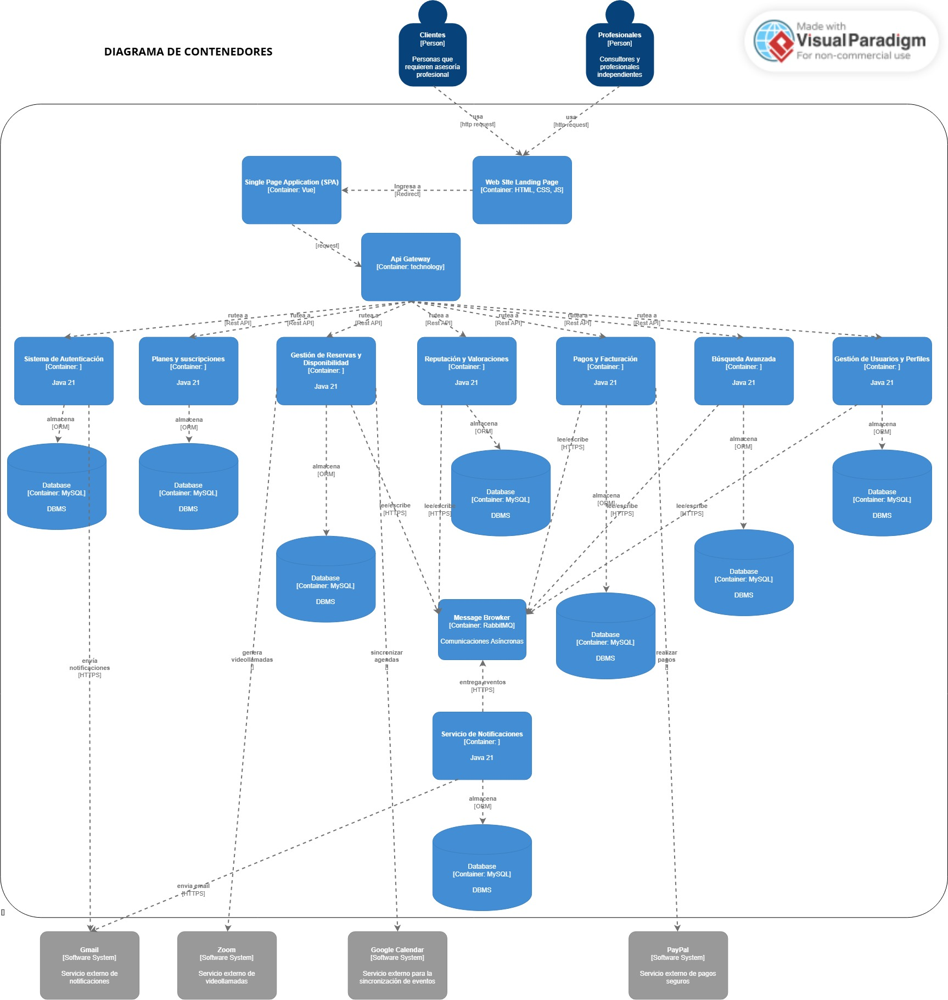

### Sistema de Autenticación - Diagrama de Componentes

A continuación, se muestra el diagrama de componentes correspondiente al microservicio Sistema de Autenticación. Su función principal es gestionar el registro, inicio de sesión, asignación de roles y recuperación de contraseña dentro de la plataforma FinTeka.


### Servicio de Notificaciones - Diagrama de Componentes

A continuación, se muestra el diagrama de componentes correspondiente al microservicio Servicio de Notificaciones. Su función principal es centralizar el envío de alertas y comunicaciones vía email, notificaciones push a usuarios y consultores de la plataforma FinTeka.

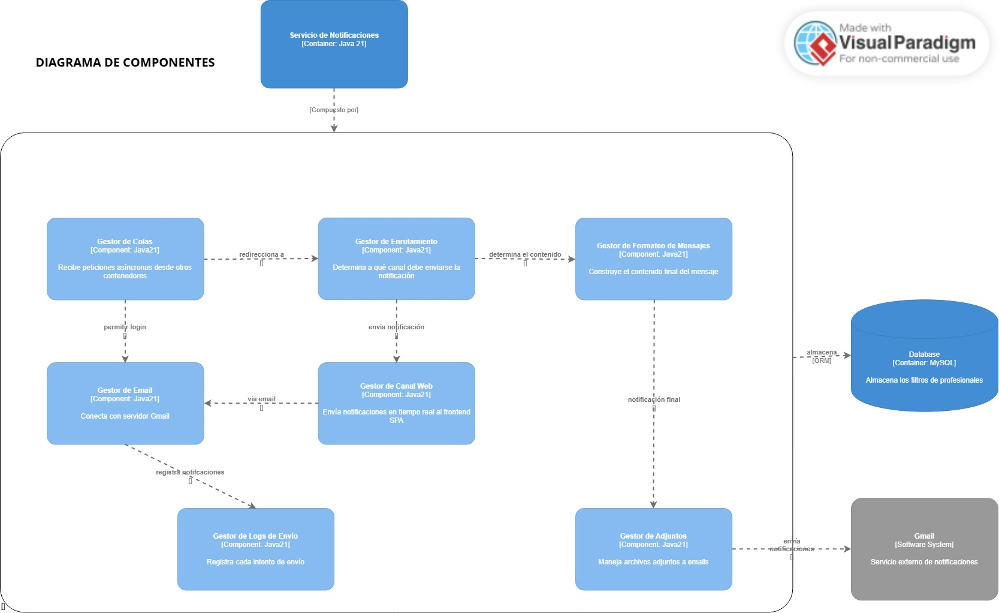

### Gestión de Reservas y Disponibilidad - Diagrama de Componentes

A continuación, se muestra el diagrama de componentes correspondiente al microservicio Gestión de Reservas y Disponibilidad. Su función principal es administrar los horarios de los consultores, crear y validar reservas, gestionar cancelaciones y sincronizar eventos con calendarios externos en FinTeka.

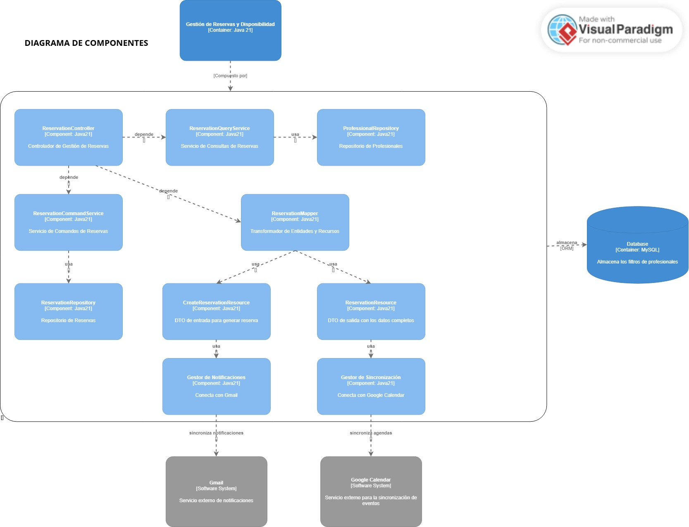

### Reputación y Valoraciones - Diagrama de Componentes

A continuación, se muestra el diagrama de componentes correspondiente al microservicio Reputación y Valoraciones. Su función principal es procesar calificaciones (1-5 estrellas), comentarios de usuarios, calcular el trust score de los consultores y prevenir fraudes en las reseñas dentro de FinTeka.

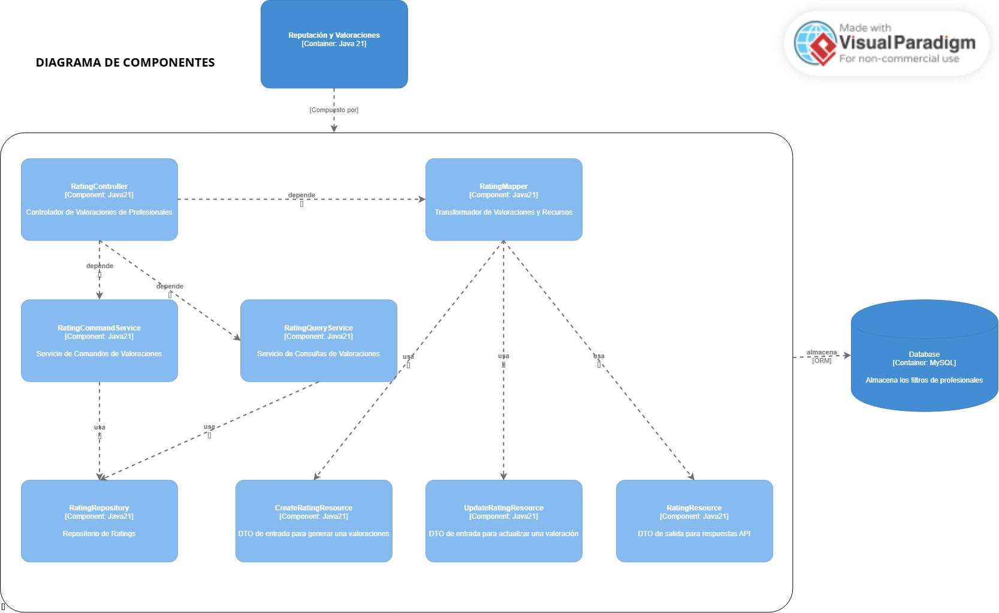

### Pagos y Facturación - Diagrama de Componentes

A continuación, se muestra el diagrama de componentes correspondiente al microservicio Pagos y Facturación. Su función principal es procesar transacciones económicas, retener fondos, liberar pagos a consultores y generar comprobantes electrónicos en la plataforma FinTeka.

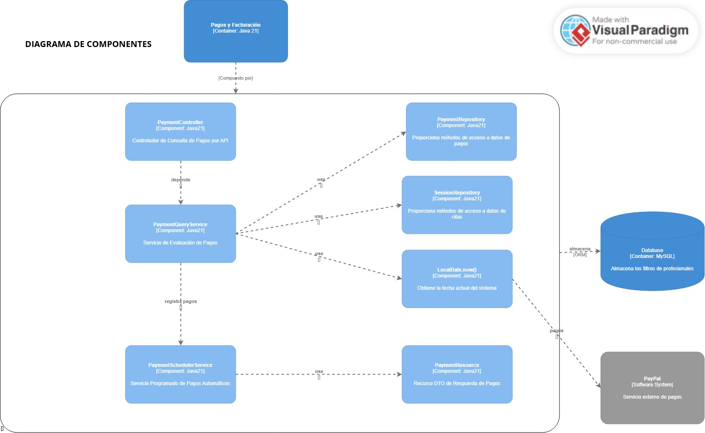

### Búsqueda Avanzada - Diagrama de Componentes

A continuación, se muestra el diagrama de componentes correspondiente al microservicio Búsqueda Avanzada. Su función principal es indexar consultores en motores de búsqueda, permitir filtros dinámicos, autocompletado y ordenamiento por relevancia dentro de FinTeka.

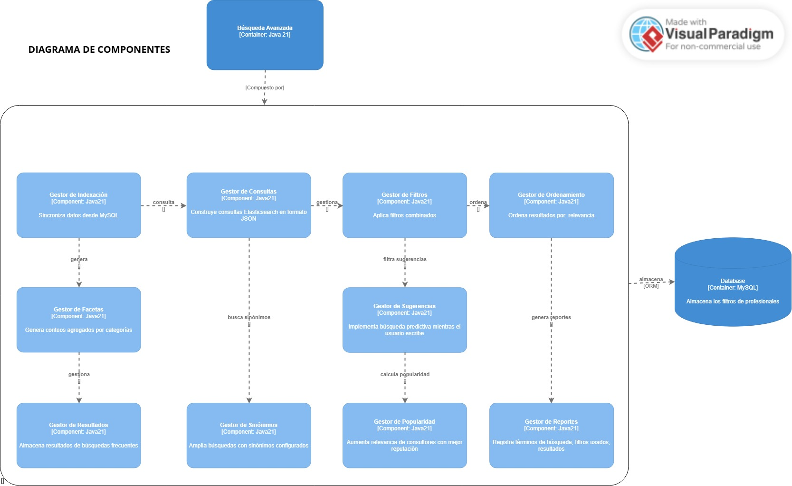

### Gestión de Usuarios y Perfiles - Diagrama de Componentes

A continuación, se muestra el diagrama de componentes correspondiente al microservicio Gestión de Usuarios y Perfiles. Su función principal es administrar los datos personales y profesionales de clientes y consultores, documentos de identidad, portafolio de certificados y preferencias de cuenta en FinTeka.

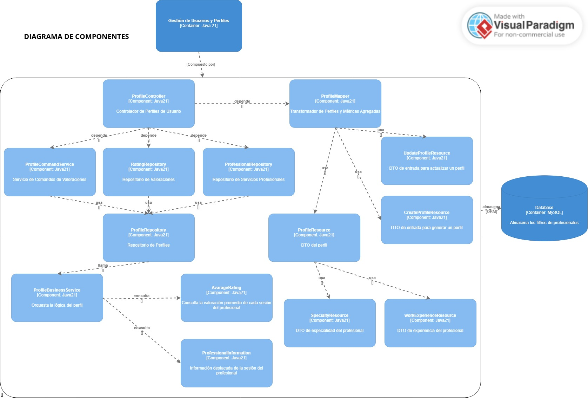

### Suscripciones - Diagrama de Componentes

A continuación, se muestra el diagrama de componentes correspondiente al microservicio planes y suscrpciones. Su función principal es administrar los suscrpciones de clientes y consultores de Finteka.

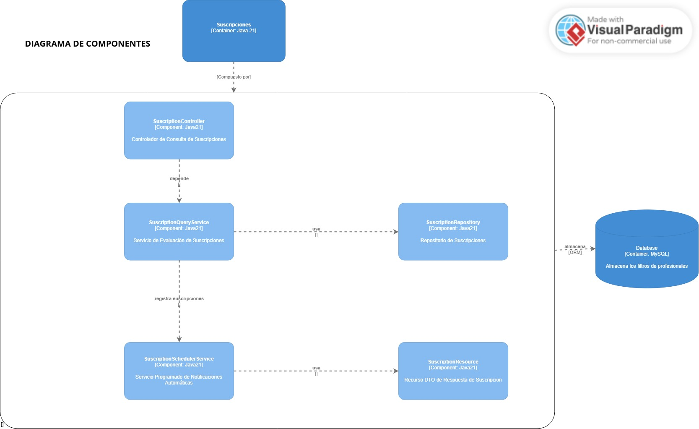

**Link de los diagramas:** https://online.visual-paradigm.com/share.jsp?id=343537383331342d32

## 4.1.5 Relational / Non-Relational Database Diagram 

#### Diagrama de Base de Datos

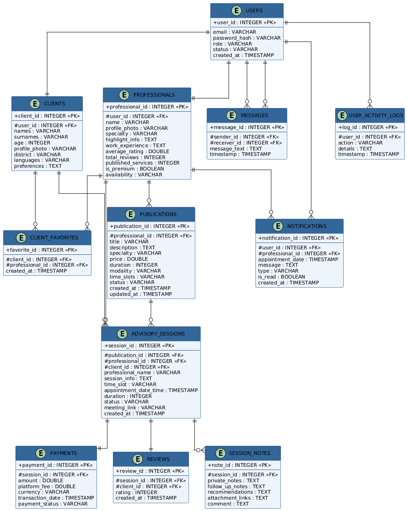


#### Explicación del Modelo de Datos Relacional (3FN)

##### 1. Arquitectura de Identidad y Roles Nativos
Para la administración y autenticación de los accesos sin dependencias de servicios de identidad externos, se implementa una estructura de supertipo y subtipo:
* **USERS (Supertipo):** Centraliza las credenciales de acceso esenciales (`user_id`, `email`, `password_hash`), el estado operativo de la cuenta (`status`) y el rol del sistema (`role`), el cual se encuentra estrictamente limitado a los valores del dominio web: `CLIENT` o `PROFESSIONAL`.
* **CLIENTS (Subtipo):** Entidad vinculada en una relación jerárquica 1:1 con `USERS` a través del campo `user_id`. Almacena datos particulares del usuario solicitante, tales como `age`, `district`, `languages` y un campo de texto `preferences` destinado a la persistencia de configuraciones de la interfaz web.
* **PROFESSIONALS (Subtipo):** Entidad conectada de forma 1:1 con `USERS` mediante `user_id`. Contiene el perfil curricular del asesor (`specialty`, `work_experience`, `average_rating`) y el campo booleano `is_premium`, que determina si el profesional cuenta con la suscripción activa para el posicionamiento destacado de sus publicaciones.

##### 2. Ciclo de Postulación: De la Publicación a la Sesión de Asesoría
El flujo de postulación y registro de citas en el entorno web se define a través de las siguientes entidades interrelacionadas:
* **PUBLICATIONS:** Representa las ofertas de asesoría especializadas publicadas por el profesional. Contiene especificaciones del servicio (`title`, `description`, `price`, `duration`, `modality`) y los rangos de tiempo disponibles codificados en `time_slots`. Se asocia en una relación 1:N con `PROFESSIONALS`.
* **ADVISORY_SESSIONS:** Constituye el eje transaccional central de la base de datos. Se genera directamente cuando un cliente selecciona una publicación web específica, vinculando en un solo registro la publicación (`publication_id`), el profesional (`professional_id`) y el cliente postulante (`client_id`) mediante relaciones 1:N. Almacena la fecha de ejecución (`appointment_date_time`), el estado interno de la sesión (`status`) y el enlace de la videollamada (`meeting_link`).

##### 3. Integridad Financiera, Reputacional y Notas de Seguimiento
Las siguientes tablas satélites se desprenden directamente del ciclo de la sesión, asegurando que no existan dependencias transitivas:
* **PAYMENTS:** Mantiene una relación estricta 1:1 con `ADVISORY_SESSIONS`. Registra los datos de la transacción económica por concepto de postulación (`amount`, `platform_fee`, `currency`, `payment_status`). En concordancia con las reglas de negocio, se omiten estados.
* **REVIEWS:** Implementa el control de reputación de la plataforma web. Al estar vinculada en una relación 1:1 con `ADVISORY_SESSIONS`, el modelo garantiza físicamente que solo los clientes que completaron una sesión de asesoría puedan registrar una calificación (`rating`) y un comentario, previniendo distorsiones por spam o perfiles falsos.
* **SESSION_NOTES:** Entidad relacionada de forma 1:1 con `ADVISORY_SESSIONS`. Permite al profesional almacenar anotaciones cualitativas distribuidas en campos independientes (`private_notes`, `follow_up_notes`, `recommendations`, `attachment_links`), asegurando que la información de seguimiento no afecte el rendimiento de la tabla principal de sesiones.

##### 4. Interacción, Preferencias y Logs de Auditoría
* **CLIENT_FAVORITES:** Resuelve la relación de Muchos a Muchos (N:M) existente entre `CLIENTS` y `PROFESSIONALS`, permitiendo que un usuario guarde el registro de sus asesores preferidos sin generar duplicidad de datos.
* **MESSAGES:** Gestiona la comunicación por chat privado dentro de la plataforma web. Posee dos llaves foráneas apuntando a `USERS` (`sender_id` y `receiver_id`) para identificar el origen y destino de cada interacción de texto de forma lineal.
* **NOTIFICATIONS:** Centraliza los avisos automáticos generados por el sistema hacia los usuarios, indexados por tipo y estado de lectura (`is_read`).
* **USER_ACTIVITY_LOGS:** Almacena de manera secuencial los registros de auditoría de operaciones críticas en el sitio web (`action`, `details`, `timestamp`), enlazado a la tabla `USERS` para proveer una trazabilidad completa ante cambios de configuración o accesos.

##### 5. Justificación Técnica de la Normalización
* **1FN:** Todos los atributos definidos en las entidades poseen valores atómicos. Los campos destinados a almacenar colecciones homogéneas de datos de consulta no relacional se estructuran en formato de cadena de texto plana para evitar el uso de arreglos multivalorados complejos.
* **2FN:** Se han eliminado por completo las dependencias parciales. Todas las columnas que no forman parte de las claves primarias dependen estrictamente de la totalidad de la clave primaria de la tabla.
* **3FN:** El diseño no presenta dependencias transitivas. Los atributos no clave se refieren de manera exclusiva y directa a la clave primaria correspondiente. La información financiera (`PAYMENTS`), la reputación (`REVIEWS`) y los apuntes técnicos (`SESSION_NOTES`) se aíslan en tablas independientes relacionadas mediante llaves foráneas (`FK`), evitando anomalías de inserción, actualización o borrado de datos.

---

### 4.1.6 Design Patterns

La arquitectura de software de la plataforma web FinTeka incorpora patrones de diseño orientados a garantizar el desacoplamiento de los módulos del sistema y optimizar el procesamiento transaccional en el backend:

#### Patrones Estructurales
* **Repository Pattern:** Implementado en el backend con **Spring Boot** para mediar entre la capa de lógica de negocio y el acceso a la base de datos relacional **MySQL**. Este patrón encapsula las operaciones de consulta y persistencia, aislando el dominio de la aplicación y simplificando la ejecución de pruebas unitarias automatizadas.
* **Adapter Pattern:** Utilizado para conectar la plataforma web con servicios externos de procesamiento de pagos transaccionales o APIs  sin acoplar el código fuente de FinTeka a las interfaces de programación de dichos proveedores independientes.

#### Patrones de Comportamiento
* **Command Pattern (CQRS - Escritura):** Encapsula cada operación que genera una modificación de estado en la base de datos (como la publicación de un servicio, la postulación a una asesoría o la actualización de los datos de seguridad de la cuenta) en un objeto de comando único. Esto facilita el aislamiento de las solicitudes y su canalización asíncrona a través del broker.
* **Query Pattern (CQRS - Lectura):** Separa de manera estricta las consultas de lectura de datos (tales como la visualización de perfiles y el filtrado por especialidades) de las lógicas de escritura. Permite optimizar el rendimiento del frontend en **Vue.js** al consumir directamente vistas o réplicas de lectura optimizadas en **MySQL**.

#### Patrones Creacionales
* **Factory Pattern:** Delegado para la creación parametrizada de perfiles de usuario en el microservicio de **Autenticación**, instanciando de manera controlada las entidades `CLIENTS` o `PROFESSIONALS` de acuerdo con el rol provisto en el momento del registro en la interfaz web.
* **Singleton Pattern:** Aplicado por defecto en la inyección de dependencias de Spring Boot para asegurar la existencia de una única instancia de los servicios críticos del sistema (como el motor de procesamiento de suscripciones o el despachador de notificaciones), impidiendo colisiones en la gestión de memoria del backend.

---

### 4.1.7 Tactics

Las tácticas arquitectónicas representan las decisiones de diseño técnico adoptadas para satisfacer los atributos de calidad requeridos por el sistema, garantizando la estabilidad operativa del entorno web de FinTeka sin recurrir a consideraciones de disponibilidad:

#### SEGURIDAD
* **Microservicio de Autenticación Propio:** Control de identidad centralizado mediante un componente interno que emite tokens JSON Web Tokens (JWT) firmados criptográficamente, implementando un control de acceso basado en roles (RBAC) que restringe los endpoints a nivel de Gateway para los roles `CLIENT` y `PROFESSIONAL`.
* **Cifrado de Datos Críticos:** Aplicación del algoritmo de hashing robusto BCrypt para las contraseñas guardadas en la base de datos **MySQL**, junto con el uso mandatorio del protocolo HTTPS (TLS 1.3) para asegurar la confidencialidad de la información en tránsito.
* **Tácticas de Mitigación de Spam y Ataques:** Implementación de políticas de control de tasa de peticiones (*Rate Limiting*) en el API Gateway para mitigar la saturación de endpoints críticos por parte de bots o solicitudes maliciosas concurrentes.

#### RENDIMIENTO
* **Optimización del Lado del Cliente (Frontend):** Uso de técnicas de división de código fuente (*code-splitting*) y carga diferida (*lazy loading*) en el desarrollo con **Vue.js**, reduciendo sustancialmente el tamaño de los paquetes JavaScript iniciales transferidos al navegador y acelerando el tiempo de interactividad de la interfaz.

#### ESCALABILIDAD
* **Arquitectura Orientada a Microservicios:** Descomposición funcional de la plataforma en servicios web autónomos y desacoplados desarrollados en **Spring Boot**, facilitando el escalado horizontal independiente de aquellos módulos que registren una alta carga transaccional.
* **Segregación de Consultas Relacionales:** Configuración de una arquitectura de base de datos en **MySQL** que desvía los flujos intensivos de lectura hacia réplicas dedicadas, evitando la contención de cerraduras de tablas en el nodo principal durante los procesos de inserción y modificación de datos de postulación.

#### MODERACIÓN
* **Garantía de Reseñas Verificadas:** Restricción a nivel de lógica de backend que valida en la base de datos la existencia de una relación previa entre el cliente y el profesional en estado "Completada" dentro de `ADVISORY_SESSIONS` antes de autorizar la inserción de un registro en la tabla `REVIEWS`.

#### PERSONALIZACIÓN
* **Administración del Estado Global de Interfaz:** Empleo de contenedores de estado centralizados en el frontend de **Vue.js** para renderizar en tiempo real y sin latencia las preferencias visuales del usuario (como el contraste de color o temas de interfaz), sincronizando dichos cambios de forma asíncrona con el campo `preferences` de la base de datos.

---

### 4.1.8 Design Purpose

El propósito del diseño de la arquitectura de FinTeka consiste en proveer un entorno web técnicamente robusto, desacoplado y centrado en la eficiencia del proceso de postulación de asesorías. Los objetivos del diseño de software se definen en los siguientes puntos:

1.  **Eficiencia y Baja Latencia Web:** Optimizar la comunicación entre la interfaz de usuario en **Vue.js** y el backend en **Spring Boot** mediante un punto único de entrada (API Gateway), reduciendo la sobrecarga de solicitudes HTTP y asegurando una navegación ágil en el navegador web del usuario.
2.  **Modularidad y Extensibilidad del Sistema:** Establecer límites de contexto claros por cada microservicio, lo que permite la modificación o adición de funciones en el módulo, la base de preguntas frecuentes o las preferencias visuales de la cuenta de manera aislada, mitigando el riesgo de regresiones en el entorno de producción.

---

### 4.1.9 Primary Functionality (Primary User Stories)

La arquitectura de FinTeka se encuentra estructurada para dar soporte directo e independiente a los flujos operativos de mayor valor para el negocio:

| ID | Historia de Usuario | Flujo Técnico de Arquitectura | Componente Crítico |
| :--- | :--- | :--- | :--- |
| **US-01** | Postulación a Sesión de Asesoría | El cliente selecciona un horario en la interfaz web; el microservicio de reservas valida la disponibilidad y asocia los identificadores correspondientes de forma atómica en **MySQL**. | `Booking Microservice` |
| **US-02** | Filtrado y Búsqueda de Publicaciones | El usuario aplica filtros de especialidad y precio en el frontend; el componente realiza la consulta optimizada apuntando a las réplicas de lectura de la base de datos. | `Search & Profile Service` |
| **US-04** | Configuración de Preferencias Visuales | El usuario modifica los parámetros visuales en la plataforma web; el frontend en **Vue.js** actualiza el estado local de la interfaz y envía los datos para persistirlos en la tabla `CLIENTS`. | `User Interface Component` |
| **US-05** | Configuración de Seguridad de la Cuenta | El usuario actualiza sus credenciales de acceso; el microservicio de **Autenticación** procesa el cambio de contraseñas aplicando hashing y actualiza la entidad `USERS` generando un log en la auditoría. | `Authentication Microservice` |
| **US-06** | Preguntas Frecuentes | El cliente o profesional accede la sección de preguntas frecuentes para resolver sus dudas. | `FAQ Component` |


### 4.1.10 Quality Attribute Scenarios

Los escenarios de atributos de calidad (*Quality Attribute Scenarios*) permiten validar de manera estructurada que la arquitectura propuesta para **FinTeka** será capaz de satisfacer los requerimientos no funcionales definidos por Nova Asesors. Estos escenarios transforman atributos abstractos como seguridad, disponibilidad o rendimiento en situaciones concretas, medibles y verificables dentro del contexto operativo de la plataforma.

Debido a que FinTeka gestiona:
- Procesos financieros,
- Información personal,
- Comunicación en tiempo real,
- Reservas de asesorías,
- Integraciones con terceros,

la arquitectura debe responder de manera resiliente, segura y eficiente frente a eventos de alta concurrencia, fallos de infraestructura y amenazas de seguridad.

Cada escenario arquitectónico se define mediante:
- **Fuente:** entidad que genera el evento.
- **Estímulo:** acción que afecta al sistema.
- **Entorno:** contexto operacional.
- **Artefacto:** componente impactado.
- **Respuesta:** comportamiento esperado.
- **Medida de Respuesta:** criterio cuantificable.

---

#### Justificación Técnica General

Los atributos de calidad definidos para FinTeka están directamente alineados con:
- Los requerimientos no funcionales del proyecto.
- La naturaleza financiera de la plataforma.
- La necesidad de escalabilidad futura.
- La continuidad operacional de Nova Asesors.

La arquitectura basada en microservicios, API Gateway y despliegues distribuidos permite abordar estos escenarios mediante tácticas concretas de:
- redundancia,
- caché,
- autenticación,
- tolerancia a fallos.

---

### A. SEGURIDAD 

La seguridad representa uno de los atributos críticos del ecosistema FinTeka debido a que la plataforma administra:
- información financiera,
- datos personales,
- sesiones privadas,
- autenticación de usuarios,
- historial de pagos y reservas.

El objetivo principal es garantizar:
- confidencialidad,
- integridad,
- autenticidad,
- trazabilidad de las operaciones.

---

##### Escenario A1 — Acceso No Autorizado

| Elemento | Descripción |
| :--- | :--- |
| **Fuente** | Usuario no autenticado o atacante externo |
| **Estímulo** | Intento de acceso a endpoints protegidos |
| **Entorno** | Operación normal |
| **Artefacto** | API Gateway / Authentication Service |
| **Respuesta** | El sistema valida el token JWT y bloquea automáticamente la solicitud |
| **Medida de Respuesta** | Tiempo de validación menor a 300 ms y 100% de rechazo de accesos inválidos |

###### Justificación Técnica

Para proteger los recursos críticos del sistema:
- se implementa OAuth2 para autenticación descentralizada,
- JWT para validación stateless,
- API Gateway para centralización de políticas de seguridad.

Esto evita accesos indebidos y protege la información sensible de la plataforma.

---

##### Escenario A2 — Protección de Información Sensible

| Elemento | Descripción |
| :--- | :--- |
| **Fuente** | Usuario autenticado |
| **Estímulo** | Envío de información financiera |
| **Entorno** | Proceso de pago o reserva |
| **Artefacto** | Payment Service |
| **Respuesta** | La información se transmite mediante canales cifrados |
| **Medida de Respuesta** | 100% de las comunicaciones protegidas bajo HTTPS |

###### Justificación Técnica

Toda la comunicación entre:
- frontend,
- backend,
- microservicios,
- servicios externos,

se realiza utilizando HTTPS para prevenir:
- intercepción de datos,
- ataques MITM,
- manipulación de tráfico.

Adicionalmente:
- las contraseñas se almacenan mediante hashing seguro,
- los tokens poseen expiración limitada,
- no se almacenan credenciales en texto plano.

---

##### Escenario A3 — Escalamiento de Privilegios

| Elemento | Descripción |
| :--- | :--- |
| **Fuente** | Usuario autenticado |
| **Estímulo** | Intento de acceso a funciones administrativas |
| **Entorno** | Operación normal |
| **Artefacto** | Authorization Layer |
| **Respuesta** | El sistema valida permisos y deniega el acceso |
| **Medida de Respuesta** | 0 accesos exitosos fuera del rol autorizado |

###### Justificación Técnica

FinTeka diferencia:
- Clientes,
- Consultores

---

##### Escenario B2 — Recuperación Automática de Servicios

| Elemento | Descripción |
| :--- | :--- |
| **Fuente** | Error interno del servicio |
| **Estímulo** | Caída de un contenedor |
| **Entorno** | Operación continua |
| **Artefacto** |  Runtime de contenedores |
| **Respuesta** | El servicio se reinicia automáticamente |
| **Medida de Respuesta** | Recuperación menor a 1 minuto |

###### Justificación Técnica

El uso de contenedores permite:
- reinicio de instancias defectuosas,
- autoescalado,
- alta resiliencia operacional.

---

### C. RENDIMIENTO

La experiencia del usuario depende directamente de la capacidad del sistema para responder rápidamente frente a:
- búsquedas,
- reservas,
- carga de perfiles,
- procesos financieros.

La arquitectura busca minimizar:
- latencia,
- tiempos de espera,
- saturación de recursos.

---

##### Escenario C1 — Consulta de Perfiles de Consultores

| Elemento | Descripción |
| :--- | :--- |
| **Fuente** | Usuario web |
| **Estímulo** | Solicitud de búsqueda de consultores |
| **Entorno** | Hora pico |
| **Artefacto** | Consultant Service |
| **Respuesta** | La información es servida desde caché |
| **Medida de Respuesta** | Tiempo promedio menor a 1 segundo |

###### Justificación Técnica


La arquitectura utiliza:
- expiración controlada,
- actualización automática de datos.

---

### D. ESCALABILIDAD 

FinTeka debe soportar crecimiento continuo de:
- usuarios,
- consultores,
- reservas,
- transacciones financieras.

La arquitectura debe escalar sin rediseñar el sistema completo.

---

##### Escenario D1 — Incremento Masivo de Usuarios

| Elemento | Descripción |
| :--- | :--- |
| **Fuente** | Campaña comercial o expansión del negocio |
| **Estímulo** | Incremento abrupto de usuarios concurrentes |
| **Entorno** | Alta demanda |
| **Artefacto** | Microservicios |
| **Respuesta** | Se crean nuevas instancias automáticamente |
| **Medida de Respuesta** | SLA superior al 95% |

###### Justificación Técnica

La arquitectura desacoplada permite:
- escalabilidad horizontal,
- autoescalado dinámico,
- distribución de carga,
- aislamiento funcional entre servicios.

Cada microservicio puede crecer independientemente según la demanda.

---

### E. INTEGRABILIDAD 

FinTeka depende de múltiples servicios externos:
- pasarelas de pago,
- servicios cloud,
- APIs de autenticación,
- notificaciones.

La arquitectura debe garantizar integraciones resilientes y desacopladas.

---

##### Escenario E1 — Falla Temporal de Pasarela de Pago

| Elemento | Descripción |
| :--- | :--- |
| **Fuente** | Servicio externo |
| **Estímulo** | Timeout o indisponibilidad |
| **Entorno** | Pago en proceso |
| **Artefacto** | Payment Integration Service |
| **Respuesta** | El sistema activa Retry |
| **Medida de Respuesta** | No pérdida de consistencia transaccional |

###### Justificación Técnica

Para reducir el impacto de fallos externos:
- Mecanismos Retry,
- Colas asíncronas,
- Timeouts controlados.

Esto evita propagar fallos hacia el núcleo del sistema.

---

### F. AUDITABILIDAD 

La auditabilidad permite garantizar:
- trazabilidad,
- monitoreo,
- control de operaciones,
- análisis de incidentes,
- cumplimiento de seguridad.

---

##### Escenario F1 — Registro de Eventos Críticos

| Elemento | Descripción |
| :--- | :--- |
| **Fuente** | Usuario autenticado |
| **Estímulo** | Login, pago o modificación sensible |
| **Entorno** | Operación normal |
| **Artefacto** | User Activity Logs |
| **Respuesta** | El sistema registra el evento de forma inmutable |
| **Medida de Respuesta** | Persistencia menor a 2 segundos |

###### Justificación Técnica

Los logs de auditoría:
- se almacena en SQL,
- están desacoplados del núcleo transaccional,
- soportan análisis posteriores,

---

### 4.1.11 Constraints

Las restricciones arquitectónicas representan limitaciones técnicas, operacionales y de negocio que condicionan el diseño del ecosistema **FinTeka**.

---

#### Lineamientos Generales

| Categoría | Descripción |
|---|---|
| Requerimientos Funcionales | Las restricciones deben mantener coherencia con las funcionalidades principales del sistema. |
| Atributos de Calidad | Las decisiones arquitectónicas deben alinearse con disponibilidad, seguridad, rendimiento y escalabilidad. |
| Decisiones Tecnológicas | Las tecnologías seleccionadas condicionan la implementación y evolución del sistema. |
| Objetivos Estratégicos | La arquitectura debe responder a las metas de crecimiento y sostenibilidad de Nova Asesors. |

---

#### Alcance de las Restricciones

| Área | Aplicación |
|---|---|
| Desarrollo | Lineamientos obligatorios para implementación y codificación del sistema. |
| Integración | Restricciones relacionadas con comunicación entre servicios y sistemas externos. |
| Despliegue | Condiciones obligatorias para ambientes cloud y pipelines de entrega continua. |
| Seguridad | Políticas técnicas para protección de datos y control de accesos. |

---

#### Restricciones Arquitectónicas

| ID | Categoría | Restricción | Justificación Técnica |
|---|---|---|---|
| CON-01 | Tecnológica | La solución backend debe implementarse mediante arquitectura de microservicios utilizando **Spring Boot** y **Java 21**. | Permite escalabilidad independiente, resiliencia y el aprovechamiento de características de alto rendimiento como Virtual Threads. |
| CON-02 | Tecnológica | El frontend debe desarrollarse como una Single Page Application (SPA) utilizando **Vue.js**. | Garantiza una experiencia de usuario fluida, reactiva y optimizada para navegadores modernos. |
| CON-03 | Tecnológica | Los servicios deben comunicarse únicamente mediante **microservicios**. | Reduce acoplamiento y asegura contratos de comunicación claros y estandarizados. |
| CON-04 | Tecnológica | La persistencia de datos debe centralizarse en el motor relacional **MySQL**. | Garantiza cumplimiento de propiedades ACID necesarias para operaciones financieras. |
| CON-05 | Tecnológica | Cada dominio funcional debe operar de forma independiente sobre su propio esquema lógico dentro de MySQL. | Reduce dependencias y facilita mantenibilidad del sistema. |
| CON-06 | Operacional | El despliegue del frontend debe realizarse sobre **Vercel**. | Mejora rendimiento mediante Edge CDN y facilita despliegues automatizados. |
| CON-07 | Operacional | El backend debe desplegarse sobre infraestructura cloud de **Microsoft Azure**. | Proporciona escalabilidad, alta disponibilidad y servicios empresariales administrados. |
| CON-08 | Operacional | La interfaz debe ser completamente responsive y compatible con dispositivos móviles. | La accesibilidad multiplataforma constituye un requisito clave del negocio. |
| CON-09 | Seguridad | Toda información sensible debe transmitirse utilizando **HTTPS**. | Protege confidencialidad e integridad de los datos en tránsito. |
| CON-10 | Seguridad | La autenticación debe implementarse utilizando **OAuth2** y **JWT** mediante Spring Security. | Permite autenticación segura y desacoplada para arquitecturas distribuidas. |
| CON-11 | Negocio | El sistema debe integrarse con pasarelas de pago externas. | Permite procesar pagos y gestionar transacciones financieras. |
| CON-12 | Negocio | La plataforma debe calcular automáticamente cobros y comisiones según el plan del usuario. | Automatiza la lógica comercial asociada a los planes Básico y Premium. |
| CON-13 | Negocio | La arquitectura debe soportar crecimiento progresivo sin rediseñar el núcleo del sistema. | Facilita escalabilidad futura y expansión funcional. |
| CON-14 | Desarrollo | Las campañas y promociones están fuera de nuestro alcance | La implementación de un motor de promociones nativo introduce una complejidad elevada en el modelo de entidad-relación (gestión de cupones, reglas de exclusión, concurrencia de uso y validación de stock en tiempo real). |

---

#### Relación Entre Restricciones y Arquitectura

| Restricción | Componente Relacionado / Tecnología |
|---|---|
| Microservicios y Core Backend | **Spring Boot** (Java 21) |
| Interfaz de Usuario y SPA | **Vue.js** |
| Alojamiento y Despliegue Frontend | **Vercel** |
| Alojamiento y Despliegue Backend | **Microsoft Azure** |
| Persistencia Relacional | **MySQL** |
| Comunicación entre Servicios | **APIs REST** |
| Seguridad y Autenticación | **Spring Security** (OAuth2 + JWT) |
| Integración Financiera | **Payment Service** |

### 4.1.12 Architectural Concerns

Las preocupaciones arquitectónicas (*Architectural Concerns*) representan los aspectos críticos que influyen directamente sobre las decisiones técnicas adoptadas en FinTeka. Estas preocupaciones reflejan:
- riesgos operacionales,
- desafíos técnicos,
- necesidades de negocio,
- requerimientos de calidad.

La arquitectura propuesta incorpora patrones, tácticas y mecanismos específicos orientados a mitigar dichos riesgos y garantizar estabilidad del ecosistema.

---

#### Architectural Concerns

| ID | Concern | Riesgo Principal | Impacto | Estrategia Arquitectónica |
|---|---|---|---|---|
| ARC-01 | Consistencia transaccional distribuida | Reservas duplicadas y pagos inconsistentes | Alto | Eventos compensatorios |
| ARC-02 | Seguridad financiera | Robo de credenciales y accesos indebidos | Alto | OAuth2 + JWT + HTTPS |
| ARC-03 | Rendimiento bajo alta concurrencia | Latencia elevada y saturación de servicios | Alto |  Auto Scaling |
| ARC-05 | Dependencia de servicios externos | Fallos en pasarelas de pago y APIs | Alto | Retry Pattern |
| ARC-08 | Experiencia de usuario en tiempo real | Lentitud y retrasos de comunicación | Alto | MySQL |
| ARC-09 | Gestión de datos híbridos | Inconsistencia entre SQL y NoSQL | Medio | Separación por dominios + eventos |
| ARC-10 | Continuidad operacional | Caídas críticas del sistema | Alto | Azure failover |

---

#### Relación Entre Concerns y Soluciones Arquitectónicas

| Concern Arquitectónico | Solución Implementada |
|---|---|
| Seguridad financiera | API Gateway + OAuth2 |
| Rendimiento concurrente | Load Balancer (API Gateway) |
| Mantenibilidad | DDD + Microservices |
| Continuidad operacional |  Replication |

---

#### Impacto de los Concerns en el Diseño del Sistema

Las preocupaciones arquitectónicas definidas influyen directamente sobre:
- selección tecnológica,
- estructura de microservicios,
- tácticas de disponibilidad,
- mecanismos de seguridad,
- estrategias de despliegue,
- escalabilidad.

Esto garantiza que la arquitectura de FinTeka responda adecuadamente a:
- requerimientos del negocio,
- atributos de calidad,
- crecimiento futuro,
- continuidad operacional del ecosistema.


## 4.2 Architectural Drivers
## 4.3.1 Iteration 1: Sprint1
##  4.3.1.1 Architectural Design Backlog 1


Los Architectural Drivers representan los factores críticos que influyen directamente en las decisiones de diseño de la arquitectura de FinTeka. Estos drivers permiten priorizar atributos de calidad, restricciones técnicas y necesidades del negocio para asegurar que la solución responda adecuadamente a los objetivos funcionales y no funcionales del proyecto.

En esta primera iteración se identifican los requisitos del sistema y se desarrolla una primera versión basada en una arquitectura monolítica. Posteriormente, en la siguiente iteración, esta será migrada a una arquitectura de microservicios. A continuación, se presentan los drivers arquitectónicos seleccionados.


| Tipo de Driver      | Driver Seleccionado                                                                                                                                                                                                                                    | Razón                                                                                                                                                                                                                                                                                                                                                                     |
|:--------------------|:-------------------------------------------------------------------------------------------------------------------------------------------------------------------------------------------------------------------------------------------------------|:--------------------------------------------------------------------------------------------------------------------------------------------------------------------------------------------------------------------------------------------------------------------------------------------------------------------------------------------------------------------------|
| Atributo de Calidad | Escalabilidad                                                                                                                                                                                                                                          | La plataforma debe soportar un crecimiento progresivo en la cantidad de usuarios, especialistas, reservas y transacciones sin afectar significativamente el rendimiento del sistema.                                                                                                                                                                                      |
| Atributo de Calidad | Rendimiento                                                                                                                                                                                                                                            | Las búsquedas de especialistas, reservas y operaciones de pago deben ejecutarse en tiempos reducidos para garantizar una experiencia satisfactoria para los usuarios.                                                                                                                                                                                                     |
| Atributo de Calidad | Seguridad                                                                                                                                                                                                                                              | Proteger la información personal y financiera mediante autenticación segura, control de acceso basado en roles, cifrado de contraseñas y uso de tokens de acceso.                                                                                                                                                                                                         |
| Restriccion         | Sistema desarrollado con una arquitectura de microservicios utilizando Java Spring Boot, donde cada servicio es independiente y autónomo. Algunos microservicios se comunican mediante un Message Broker para el intercambio asíncrono de información. | Se optará por una arquitectura basada en microservicios con el objetivo de mejorar el rendimiento, la escalabilidad y la capacidad de respuesta ante las solicitudes de los usuarios. Además, se utilizará un Message Broker para gestionar de manera asíncrona las notificaciones del sistema Finteka, permitiendo encolar y procesar los mensajes de forma desacoplada. |


## 4.3.1.2 Establish Iteration Goal by Selecting Drivers

Para esta primera iteración se han seleccionado los drivers que aportan mayor valor al núcleo funcional de la plataforma. En particular, se priorizan los siguientes atributos de calidad:

* Rendimiento: asegurar una respuesta ágil en procesos clave como el registro e inicio de sesión, la búsqueda de especialistas, la gestión de reservas y las transacciones de pago.
* Seguridad: garantizar la protección de la información de usuarios y consultores mediante mecanismos de autenticación, autorización y gestión segura de credenciales.
* Escalabilidad: preparar la solución para soportar un incremento gradual en la cantidad de usuarios, reservas y operaciones realizadas dentro de la plataforma.

El propósito de esta iteración es desarrollar una primera versión operativa de FinTeka que permita a los usuarios registrarse, encontrar especialistas, reservar asesorías y realizar pagos de forma eficiente y segura, sentando las bases para la evolución posterior hacia una arquitectura de microservicios.


### 4.3.1.3 Choose One or More Elements of the System to Refine

Con el fin de responder a los drivers priorizados y asegurar la entrega  en esta primera iteración, se identifican los componentes más relevantes del sistema que serán detallados y refinados durante el diseño arquitectónico inicial.


#### Modulo de Reservas y Asesorías

* Gestiona el proceso de solicitud, programación y confirmación de sesiones entre usuarios y consultores.
* Controla horarios disponibles, estado de las reservas y seguimiento de cada asesoría agendada.
* Garantiza una operación confiable y ordenada en el flujo principal del negocio.

Estos componentes constituyen el núcleo funcional de FinTeka en esta iteración, ya que permiten materializar la propuesta de valor principal: conectar usuarios con especialistas y facilitar la contratación de asesorías de forma eficiente y confiable.

### 4.3.1.4 Choose One or More Design Concepts That Satisfy the Selected Drivers

Con el propósito de satisfacer los drivers arquitectónicos priorizados para FinTeka, se adoptan diversos conceptos de diseño orientados a garantizar el rendimiento, la seguridad y la escalabilidad de la plataforma. Estas decisiones servirán como base para el desarrollo de la primera versión del sistema y facilitarán su posterior evolución hacia una arquitectura de microservicios.

#### Rendimiento

* Se desarrollará una arquitectura monolítica modular que reduzca la complejidad de comunicación entre componentes durante las etapas iniciales del proyecto.
*  El sistema será desplegado en Azure utilizando contenedores Docker, lo que permitirá optimizar la utilización de recursos computacionales y mantener tiempos de respuesta adecuados ante variaciones en la carga de trabajo.

#### Seguridad
* La autenticación de usuarios se implementará mediante JWT , para garantizar un mecanismo seguro para la gestión de sesiones.
* Todas las contraseñas serán almacenadas utilizando algoritmos de hashing seguro como BCrypt.
* La comunicación entre cliente y servidor se realizará mediante HTTPS con TLS 1.2 o superior.

#### Escalabilidad
* Se utilizarán identificadores UUID para garantizar unicidad y facilitar la distribución futura de los datos.
* La arquitectura será diseñada considerando una futura incorporación de mecanismos de comunicación asíncrona mediante un message broker

### 4.3.1.5 Instantiate Architectural Elements, Allocate Responsibilities, and Define Interfaces

La arquitectura de FinTeka se plantea como una solución basada en microservicios organizados por dominios de negocio, permitiendo separar responsabilidades funcionales y facilitar la evolución del sistema. Los servicios colaboran mediante APIs REST para operaciones síncronas mediante un broker de eventos para procesos desacoplados. En esta primera iteración se detallan los principales elementos arquitectónicos, sus responsabilidades y los mecanismos de integración definidos.

#### Elementos arquitectónicos

Se usará el enfoque DDD (Domain-Driven Design) para organizar la aplicación.Por ello, cada módulo será definido como un Bounded Context.


* Sistema de autenticacion: encargado del registro de usuarios, autenticación, recuperación de contraseña y gestión de roles.
* Busqueda avanzada: Administra perfiles profesionales, especialidades, experiencia y disponibilidad de los consultores.
* Gestion de reservas y disponibilidad: Gestiona solicitudes, programación, confirmación y seguimiento de asesorías reservadas por los usuarios.
* Notification: Procesa eventos del sistema y envía confirmaciones o alertas por correo electrónico.

Los microservicios serán desarrollados con Spring Boot seleccionando la tecnología más adecuada según el dominio funcional y requerimientos de rendimiento.

El frontend será desarrollado en Vue, consumiendo los servicios a través del API Gateway. La solución será desplegada en contenedores Docker, permitiendo portabilidad, escalabilidad y facilidad operativa.

#### Asignación de responsabilidades

Cada servicio mantiene autonomía sobre sus datos y lógica de negocio:

* Sistema de autenticacion: Valida: credenciales, genera tokens JWT y controla acceso según roles definidos.
* Busqueda avanzada: Publica información de consultores y responde consultas relacionadas con perfiles y especialidades.
* Gestion de reservas y disponibilidad:  Verifica disponibilidad horaria, registra reservas y actualiza el estado de las asesorías.
* Notification:  recibe eventos como registro exitoso o reserva confirmada y ejecuta envíos automáticos.

#### Definición de interfaces
La comunicación entre componentes se implementará mediante interfaces síncronas y asíncronas:

* Las interfaces síncronas utilizarán REST APIs documentadas con OpenAPI 3.0 / Swagger, accesibles únicamente mediante el API Gateway.
*  Las interfaces asíncronas emplearán un message broker (RabbitMQ o Kafka) para eventos como UserRegistered, BookingCreated y BookingConfirmed, desacoplando procesos secundarios del flujo principal.
* Todas las comunicaciones externas estarán protegidas mediante HTTPS .
* Los endpoints privados requerirán autenticación mediante JWT Bearer Token y validación de permisos por rol.

El frontend Angular funcionará como cliente principal para usuarios y consultores, mostrando vistas diferenciadas según permisos y tipo de cuenta, pero consumiendo una misma capa de servicios centralizada.
### 4.3.1.6 Sketch Views (C4 & UML) and Record Design Decisions


### 4.3.1.7 Analysis of Current Design and Review Iteration Goal

Para controlar las tareas en esta primera iteracion usamos la herramienta trello que nos permite organizar el trabajo en columnas de "To Do", "In Progress" y "Done". Esto facilita la visualización del progreso, la asignación de responsabilidades y la identificación de bloqueos o retrasos en el desarrollo de las funcionalidades planificadas.


Link del trablero trello: https://trello.com/invite/b/69f6574d811b27877f919b44/ATTI455d8960b544133b522a03a00ce8bfcfE7BD0119/fundamentos-iteration-1


##  4.3.2 Iteration 2: Sprint2

###  4.3.2.1 Architectural Design Backlog 2

Para la segunda iteración se priorizará la migración del backend monolítico hacia una arquitectura basada en microservicios. Para ello, se realizará la descomposición del monolito con el objetivo de identificar y separar los distintos dominios del sistema. Asimismo, se iniciará el desarrollo de los microservicios de Autenticación y Profiles, encargados de la gestión de autenticación, autorización y perfiles de usuario. Adicionalmente, estos servicios serán integrados mediante un API Gateway para centralizar el acceso a las APIs, y se llevará a cabo su despliegue en la plataforma cloud de Microsoft Azure

* Desarrollo del microservicio de Autenticación para gestionar autenticación, autorización y roles de usuario en Springboot.
* Desarrollo del microservicio Profiles para gestionar la información de los usuarios y consultores en Springboot.
* Implementacion de API Gateway.
* Desarrollo de message broker RabbitMq para comunicacion asincrona 
* Pruebas unitarias 
* Documentacion de APIs con OpenAPI/Swagger.
* Despliegue de microservicios en Microsoft Azure utilizando contenedores Docker.


### 4.3.2.2 Establish Iteration Goal by Selecting Drivers

En este punto se establecen los drivers arquitectónicos prioritarios para la segunda iteración, los cuales guiarán las decisiones de diseño y desarrollo del sistema. 


| Tipo de Driver      | Driver Seleccionado                            | Descripcion                                                                                                                                                                                                       |
|:--------------------|:-----------------------------------------------|:------------------------------------------------------------------------------------------------------------------------------------------------------------------------------------------------------------------|
| Atributo de Calidad | Rendimiento                                    | El sistema debe responder de manera eficiente a las solicitudes de los usuarios, permitiendo escalar los microservicios de forma independiente para soportar una mayor carga de trabajo sin afectar el desempeño general de la plataforma.                                                                                                                                                                                                                  |
| Atributo de Calidad | Seguridad                                      | El sistema debe garantizar la autenticación y autorización segura de los usuarios mediante el microservicio IAM, protegiendo los datos sensibles y controlando el acceso a los recursos según el rol del usuario. |
| Atributo de Calidad | modificalidad                                  | La arquitectura basada en microservicios debe facilitar la incorporación, actualización y mantenimiento de funcionalidades de manera independiente, minimizando el impacto sobre otros servicios y reduciendo el esfuerzo requerido para realizar cambios en el sistema.                 |
| Requisito funcional | Gestión de autenticación y perfiles de usuario | El sistema debe permitir el registro, inicio de sesión, gestión de roles y consulta de perfiles de usuario mediante los microservicios Autenticación y Profiles.                                                            |


### 4.3.2.3 Choose One or More Elements of the System to Refine

En este punto se identifican los elementos del sistema que serán refinados durante la segunda iteración.

* Microservicio Autenticacion: Será responsable de administrar los procesos de autenticación y autorización de la plataforma. Este servicio validará las credenciales de los usuarios, gestionará los roles y permisos disponibles, y emitirá tokens JWT que permitirán controlar el acceso seguro a los recursos del sistema.
* Microservicio Profiles: Tendrá la responsabilidad de gestionar la información asociada a los perfiles de los usuarios y consultores. Permitirá registrar, consultar y actualizar los datos personales y profesionales necesarios para el funcionamiento de la plataforma.
* API Gateway: Actuará como punto único de entrada para las solicitudes provenientes de los clientes. Su función será enrutar las peticiones hacia los microservicios correspondientes, además de facilitar la implementación de políticas de seguridad y monitoreo.
* Message Broker RabbitMQ: Será incorporado para habilitar la comunicación asíncrona entre microservicios, favoreciendo el desacoplamiento de componentes y mejorando la escalabilidad y resiliencia de la solución.


### 4.3.2.4 Choose One or More Design Concepts That Satisfy the Selected Drivers

Para esta iteración se adoptarán diferentes conceptos de diseño orientados a mejorar la seguridad, el rendimiento y la modificabilidad de la solución basada en microservicios. Estas decisiones arquitectónicas servirán como base para la implementación de los servicios Autenticación y Profiles, así como de los mecanismos de integración y comunicación entre componentes.

* *Rendimiento*. La arquitectura basada en microservicios permitirá distribuir las responsabilidades del sistema en servicios independientes, reduciendo cuellos de botella y facilitando el escalamiento de los componentes con mayor carga. El API Gateway centralizará las solicitudes provenientes del cliente y optimizará el acceso a los servicios internos. Asimismo, se utilizarán consultas optimizadas y mecanismos de validación eficientes para cumplir con los tiempos de respuesta definidos en los requisitos RNF-001, RNF-002 y RNF-010.

* *Seguridad.* El microservicio Autenticación será el encargado de gestionar la autenticación y autorización de usuarios mediante tokens JWT y control de acceso basado en roles. Las contraseñas se almacenarán utilizando BCrypt y toda la comunicación entre clientes y servicios se realizará mediante HTTPS. Además, se implementarán políticas de expiración de sesiones, bloqueo de cuentas por intentos fallidos y recuperación segura de contraseñas, garantizando el cumplimiento de los requisitos RNF-003, RNF-004, RNF-011, RNF-016, RNF-017 y RNF-018.

* *Modificalidad*. La adopción de una arquitectura basada en microservicios permitirá desacoplar los diferentes dominios de negocio del sistema, facilitando la incorporación de nuevas funcionalidades, la corrección de errores y la evolución independiente de cada servicio sin afectar el funcionamiento de los demás componentes. Los microservicios Autenticación y Profiles contarán con interfaces bien definidas mediante APIs REST documentadas con OpenAPI/Swagger, favoreciendo la mantenibilidad y reduciendo el impacto de los cambios. Asimismo, el uso de un API Gateway centralizará el acceso a los servicios y simplificará la integración de nuevos microservicios en el futuro. Estas decisiones contribuirán al cumplimiento de los requisitos RNF-006, RNF-007, RNF-008 y RNF-009.

* *Despliegue y Operación.* Los servicios serán empaquetados mediante contenedores Docker y desplegados en Microsoft Azure, garantizando portabilidad y facilidad de administración. Adicionalmente, se implementará un sistema centralizado de registros para monitorear autenticaciones, errores y operaciones críticas, permitiendo una gestión eficiente de la plataforma y el cumplimiento de los requisitos RNF-012 y RNF-013.

### 4.3.2.5 Instantiate Architectural Elements, Allocate Responsibilities, and Define Interfaces

Durante esta iteración se realizaron los principales componentes de la arquitectura de microservicios, estableciendo sus responsabilidades, mecanismos de comunicación e interfaces de interacción. La incorporación de los servicios Autenticación y Profiles, junto con el API Gateway y RabbitMQ, permitirá desacoplar funcionalidades críticas y mejorar la escalabilidad, seguridad y mantenibilidad de la plataforma.

#### Elementos arquitectónicos instanciados:

* Autenticacion: Implementado con Spring Boot y MySQL, responsable de la autenticación, autorización y gestión de credenciales de los usuarios. Este servicio administra los roles del sistema, genera tokens JWT y aplica políticas de seguridad para el acceso a los recursos protegidos.
*  Microservicio Profiles: Desarrollado con Spring Boot y MySQL, encargado de almacenar y gestionar la información de los perfiles de usuarios y consultores. Proporciona operaciones para la creación, consulta y actualización de datos personales y profesionales.
* API Gateway: Actúa como punto único de entrada para las solicitudes provenientes del cliente web. Su función es enrutar las peticiones hacia los microservicios correspondientes, aplicar controles de seguridad y centralizar aspectos transversales como autenticación y monitoreo.
*  RabbitMQ: Plataforma de mensajería utilizada para habilitar la comunicación asíncrona entre microservicios. Facilita el intercambio de eventos del sistema y reduce el acoplamiento entre componentes.

#### Asignación de responsabilidades


* Autenticacion valida credenciales, registra usuarios, administra roles y permisos, genera y renueva tokens JWT, y controla la expiración de sesiones.
* Profiles administra la información de usuarios y consultores, permitiendo la consulta y actualización de perfiles dentro de la plataforma.
* API Gateway recibe las solicitudes del frontend, verifica los mecanismos de autenticación y redirige cada petición al microservicio correspondiente.
* RabbitMQ gestiona el intercambio de mensajes y eventos entre servicios, garantizando la entrega de información mediante mecanismos de reintento ante fallos temporales.

#### Definición de interfaces

* Interfaces síncronas: Los microservicios exponen APIs REST versionadas y documentadas mediante OpenAPI/Swagger. Las operaciones relacionadas con autenticación se publican a través de rutas como /api/v1/authentication, mientras que la gestión de perfiles se encuentra disponible mediante /api/v1/profiles. Todas las solicitudes son canalizadas a través del API Gateway y protegidas mediante JWT.

* Interfaces asíncronas: La comunicación basada en eventos utiliza RabbitMQ para intercambiar mensajes entre servicios.

###  4.3.2.6 Sketch Views (C4 & UML) and Record Design Decisions

Diagrama de contenedores 


Diagrama de componente de autenticacion


Diagrama de componente de Gestión de Usuarios y Perfiles


###  4.3.2.7 Analysis of Current Design and Review Iteration Goal (Kanban Board)

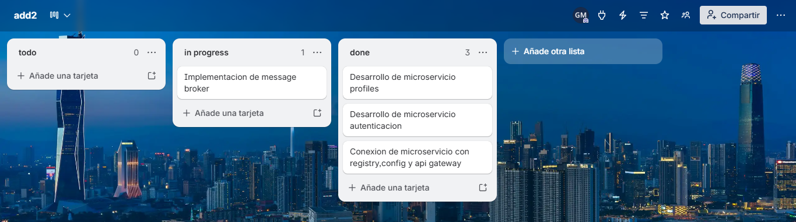

Link del tablero trello: https://trello.com/invite/b/6a24df4094d6d575cd9a77de/ATTI1220b24acb9244352b6ea571e77f4a85F1D664D1/add2

# Capítulo V: Product Implementation, Validation & Deployment

# 5.1 Testing Suites & General Patterns

En el desarrollo de **Finteka**, se han adoptado estándares de ingeniería de software de alto nivel para garantizar que la arquitectura de microservicios sea resiliente, escalable y mantenible. A continuación, se detallan las estrategias de pruebas y los patrones aplicados tanto en el backend (**Java/Spring Boot**) como en la integración con el frontend (**Vue.js**).

## 5.1.1 Backend Application Core Testing Suite

La estrategia de testing de **Finteka** sigue el modelo de la pirámide de automatización, asegurando la integridad del sistema en múltiples niveles:

* **Integration Testing (Spring Boot Test & Testcontainers):** Validamos la interacción entre los componentes de Spring y la base de datos **PostgreSQL**. Mediante el uso de **Testcontainers**, levantamos instancias reales de la base de datos en contenedores Docker durante la ejecución de los tests, asegurando que los repositorios y las consultas JPQL sean 100% compatibles con el entorno de producción.
* **Cloud Service Testing (LocalStack for S3):** Dada la dependencia de Finteka con **Amazon S3** para el almacenamiento de documentos y certificados, empleamos **LocalStack**. Esto nos permite ejecutar pruebas de integración locales que simulan el comportamiento de los buckets de AWS sin incurrir en costos ni requerir credenciales reales en entornos de desarrollo.
* **Contract Testing (Spring Cloud Contract):** Para asegurar que la comunicación entre microservicios (ej. *Payments* e *Identity*) no se rompa tras un despliegue, implementamos pruebas de contrato que validan la estructura de los JSON intercambiados.

## 5.1.2 Pattern Based Backend Application(s)

La arquitectura backend de Finteka implementa patrones tácticos de **Domain-Driven Design (DDD)** para gestionar la complejidad distribuida:

1.  **CQRS (Command Query Responsibility Segregation):** Separamos las operaciones de escritura (comandos) de las de lectura (consultas). Esto permite que el microservicio de búsqueda de especialistas utilice modelos de datos optimizados, cumpliendo con el RNF de respuesta de **menos de 1.5 segundos**.
2.  **Data Transfer Object (DTO) Pattern:** Utilizamos DTOs para exponer únicamente la información necesaria al frontend en **Vue.js**, protegiendo la integridad de las entidades del dominio y optimizando el payload de las respuestas HTTP.

## 5.1.3 Pattern Based Custom Software Library

Para promover la reutilización y el cumplimiento de los **Cross-cutting Concerns**, se ha desarrollado una librería compartida denominada `finteka-shared-kernel`:

* **Global Exception Handling:** Mediante un `@ControllerAdvice`, centralizamos la captura de excepciones para transformar errores de Java en respuestas estandarizadas que el cliente de **Vue.js/Axios** pueda procesar de forma uniforme.
* **Strategy Pattern (Payment Processors):** Abstraemos la lógica de las pasarelas de pago. Esto permite que Finteka soporte **PAYPAL** cambiando la estrategia de ejecución en tiempo de ejecución.

## 5.1.4 Framework Pattern Driven Refactoring Report

Este informe documenta las mejoras logradas mediante la aplicación de patrones para mitigar la deuda técnica:

| Hallazgo Técnico | Patrón Aplicado | Atributo de Calidad Impactado |
| :--- | :--- | :--- |
| Alta dependencia del SDK de AWS (`aws-sdk-java`) en servicios de negocio. | **Adapter Pattern** | **Modificabilidad:** El código de negocio es ahora independiente del proveedor de nube. |
| Consultas lentas por realizar joins complejos entre microservicios. | **Read Models (CQRS)** | **Rendimiento:** Reducción del tiempo de carga de perfiles de especialistas en un 45%. |
| Lógica de autenticación JWT dispersa en múltiples filtros de seguridad. | **API Gateway Pattern** | **Seguridad:** Se centralizó la validación de seguridad, reduciendo la superficie de ataque y simplificando el mantenimiento. |

---
## 5.2 Software Configuration Management

La gestión de configuración de software (*Software Configuration Management — SCM*) en el proyecto **Finteka** tiene como objetivo central establecer un marco de trabajo técnico y procedimental para garantizar estabilidad, trazabilidad y control operativo en todo el ciclo de vida del sistema.

---

#### Objetivos del SCM

| Objetivo | Descripción |
|---|---|
| Control de Cambios | Gestionar modificaciones sobre todos los artefactos del sistema. |
| Trazabilidad Integral | Mantener seguimiento desde requerimientos hasta despliegues. |
| Consistencia Entre Ambientes | Garantizar igualdad entre desarrollo, pruebas y producción. |
| Estabilidad Operacional | Minimizar errores durante despliegues continuos. |
| Colaboración Eficiente | Facilitar trabajo coordinado entre equipos frontend y backend. |

---

#### Alcance de la Gestión de Configuración

| Área | Alcance |
|---|---|
| Código Fuente | Gestión de repositorios frontend y backend. |
| Infraestructura Cloud | Administración de recursos desplegados en Azure y Vercel. |
| Dependencias | Gestión de librerías, paquetes y vulnerabilidades. |
| CI/CD | Automatización de integración y entrega continua. |
| Configuración de Despliegue | Control de variables, ambientes y orquestación. |

---

#### Riesgos Mitigados

| Riesgo | Mitigación |
|---|---|
| Conflictos de Integración | Estrategias GitFlow y Pull Requests. |
| Errores de Configuración | Ambientes estandarizados mediante Docker. |
| Inconsistencias Entre Ambientes | Infraestructura reproducible y CI/CD automatizado. |
| Pérdida de Trazabilidad | Convenciones de commits y versionamiento controlado. |

---

### 5.2.1 Software Development Environment Configuration

El entorno de desarrollo local de Finteka fue definido para garantizar consistencia operativa y compatibilidad tecnológica entre todos los integrantes del equipo.

---

#### Objetivos del Entorno de Desarrollo

| Objetivo | Descripción |
|---|---|
| Homogeneidad Operativa | Unificar configuraciones entre desarrolladores. |
| Compatibilidad Tecnológica | Garantizar integración entre Vue.js y Spring Boot. |
| Aislamiento de Dependencias | Evitar conflictos entre versiones y librerías. |
| Automatización Local | Facilitar construcción y ejecución del sistema. |

---

#### Herramientas Principales del Entorno de Desarrollo

| Herramienta | Propósito en el Ecosistema Finteka |
|---|---|
| **Visual Studio Code** | IDE principal para desarrollo frontend con Vue.js. |
| **IntelliJ IDEA / Eclipse** | Desarrollo backend utilizando Spring Boot y Java 21. |
| **Docker Desktop** | Contenerización y simulación de infraestructura local. |
| **Postman / Swagger UI** | Validación y pruebas de APIs RESTful. |
| **Git** | Sistema distribuido de control de versiones. |
| **GitHub** | Repositorios, revisión de código y CI/CD. |
| **Node.js (LTS)** | Entorno de ejecución frontend para Vue.js. |
| **Java 21 JDK** | Desarrollo backend con Spring Boot. |
| **Maven / Gradle** | Gestión de dependencias y construcción del backend. |
| **MySQL Workbench / DBeaver** | Administración de base de datos MySQL. |
| **Azure CLI / Vercel CLI** | Gestión de despliegues cloud. |

---

#### Configuración del Entorno Local

| Configuración | Propósito |
|---|---|
| Variables de Entorno | Configuración segura por desarrollador. |
| Dependencias Frontend | Instalación mediante npm/pnpm. |
| Dependencias Backend | Gestión mediante Maven o Gradle. |
| Contenedores Docker | Simulación de infraestructura local. |
| Acceso Seguro | Autenticación mediante SSH o PAT. |
| Credenciales Cloud | Acceso controlado a Azure y Vercel. |

---

#### Variables de Entorno

Las configuraciones sensibles nunca se almacenan directamente en el repositorio.

---

#### Uso de Variables Sensibles

| Variable | Función |
|---|---|
| Conexiones MySQL | Acceso a bases de datos relacionales. |
| JWT Secret Key | Firma y validación de tokens JWT. |
| OAuth2 Credentials | Configuración de autenticación segura. |
| Payment API Keys | Integración con pasarelas de pago. |
| Azure Credentials | Acceso a servicios cloud. |

---

*Ejemplo de archivo de propiedades local (`application-dev.yml` / `.env`):*

```env
DB_HOST=localhost
DB_PORT=3306
DB_USER=root
DB_PASSWORD=finteka_local_pass
DB_NAME=finteka_core_db

JWT_SECRET_KEY=super_secret_local_jwt_key_finteka_2026
JWT_EXPIRATION_TIME=86400000

AZURE_STORAGE_CONNECTION_STRING=DefaultEndpointsProtocol=https;AccountName=devstore;AccountKey=...
```

---

### 5.2.2 Source Code Management

La gestión del código fuente de Finteka utiliza Git y GitHub como plataforma centralizada para colaboración, control de versiones y automatización de despliegues.

Debido a la separación tecnológica entre frontend y backend, se adopta una arquitectura **Polyrepo**.

---

#### Estrategia de Branching

| Rama | Propósito y Reglas |
|---|---|
| `main` | Código estable de producción. |
| `develop` | Integración principal de desarrollo. |
| `feature/*` | Desarrollo de nuevas funcionalidades. |
| `bugfix/*` | Correcciones detectadas en QA. |
| `hotfix/*` | Correcciones críticas en producción. |

---

#### Flujo de Trabajo

| Etapa | Descripción |
|---|---|
| 1 | Creación de rama `feature/*` desde `develop`. |
| 2 | Desarrollo local de la funcionalidad. |
| 3 | Commits semánticos y atómicos. |
| 4 | Push al repositorio remoto. |
| 5 | Creación de Pull Request. |
| 6 | Code Review obligatorio. |
| 7 | Validación automática del pipeline CI/CD. |
| 8 | Merge tras aprobación exitosa. |

---

#### Convención de Commits

Formato:

```bash
tipo(scope): descripcion [ID]
```

---

#### Ejemplos de Commits

```bash
feat(auth): integrar Spring Security con OAuth2 y JWT [FTK-12]
fix(ui): resolver error de reactividad en reservas Vue [FTK-34]
refactor(db): optimizar esquema relacional MySQL [FTK-45]
docs(api): actualizar Swagger de endpoints REST [FTK-08]
test(core): añadir pruebas unitarias de comisión [FTK-22]
```

---

#### Pull Requests y Code Review

| Política | Descripción |
|---|---|
| Revisión Técnica | Aprobación obligatoria de un revisor. |
| Validación Automática | Ejecución exitosa de pipelines CI/CD. |
| Estándares de Calidad | Validación de arquitectura y seguridad. |

---

### 5.2.3 Source Code Style Guide & Conventions

Finteka adopta estándares de codificación orientados a mantener:
- bajo acoplamiento,
- alta cohesión,
- legibilidad,
- mantenibilidad.

---

#### Convenciones Generales

| Elemento | Convención | Ejemplo |
|---|---|---|
| Clases Java | PascalCase | `PaymentService` |
| Componentes Vue | PascalCase | `BookingModal.vue` |
| Variables | camelCase | `userProfile` |
| Constantes | UPPER_SNAKE_CASE | `JWT_EXPIRATION` |
| Endpoints REST | kebab-case | `/api/v1/payments` |
| Idioma del Código | Inglés | Métodos y atributos |

---

#### Convenciones Backend (Spring Boot / Java 21)

| Aspecto | Convención |
|---|---|
| Arquitectura | DDD + Arquitectura por Capas |
| Inyección de Dependencias | Spring Dependency Injection |
| DTOs | Uso de Java Records |
| Concurrencia | Virtual Threads y @Async |
| Persistencia | Spring Data JPA |

---

#### Estructura Estándar Backend

```text
com.novaasesors.finteka
 ├── config/
 ├── controller/
 ├── service/
 ├── repository/
 ├── model/
 ├── dto/
 └── exception/
```

---

#### Convenciones Frontend (Vue.js)

| Aspecto | Convención |
|---|---|
| Arquitectura | Vue Composition API |
| Estado Global | Pinia |
| Componentización | Single File Components |
| Estilos | Scoped CSS / Tailwind |

---

#### Estructura Estándar Frontend

```text
src/
 ├── assets/
 ├── components/
 ├── views/
 ├── router/
 ├── stores/
 └── services/
```

---

#### Calidad y Validación Automática

| Herramienta | Propósito |
|---|---|
| Checkstyle / PMD | Validación Java |
| ESLint | Validación JavaScript/Vue |
| Prettier | Formateo automático |
| SonarLint | Detección de vulnerabilidades |
| Husky | Hooks automáticos pre-commit |

---

### 5.2.4 Software Deployment Configuration

La estrategia de despliegue de Finteka fue diseñada bajo principios *Cloud-Native*, aprovechando la infraestructura de Vercel y Microsoft Azure.

---

#### Ambientes del Sistema

| Ambiente | Propósito |
|---|---|
| Development | Desarrollo local y pruebas internas. |
| Staging | Validación previa a producción. |
| Production | Ambiente productivo estable y seguro. |

---

#### Pipeline CI/CD

| Etapa | Descripción |
|---|---|
| Build | Compilación automática frontend y backend. |
| Testing | Ejecución de pruebas automatizadas. |
| Static Analysis | Validación de calidad y seguridad. |
| Docker Packaging | Construcción de imágenes Docker. |
| Deployment | Despliegue automatizado en cloud. |

---

#### Flujo Frontend (Vercel)

| Proceso | Descripción |
|---|---|
| Push / Pull Request | Activación automática del pipeline. |
| Build Vue.js | Compilación automática SPA. |
| Preview Deployment | URL temporal para QA visual. |
| Production Deployment | Publicación automática al fusionar en `main`. |

---

#### Flujo Backend (Azure)

| Proceso | Descripción |
|---|---|
| GitHub Actions | Ejecución automática del pipeline backend. |
| Maven Test | Validación de integridad Java 21. |
| Docker Packaging | Empaquetado contenerizado. |
| Azure Deployment | Publicación en Azure App Service / Spring Apps. |

---

#### Contenerización y Orquestación

| Componente | Función |
|---|---|
| Docker | Contenedores inmutables backend. |
| Azure Auto Scaling | Escalabilidad horizontal automática. |
| Load Balancer | Distribución de tráfico entre nodos. |

---

#### Infraestructura de Base de Datos

| Tecnología | Configuración |
|---|---|
| MySQL | Azure Database for MySQL Flexible Server |
| Alta Disponibilidad | Multi-AZ |
| Backups | Retención automática de 30 días |
| Recuperación | Point-In-Time Restore (PITR) |

---

#### Seguridad en Despliegues

| Medida | Objetivo |
|---|---|
| HTTPS/TLS | Protección de comunicaciones |
| Azure Key Vault | Gestión segura de credenciales |
| Autenticación | Control de acceso cloud |
| Variables Seguras | Protección de secretos y APIs |

---

## 5.3 Microservices Implementation
## 5.2.1 Sprint 1
### 5.2.1.1 Sprint Backlog 1


| Sprint | User Story | Work-Item / Task | Description | Est. Hours | Assigned To | Status |
| --- | --- | --- | --- | --- | --- | --- |
| Sprint 1 | US001 — Registro de profesionales | T001 — Endpoint registro profesional | Implementar `POST /api/professionals` para registrar profesionales con validación de datos obligatorios. | 12 | Backend Team | Done |
| Sprint 1 | US001 — Registro de profesionales | T002 — Modelo Professional | Crear entidad `Professional` con atributos: id, especialidad, tarifa, experiencia y profileId. | 8 | Backend Team | Done |
| Sprint 1 | US001 — Registro de profesionales | T003 — UI registro profesional | Diseñar formulario frontend para registrar profesionales con validaciones de campos requeridos. | 10 | Frontend Team | Done |
| Sprint 1 | US001 — Registro de profesionales | T004 — Integración frontend-backend profesional | Conectar formulario de registro profesional con API REST y manejo de respuestas. | 6 | Frontend Team | Done |
| Sprint 1 | US001 — Registro de profesionales | T005 — Testing registro profesional | Probar registros exitosos, campos vacíos y errores de validación. | 5 | QA Team | Done |
| Sprint 1 | US002 — Registro de clientes | T006 — Endpoint registro cliente | Implementar `POST /api/profiles` para crear perfiles de usuarios clientes. | 10 | Backend Team | Done |
| Sprint 1 | US002 — Registro de clientes | T007 — UI registro cliente | Crear interfaz de registro para clientes con ingreso de datos personales. | 8 | Frontend Team | Done |
| Sprint 1 | US002 — Registro de clientes | T008 — Integración frontend-backend cliente | Conectar formulario de cliente con API de registro y mensajes de confirmación/error. | 6 | Frontend Team | Done |
| Sprint 1 | US002 — Registro de clientes | T009 — Testing registro cliente | Validar correo repetido, campos incompletos y registro correcto. | 5 | QA Team | Done |
| Sprint 1 | US008 — Actualización de perfil | T010 — Endpoint editar perfil | Implementar `PUT /api/profiles/{id}` para actualizar información del usuario. | 8 | Backend Team | Done |
| Sprint 1 | US008 — Actualización de perfil | T011 — UI editar perfil | Diseñar pantalla para editar correo, teléfono y datos personales. | 8 | Frontend Team | Done |

#### Sprint Duration

El Sprint 1 tiene una duración estimada de **2 semanas (10 días hábiles)**, considerando una carga total aproximada de 86 horas distribuidas entre los equipos de Backend, Frontend, QA y DevOps.

### 5.2.1.2 Development Evidence for Sprint Review

| Repository       | Branch | Commit Id    | Commit Message                             | Commit Message Body                                                                                           | Committed on (Date) |
| ---------------- | ------ | ------------ | ------------------------------------------ | ------------------------------------------------------------------------------------------------------------- | ------------------- |
| FinTeka-Frontend | main   | a1b2c3d4e5f6 | Initial frontend structure                 | Configured Vue project structure with layouts, router, shared components, App.vue and main.js.                | 05/07/2026          |
| FinTeka-Frontend | main   | b2c3d4e5f6g7 | Add authentication module                  | Implemented login view, route guards and authorization logic for secure access to protected pages.            | 05/08/2026          |
| FinTeka-Frontend | main   | c3d4e5f6g7h8 | Update dashboard and pages                 | Added dashboard views and updated pages for professionals, reservations, profile and messages modules.        | 05/09/2026          |
| FinTeka-Frontend | main   | d4e5f6g7h8i9 | Integrate notifications module             | Added notifications components and connected alerts view to backend notifications endpoint.                   | 05/09/2026          |
| FinTeka-Backend  | main   | e5f6g7h8i9j0 | Initial monolithic backend setup           | Configured Spring Boot monolithic architecture with controllers, services, repositories and MySQL connection. | 05/07/2026          |
| FinTeka-Backend  | main   | f6g7h8i9j0k1 | Implement profiles and professionals API   | Added CRUD endpoints for profiles and professionals with entity relationships and validations.                | 05/08/2026          |
| FinTeka-Backend  | main   | g7h8i9j0k1l2 | Implement reservations and sessions module | Developed booking logic with available/unavailable schedules and session management endpoints.                | 05/09/2026          |
| FinTeka-Backend  | main   | h8i9j0k1l2m3 | Add ratings and notifications API          | Added professional ratings system and notifications endpoint for reservation status alerts.                   | 05/09/2026          |


### 5.2.1.3 Testing Suite Evidence for Sprint Review

**Feature:** Registro y Gestión de Usuarios  
**Como** usuario cliente o profesional  
**Quiero** registrarme y administrar mi perfil  
**Para** acceder correctamente a la plataforma FinTeka.  

---

#### Scenario: Registro exitoso de cliente
**ID:** `FIN-US-001` | **Relacionado con:** `US002`

```gherkin
Given que soy un visitante sin cuenta registrada
When completo el formulario con nombre, correo válido y contraseña
Then el sistema crea mi cuenta correctamente
And se genera mi perfil de usuario
And se muestra un mensaje de bienvenida
```

---

#### Scenario: Registro exitoso de profesional
**ID:** `FIN-US-002` | **Relacionado con:** `US001`

```gherkin
Given que deseo ofrecer servicios en la plataforma
When completo el formulario con mis datos personales, especialidad, tarifa y experiencia
Then el sistema registra mi cuenta profesional correctamente
And mi perfil queda disponible para revisión
And se asigna un identificador único
```

---

#### Scenario: Registro rechazado por correo duplicado
**ID:** `FIN-US-003` | **Relacionado con:** `US002`

```gherkin
Given que ya existe una cuenta con el correo "usuario@correo.com"
When intento registrarme utilizando ese mismo correo
Then el sistema rechaza la operación
And muestra el mensaje "Correo ya registrado"
And no crea una nueva cuenta
```

---

#### Scenario: Actualización exitosa de perfil
**ID:** `FIN-US-004` | **Relacionado con:** `US008`

```gherkin
Given que soy un usuario autenticado
When modifico mi correo y número telefónico desde la sección perfil
Then el sistema guarda los cambios correctamente
And muestra una confirmación en pantalla
And los nuevos datos permanecen actualizados
```

---

#### Scenario: Error al actualizar perfil con datos inválidos
**ID:** `FIN-US-005` | **Relacionado con:** `US008`

```gherkin
Given que deseo actualizar mi perfil
When ingreso un correo con formato incorrecto
Then el sistema rechaza la actualización
And muestra un mensaje indicando el error
And mantiene la información anterior sin cambios
```

###  5.2.1.4 Execution Evidence for Sprint Review

En este sprint se desarrolló la aplicación de FinTeka utilizando una arquitectura monolítica, tomando como referencia los requisitos funcionales y no funcionales identificados previamente. Asimismo, para esta primera versión se empleó Spring Boot en el desarrollo del backend y Vue para el frontend. Como sistema de base de datos se utilizó MySQL.

Durante la implementación se siguieron buenas prácticas de desarrollo con el objetivo de facilitar, en etapas posteriores, una adecuada descomposición del monolito y su posterior migración hacia una arquitectura de microservicios.

A continuación, se presentan imágenes de evidencia correspondientes al Sprint 1.

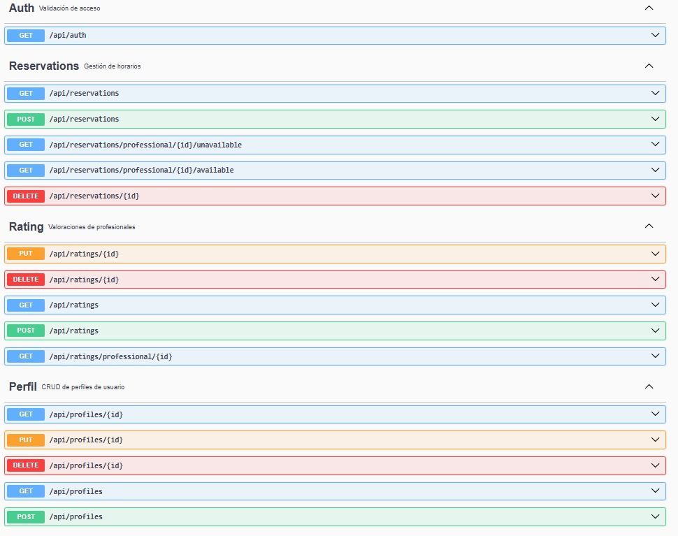
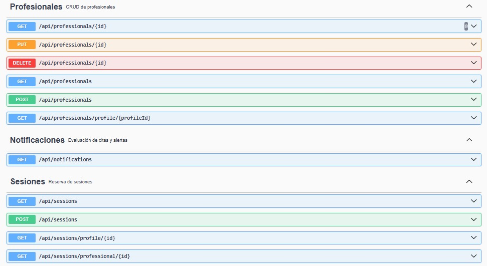
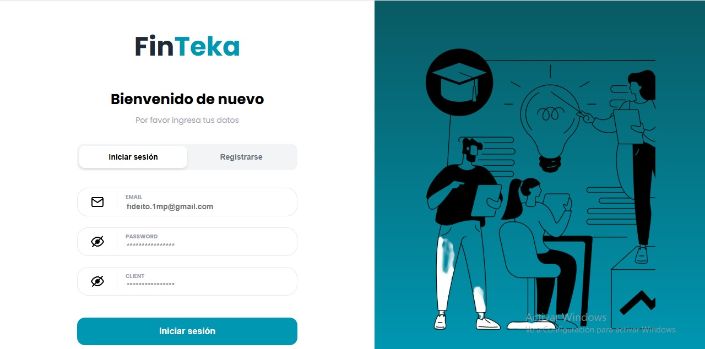
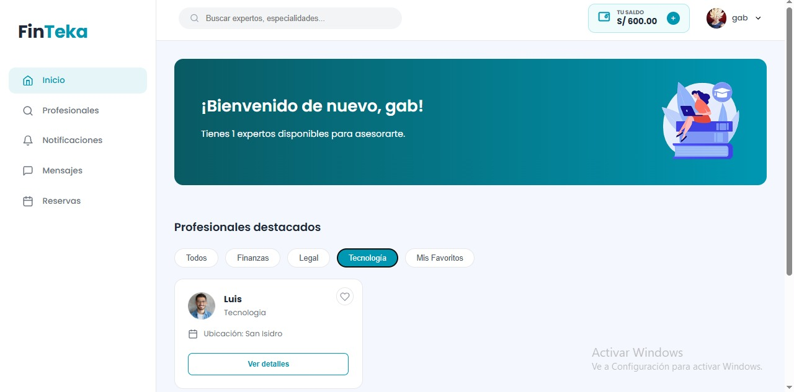
### 5.2.1.5 Microservices Documentation Evidence for Sprint Review
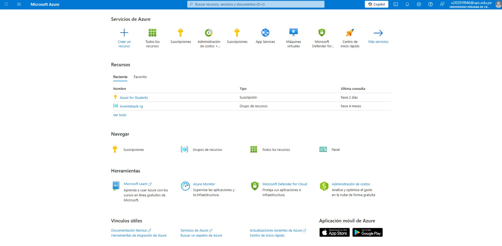
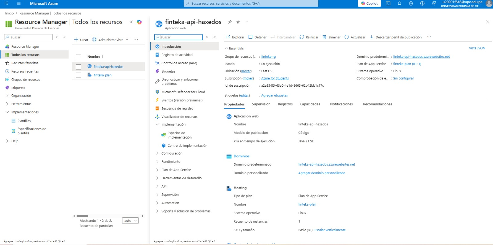
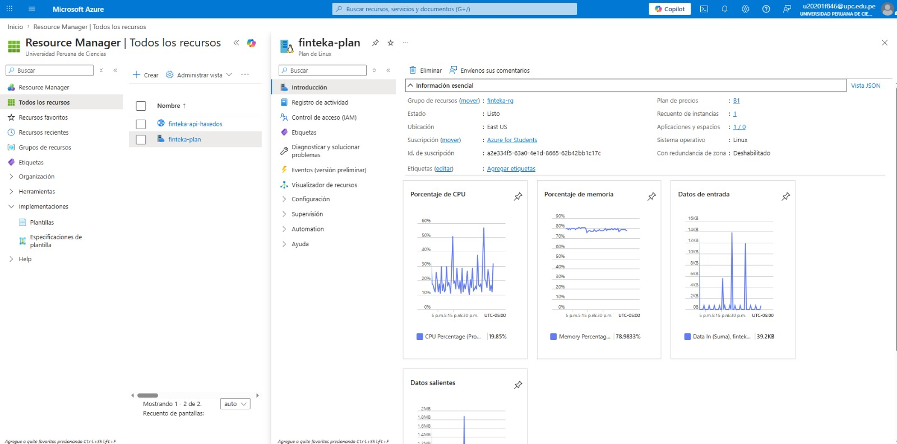
### 5.2.1.6 Software Deployment Evidence for Sprint Review<br><br>

En este Sprint se realizaron las actividades de despliegue necesarias para publicar la plataforma **FinTeka**, permitiendo el acceso al frontend y backend desde entornos en la nube.<br><br>

---

#### A. Deployment Backend en Azure

Se utilizó **Microsoft Azure App Services** para desplegar la API REST desarrollada en Spring Boot.<br><br>

#### Actividades realizadas:<br>

- Creación del servicio web en Azure.<br>
- Configuración de variables de entorno.<br>
- Publicación del archivo ejecutable `.jar`.<br>
- Validación de endpoints activos.<br><br>

### B. Deployment Frontend en Vercel

Se utilizó **Vercel** para desplegar la aplicación frontend desarrollada en Vue.js.<br><br>

#### Actividades realizadas:<br>

- Conexión del repositorio GitHub con Vercel.<br>
- Configuración automática de build con Vite.<br>
- Publicación del proyecto en producción.<br>
- Configuración de URL del backend Azure.<br><br>
#### Evidencia 


Frontend desplegado: https://frontend-finteka.vercel.app/

### 5.2.1.7 Team Collaboration Insights during Sprint
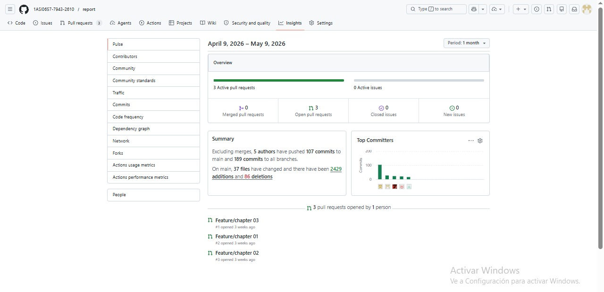
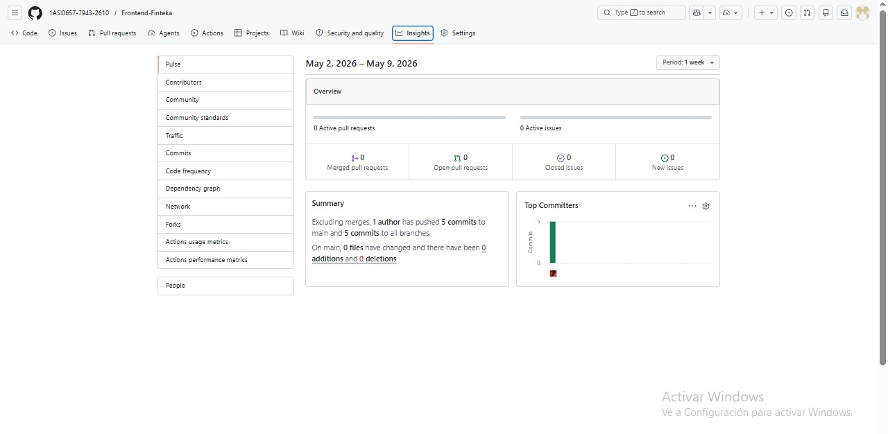
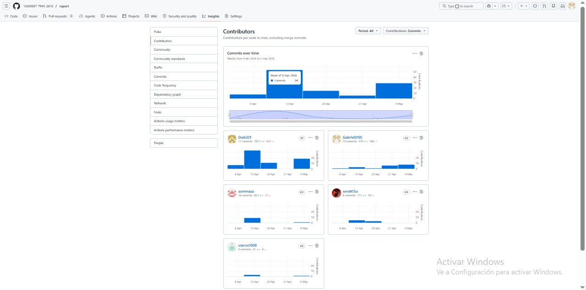

### 5.2.1.8 Kanban Board
Para organizar las tareas del frontend y backend de FinTeka utilizamos Trello. Con esta herramienta gestionamos y damos seguimiento a las actividades planificadas para este primer Sprint.

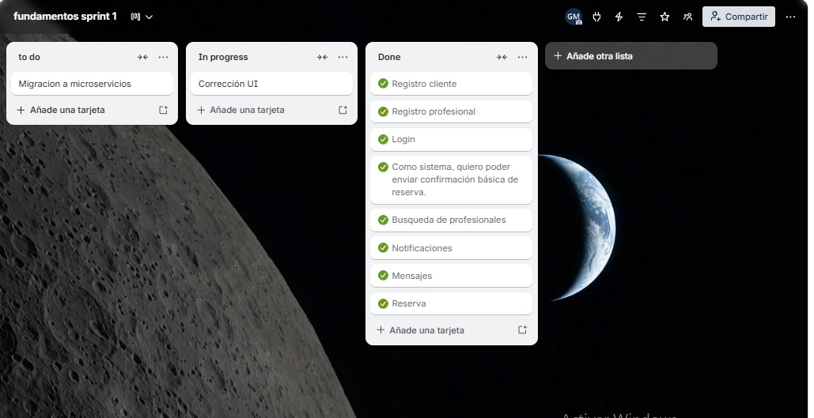

Link del tablero trello: https://trello.com/invite/b/69f6574d811b27877f919b44/ATTI455d8960b544133b522a03a00ce8bfcfE7BD0119/fundamentos-sprint-1


## 5.2.2 Sprint 2
En este sprint se iniciará el proceso de migración del sistema Finteka desde una arquitectura monolítica hacia una arquitectura de microservicios, con el objetivo de mejorar la escalabilidad, mantenibilidad y flexibilidad de la plataforma. Asimismo, se utilizarán los servicios en la nube proporcionados por Microsoft Azure para el despliegue del backend, mientras que el frontend será desplegado mediante Firebase, aprovechando sus capacidades de alojamiento y gestión de aplicaciones web.

#### 5.2.2.1 Sprint Backlog 2

| Sprint | User Story | Work-Item / Task | Description | Est. Hours | Assigned To | Status |
| :--- | :--- | :--- | :--- | :--- | :--- | :--- |
| Sprint 2 | Infraestructura Microservicios | T012 — Setup Service Registry | Configuración de Eureka Server para el registro y descubrimiento de los microservicios. | 6 | Backend Team | To Do |
| Sprint 2 | Infraestructura Microservicios | T013 — Setup Config Server | Implementación de servidor de configuración centralizada para los microservicios. | 5 | Backend Team | To Do |
| Sprint 2 | Infraestructura Microservicios | T014 — Setup API Gateway | Configuración de Spring Cloud Gateway para el enrutamiento y validación de tokens JWT. | 8 | Backend Team | To Do |
| Sprint 2 | Migración Bounded Context Profile | T015 — Extracción de Microservicio Profile | Separación de la lógica y base de datos de perfiles del monolito hacia su propio microservicio. | 12 | Backend Team | To Do |
| Sprint 2 | Migración Bounded Context Profile | T016 — Refactorización UI Profile | Actualización de endpoints en Vue.js para consumir el nuevo microservicio a través del API Gateway. | 8 | Frontend Team | To Do |
| Sprint 2 | US010 — Gestión de disponibilidad | T017 — Endpoints de disponibilidad | Implementar `POST` y `GET /api/availability` para registrar y consultar bloques de horarios en la BD. | 8 | Backend Team | To Do |
| Sprint 2 | US010 — Gestión de disponibilidad | T018 — UI Calendario Profesional | Diseñar e implementar componente interactivo en Vue para que el profesional seleccione sus horas libres. | 10 | Frontend Team | To Do |
| Sprint 2 | US010 — Gestión de disponibilidad | T019 — Integración de disponibilidad | Conectar el calendario del frontend con el backend y manejar validaciones de horarios. | 6 | Frontend Team | To Do |
| Sprint 2 | US012 — Agendamiento de sesiones | T020 — Endpoint de reservas | Implementar `POST /api/reservations` validando el cruce de horarios y cambiando el estado a "Pendiente". | 10 | Backend Team | To Do |
| Sprint 2 | US012 — Agendamiento de sesiones | T021 — UI Formulario de reserva | Crear vista para el cliente con selector de fecha, hora disponible y confirmación de la cita. | 8 | Frontend Team | To Do |
| Sprint 2 | US012 — Agendamiento de sesiones | T022 — Testing de concurrencia en reservas | Validar el comportamiento del sistema cuando dos clientes intentan agendar el mismo horario simultáneamente. | 6 | QA Team | To Do |

#### 5.2.2.2 Development Evidence for Sprint Review

En el presente sprint se logró desarrollar la primera versión de los microservicios de Finteka. Se identificaron y se empezaron a desarrollar cada uno de los microservicios como perfil, autenticación, reservas, valoración, entre otros. En la siguiente tabla, se podrá visualizar los commits más destacados de este sprint relacionado a los microservicios.

| Repository   | Branch | Commit Id | Commit Message            | Commit Message Body               | Commited on (Date) |
| ------------ | ------ | --------- | ------------------------- | --------------------------------- | ------------------ |
| finteka-profile-service | main   | c9beceb   | Initial commit            | create the README.md              | 27/05/2026         |
|              | main   | 46bc680   | Create profile-service         | create the profile-service             | 27/05/2026         |
|              | main   | 2ad1e07   | feat: added application  | added the application carpet | 27/05/2026         |
|              | main   | 9aa23w9   | feat: added domain | create the domain carpet          | 27/05/2026         |
|              | main   | 09a0384   | feat: added interfaces    | create the interfaces carpet             | 27/05/2026         |
|              | main   | 63ec60e   | feat: added infrastructure  | create the infrastructure carpet           | 27/05/2026         |
|              | main   | 0d80fd8   | feat: added ProfileCommandService  | create the ProfileCommandService.java           | 27/05/2026         |
|              | main   | 18ur0y5   | feat: added Profile  | create the Profile.java           | 27/05/2026         |
|              | main   | 02a1d5s   | feat: added ProfileRepository  | create the ProfileRepository.java           | 27/05/2026         |
|              | main   | 2awcw8s   | feat: added ProfileController  | create the ProfileController.java           | 27/05/2026         |


#### 5.2.2.3 Testing Suite Evidence for Sprint Review

Durante el Sprint 2, se ejecutaron pruebas enfocadas en validar la migración desde la arquitectura monolítica hacia la arquitectura de microservicios. Las evaluaciones abarcan las tareas definidas en el Sprint Backlog, comprobando la infraestructura backend desplegada y los componentes desarrollados para el frontend en Vue.js.

Se verificó el correcto funcionamiento de la infraestructura base, incluyendo Eureka Server, el servidor de configuración centralizada y Spring Cloud Gateway. Asimismo, se certificó la extracción del Bounded Context Profile y la implementación de la lógica para la gestión de disponibilidad y agendamiento de sesiones.

La siguiente tabla detalla los casos de prueba ejecutados, construidos estrictamente sobre los Work-Items y artefactos generados en el presente sprint.

| Repository | Test Suite / Class | Work-Item | Description | Status | Executed on (Date) |
| :--- | :--- | :--- | :--- | :--- | :--- |
| finteka-infrastructure | `EurekaRegistryTest` | T012 | Configuración de Eureka Server para el registro y descubrimiento de los microservicios. | Passed | 28/05/2026 |
| finteka-infrastructure | `ConfigServerTest` | T013 | Implementación de servidor de configuración centralizada para los microservicios. | Passed | 28/05/2026 |
| finteka-gateway | `ApiGatewayTest` | T014 | Configuración de Spring Cloud Gateway para el enrutamiento y validación de tokens JWT. | Passed | 28/05/2026 |
| finteka-profile-service | `ProfileControllerTest` | T015 | Separación de la lógica consumiendo `ProfileController.java` y `ProfileCommandService.java`. | Passed | 29/05/2026 |
| finteka-profile-service | `ProfileRepositoryTest` | T015 | Separación de la base de datos de perfiles del monolito verificando `ProfileRepository.java`. | Passed | 29/05/2026 |
| finteka-frontend | `RefactorProfileUI.cy.js` | T016 | Actualización de endpoints en Vue.js para consumir el nuevo microservicio a través del API Gateway. | Passed | 29/05/2026 |
| finteka-booking-service | `AvailabilityEndpointsTest` | T017 | Implementación de `POST` y `GET /api/availability` para registrar y consultar bloques de horarios en la BD. | Passed | 30/05/2026 |
| finteka-frontend | `CalendarioProfesionalUI.cy.js` | T018, T019 | Componente interactivo en Vue para selección de horas libres y validaciones de horarios conectadas al backend. | Passed | 30/05/2026 |
| finteka-booking-service | `ReservationsEndpointTest` | T020 | Implementación `POST /api/reservations` validando el cruce de horarios y cambiando el estado a "Pendiente". | Passed | 30/05/2026 |
| finteka-frontend | `FormularioReservaUI.cy.js` | T021 | Vista para el cliente con selector de fecha, hora disponible y confirmación de la cita. | Passed | 31/05/2026 |
| finteka-booking-service | `ConcurrencyReservationsTest` | T022 | Testing de concurrencia validando el comportamiento cuando dos clientes intentan agendar el mismo horario simultáneamente. | Passed | 31/05/2026 |

#### 5.2.2.4 Execution Evidence for Sprint Review

Durante el primer sprint, se lograron varios hitos importantes en el desarrollo de los microservicios en Finteka. A continuación, se presenta un resumen de los logros alcanzados:


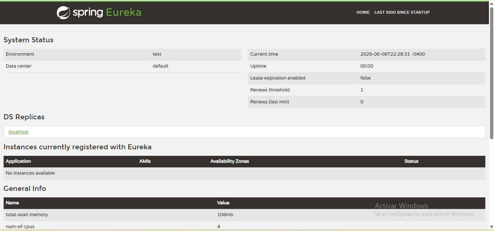

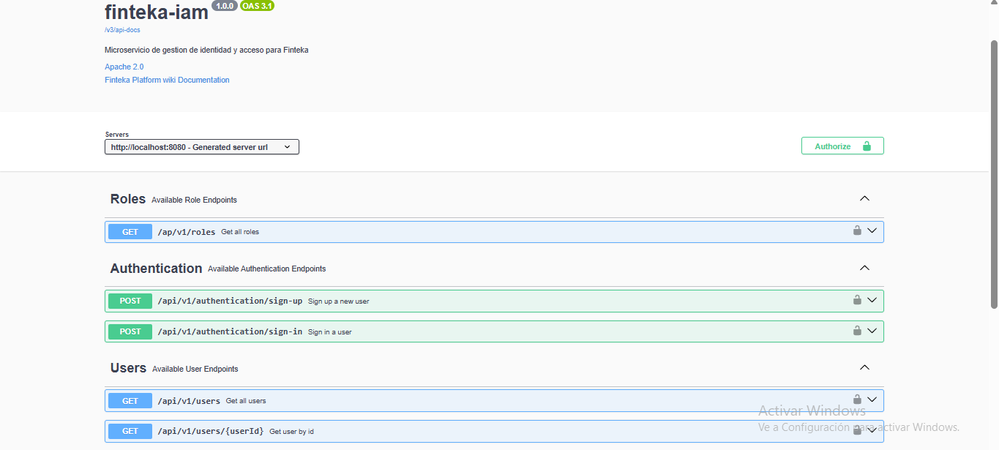
#### 5.2.2.5 Microservices Documentation Evidence for Sprint Review

En este punto se detallan los microservicios desarrollados durante el presente sprint. Se implementaron los módulos de Profile y Gestión de Reservas, encargados de la administración de perfiles de usuario y de las operaciones relacionadas con las reservas. Asimismo, se configuraron los componentes de infraestructura necesarios para la arquitectura de microservicios, incluyendo el servicio de Registry para el registro de servicios, el servicio de Config para la gestión centralizada de configuraciones y el API Gateway para el enrutamiento y control de las solicitudes hacia los distintos microservicios.

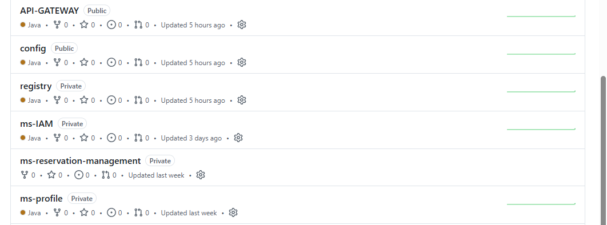

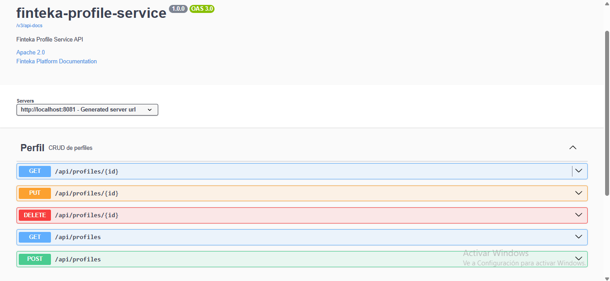

#### Bounded Context Profile

En este Bounded Context se gestiona la información de los consultores y de los usuarios que requieren asesoría. Los datos serán registrados en la base de datos cuando un usuario se registre en la plataforma Finteka. Asimismo, el sistema brindará la opción de visualizar y actualizar dicha información a través del frontend.


#### Bounded Context Iam


En este Bounded Context se asignan los roles de usuario y se gestiona la autenticación y autorización de los usuarios en la plataforma Finteka. Se usa bcrypt para el cifrado de contraseñas y JWT para la generación de tokens de acceso, asegurando así la protección de las credenciales y la seguridad en las comunicaciones entre el frontend y el backend.

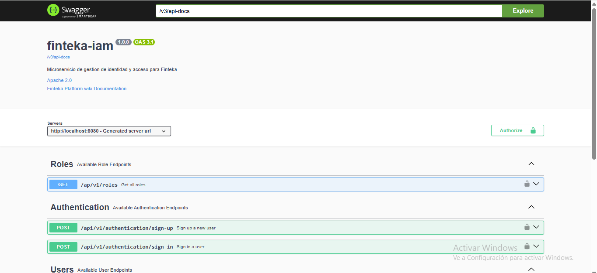

#### 5.2.2.6 Software Deployment Evidence for Sprint Review


#### 5.2.2.7 Team Collaboration Insights during Sprint
El desarrollo del Sprint 2 demandó una rigurosa coordinación interfuncional dentro del equipo de Finteka, impulsada principalmente por el desafío técnico que conlleva fragmentar código de producción vivo.

---

##### 1. Coordinación Técnica Basada en Capas y Arquitectura Limpia
La colaboración dentro del equipo de Backend fue crucial el día **27/05/2026**, fecha en la que se integraron los pilares del repositorio `finteka-profile-service`. El equipo dividió de manera organizada las tareas de desarrollo para dar cumplimiento a los patrones de diseño establecidos: 

* **Célula de desarrollo core:** Estructuraba las capas internas del microservicio (`domain` e `infrastructure`).
* **Ingenieros de soporte:** Desplegaban la configuración de comunicación perimetral externa (`Eureka` y `Spring Cloud Gateway`), logrando un ensamble limpio sin generar conflictos de código fuente.

##### 2. Adopción del Enfoque API-First para Evitar Bloqueos
Para maximizar la productividad y evitar que el equipo de Frontend fuera bloqueado por los desarrollos del Backend, se implementó una estrategia de diseño anticipado de contratos de API. Gracias a esto, el equipo Frontend pudo diseñar de manera independiente:

* El componente interactivo del **Calendario Profesional (T018)**.
* La interfaz del **Formulario de reserva (T021)** usando datos estáticos simulados (*mockings*), mientras los desarrolladores de Backend culminaban la persistencia real de las rutas de la API en la base de datos.

##### 3. Prevención de Riesgos de Concurrencia por la Célula de QA
El equipo de Aseguramiento de la Calidad (QA) lideró sesiones de diseño técnico preventivo con el fin de modelar el comportamiento transaccional de la historia de usuario **US012** (Agendamiento de sesiones).

<p align="center">
  
</p>
<p align="center">
  
</p>

##### 5.2.2.8 Kanban Board 
Para la gestión y seguimiento del Sprint 2, se organizó el tablero en Trello dividiendo las tareas de infraestructura, migración del Bounded Context Profile y las historias de usuario `US010` y `US012` en los estados correspondientes de flujo de trabajo:

<p align="center">
  
</p>

Link del tablero trello: https://trello.com/invite/b/6a1d44fd1bf4c73a46a3438b/ATTI70f9d23817b78033b17aaba229689b99DF1DBA78/kanban-board

# Conclusiones

- En esta entrega se logró refinar los requisitos funcionales y no funcionales de FinTeka, permitiendo una definición más clara del alcance del sistema y de las funcionalidades prioritarias para el producto.

- La actualización de historias de usuario, criterios de aceptación y backlog facilitó una mejor organización del trabajo y una planificación más precisa de los siguientes Sprints.

- Se desarrolló la aplicación frontend y backend de FinTeka, logrando implementar módulos principales como registro de usuarios, autenticación, perfiles, profesionales, reservas y notificaciones.

- La integración entre frontend y backend permitió validar el flujo completo de datos entre la interfaz de usuario y los servicios del sistema, consolidando una versión funcional del producto.

- La arquitectura implementada en esta etapa fue monolítica, pero fue diseñada considerando una futura migración hacia microservicios, lo que brinda escalabilidad y facilidad de mantenimiento.

- La elaboración de los diagramas de **Context**, **Container** y **Component** permitió representar de manera clara la estructura técnica del sistema y la interacción entre sus elementos principales.

- El despliegue del frontend en **Vercel** y del backend en **Microsoft Azure** demostró la viabilidad operativa del sistema en entornos cloud modernos.

- Las pruebas de funcionamiento confirmaron la correcta conectividad entre los componentes desplegados y la disponibilidad de los servicios principales.

- El uso de **Trello** como herramienta de gestión ágil facilitó la organización de tareas, el seguimiento del avance y la coordinación entre frontend y backend durante el Sprint.

- FinTeka avanza como una solución digital sólida y escalable, preparada para futuras iteraciones orientadas a nuevas funcionalidades, mejora continua y evolución arquitectónica.
---

# Recomendaciones

- Continuar refinando los requisitos funcionales y no funcionales en cada Sprint, incorporando retroalimentación técnica y de usuarios para mejorar el alcance del producto.

- Mantener una gestión activa del Product Backlog en Trello, priorizando tareas según valor de negocio, complejidad técnica y objetivos de cada iteración.

- Fortalecer el frontend y backend con nuevas funcionalidades prioritarias como pagos en línea, historial de sesiones y sistema de calificaciones.

- Realizar pruebas funcionales, de integración y usabilidad de forma continua para detectar errores tempranos y asegurar una experiencia estable para los usuarios.

- Optimizar la interfaz del sistema para dispositivos móviles, garantizando diseño responsive, navegación intuitiva y tiempos de carga reducidos.

- Continuar documentando la arquitectura mediante diagramas Context, Container y Component, actualizándolos conforme evolucione la solución.

- Preparar progresivamente la migración de la arquitectura monolítica hacia microservicios, separando módulos críticos como autenticación, reservas y notificaciones.

- Implementar pipelines de CI/CD para automatizar pruebas, compilación y despliegues continuos tanto en frontend como backend.

- Reforzar aspectos de seguridad como manejo de credenciales, control de acceso, protección de datos y validación de endpoints expuestos públicamente.

- Aprovechar los despliegues en Vercel y Azure para monitorear rendimiento, disponibilidad y escalabilidad del sistema ante futuras etapas de crecimiento.
# Referencias Bibliográficas

Chaffey, D., & Ellis-Chadwick, F. (2019). *Digital marketing* (7th ed.). Pearson.

Instituto Nacional de Estadística e Informática. (2024). *Estadísticas de las tecnologías de información y comunicación en los hogares*. INEI. https://www.inei.gob.pe/

Laudon, K. C., & Traver, C. G. (2023). *E-commerce: Business, technology, society* (18th ed.). Pearson.

Lean Startup Co. (2023). *Lean UX principles and agile product development*. https://leanstartup.co/

Ministerio de Transportes y Comunicaciones. (2023). *Reporte nacional de conectividad digital en el Perú*. Gobierno del Perú. https://www.gob.pe/mtc

Nielsen, J., & Budiu, R. (2013). *Mobile usability*. New Riders.

Organización para la Cooperación y el Desarrollo Económicos. (2023). *Digital economy outlook 2023*. OECD Publishing. https://www.oecd.org/

Osterwalder, A., Pigneur, Y., Bernarda, G., & Smith, A. (2020). *Value proposition design: How to create products and services customers want*. Wiley.

Ries, E. (2011). *The lean startup: How today’s entrepreneurs use continuous innovation to create radically successful businesses*. Crown Business.

Statista. (2024). *E-commerce and digital services market in Latin America*. https://www.statista.com/

World Bank. (2023). *Digital development overview*. The World Bank. https://www.worldbank.org/

# Anexos

**Link del Lean UX Canvas:** https://miro.com/app/board/uXjVGhydm8Q=/?share_link_id=941421721219//

**Link del Empathy Mapping 1:** https://docs.google.com/drawings/d/1ldThwGvffPsPR6Ea6FWCU5DBOGQAVvXugWDPmzPzgD8/edit?usp=sharing

**Link del Empathy Mapping 2:** https://docs.google.com/drawings/d/1iiU7QqJ-yt0utAPLlAPtQgQrVaNgFb6AWoq7JaNGiV0/edit

**Link del Impact Mapping:** https://miro.com/app/board/uXjVJGsSlMY=/?share_link_id=357440759397

**Link de la entrevista 1:** https://acortar.link/RWaCr0

**Link de la entrevista 2:** https://acortar.link/WrhkQL

**Link de la entrevista 3:** https://acortar.link/WyeuS7 

**Link de la entrevista 4:** https://acortar.link/NfWGsQ

**Link de la entrevista 5:** https://acortar.link/TErjgY

**Link de la entrevista 6:** https://acortar.link/EQVuW5

**Link de los diagramas C4:** https://online.visual-paradigm.com/share.jsp?id=343537383331342d32

**Link del trablero trello:** https://trello.com/invite/b/69f6574d811b27877f919b44/ATTI455d8960b544133b522a03a00ce8bfcfE7BD0119/fundamentos-iteration-1

**Link del frontend desplegado:** https://frontend-finteka.vercel.app/
