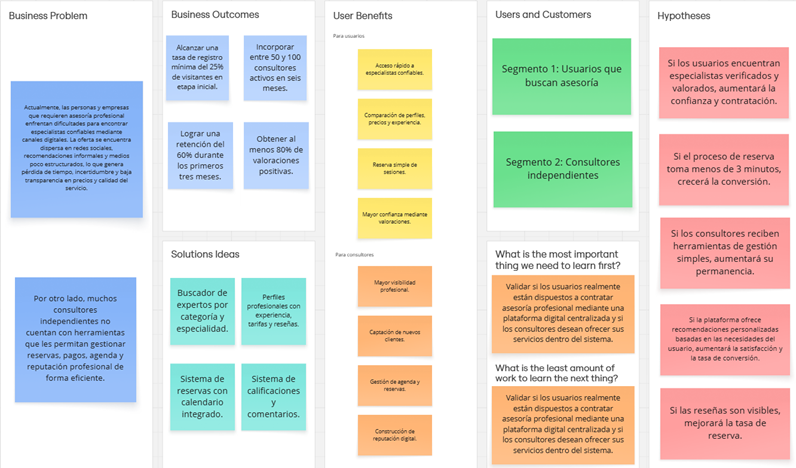
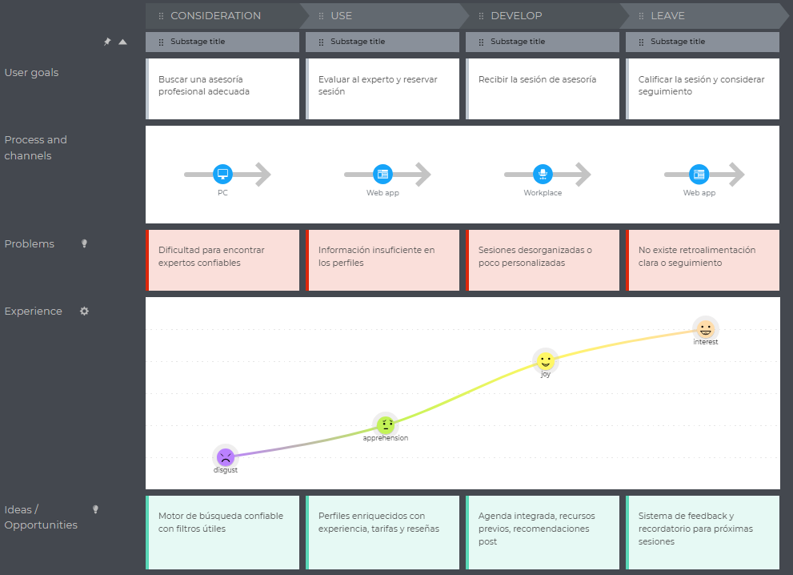
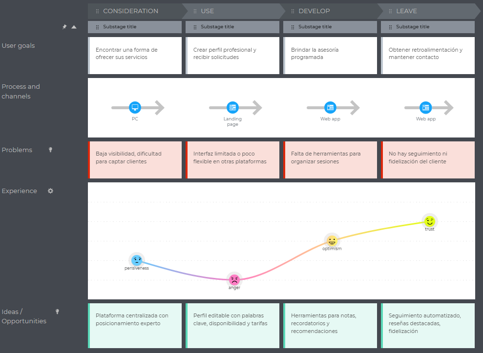
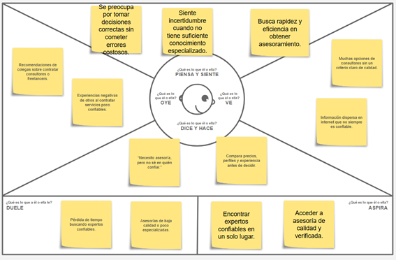
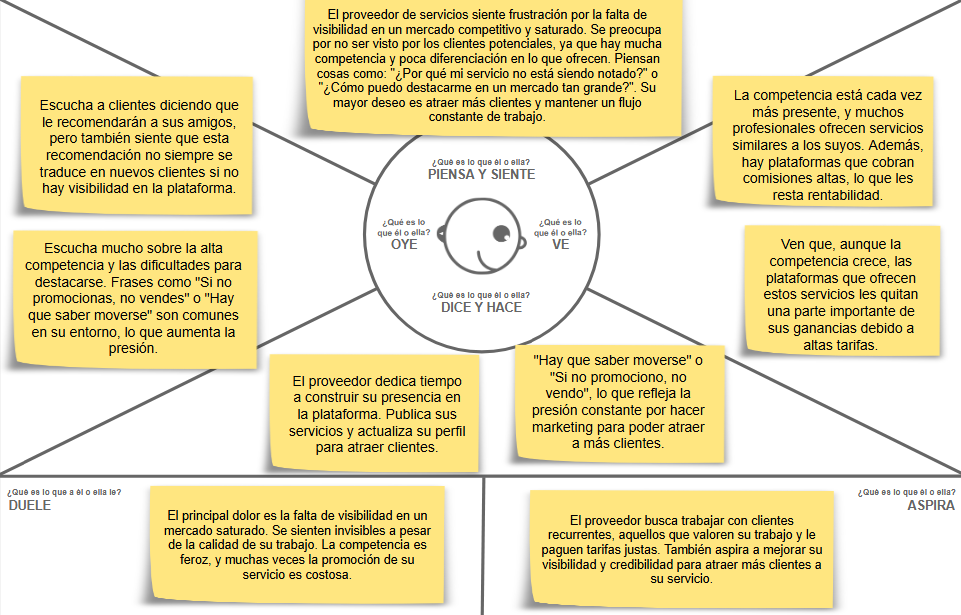
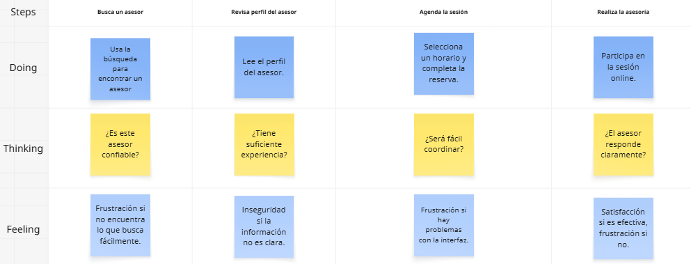
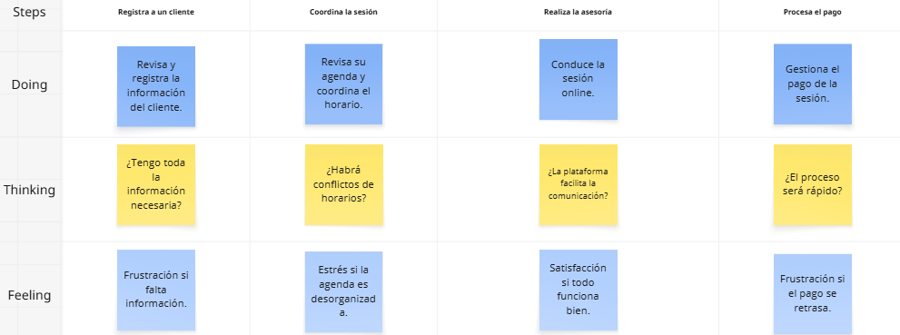

# UNIVERSIDAD PERUANA DE CIENCIAS APLICADAS
### Ingeniería de Software
### 7mo ciclo
### 1ASI0657 - Fundamentos de Arquitectura de Software 
### 202610
### NRC: 7943
### Profesor: Ernesto Ocampo Tello
## Informe de TB1

## Producto:  Finteka

### Relación de integrantes:

| **Código** | **Apellidos y Nombres**               |
| :--------: | :------------------------------------ |
| U202310425 | Aguirre Castillo, Sergio Cesar        |
| U202128264 | Burga Loarte, Anaely Zarely           |
| U202220659 | Mamani Marca, Gabriel Cristian        |
| U20201f846 | Oshiro Yamashita, Daiki Oscar         |
| U20201f846 | Montes Maza, Augusto Sebastian        |

### Abril,2026

---

## Registro de Versiones del Informe

<table>
  <tr>
    <th>Versión</th>
    <th>Fecha</th>
    <th>Autor</th>
    <th>Descripción</th>
  </tr>
  <tr>
    <td rowspan="5">TB1</td>
    <td>10/06/2026</td>
    <td>Aguirre Castillo, Sergio Cesar</td>
    <td>Desarrollo del capítulo 3.</td>
  </tr>
  <tr>
    <td>04/12/2026</td>
    <td>Burga Loarte, Anaely Zarely</td>
    <td>Desarrollo puntos 2.1, 2.3, 2.3.1 </td>
  </tr>

   <tr>
    <td>04/12/2026</td>
    <td>Mamani Marca, Gabriel Cristian</td>
    <td>Desarrollo el capitulo 1 y punto 3.2 </td>
  </tr>

  <tr>
    <td>07/06/2026</td>
    <td>Oshiro Yamashita, Daiki Oscar</td>
    <td>Desarrollo de los puntos 2.3.2 a 2.3.5</td>
  </tr>
  <tr>
    <td>12/04/2026</td>
    <td>Oshiro Yamashita, Daiki Oscar</td>
    <td>Revisión general del documento.</td>
  </tr>
</table>

# Contenido

## Índice

Tabla de contenidos

- [Registro de versiones del informe](#registro-de-versiones-del-informe)

- [Project Report Collaboration Insights](#project-report-collaboration-insights)

- [Contenido](#contenido)

- [Student Outcome](#student-outcome-1)

- [Capítulo I: Introducción](#capitulo-i-introduccion)
  - [1.1. StartUp Profile](#11-startup-profile)
    - [1.1.1. Descripción de la StartUp](#111-descripción-de-la-startup)
    - [1.1.2. Perfiles de Integrantes del equipo](#112-perfiles-de-integrantes-del-equipo)
  - [1.2. Solution Profile](#12-solution-profile)
    - [1.2.1. Antecedentes y Problemática](#121-antecedentes-y-problemática)
    - [1.2.2. Lean UX Process](#122-lean-ux-process)
      - [1.2.2.1. Lean UX Problem Statements](#1221-lean-ux-problem-statements)
      - [1.2.2.2. Lean UX Assumptions](#1222-lean-ux-assumptions)
      - [1.2.2.3. Lean UX Hyphotesis Statements](#1223-lean-ux-hyphotesis-statements)
      - [1.2.2.4. Lean UX Canvas](#1224-lean-ux-canvas)
  - [1.3. Segmentos objetivo](#13-segmentos-objetivo)
- [Capítulo II: Requirements & Analysis]()
  - [2.1. Competidores](#21-competidores)
    - [2.1.1. Análisis competitivo](#211-análisis-competitivo)
    - [2.1.2. Estrategias y tácticas frente a competidores](#212-estrategias-y-tácticas-frente-a-competidores)
  - [2.2. Entrevistas](#22-entrevistas)
    - [2.2.1. Diseño de entrevistas](#221-diseño-de-entrevistas)
    - [2.2.2. Registro de entrevistas](#222-registro-de-entrevistas)
    - [2.2.3. Análisis de entrevistas](#223-análisis-de-entrevistas)
  - [2.3. Needfinding](#23-needfinding)
    - [2.3.1. User Persona](#231-user-persona)
    - [2.3.2. User Task Matrix](#232-user-task-matrix)
    - [2.3.3. Empathy Mapping](#233-empathy-mapping)
    - [2.3.4. As-is Scenario Mapping](#234-as-is-scenario-mapping)
- [Capítulo III: Requirements Specification]()
  - [3.1. To-Be Scenario Mapping](#31-to-be-scenario-mapping)
  - [3.2. User Stories](#32-user-stories)
  - [3.3. Impact Map](#33-impact-map)
  - [3.4. Product Backlog](#34-product-backlog)
- [Capítulo IV: Product Architecture Design]()
  - [4.1. Desing Concepts, ViewPoints & ER Diagrams](#41-desing-concepts-viewpoints-&-er-diagrams)
    - [4.1.1. Principles Statements](#411-principles-statements)
    - [4.1.2. Approaches Statements Architectural Styles & Patterns](#412-approaches-statements-architectural-styles-&-patterns)
    - [4.1.3. Context Diagram](#413-context-diagrams)
    - [4.1.4. Approach driven ViewPoints Diagrams](#414-approach-driven-viewpoints-diagrams)
    - [4.1.5. Relational/Non Relational Database Diagram](#415-relational-non-relational-database-diagrams)
    - [4.1.6. Design Patterns](#416-design-patterns)
    - [4.1.7. Tactics](#417-tactics)
  - [4.2. Architectural Drivers](#42-architectural-drivers)

- [Capítulo V: Product Implementation, Validation & Deployment]()
  - [5.1. Testing Suites & General Patterns](#51-testing-suites-&-general-patterns)
    - [5.1.1. Backend Application Core Testing Suite](#511-backend-application-core-testing-suite)
    - [5.1.2. Pattern Based Backend Application(s)](#512-pattern-based-backend-application(s))
    - [5.1.3. Pattern Based Custom Software Library](#513-pattern-based-custom-software-library)
    - [5.1.4. Framework Pattern Driven Refactoring Report](#514-framework-pattern-driven-refactoring-report)
  - [5.2. Software Configuration Management](#52-software-configuration-management)
    - [5.2.1. Software Development Environment Configuration](#521-software-development-environment-configuration)
    - [5.2.2. Source Code Management](#522-source-code-management)
    - [5.2.3. Source Code Style Guide & Conventions](#523-source-code-style-guide-&-conventions)
    - [5.2.4. Software Deployment Configuration](#524-software-deployment-configuration)
  - [5.3. Microservices Implementation](#53-microservices-implementation)
    - [5.2.1. Sprint 1](#521-sprint-1)
      - [5.2.1.1. Sprint Backlog 1](#5211-sprint-backlog-1)
      - [5.2.1.2. Development Evidence for Sprint Review](#5212-development-evidence-for-sprint-review)
      - [5.2.1.3. Testing Suite Evidence for Sprint Review](#5213-testing-suite-evidence-for-sprint-review)
      - [5.2.1.4. Execution Evidence for Sprint Review](#5214-execution-evidence-for-sprint-review)
      - [5.2.1.5. Microservices Documentation Evidence for Sprint Review](#5215-microservices-documentation-evidence-for-sprint-review)
      - [5.2.1.6. Software Deployment Evidence for Sprint Review](#5216-software-deployment-evidence-for-sprint-review)
      - [5.2.1.7. Team Collaboration Insights during Sprint](#5217-team-collaboration-insights-during-sprint)
      - [5.2.1.8. Kanban Board](#5218-kanban-board)
    - [5.2.2. Sprint 2](#522-sprint-2)
      - [5.2.2.1. Sprint Backlog 2](#5221-sprint-backlog-2)
      - [5.2.2.2. Development Evidence for Sprint Review](#5222-development-evidence-for-sprint-review)
      - [5.2.2.3. Testing Suite Evidence for Sprint Review](#5223-testing-suite-evidence-for-sprint-review)
      - [5.2.2.4. Execution Evidence for Sprint Review](#5224-execution-evidence-for-sprint-review)
      - [5.2.2.5. Microservices Documentation Evidence for Sprint Review](#5225-microservices-documentation-evidence-for-sprint-review)
      - [5.2.2.6. Software Deployment Evidence for Sprint Review](#5226-software-deployment-evidence-for-sprint-review)
      - [5.2.2.7. Team Collaboration Insights during Sprint](#5227-team-collaboration-insights-during-sprint)
      - [5.2.2.8. Kanban Board](#5228-kanban-board)
    - [5.2.3. Sprint 3](#523-sprint-3)
      - [5.2.3.1. Sprint Backlog 3](#5231-sprint-backlog-3)
      - [5.2.3.2. Development Evidence for Sprint Review](#5232-development-evidence-for-sprint-review)
      - [5.2.3.3. Testing Suite Evidence for Sprint Review](#5233-testing-suite-evidence-for-sprint-review)
      - [5.2.3.4. Execution Evidence for Sprint Review](#5234-execution-evidence-for-sprint-review)
      - [5.2.3.5. Microservices Documentation Evidence for Sprint Review](#5235-microservices-documentation-evidence-for-sprint-review)
      - [5.2.3.6. Software Deployment Evidence for Sprint Review](#5236-software-deployment-evidence-for-sprint-review)
      - [5.2.3.7. Team Collaboration Insights during Sprint](#5237-team-collaboration-insights-during-sprint)
      - [5.2.3.8. Kanban Board](#5238-kanban-board)
    - [5.2.4. Sprint 4](#524-sprint-4)
      - [5.2.4.1. Sprint Backlog 4](#5241-sprint-backlog-4)
      - [5.2.4.2. Development Evidence for Sprint Review](#5242-development-evidence-for-sprint-review)
      - [5.2.4.3. Testing Suite Evidence for Sprint Review](#5243-testing-suite-evidence-for-sprint-review)
      - [5.2.4.4. Execution Evidence for Sprint Review](#5244-execution-evidence-for-sprint-review)
      - [5.2.4.5. Microservices Documentation Evidence for Sprint Review](#5245-microservices-documentation-evidence-for-sprint-review)
      - [5.2.4.6. Software Deployment Evidence for Sprint Review](#5246-software-deployment-evidence-for-sprint-review)
      - [5.2.4.7. Team Collaboration Insights during Sprint](#5247-team-collaboration-insights-during-sprint)
      - [5.2.4.8. Kanban Board](#5248-kanban-board)
  - [5.4. Microservices Deployment](#54-microservices-deployment)
    - [5.3.1. Cloud Architecture Diagram](#531-cloud-architecture-diagram)
    - [5.3.2. Cloud Architecture Deployment](#532-cloud-architecture-deployment)
- [Conclusiones](#conclusiones)
  - [Conclusiones y recomendaciones](#conclusiones-y-recomendaciones)
  - [Video About-The-Team](#video-about-the-team)
- [Referencias Bibliográficas](#referencias-bibliograficas)
- [Anexos](#anexos)
- [Link](#links)

## Student Outcome

Objetivo general, ABET – EAC - Student Outcome 7: Aprendizaje Continuo y Autónomo.

| Criterio específico | Acciones realizadas | Conclusiones |
|---|---|---|
| Actualiza conceptos y conocimientos necesarios para su desarrollo profesional y en especial para su proyecto en soluciones de software. | Daiki Oscar Oshiro Yamashita   **TB1**: Actualicé y apliqué conocimientos de UX y metodologías ágiles durante el desarrollo de Finteka, elaborando el User Task Matrix, Empathy Mapping, As-is Scenario Mapping y revisando el Product Backlog para mejorar la definición del proyecto.    Anaely Burga Loarte   **TB1**: Actualicé y apliqué conocimientos de investigación de usuarios mediante la elaboración del análisis de competidores y el desarrollo de Needfinding, lo que permitió identificar oportunidades de mejora en el mercado. Asimismo, diseñé User Personas basadas en datos recolectados para representar de manera precisa a los usuarios objetivo del proyecto Finteka.    Sergio Aguirre Castillo   **TB1**: Actualicé y apliqué conocimientos en desarrollo de software utilizando lenguajes como Python, C++ y C#, participando en la implementación de funcionalidades del proyecto Finteka. Además, reforcé conceptos de estructuras de datos y buenas prácticas de programación para mejorar la calidad del código.    Gabriel Cristian Mamani Marca   **TB1**: Actualicé y apliqué conocimientos de investigación de usuarios mediante la identificación y el análisis detallado de los segmentos objetivo, lo que permitió comprender mejor sus necesidades y características dentro del mercado. Asimismo, elaboré los requisitos funcionales y no funcionales de la aplicación Finteka, asegurando que el sistema responda adecuadamente a las expectativas y condiciones de uso definidas para el proyecto. | Daiki Oscar Oshiro Yamashita   **TB1**: La actualización constante de conocimientos permitió mejorar el análisis, organización y planificación del proyecto de software.    Anaely Burga Loarte   **TB1**: La actualización de conocimientos en investigación de usuarios permitió comprender mejor el entorno competitivo y las necesidades reales de los usuarios, fortaleciendo la propuesta de valor del proyecto.    Sergio Aguirre Castillo   **TB1**: La actualización de conocimientos técnicos permitió mejorar la calidad del desarrollo, optimizar la implementación de funcionalidades y fortalecer las competencias en programación para el proyecto.    Gabriel Cristian Mamani Marca   **TB1**: La actualización de conocimientos en análisis de segmentos objetivo y definición de requisitos funcionales y no funcionales permitió estructurar de manera clara las necesidades del sistema Finteka, asegurando una mejor alineación entre los requerimientos del usuario y las funcionalidades de la aplicación. |
| Reconoce la necesidad del aprendizaje permanente para el desempeño profesional y el desarrollo de proyectos en soluciones de software. | Daiki Oscar Oshiro Yamashita   **TB1**: Reconocí la necesidad del aprendizaje continuo al investigar nuevas técnicas de análisis de usuarios, priorización de requerimientos y gestión ágil, aplicándolas en el proyecto Finteka para mejorar la calidad de la solución propuesta.    Anaely Burga Loarte   **TB1**: Reconocí la importancia del aprendizaje continuo al aplicar técnicas de Needfinding y construcción de User Personas, lo que implicó investigar nuevas herramientas y enfoques centrados en el usuario para mejorar la definición del público objetivo en Finteka.    Sergio Aguirre Castillo   **TB1**: Reconocí la importancia del aprendizaje continuo al investigar nuevas tecnologías, frameworks y herramientas de desarrollo, así como buenas prácticas de programación, con el fin de mejorar mi desempeño y aportar de manera más eficiente al proyecto Finteka.    Gabriel Cristian Mamani Marca   **TB1**: Reconocí la necesidad del aprendizaje continuo al investigar y aplicar enfoques para la identificación de segmentos objetivo y la elaboración de requisitos funcionales y no funcionales, incorporando nuevos conocimientos para mejorar la definición del sistema Finteka. | Daiki Oscar Oshiro Yamashita   **TB1**: El aprendizaje permanente es clave para adaptarse a nuevas metodologías y desarrollar soluciones más eficientes e innovadoras.    Anaely Burga Loarte   **TB1**: El aprendizaje permanente permite desarrollar soluciones más centradas en el usuario, adaptándose a sus necesidades y mejorando la efectividad del diseño del software.    Sergio Aguirre Castillo   **TB1**: El aprendizaje continuo permite mantenerse actualizado en tecnologías y metodologías, facilitando el desarrollo de soluciones más eficientes, escalables y alineadas a las necesidades del proyecto.    Gabriel Cristian Mamani Marca   **TB1**: El aprendizaje permanente permite mejorar la identificación de segmentos objetivo y la correcta definición de requisitos, contribuyendo al desarrollo de soluciones de software más claras, estructuradas y alineadas a las necesidades del usuario. |

# Capítulo I: Introducción

## 1.1. Startup Profile

En la presente sección se expone información general relacionada con la startup desarrolladora de la propuesta.

## 1.1.1. Descripción de la Startup

Nova Asesors es una startup orientada a la consultoría digital, creada con el propósito de facilitar la conexión entre profesionales especializados y personas o empresas que requieren asesoramiento en distintas áreas. La propuesta surge ante la necesidad de contar con canales más eficientes, confiables y organizados para acceder a conocimiento experto, en un contexto donde muchos servicios de consultoría aún se gestionan de manera informal o dispersa.

Mediante una plataforma web, Nova Asesors busca optimizar el proceso de búsqueda, selección y contratación de especialistas, brindando a los usuarios una experiencia ágil, segura y accesible. De esta manera, se promueve una mejor toma de decisiones tanto en el ámbito personal como empresarial, sin intervenir directamente en la ejecución de las actividades del cliente.

La misión de Nova Asesors es brindar acceso eficiente y confiable a servicios de consultoría profesional mediante una plataforma digital que conecte a usuarios con expertos, contribuyendo al desarrollo de proyectos, negocios y objetivos personales.

La visión de Nova Asesors es consolidarse como una de las principales plataformas de consultoría digital en Latinoamérica, reconocida por su innovación tecnológica, calidad de servicio y confianza generada entre usuarios y profesionales afiliados.

El principal producto de la startup es FinTeka, una plataforma digital diseñada para conectar usuarios con especialistas de diversas áreas, permitiendo buscar, comparar y seleccionar profesionales de manera eficiente. Asimismo, facilita la reserva de sesiones, la gestión de agendas y la realización de pagos seguros dentro de un entorno integrado. Adicionalmente, incorpora herramientas orientadas a mejorar la interacción entre usuarios y consultores, garantizando una experiencia organizada, confiable y accesible. Su finalidad es centralizar el acceso a asesoría profesional y fortalecer la toma de decisiones mediante información especializada.

### 1.1.2. Perfiles de integrantes del equipo

| Miembros del equipo                                                                                                        | Código Estudiante | Carrera                | Conocimientos / Habilidades                                                                                                                                                                                 |
|----------------------------------------------------------------------------------------------------------------------------|-------------------|------------------------|-------------------------------------------------------------------------------------------------------------------------------------------------------------------------------------------------------------|
| Mamani Marca, Gabriel Cristian     | u202220659        | Ingeniería de Software | Soy estudiante de sexto o séptimo de la carrera de Ingeniería de Software. Durante el camino aprendí lenguajes como C++, Python, Java y .Net. También, sobre  gestores de base de datos como MongoDB y MySQL. |
|Daiki Oscar Oshiro Yamashita   |U20201F846|Ingeniería de Software|Soy estudiante de la carrera de Ingeniería de Software. Tengo interés en obtener nuevos conocimientos relacionados con mi carrera que me sean de utilidad para el futuro. Cuento con el conocimiento de diversos lenguajes Python, C++, PHP, C#.|
|Sergio Cesar Aguirre Castillo  |U202310425|Ingeniería de Software|Soy estudiante de la carrera de Ingeniería de Software, actualmente cursando el séptimo ciclo. Tengo un gran interés en adquirir nuevos conocimientos relacionados con mi área que me permitan fortalecer mis habilidades y prepararme para los retos del futuro profesional. Cuento con experiencia en diversos lenguajes de programación como Python, C++, PHP, C#, Java y JavaScript, además de conocimientos en desarrollo web utilizando HTML, CSS y manejo básico de bases de datos como MySQL, lo que me permite adaptarme a distintos entornos de desarrollo y seguir aprendiendo nuevas tecnologías.|
|Anaely Burga Loarte   |U202118264|Ingeniería de Software|Soy estudiante de la carrera de Ingeniería de Software, con interés en el análisis de usuarios y el diseño de soluciones centradas en el usuario. Durante mi formación he desarrollado habilidades lo que me permite comprender mejor las necesidades del usuario y proponer soluciones innovadoras. Además, cuento con conocimientos en lenguajes de programación y herramientas tecnológicas que complementan mi perfil, permitiéndome adaptarme a distintos entornos de desarrollo y seguir aprendiendo continuamente.|
|Augusto Sebastian Montes Maza  |U202218645|Ingeniería de Software|Estudiante de Ingeniería de Software con una visión global y capacidad de adaptación demostrada en entornos internacionales. Mi formación académica se complementa con una fuerte orientación al trabajo en equipo y la comunicación efectiva, habilidades potenciadas durante mis experiencias de trabajo y estudio. Me especializo en el diseño de soluciones centradas en el usuario y poseo la agilidad técnica necesaria para integrarme a diversos entornos de desarrollo, manteniendo un compromiso constante con el aprendizaje de nuevas tecnologías.|

## 1.2 Solution Profile

**Nombre del Producto:** FinTeka

**Descripción del producto:** 

FinTeka es una plataforma web orientada a facilitar el acceso a servicios de asesoría profesional especializada, conectando a usuarios con expertos de diversas áreas de manera rápida, segura y eficiente. La propuesta busca centralizar en un solo entorno digital los principales procesos relacionados con la contratación de consultorías, reduciendo la informalidad y mejorando la experiencia del usuario.

La plataforma permite buscar, comparar y seleccionar especialistas de acuerdo con criterios como categoría, experiencia, disponibilidad y valoraciones previas. Asimismo, ofrece herramientas para reservar sesiones, gestionar pagos y realizar seguimiento de las asesorías contratadas.

Del mismo modo, FinTeka incorpora funcionalidades que benefician tanto a los usuarios como a los consultores, tales como gestión de agendas en tiempo real, historial de sesiones, canales de comunicación directa y sistemas de reputación basados en calificaciones. En conjunto, estas características contribuyen a fortalecer la confianza, la organización y la calidad del servicio ofrecido.

**Plan Básico**

* Búsqueda de especialistas por categoría, experiencia y valoraciones.
* Visualización de perfiles profesionales con información relevante.
* Reserva de sesiones según disponibilidad.
* Sistema de calificaciones y comentarios.
* Historial básico de asesorías realizadas.
* Notificaciones de confirmación y recordatorios.

**Plan Premium**:

* Posicionamiento destacado del perfil del consultor dentro de la plataforma.
* Gestión avanzada de agenda con disponibilidad en tiempo real.
* Integración de pagos seguros dentro del sistema.
* Historial completo con seguimiento detallado de sesiones.
* Comunicación directa mediante chat entre usuario y consultor.
* Acceso a métricas de desempeño y reputación profesional.
* Herramientas avanzadas para la gestión de servicios.
* Soporte prioritario y atención extendida.

## 1.2.1. Antecedentes y problemática

**Antecedentes:**

En los últimos años, la transformación digital ha modificado la forma en que las personas y organizaciones acceden a diversos servicios, incluyendo aquellos vinculados con la asesoría profesional. El crecimiento del comercio electrónico, las plataformas colaborativas y los servicios remotos ha incrementado la demanda de soluciones digitales orientadas a facilitar la interacción entre proveedores especializados y potenciales clientes.

En el contexto peruano, el acceso progresivo a internet y el mayor uso de dispositivos móviles han favorecido la adopción de herramientas digitales para actividades comerciales, educativas y financieras. Paralelamente, pequeñas empresas, emprendedores y profesionales independientes requieren con mayor frecuencia orientación especializada en áreas como finanzas, derecho, tecnología, marketing y gestión empresarial.

No obstante, una parte importante de estos servicios continúa ofreciéndose mediante canales informales, como redes sociales, mensajería instantánea o recomendaciones personales. Esta situación dificulta la comparación entre alternativas disponibles, reduce la transparencia en precios y experiencia profesional, y limita la confianza entre las partes involucradas.

En ese sentido, surge la necesidad de implementar plataformas digitales que centralicen la oferta de asesoría profesional, optimicen los procesos de contacto y contratación, y brinden mayores garantías de seguridad, organización y calidad en el servicio.

**Problemáticas:**

Actualmente, muchas personas y organizaciones enfrentan dificultades para acceder a asesoría profesional confiable de manera rápida y ordenada. La búsqueda de especialistas suele realizarse a través de medios dispersos, lo que incrementa el tiempo de selección y dificulta la toma de decisiones informadas.

Asimismo, los profesionales independientes no siempre disponen de herramientas tecnológicas que les permitan gestionar adecuadamente su disponibilidad, reservas, pagos y comunicación con clientes. Como consecuencia, se reducen sus posibilidades de crecimiento y formalización dentro del mercado digital.

De igual manera, la ausencia de sistemas integrados para programar sesiones, procesar pagos y registrar valoraciones genera experiencias poco eficientes tanto para usuarios como para consultores. Esto limita la confianza, disminuye la continuidad del servicio y afecta la percepción de calidad.

Frente a esta situación, resulta pertinente el desarrollo de una solución digital que centralice la interacción entre usuarios y especialistas, simplifique los procesos operativos y fortalezca la transparencia en la contratación de servicios profesionales.

**Aplicación de la técnica 5W y 2H:**

A partir del análisis de los antecedentes y la problemática, se aplica la técnica de las 5W y 2H para estructurar la solución propuesta:

**What (Qué)**  
El problema identificado es la inexistencia de una plataforma centralizada que facilite el acceso a asesoría profesional especializada y que permita a los consultores ofrecer sus servicios de manera estructurada.

**When (Cuándo)**  
La necesidad se presenta de forma recurrente, cada vez que personas, emprendedores o empresas requieren orientación para resolver problemas, tomar decisiones o mejorar sus resultados.

**Where (Dónde)**  
La problemática se manifiesta en entornos personales, académicos y empresariales, especialmente en medios digitales donde la oferta de servicios se encuentra fragmentada.

**Who (Quiénes)**  
Los principales involucrados son usuarios que necesitan asesoría confiable y profesionales independientes que buscan captar clientes y gestionar sus servicios de manera eficiente.

**Why (Por qué)**  
La situación se origina por la falta de herramientas integrales que centralicen la búsqueda de especialistas, la reserva de sesiones, los pagos y la evaluación del servicio.

**How (Cómo)**  
FinTeka propone una plataforma web que integra búsqueda de expertos, perfiles profesionales, reservas, pagos seguros, comunicación directa y sistemas de valoración.

**How Much (Cuánto impacto)**  
La solución puede beneficiar a personas naturales, emprendedores, pequeñas empresas y consultores independientes, incrementando la eficiencia en la contratación de asesorías y ampliando el acceso a servicios especializados.

### 1.2.2 Lean UX Process

#### 1.2.2.1 Lean UX Problem Statement

Actualmente, las personas, emprendedores y empresas que requieren asesoría profesional enfrentan dificultades para identificar especialistas confiables en un mercado altamente fragmentado. Con frecuencia, la búsqueda se realiza mediante recomendaciones informales o redes sociales, donde la información disponible no siempre resulta clara, verificable o suficiente para tomar decisiones adecuadas.

Esta situación genera demoras en la selección del profesional adecuado, escasa transparencia en precios y experiencia, dificultades para coordinar sesiones y limitada seguridad en los procesos de pago. Como consecuencia, la experiencia del usuario suele ser poco eficiente y con altos niveles de incertidumbre.

Por otro lado, los profesionales independientes carecen, en muchos casos, de herramientas digitales que les permitan organizar su disponibilidad, administrar reservas, fortalecer su reputación y ampliar su alcance comercial. Esto restringe sus oportunidades de crecimiento y formalización en entornos digitales.

Frente a esta problemática, FinTeka propone el desarrollo de una plataforma digital orientada a centralizar la relación entre usuarios y consultores, simplificando los procesos de búsqueda, contratación y seguimiento del servicio. La propuesta busca validar inicialmente el interés del mercado y, posteriormente, consolidar una solución integral que genere valor para ambas partes.

El principal reto consiste en construir una plataforma que transmita confianza, facilidad de uso, seguridad operativa y calidad en la experiencia ofrecida.

¿Cómo podríamos diseñar una plataforma digital confiable, eficiente e intuitiva que conecte a usuarios con especialistas profesionales, mejorando la experiencia de contratación y generando valor sostenible para clientes y consultores?

#### 1.2.2.2 Lean UX Assumptions

Con el fin de validar la propuesta de valor de FinTeka, se identificaron los principales supuestos relacionados con usuarios, negocio, resultados esperados y funcionalidades clave.

### Business Assumptions

- Existe una demanda creciente por servicios de asesoría profesional contratados mediante canales digitales.
- Los usuarios valoran plataformas que ofrezcan rapidez, seguridad y transparencia durante el proceso de contratación.
- Los consultores independientes están dispuestos a utilizar herramientas digitales para captar clientes y gestionar sus servicios.
- Un modelo basado en comisión por sesión y planes premium resulta viable para monetizar la plataforma.
- Las redes sociales y recomendaciones personales constituyen la principal competencia indirecta.
- Una propuesta especializada permitirá diferenciarse de plataformas genéricas de servicios.
- La generación de confianza inicial será un factor crítico para la adopción temprana del producto.

### User Assumptions

- Los usuarios necesitan encontrar especialistas confiables sin invertir tiempo excesivo en búsquedas informales.
- Las personas comparan experiencia, precio, disponibilidad y valoraciones antes de contratar un servicio.
- Los usuarios prefieren procesos simples de reserva y pago desde un solo entorno digital.
- Los consultores requieren herramientas para administrar agenda, reservas y reputación profesional.
- Tanto clientes como especialistas valoran una comunicación clara y ordenada.
- La facilidad de uso influirá directamente en la permanencia dentro de la plataforma.

### User Outcomes

- Los usuarios tomarán decisiones mejor informadas al contar con perfiles verificables y valoraciones visibles.
- El tiempo necesario para encontrar y contratar asesoría se reducirá significativamente.
- Los clientes percibirán mayor seguridad en pagos y contratación.
- Los consultores incrementarán su visibilidad y acceso a nuevos clientes.
- Ambas partes mejorarán la organización y seguimiento de sesiones programadas.

### Business Outcomes

- Alcanzar una tasa de conversión mínima del 25% de visitantes registrados durante los primeros tres meses.
- Lograr una retención del 60% de usuarios registrados en el primer trimestre.
- Conseguir que al menos el 80% de valoraciones sean positivas.
- Incorporar entre 50 y 100 consultores activos durante los primeros seis meses.
- Establecer entre 3 y 5 alianzas estratégicas iniciales con profesionales o comunidades especializadas.

### Feature Assumptions

- Buscador avanzado con filtros por categoría, precio, experiencia y disponibilidad.
- Perfiles profesionales con experiencia, certificaciones y reseñas.
- Sistema de reservas con calendario integrado.
- Pasarela de pagos segura.
- Historial de sesiones realizadas.
- Dashboard de seguimiento para usuarios.
- Panel administrativo para consultores.
- Sistema de calificaciones y comentarios.
- Notificaciones y recordatorios automáticos.
- Chat entre usuario y consultor.
- Reportes de desempeño para especialistas.
- Opciones premium para destacar perfiles.
- Integración con videollamadas.
- Soporte y atención al cliente.

#### 1.2.2.3. Lean UX Hypothesis Statements

##### Hipótesis 1

Creemos que, si se implementa una plataforma digital que centralice la búsqueda y contratación de especialistas, los usuarios podrán acceder a asesoría profesional de manera más rápida, segura y ordenada. Esto se validará cuando aumente la cantidad de reservas completadas y disminuya el tiempo promedio entre la búsqueda inicial y la contratación del servicio.

- **Business Outcome:** Incremento en la cantidad de sesiones reservadas y en la tasa de conversión de usuarios registrados.  
- **Users:** Personas naturales, emprendedores y pequeñas empresas que requieren asesoría especializada.  
- **User Outcome:** Acceso eficiente a especialistas confiables y mejora en la experiencia de contratación.  
- **Feature:** Buscador por categorías, perfiles profesionales, sistema de reservas y pagos integrados.

##### Hipótesis 2

Creemos que, si se brindan herramientas de gestión para agenda, servicios y clientes dentro de una sola plataforma, los consultores mejorarán su productividad y ampliarán sus oportunidades comerciales. Esto se validará cuando aumente la cantidad de especialistas activos y el promedio de sesiones atendidas por profesional.

- **Business Outcome:** Crecimiento de la red de consultores registrados y mayor actividad dentro de la plataforma.  
- **Users:** Consultores independientes y profesionales especializados.  
- **User Outcome:** Mejor organización operativa, mayor visibilidad y nuevas oportunidades de ingresos.  
- **Feature:** Panel de gestión profesional, calendario de disponibilidad, historial de clientes y métricas de desempeño.

##### Hipótesis 3

Creemos que, si se incorpora un sistema de valoraciones y reseñas verificadas, aumentará la confianza de los usuarios al momento de seleccionar especialistas. Esto se validará cuando mejore la tasa de contratación desde perfiles visitados y aumente la recurrencia de uso.

- **Business Outcome:** Incremento en la conversión de visitas a reservas y mejora en la retención de usuarios.  
- **Users:** Usuarios que buscan asesoría y consultores que ofrecen sus servicios.  
- **User Outcome:** Mayor seguridad al elegir especialistas y fortalecimiento de reputación profesional.  
- **Feature:** Sistema de calificaciones, comentarios verificados y reputación visible en perfiles.

##### Hipótesis 4

Creemos que, si se habilitan canales de comunicación directa y seguimiento posterior a cada sesión, mejorará la continuidad del servicio y la satisfacción general del usuario. Esto se validará cuando aumente la cantidad de sesiones recurrentes con un mismo consultor y las valoraciones positivas posteriores a la atención.

- **Business Outcome:** Mayor tasa de recompra y fortalecimiento de fidelización.  
- **Users:** Usuarios que requieren acompañamiento continuo y especialistas que brindan asesorías periódicas.  
- **User Outcome:** Mejor experiencia de servicio, continuidad en el asesoramiento y relaciones profesionales sostenibles.  
- **Feature:** Chat interno, historial de sesiones, recordatorios y programación de seguimientos.

##### Hipótesis 5

Creemos que, si se ofrecen pagos seguros e integrados dentro de la plataforma, los usuarios percibirán mayor confianza y comodidad al contratar servicios profesionales. Esto se validará cuando disminuya el abandono en el proceso de pago y aumente el porcentaje de transacciones completadas.

- **Business Outcome:** Incremento de ingresos por comisiones y reducción de transacciones inconclusas.  
- **Users:** Usuarios contratantes y consultores afiliados.  
- **User Outcome:** Proceso de pago simple, seguro y confiable.  
- **Feature:** Pasarela de pago integrada, comprobantes automáticos y confirmación inmediata de reservas.

#### 1.2.2.4. Lean UX Canvas

Tablero Miro: https://miro.com/app/board/uXjVGhydm8Q=/?share_link_id=941421721219

**Descripción del Canvas desarrollado:**

- **Business Problem:** dificultad para acceder a asesoría profesional confiable mediante canales digitales organizados.
- **Users and Customers:** personas que requieren asesoría especializada y consultores independientes.
- **User Benefits:** rapidez, confianza, transparencia, acceso a especialistas y facilidad de contratación.
- **Solution Ideas:** buscador de expertos, reservas online, pagos seguros, valoraciones y panel de gestión.
- **Hypotheses:** los usuarios contratarán más asesorías si existe confianza, facilidad de uso y especialistas verificados.
- **Most Important Thing to Learn First:** validar si los usuarios realmente pagarían por asesoría digital en una plataforma centralizada.
- **Least Amount of Work to Learn:** landing page, entrevistas, prototipo navegable y pruebas con usuarios iniciales.
- **Business Outcomes:** crecimiento de usuarios registrados, reservas completadas, retención y satisfacción.

## 1.3. Segmentos objetivo

### Segmento objetivo N.° 1: Personas que requieren asesoría profesional

**Descripción:**  
Este segmento está conformado por personas que necesitan orientación especializada en áreas como finanzas, derecho, tecnología, negocios, empleabilidad o desarrollo personal. Representan la demanda principal de la plataforma, al buscar soluciones confiables que respalden decisiones relevantes en el ámbito personal, académico o laboral.

**Aspectos demográficos:**  
Hombres y mujeres entre 20 y 45 años, pertenecientes principalmente a los niveles socioeconómicos B y C. Incluye estudiantes universitarios, profesionales jóvenes, emprendedores y trabajadores independientes con acceso frecuente a internet.

**Aspectos geográficos:**  
Ubicados principalmente en zonas urbanas del Perú, con mayor concentración en Lima Metropolitana, Arequipa, Trujillo, Chiclayo y otras ciudades con alta adopción digital.

**Aspectos psicográficos:**  
Valoran la eficiencia, la practicidad y el acceso rápido a información confiable. Buscan herramientas que simplifiquen procesos complejos y les permitan tomar decisiones con menor nivel de incertidumbre.

**Necesidades:**  
- Encontrar especialistas confiables según su necesidad.  
- Recibir asesoría personalizada y oportuna.  
- Contar con procesos claros de reserva y pago.  
- Acceder a una experiencia segura y transparente.

**Requisitos:**  
- Plataforma intuitiva y de fácil navegación.  
- Compatibilidad con dispositivos móviles y computadoras.  
- Información clara sobre experiencia, tarifas y disponibilidad.  
- Métodos de pago seguros.

**Objetivo:**  
Resolver necesidades específicas, optimizar tiempo y mejorar la calidad de sus decisiones mediante acceso rápido a conocimiento especializado.

### Segmento objetivo N.° 2: Consultores y profesionales independientes

**Descripción:**  
Este segmento está integrado por profesionales que brindan servicios de asesoría en áreas como derecho, contabilidad, psicología, finanzas, tecnología, marketing, recursos humanos y coaching. Utilizan la plataforma como canal de captación de clientes y herramienta de gestión operativa.

**Aspectos demográficos:**  
Hombres y mujeres entre 25 y 55 años, con formación técnica o universitaria, experiencia laboral previa y orientación al trabajo independiente o complementario.

**Aspectos geográficos:**  
Principalmente ubicados en Lima Metropolitana y capitales de región, aunque también incluye profesionales que prestan servicios remotos desde otras ciudades.

**Aspectos psicográficos:**  
Valoran la autonomía profesional, la generación de ingresos y el uso de tecnología para ampliar oportunidades comerciales. Buscan posicionamiento, eficiencia y crecimiento sostenido.

**Necesidades:**  
- Captar nuevos clientes de forma constante.  
- Gestionar agenda y reservas en un solo entorno.  
- Recibir pagos de manera segura.  
- Construir reputación mediante valoraciones verificadas.

**Requisitos:**  
- Plataforma confiable y profesional.  
- Herramientas de administración simples.  
- Visibilidad del perfil frente a potenciales clientes.  
- Reportes de actividad e ingresos.

**Objetivo:**  
Incrementar ingresos, optimizar la gestión de servicios y ampliar alcance profesional mediante canales digitales.

## 2.1. Competidores  
### 2.1.1. Análisis Competitivo  
**Competitive Analysis Landscape**

| Categoría | **Meal Flow (Nuestra Startup)** | Clarity.fm | Superpeer | Maven |
|------------|----------------------------|-------------|------------|--------|
| **Perfil / Overview** | Plataforma digital enfocada en la organización y optimización de comidas/servicios de alimentación, permitiendo a los usuarios gestionar, planificar o acceder a soluciones de comida de forma eficiente y personalizada. | Marketplace de expertos para asesorías 1 a 1 mediante llamadas pagadas por minuto. Enfoque en negocios, marketing y tecnología.     | Plataforma para creadores que ofrece videollamadas 1 a 1, eventos en vivo y suscripciones para monetizar audiencia.     | Plataforma de aprendizaje en cohortes con cursos en vivo guiados por expertos en distintas áreas profesionales.     |
| **Ventaja Competitiva** | Experiencia personalizada, enfoque en conveniencia y eficiencia, con potencial de recomendaciones inteligentes y optimización del servicio. | Red consolidada de expertos y modelo flexible de pago por minuto. | Fuerte enfoque en monetización de creadores y construcción de comunidad. | Aprendizaje estructurado en cohortes con alto valor educativo. |
| **Mercado Objetivo** | Usuarios que buscan soluciones prácticas relacionadas con alimentación: profesionales ocupados, estudiantes y familias que valoran eficiencia. | Emprendedores, freelancers y profesionales que requieren asesorías puntuales. | Creadores de contenido, coaches y profesionales con audiencia propia. | Profesionales y empresas interesadas en formación continua estructurada. |
| **Estrategias de Marketing** | Marketing digital (SEO, redes sociales), alianzas con servicios de alimentación, apps de bienestar y comunidades fitness/salud. | SEO, LinkedIn y contenido enfocado en negocios y startups. | Branding personal, redes sociales y crecimiento de comunidad. | Webinars, email marketing y alianzas con expertos educativos. |
| **Productos y Servicios** | Planificación de comidas, recomendaciones personalizadas, gestión de pedidos o suscripciones, optimización de hábitos alimenticios. | Llamadas 1 a 1 con expertos pagadas por minuto. | Videollamadas, eventos en vivo y suscripciones premium. | Cursos en vivo, materiales educativos y sesiones interactivas. |
| **Precios y Costos** | Modelo flexible (suscripción o comisión por servicio), con potencial de planes personalizados. | Pago por minuto según el experto. | Comisión por transacción + suscripciones mensuales. | Pago por curso (modelo premium). |
| **Canales de Distribución** | Aplicación móvil y web, optimizada para uso rápido y cotidiano. | Principalmente web. | Web y app móvil. | Plataforma web enfocada en educación. |
| **SWOT - Fortalezas** | Experiencia centrada en conveniencia, personalización y posible uso de tecnología para optimización. | Red de expertos consolidada y modelo simple de monetización. | Fuerte ecosistema de creadores y comunidad activa. | Alta calidad educativa y estructura sólida de aprendizaje. |
| **SWOT - Debilidades** | Baja presencia inicial en el mercado, necesidad de construir confianza y adopción del usuario. | Costos altos en sesiones largas. | Dependencia de creadores con audiencia previa. | Público más limitado y especializado. |
| **SWOT - Oportunidades** | Crecimiento del mercado food-tech, apps de bienestar y soluciones de conveniencia alimentaria. | Expansión hacia nuevos formatos de consultoría. | Expansión de monetización digital y nuevas audiencias. | Crecimiento de educación online profesional. |
| **SWOT - Amenazas** | Alta competencia en apps de comida, delivery y supermercados digitales. | LinkedIn, Upwork y plataformas de freelancing. | Patreon y plataformas similares. | Coursera, edX y plataformas educativas masivas. |

## 2.1.2. Estrategias y tácticas frente a competidores

### 1. Aprovechar la fortaleza: Verificación de expertos y asesoría personalizada
**Estrategia**  
Diferenciar la plataforma mediante un sistema de verificación más riguroso de expertos y la entrega de asesorías altamente personalizadas y de calidad superior.

**Tácticas**
- **Sistema de verificación reforzado:**  
  Implementar un proceso de selección exigente para garantizar que solo profesionales altamente calificados formen parte de la plataforma, diferenciándose de competidores como Clarity.fm.
- **Enfoque en asesoría personalizada:**  
  Diseñar campañas de marketing que resalten soluciones adaptadas a cada usuario, destacando un enfoque más profundo y específico frente a servicios más genéricos.
- **Control de calidad continuo:**  
  Evaluación constante de los expertos mediante calificaciones, feedback y métricas de satisfacción del usuario.

**Valor añadido**
- Mayor nivel de confianza en la plataforma.  
- Incremento en la fidelización y retención de usuarios.  
- Posicionamiento como servicio premium de asesoría.

---

### 2. Aprovechar la oportunidad: Crecimiento de la demanda de asesoría remota
**Estrategia**  
Posicionar la plataforma como una solución líder en asesoría remota, aprovechando el crecimiento sostenido de servicios digitales post-pandemia.

**Tácticas**
- **Campañas educativas multicanal:**  
  Generar contenido en redes sociales, blogs y webinars explicando los beneficios de la asesoría remota y el valor de la plataforma.
- **Alianzas estratégicas:**  
  Establecer convenios con empresas, colegios profesionales y asociaciones para ampliar la oferta de servicios y generar ingresos recurrentes.
- **Mejora de la experiencia digital:**  
  Incorporar videollamadas de alta calidad, chat en tiempo real y sistemas de pago seguros para una experiencia fluida y profesional.

**Valor añadido**
- Expansión del alcance del mercado.  
- Mayor adopción de la plataforma en entornos corporativos.  
- Incremento de ingresos por volumen de usuarios.

---

### 3. Afrontar la amenaza de competidores consolidados con grandes bases de usuarios
**Estrategia**  
Fortalecer el posicionamiento de la plataforma a través de confianza, especialización y valor agregado frente a competidores ya establecidos.

**Tácticas**
- **Enfoque en seguridad y confianza:**  
  Comunicar de forma clara el proceso de verificación de expertos como elemento diferenciador clave.
- **Modelo freemium:**  
  Ofrecer acceso gratuito básico con opciones premium para reducir la barrera de entrada y atraer nuevos usuarios.
- **Especialización por sectores:**  
  Desarrollar verticales específicos como asesoría legal, financiera, tecnológica y empresarial.

**Valor añadido**
- Mayor captación de usuarios nuevos.  
- Diferenciación frente a plataformas generalistas.  
- Incremento de conversiones a planes premium.

---

### 4. Mitigar la debilidad de dependencia del SEO y baja visibilidad inicial
**Estrategia**  
Implementar una estrategia integral de marketing digital para acelerar la visibilidad y adquisición de usuarios.

**Tácticas**
- **Marketing de contenido de alto valor:**  
  Publicación de artículos, videos y casos de éxito orientados a resolver problemas reales del usuario.
- **Publicidad segmentada:**  
  Campañas en redes sociales dirigidas a profesionales y empresas en sectores clave como tecnología, salud, derecho y negocios.
- **SEO + alianzas estratégicas:**  
  Optimización del posicionamiento orgánico y colaboración con instituciones, universidades y asociaciones profesionales.

**Valor añadido**
- Aumento rápido de visibilidad en el mercado.  
- Posicionamiento de marca en nichos específicos.  
- Generación constante de tráfico cualificado.

## 2.3. Needfinding

En esta sección se presenta el proceso de análisis de la información recolectada a partir de entrevistas y observación de usuarios potenciales. El objetivo es identificar necesidades, comportamientos, motivaciones y principales puntos de dolor, con el fin de sustentar el diseño de la solución.

Como resultado del proceso de needfinding, se desarrollan y presentan los siguientes artefactos de análisis:

- **User Personas:** representación de los perfiles de usuarios clave identificados, describiendo sus características, objetivos, necesidades y frustraciones.
- **User Task Matrix:** matriz que permite priorizar y analizar las tareas más relevantes que los usuarios realizan dentro del contexto del problema.
- **User Journey Maps:** mapeo de la experiencia del usuario a lo largo de su interacción con el servicio, identificando puntos de contacto, emociones y oportunidades de mejora.
- **Empathy Mapping:** herramienta que permite profundizar en lo que el usuario piensa, siente, dice y hace, facilitando una comprensión más humana de sus necesidades.
- **As-Is Scenario Mapping:** análisis del escenario actual del usuario antes de la solución, permitiendo identificar problemas, ineficiencias y oportunidades de innovación.

Este conjunto de artefactos permite construir una visión clara y estructurada del usuario, sirviendo como base fundamental para el diseño de la solución propuesta.

### 2.3.1. User Personas

A continuación, se presentan las fichas de **User Personas** elaboradas a partir del análisis de las entrevistas realizadas. Estas representaciones sintetizan los principales perfiles de usuarios identificados, sus necesidades, objetivos, motivaciones y principales puntos de dolor dentro del contexto de la solución.

---

#### Segmento #1: Solicitante de Servicios

Este perfil representa a los usuarios que buscan contratar servicios de asesoría o apoyo profesional de manera rápida, confiable y personalizada. Generalmente, son personas que valoran la eficiencia, la facilidad de uso de la plataforma y la seguridad al momento de seleccionar a un experto.

Sus principales necesidades se centran en encontrar profesionales calificados, reducir el tiempo de búsqueda y contar con una experiencia de servicio clara y sin fricciones. Entre sus principales frustraciones destacan la falta de confianza en plataformas poco verificadas y la dificultad para identificar expertos realmente confiables.

---

#### Segmento #2: Proveedores de Servicios

Este perfil corresponde a profesionales o expertos que ofrecen sus servicios dentro de la plataforma. Su principal objetivo es monetizar su conocimiento, ampliar su alcance y conectar con clientes potenciales de forma eficiente.

Entre sus necesidades destacan contar con una plataforma que les brinde visibilidad, un sistema de pagos seguro y herramientas que faciliten la gestión de sus servicios. Sus principales frustraciones incluyen la baja visibilidad en plataformas saturadas, la competencia elevada y la dificultad para captar clientes de calidad.

---

Estos dos segmentos permiten comprender de manera clara las dos partes fundamentales del ecosistema de la plataforma, facilitando el diseño de una solución equilibrada tanto para usuarios solicitantes como para proveedores de servicios.
  
### 2.3.2. User Task Matrix

A continuación se muestra el proceso para la realizacion del User Task Matrix para comprender las tareas que realizan los User Persona para cumplir sus objetivos.

**Segmento #1: Solicitante de Servicios**

| Tarea                         | Frecuencia    | Importancia      |
|-------------------------------|----------------|----------------|
| Buscar profesionales | Alta   | Alta   |
| Crear y configurar su perfil | Media   | Alta    |
| Realizar pagos por el servicio | Alta    | ALta   |
| Calificar al profesional | Media   | Media   |
| Coordinar fechas o entregas | Media  | Media  |
| Consultar opiniones o reseñas | Alta  | Alta  |

**Segmento #2: Proveedores de Servicios**

| Tarea                         | Frecuencia    | Importancia      |
|-------------------------------|----------------|----------------|
| Crear y configurar su perfil | Alta   | Alta   |
| Publicar servicios y actualizar info | Alta  | Alta    |
| Responder mensajes y consultas | Alta    | ALta   |
| Recibir pagos | Media   | Media   |
| Promocionar su perfil | Media  | Media  |
| Gestionar disponibilidad de horarios | Alta  | Alta  |

### 2.3.3. User Journey Mapping

A continuación se muestra el proceso para la realización del User Journey Mapping para los User Persona con el fin de entender las experiencias del usuario sin nuestra solución.

**Segmento #1: Solicitante de Servicios**

**Segmento #2: Proveedores de Servicios**

### 2.3.4. Empathy Mapping

A continuación se muestra el proceso para la realización del Empathy Mapping para los User Persona con el fin de entender lo que piensa, siente, oye, hace y observa.

**Segmento #1: Solicitante de Servicios**

Link del Empathy Mapping: https://docs.google.com/drawings/d/1ldThwGvffPsPR6Ea6FWCU5DBOGQAVvXugWDPmzPzgD8/edit?usp=sharing

**Segmento #2: Proveedores de Servicios**

Link del Empathy Mapping: https://docs.google.com/drawings/d/1iiU7QqJ-yt0utAPLlAPtQgQrVaNgFb6AWoq7JaNGiV0/edit

### 2.3.5. As-is Scenario Mapping

A continuación se muestra el proceso para la realización del As-Is Scenario Mapping para los User Persona.

**Segmento #1: Solicitante de Servicios**

**Segmento #2: Proveedores de Servicios**

# Capítulo III: Requirements Specification

## 3.1. To-Be Scenario Mapping

A continuación se presenta la realizacion del To-Be Scenario Mapping por cada user persona.

**Segmento #1: Solicitante de Servicios**

**Segmento #2: Proveedores de Servicios**

## 3.2 Requisitos funcionales y no funcionales

### 3.2.1 Requisitos Funcionales

**Leyenda de prefijos:**

- **CRRF** = *Core Reservation & Real-time Features*: funciones núcleo relacionadas con reservas, sesiones, mensajería en tiempo real y operación principal del servicio.  
- **CRF** = *Core Requirements Features*: funciones generales del negocio orientadas a usuarios y consultores.  
- **IRF** = *Identity Requirements Features*: funciones de identidad, autenticación, seguridad y control de acceso.  
- **PRF** = *Profile Requirements Features*: funciones relacionadas con perfiles, reputación y métricas de consultores.  
- **RF** = *Reporting / Resource Features*: funciones complementarias como publicaciones, reportes y moderación administrativa.  

| ID | Descripción |
|----|-------------|
| CRRF-001 | El sistema debe verificar la disponibilidad de los consultores en tiempo real, validando que no existan conflictos de horario al momento de realizar una reserva. El intervalo solicitado no debe superponerse con otras sesiones confirmadas. En caso de conflicto, el sistema debe rechazar la reserva y sugerir horarios alternativos disponibles. |
| CRRF-002 | El sistema debe procesar las reservas mediante un flujo transaccional que incluya validación de disponibilidad, confirmación de datos y bloqueo temporal del horario seleccionado. Si el proceso no se completa dentro del tiempo establecido, el horario debe liberarse automáticamente. |
| CRRF-003 | El sistema debe permitir la reprogramación de sesiones conservando el historial de cambios realizados, incluyendo fecha original, nueva fecha y usuario responsable del cambio. |
| CRRF-004 | El sistema debe gestionar la comunicación en tiempo real entre usuarios y consultores mediante mensajería instantánea, garantizando envío, recepción y almacenamiento de mensajes. |
| CRRF-005 | El sistema debe registrar el historial completo de mensajes asociados a cada sesión, incluyendo emisor, receptor, fecha, hora y contenido. |
| CRRF-006 | El sistema debe calcular automáticamente la calificación promedio de cada consultor a partir de las valoraciones recibidas y actualizarla inmediatamente después de cada nueva reseña. |
| CRRF-007 | El sistema debe priorizar la visibilidad de consultores con plan premium en los resultados de búsqueda mediante reglas de ordenamiento por suscripción activa, relevancia y reputación. |
| CRRF-008 | El sistema debe gestionar el ciclo de vida de una sesión mediante estados: pendiente, confirmada, en curso, completada y cancelada. Toda transición debe quedar registrada para auditoría. |
| CRRF-009 | El sistema debe enviar recordatorios automáticos al usuario y consultor antes del inicio de cada sesión programada. |
| CRRF-010 | El sistema debe registrar trazabilidad completa sobre reservas, cancelaciones, reprogramaciones y cambios de estado de sesiones. |
| CRF-001 | El sistema debe permitir al usuario buscar especialistas por categoría, experiencia, tarifa y calificación. |
| CRF-002 | El sistema debe actualizar dinámicamente los resultados cuando el usuario aplique filtros de búsqueda. |
| CRF-003 | El sistema debe permitir visualizar el perfil detallado de un consultor. Si no existe, debe mostrarse un mensaje adecuado. |
| CRF-004 | El sistema debe permitir al usuario cancelar una sesión programada conforme a las políticas definidas por la plataforma. |
| CRF-005 | El sistema debe permitir al usuario consultar sus sesiones programadas mostrando fecha, hora, estado y consultor asociado. |
| CRF-006 | El sistema debe permitir al usuario consultar el historial de asesorías realizadas. |
| CRF-007 | El sistema debe permitir al usuario calificar una sesión únicamente si se encuentra en estado completada, incluyendo puntuación y comentario opcional. |
| CRF-008 | El sistema debe permitir al usuario visualizar el detalle de una sesión específica con información completa del consultor y estado actual. |
| CRF-009 | El sistema debe permitir al consultor definir, modificar y eliminar su disponibilidad horaria sin generar conflictos con sesiones ya reservadas. |
| CRF-010 | El sistema debe permitir al consultor consultar sus sesiones agendadas mostrando usuario, fecha, hora y estado. |
| CRF-011 | El sistema debe permitir consultar la lista general de especialistas mostrando nombre, especialidad, calificación promedio y tarifa por sesión. |
| CRF-012 | El sistema debe permitir ordenar especialistas por precio, experiencia, calificación o disponibilidad. |
| CRF-013 | El sistema debe permitir gestionar categorías de especialización utilizadas en búsquedas y filtros. |
| IRF-001 | El sistema debe permitir el registro de nuevos usuarios mediante correo electrónico, contraseña y nombre de usuario. |
| IRF-002 | El correo electrónico debe ser único, válido, no exceder 255 caracteres y almacenarse en minúsculas. |
| IRF-003 | La contraseña debe tener entre 8 y 128 caracteres e incluir al menos una letra minúscula y un dígito. |
| IRF-004 | El sistema debe permitir autenticación mediante correo electrónico y contraseña validando credenciales mediante comparación segura de hash. |
| IRF-005 | El sistema debe generar un token de acceso y un token de actualización al iniciar sesión correctamente. |
| IRF-006 | El sistema debe validar la vigencia, integridad y origen de los tokens utilizados en solicitudes protegidas. |
| IRF-007 | El sistema debe permitir al usuario autenticado consultar su información básica y roles asignados. |
| IRF-008 | El sistema debe permitir modificar contraseña y nombre de usuario previa validación de identidad. |
| IRF-009 | El sistema debe permitir recuperación de contraseña mediante correo electrónico verificado. |
| IRF-010 | El sistema debe implementar roles de usuario, consultor y administrador con permisos diferenciados. |
| PRF-001 | El sistema debe permitir la creación de perfiles asociados a cuentas registradas. |
| PRF-002 | El perfil debe incluir nombre, apellido e imagen opcional. |
| PRF-003 | Para consultores, el sistema debe habilitar campos de especialidades, descripción profesional, experiencia y tarifa por sesión. |
| PRF-004 | El sistema debe permitir consultar perfiles por identificador único. |
| PRF-005 | El sistema debe permitir a los consultores actualizar su perfil profesional y reflejar cambios inmediatamente. |
| PRF-006 | El sistema debe permitir visualizar valoraciones y comentarios públicos en el perfil del consultor. |
| PRF-007 | El sistema debe permitir consultar historial de asesorías tanto para usuarios como consultores según permisos. |
| PRF-008 | El sistema debe permitir a consultores visualizar métricas de desempeño como sesiones completadas, tasa de finalización, ingresos generados y reputación promedio. |
| RF-001 | El sistema debe permitir al consultor crear publicaciones informativas en su perfil indicando título, descripción y categoría. |
| RF-002 | El sistema debe permitir modificar publicaciones existentes registrando fecha de actualización. |
| RF-003 | El sistema debe permitir eliminar publicaciones y retirar su visibilidad pública. |
| RF-004 | El sistema debe permitir adjuntar imágenes o documentos a publicaciones respetando límites definidos por la plataforma. |
| RF-005 | El sistema debe permitir al usuario visualizar publicaciones del consultor ordenadas cronológicamente. |
| RF-006 | El sistema debe permitir al usuario acceder al detalle completo de una publicación con archivos adjuntos. |
| RF-007 | El sistema debe permitir enviar consultas relacionadas a una publicación o servicio ofrecido por el consultor. |
| RF-008 | El sistema debe permitir al administrador revisar reportes realizados por usuarios sobre contenido o comportamiento indebido. |
| RF-009 | El sistema debe permitir al administrador resolver reportes aplicando acciones correctivas. |
| RF-010 | El sistema debe permitir suspender temporal o permanentemente cuentas que incumplan políticas de uso. |

### 3.2.2 Requisitos no funcionales

| ID | Descripción |
|----|-------------|
| RNF-001 | El sistema debe responder búsquedas de especialistas en un tiempo máximo de 2 segundos bajo carga normal de hasta 150 usuarios concurrentes. |
| RNF-002 | El sistema debe procesar la creación y confirmación de reservas en menos de 3 segundos incluyendo validación y persistencia. |
| RNF-003 | El sistema debe soportar al menos 300 usuarios concurrentes realizando operaciones simultáneas sin degradación significativa del rendimiento. |
| RNF-004 | El sistema debe mantener disponibilidad mínima del 99.5% mensual excluyendo mantenimientos programados. |
| RNF-005 | El sistema debe garantizar integridad de operaciones críticas mediante transacciones ACID. |
| RNF-006 | Toda comunicación debe realizarse mediante HTTPS con TLS 1.2 o superior. |
| RNF-007 | Las contraseñas deben almacenarse cifradas mediante algoritmos seguros como BCrypt. |
| RNF-008 | El sistema debe validar todas las entradas del usuario y rechazar datos inválidos con respuestas HTTP 400. |
| RNF-009 | El sistema debe registrar logs de reservas, autenticación, errores y operaciones críticas con niveles INFO, WARN y ERROR. |
| RNF-010 | El sistema debe utilizar PostgreSQL o equivalente como base de datos relacional principal. |
| RNF-011 | El sistema debe utilizar Redis para cache y optimización de consultas frecuentes. |
| RNF-012 | El sistema debe procesar mensajería en tiempo real con latencia máxima de 500 ms en condiciones normales. |
| RNF-013 | La API debe documentarse mediante OpenAPI 3.0 (Swagger). |
| RNF-014 | El sistema debe manejar errores retornando códigos HTTP adecuados (200, 201, 400, 401, 403, 404, 500). |
| RNF-015 | Las entidades principales deben utilizar identificadores UUID versión 4. |
| RNF-016 | Parámetros críticos del sistema deben configurarse mediante variables de entorno. |
| RNF-017 | Los perfiles de consultores deben cargar en menos de 1.5 segundos bajo carga normal. |
| RNF-018 | El sistema debe implementar control de acceso basado en roles (RBAC). |
| RNF-019 | El sistema debe registrar auditoría de cambios relevantes incluyendo fecha, usuario y acción realizada. |
| RNF-020 | El sistema debe ser compatible con despliegues en contenedores Docker. |
| RNF-021 | El sistema debe permitir escalabilidad horizontal mediante múltiples instancias de servicios. |
| RNF-022 | El sistema debe ser compatible con orquestación mediante Kubernetes. |
| RNF-023 | El sistema debe realizar copias de seguridad automáticas diarias de la base de datos. |
| RNF-024 | El sistema debe permitir recuperación ante fallos con tiempo máximo de recuperación de 30 minutos. |
| RNF-025 | El sistema debe integrarse con pipelines de integración y despliegue continuo (CI/CD). |

### 3.2.3 User Stories

En esta sección se presentan los requisitos funcionales definidos para Finteka. Las User Stories permiten comprender las necesidades de los usuarios finales, priorizar funcionalidades y organizar el desarrollo incremental del sistema. Asimismo, cada historia incluye criterios de aceptación que validan su cumplimiento.

| Epic / Story ID | Título | Descripción | Criterios de Aceptación | Relacionado con (Epic ID) |
| :---- | :---- | :---- | :---- | :---- |
| EP01 | Registro de usuarios | Implementar el registro de los usuarios para tanto los asesores como los clientes |  |  |
| US001 | Registrar un profesional | Como profesional. Quiero poder registrarme fácilmente en la plataforma como consultor. Para ofrecer mis servicios, gestionar mis horarios y comenzar a brindar asesoría a personas o empresas interesadas. | **Escenario 01: Registro exitoso.** Dado que soy un profesional interesado en ofrecer mis servicios, Cuando completo correctamente el formulario de registro con mis datos y lo envío, Entonces el sistema guarda la información, envía una notificación de recepción y muestra un mensaje indicando que el perfil será revisado. **Escenario 02: Fallo en el registro.** Dado que soy un profesional que intenta registrarse, Cuando dejo campos obligatorios vacíos o ingreso datos inválidos, Entonces el sistema muestra mensajes de error y no permite enviar el formulario hasta corregir los datos. | EP01 |
| US002 | Registrar un cliente | Como usuario que busca asesoría profesional. Quiero poder registrarme fácilmente en la plataforma como cliente. Para acceder al listado de consultores disponibles, agendar sesiones y recibir asesoría especializada. | **Escenario 01: Registro exitoso.** Dado que soy un nuevo cliente que desea registrarse, Cuando completo correctamente el formulario de registro con mis datos, Entonces el sistema crea mi cuenta, me muestra un mensaje de bienvenida y me redirige al panel de usuario o inicio.  **Escenario 02: Registro con errores o campos incompletos.** Dado que intento registrarme con un correo ya registrado, Cuando ingreso el correo electrónico y lo envío, Entonces el sistema me notifica que ya existe una cuenta con ese correo y me sugiere iniciar sesión o recuperar la contraseña. | EP01 |
| EP02 | Búsqueda de servicios | Poder buscar asesorías y recibir ayuda para realizarla |  |  |
| US003 | Buscar profesionales disponibles | Como usuario. Quiero poder buscar y filtrar profesionales disponibles según mi necesidad. Para encontrar al experto más adecuado y reservar una sesión fácilmente. | **Escenario 01: Filtros por disponibilidad.** Dado que estoy buscando un profesional. Cuando aplico un filtro por fecha y hora. Entonces el sistema me muestra solo aquellos consultores que tienen horarios disponibles en ese rango.  **Escenario 02: Visualización de perfil profesional.** Dado que encontré un profesional que me interesa. Cuando hago clic en su perfil. Entonces puedo ver su información completa, experiencia, calificaciones, disponibilidad y tarifas. | EP02 |
| US004 | Recibir notificaciones de disponibilidad de profesionales | Como usuario. Quiero recibir notificaciones cuando un profesional que sigo esté disponible para sesiones. Para poder agendar una sesión cuando el profesional esté libre. | **Escenario 01: Notificación de disponibilidad.** Dado que estoy siguiendo a un profesional, Cuando el profesional actualiza su disponibilidad, Entonces recibo una notificación en mi correo o aplicación con los nuevos horarios disponibles. **Escenario 02: Notificación para programar sesión.** Dado que recibo una notificación de disponibilidad, Cuando hago clic en la notificación, Entonces soy redirigido a la plataforma para poder agendar mi sesión con el profesional. | EP02 |
| US005 | Filtrar experto por tarifa | Como usuario quiero filtrar expertos por tarifa para ajustar mi búsqueda a mi presupuesto. | **Escenario 01: Filtro aplicado de manera exitosa.** Dado que elijo el rango de tarifa deseado. Cuando doy clic en Aplicar filtro. Entonces la plataforma me muestra la lista de expertos cuya tarifa se encuentra en el rango elegido.  **Escenario 02: El rango seleccionado no es válido.** Dado que ingreso valores inválidos de rango de tarifa. Cuando quiero aplicar el filtro. Entonces la plataforma muestra un mensaje de error sobre los valores de rango ingresados. | EP02 |
| EP03 | Gestión de Perfiles | Configurar e interactuar con los perfiles |  |  |
| US006 | Ver detalles del profesional | Como usuario. Quiero poder ver el perfil completo de un profesional. Para conocer su experiencia, especialidades, disponibilidad, tarifas y calificaciones antes de tomar una decisión. | **Escenario 01: Visualización de experiencia y especialidades.** Dado que estoy viendo el perfil de un consultor, Cuando navego por la sección de descripción profesional, Entonces puedo leer su formación, experiencia laboral y áreas de especialización.  **Escenario 02: Visualización de disponibilidad y tarifas.** Dado que estoy en el perfil de un profesional, Cuando reviso su disponibilidad, Entonces puedo ver los horarios libres para agendar una sesión y el costo por cada servicio. | EP03 |
| US007 | Calificar a un profesional | Como usuario. Quiero poder calificar y dejar un comentario sobre el profesional. Para compartir mi experiencia con otros usuarios y contribuir a la reputación del consultor. | **Escenario 01: Acceso a la opción de calificación tras una sesión completada.** Dado que he completado una sesión con un profesional, Cuando accedo al perfil del profesional, Entonces el sistema me muestra la opción de calificar al consultor correspondiente.  **Escenario 02: Envío de calificación y comentario.** Dado que tengo disponible la opción de calificación, Cuando selecciono una puntuación y escribo un comentario, Entonces el sistema guarda la calificación y la muestra públicamente en el perfil del profesional. | EP03 |
| US008 | Actualizar perfil de usuario | Como usuario. Quiero poder actualizar mi perfil en la plataforma. Para mantener mi información personal, preferencias y detalles de contacto actualizados. | **Escenario 01: Actualización exitosa del perfil.** Dado que soy un usuario que desea actualizar mi perfil, Cuando cambio mis datos personales, como el correo o número de teléfono y hago clic en "guardar", Entonces el sistema actualiza mi perfil y me muestra un mensaje de confirmación.  **Escenario 02: Error en la actualización del perfil.** Dado que soy un usuario que intenta actualizar mi perfil, Cuando ingreso datos inválidos, como un correo incorrecto, Entonces el sistema muestra un mensaje de error y me indica qué campo debe corregirse. | EP03 |
| US009 | Guardar profesionales como favoritos | Como usuario, quiero poder guardar profesionales como favoritos, para acceder fácilmente a sus perfiles en futuras búsquedas sin tener que encontrarlos nuevamente. | **Escenario 01: Agregar profesional a favoritos.** Dado que estoy viendo el perfil de un consultor, Cuando hago clic en el ícono de “favorito”, Entonces el profesional se añade a mi lista de favoritos y recibo una confirmación.  **Escenario 02: Visualización de lista de favoritos.** Dado que he marcado varios profesionales como favoritos, Cuando accedo a la sección “Favoritos” desde mi perfil, Entonces puedo ver una lista con sus nombres, especialidades y accesos directos a sus perfiles.  **Escenario 03: Eliminar profesional de favoritos.** Dado que ya no quiero mantener a un profesional en mi lista, Cuando hago clic en el ícono de “eliminar de favoritos”, Entonces este desaparece de mi lista y el sistema me muestra un mensaje de confirmación. | EP03 |
| US010 | Crear y gestionar servicios de profesional | Como profesional quiero crear y gestionar mis servicios para ofrecer distintos tipos de asesoría. | **Escenario 01: Agregar servicio nuevo.** Dado que quiero agregar un servicio nuevo para ofrecer asesoría. Cuando hago clic en Agregar servicio y selecciono la categoría. Entonces, la plataforma muestra un mensaje de servicio agregado de manera satisfactoria.  **Escenario 02: Eliminar servicio.** Dado que quiero eliminar un servicio que ya no deseo ofrecer. Cuando selecciono el servicio y hago clic en Eliminar servicio. Entonces, la plataforma muestra un mensaje de servicio eliminado de manera satisfactoria. | EP03 |
| US011 | Responder mensajes de clientes | Como profesional, quiero ver y responder los mensajes de los clientes para mantener buena comunicación. | **Escenario 01: Mensaje enviado de manera exitosa.** Dado que quiero comunicarme con un cliente. Cuando selecciono al cliente y selecciono en Enviar mensaje. Entonces, la plataforma muestra una confirmación de que el mensaje ha sido enviado. | EP03 |
| EP04 | Gestión de Sesiones y Seguimiento | Optimizar la experiencia de los usuarios y consultores antes, durante y después de las sesiones. |  |  |
| US012 | Realizar reserva de sesión | Como usuario. Quiero poder reservar una sesión con un profesional. Para asegurarme de contar con su tiempo disponible para recibir asesoría. | **Escenario 01: Reserva exitosa.** Dado que soy un usuario que desea agendar una sesión. Cuando selecciono un profesional, fecha y hora disponible. Entonces el sistema confirma la reserva y me envía una notificación.  **Escenario 02: Fallo en la reserva.** Dado que intento reservar un horario que ya no está disponible. Cuando elijo esa fecha y hora. Entonces el sistema muestra un mensaje de error y me sugiere otros horarios disponibles. | EP04 |
| US013 | Agendar seguimiento post-sesión | Como usuario, quiero poder agendar una sesión de seguimiento con el mismo consultor, para continuar con el proceso de asesoría. | **Escenario 01: Agendamiento desde historial.** Dado que he finalizado una sesión con un consultor, Cuando accedo al historial y selecciono “Agendar seguimiento”, Entonces puedo elegir fecha y hora y confirmar la nueva sesión.  **Escenario 02: Confirmación automática.** Dado que seleccioné un horario disponible, Cuando envío la solicitud de seguimiento, Entonces el sistema envía una notificación al consultor y confirma la cita. | EP04 |
| US014 | Tomar notas durante la sesión | Como consultor, quiero tener una sección para tomar notas durante la sesión, para guardar observaciones relevantes del cliente. | **Escenario 01: Acceso al bloc de notas.** Dado que estoy en una sesión activa, Cuando accedo al bloc de notas desde mi panel, Entonces puedo escribir y guardar comentarios privados.  **Escenario 02: Guardado automático.** Dado que estoy escribiendo notas durante la sesión, Cuando cierro el panel de notas, Entonces el sistema guarda automáticamente el contenido. | EP04 |
| US015 | Enviar recomendaciones tras sesión | Como consultor, quiero poder enviar al usuario una lista de recomendaciones o materiales luego de la sesión, para complementar la asesoría. | **Escenario 01: Envío de materiales.** Dado que terminé una sesión con un cliente, Cuando selecciono la opción “Enviar recomendaciones”, Entonces puedo adjuntar archivos o escribir sugerencias y enviarlas.  **Escenario 02: Visualización por el usuario.** Dado que el consultor me envió recomendaciones, Cuando abro la sesión desde el historial, Entonces puedo ver los materiales recibidos. | EP04 |
| US016 | Ver historial de sesiones | Como usuario. Quiero poder ver un historial de mis sesiones pasadas. Para poder revisar la información de las sesiones anteriores y hacer un seguimiento de mi progreso. | **Escenario 01: Visualización del historial de sesiones.** Dado que soy un usuario que ha tenido sesiones anteriores, Cuando accedo a la sección de historial de sesiones, Entonces puedo ver la lista de todas las sesiones pasadas, con fecha, profesional y detalles.  **Escenario 02: Visualización de detalles de una sesión.** Dado que estoy viendo el historial de mis sesiones, Cuando hago clic en una sesión específica, Entonces puedo ver los detalles completos, incluyendo notas o recomendaciones proporcionadas por el profesional. | EP04 |
| US017 | Calificar seguimiento de sesión | Como usuario, quiero poder calificar las sesiones de seguimiento por separado, para evaluar la mejora continua del servicio recibido. | **Escenario 01: Opción disponible tras sesión de seguimiento.** Dado que acabo de completar una sesión de seguimiento, Cuando reviso el historial de esa sesión, Entonces veo la opción de dejar una calificación específica para ella.  **Escenario 02: Publicación del comentario.** Dado que escribí una calificación y comentario, Cuando hago clic en “Enviar”, Entonces el sistema guarda y publica la valoración en el perfil del consultor.  | EP04 |
| US018 | Cancelar reserva de sesión | Como usuario. Quiero poder cancelar una reserva de sesión. Para poder modificar mis planes si surge un imprevisto. |  **Escenario 01: Cancelación exitosa.** Dado que tengo una sesión programada y deseo cancelarla, Cuando accedo a la opción de cancelación en mi perfil y confirmó la cancelación, Entonces el sistema cancela la sesión y me envía una notificación confirmando la cancelación.  **Escenario 02: Error al intentar cancelar.** Dado que intento cancelar una sesión programada en un horario muy cercano, Cuando intento cancelarla, Entonces el sistema muestra un mensaje de advertencia o bloqueo de la opción de cancelación. | EP04 |
| US019 | Notificaciones sobre estado de reserva | Como usuario quiero recibir notificaciones sobre el estado de mi reserva para estar informado en todo momento. | **Escenario 01: Notificación de recordatorio de sesión programada.** Dado que realicé una reserva con un profesional. Cuando hago clic en la notificación. Entonces recibo un detalle sobre la sesión programada junto al día y hora exacta.  **Escenario 02: Notificación sobre cancelación de sesión.** Dado que recibo una notificación de cancelación de sesión. Cuando hago clic en la notificación. Entonces soy redirigido a la plataforma para reagendar la sesión con el profesional. | EP04 |
| US20 | Pago en línea seguro al reservar una sesión de asesoría | Como cliente que necesita asesoría profesional quiero poder pagar en línea de forma segura al momento de reservar una sesión para asegurar mi cita con el consultor y evitar complicaciones en el proceso. | **Escenario 01: Pago exitoso.** Dado que el pago se ha procesado correctamente. Cuando la transacción se completa. Entonces el sistema debe mostrar un mensaje de confirmación y actualizar el estado de la reserva como “Confirmada”.  **Escenario 02: Fallo en el pago.** Dado que la transacción falla por cualquier motivo. Cuando el sistema detecta el error. Entonces muestra un mensaje al usuario de seleccionar otro método de pago. | EP04 |
| EP05 | Marketing y Crecimiento Profesional | Aumentar la visibilidad de los consultores y facilitar la adquisición de nuevos clientes. |  |  |
| US021 | Publicar testimonios destacados | Como consultor, quiero mostrar testimonios positivos de mis clientes en mi perfil, para generar mayor confianza en nuevos usuarios. | **Escenario 01: Selección de testimonios.** Dado que tengo varias calificaciones positivas, Cuando marco una como “destacada”, Entonces aparece resaltada en la parte superior de mi perfil.  **Escenario 02: Eliminación de un testimonio destacado.** Dado que quiero cambiar un testimonio, Cuando desmarco el actual, Entonces este ya no se muestra como destacado en mi perfil. | EP05 |
| US022 | Crear campañas promocionales | Como consultor, quiero poder crear promociones temporales (descuentos o asesorías grupales), para atraer más clientes. | **Escenario 01: Creación de descuento.** Dado que quiero lanzar una promoción, Cuando configuro una campaña con nombre, fecha y porcentaje de descuento, Entonces la promoción queda activa y visible en mi perfil.  **Escenario 02: Finalización automática de la campaña.** Dado que la campaña ya terminó, Cuando se alcanza la fecha de fin, Entonces la promoción se desactiva automáticamente. | EP05 |
| US023 | Ver estadísticas de perfil | Como consultor, quiero ver métricas sobre cuántas personas vieron mi perfil, reservaron sesiones o dejaron calificaciones, para medir mi rendimiento. | **Escenario 01: Visualización de métricas básicas.** Dado que accedo a la sección de estadísticas, Cuando ingreso a mi panel de consultor, Entonces puedo ver visitas al perfil, reservas y calificaciones recientes.  **Escenario 02: Filtros por fecha.** Dado que quiero analizar mi rendimiento, Cuando selecciono un rango de fechas, Entonces el sistema me muestra los datos correspondientes al período elegido. | EP05 |
| US024 | Gestionar campañas de referidos | Como consultor, quiero invitar a otros consultores o clientes a la plataforma mediante un sistema de referidos, para obtener beneficios por cada nuevo registro. | **Escenario 01: Generación de enlace de referido.** Dado que quiero invitar a nuevos usuarios, Cuando accedo a la sección de referidos, Entonces el sistema genera un enlace único para compartir.  **Escenario 02: Registro exitoso de un referido.** Dado que alguien se registra usando mi enlace, Cuando completa el registro, Entonces recibo una notificación y posibles recompensas por el referido. | EP05 |
| US025 | Optimizar visibilidad en buscador | Como consultor, quiero personalizar palabras clave para aparecer más fácilmente en los resultados de búsqueda dentro de la plataforma. | **Escenario 01: Edición de palabras clave del perfil.** Dado que deseo mejorar mi visibilidad, Cuando edito mi perfil y agrego palabras clave relevantes, Entonces mi perfil se ajusta a los criterios del buscador interno.  **Escenario 02: Aumento de visibilidad tras actualización.** Dado que añadí nuevas palabras clave, Cuando un usuario busca términos relacionados, Entonces mi perfil aparece mejor posicionado en los resultados. | EP05 |
| US026 | Ver Preguntas Frecuentes (FAQ) | Como usuario, quiero tener una sección de preguntas frecuentes, para poder resolver mis dudas rápidas sobre cómo usar la plataforma sin necesidad de contactar a soporte. | **Escenario 01: Visualización de respuestas.** Dado que tengo dudas sobre la plataforma, Cuando accedo a la sección "Ayuda", Entonces veo una lista de preguntas y al tocar una, se despliega la respuesta hacia abajo. | EP06 |
| US027 | Enviar sugerencia o reporte rápido | Como usuario, quiero tener un formulario simple de contacto, para poder enviar sugerencias de mejora o reportar algún error visual en la aplicación. | **Escenario 01: Envío exitoso.** Dado que quiero enviar un comentario, Cuando lleno el campo de texto y presiono "Enviar", Entonces la pantalla se limpia y la aplicación me muestra un mensaje emergente agradeciendo mi comentario. | EP06 |
| US028 | Compartir perfil del profesional | Como usuario, quiero poder compartir el perfil de un consultor, para poder recomendar sus servicios a mis amigos o colegas enviándoles un enlace. | **Escenario 01: Copiar enlace.** Dado que estoy viendo un perfil interesante, Cuando presiono el ícono de "Compartir", Entonces el sistema copia el enlace del perfil al portapapeles y me muestra un aviso de "Enlace copiado". | EP03 |
| US029 | Cambiar tema (Modo Oscuro / Claro) | Como usuario, quiero poder alternar entre un tema visual claro y oscuro, para adaptar la aplicación a mis preferencias visuales o a la iluminación del entorno. | **Escenario 01: Cambio a modo oscuro.** Dado que la aplicación está en modo claro, Cuando presiono el interruptor de cambio de tema en mi perfil, Entonces los colores de la interfaz cambian inmediatamente a una paleta oscura. | EP03 |

## 3.3. Impact Mapping

Impact map de nuestros segmentos objetivos:

Link del Impact Mapping:https://miro.com/app/board/uXjVJGsSlMY=/?share_link_id=357440759397

## 3.4. Product Backlog

Utilizamos la escala de Fibonacci para la estimación de los Story Points.

| # Orden | User Story Id | Título | Descripción | Story Points |
| :--- | :--- | :--- | :--- | :--- |
| 01 | **US001** | Registro de profesionales | Como experto, deseo registrarme en la plataforma para ofrecer mis servicios y gestionar mi perfil profesional. | 3 |
| 02 | **US002** | Registro de clientes | Como usuario interesado, deseo crear una cuenta para buscar expertos y gestionar mis reservas. | 2 |
| 03 | **US003** | Búsqueda de profesionales disponibles | Como usuario interesado, deseo buscar todos los profesionales disponibles. | 2 |
| 04 | **US026** | Filtros de búsqueda de expertos | Como cliente, deseo filtrar consultores por especialidad y calificación para encontrar al asesor ideal rápidamente. | 5 |
| 05 | **US004** | Notificaciones de disponibilidad de profesionales | Como usuario interesado, deseo recibir notificaciones de disponibilidad del profesional. | 2 |
| 06 | **US005** | Filtros de expertos por tarifa | Como usuario quiero filtrar expertos por tarifa para ajustar mi búsqueda a mi presupuesto. | 5 |
| 07 | **US006** | Visualización de perfil profesional | Como cliente, deseo consultar la experiencia y formación del profesional para validar su capacidad técnica. | 2 |
| 08 | **US007** | Calificación de sesiones | Como cliente, deseo calificar y comentar el servicio recibido para ayudar a otros usuarios en su elección. | 3 |
| 09 | **US028** | Perfiles recomendados | Como administrador, deseo destacar perfiles profesionales para aumentar su visibilidad ante nuevos clientes. | 2 |
| 10 | **US008** | Actualización de perfil | Como usuario, deseo editar mi información personal y de contacto para mantener mi cuenta actualizada. | 2 |
| 11 | **US009** | Favoritos de profesionales | Como cliente, deseo guardar consultores en mi lista de favoritos para acceder a ellos rápidamente en el futuro. | 3 |
| 12 | **US010** | Gestión de disponibilidad | Como consultor, deseo configurar mi agenda de disponibilidad para que los clientes puedan agendar sin conflictos. | 8 |
| 13 | **US011** | Gestión de mensajes | Como consultor, quiero ver y responder los mensajes de los clientes para mantener buena comunicación. | 5 |
| 14 | **US012** | Agendamiento de sesiones | Como cliente, deseo seleccionar un horario y agendar una sesión para asegurar mi consultoría técnica. | 5 |
| 15 | **US013** | Seguimiento post-sesión | Como consultor, deseo registrar notas y tareas pendientes para dar un seguimiento adecuado al progreso del cliente. | 3 |
| 16 | **US014** | Apunte de notas de texto| Como consultor, quiero tener una sección para tomar notas durante la sesión, para guardar observaciones relevantes del cliente. | 2 |
| 17 | **US015** | Enviar recomendaciones tras sesión| Como consultor, quiero poder enviar al usuario una lista de recomendaciones o materiales luego de la sesión, para complementar la asesoría. | 3 |
| 18 | **US016** | Visualizar historial de sesiones| Como usuario. Quiero poder ver un historial de mis sesiones pasadas. Para poder revisar la información de las sesiones anteriores. | 5 |
| 19 | **US017** | Calificar seguimiento de sesión| Como usuario, quiero poder calificar las sesiones de seguimiento por separado, para evaluar la mejora continua del servicio recibido. | 5 |
| 20 | **US018** | Cancelar reserva de sesión| Como usuario. Quiero poder cancelar una reserva de sesión. Para poder modificar mis planes si surge un imprevisto. | 3 |
| 21 | **US027** | Confirmación de sesiones | Como consultor, deseo aceptar o rechazar solicitudes de sesiones para organizar mejor mi tiempo laboral. | 3 |
| 22 | **US019** | Notificaciones de alertas | Como usuario, deseo recibir notificaciones de disponibilidad y recordatorios para no perder mis sesiones programadas. | 3 |
| 23 | **US020** | Pago en línea seguro | Como cliente, deseo realizar el pago mediante la plataforma para confirmar mi reserva de manera automática. | 8 |
| 24 | **US021** | Publicar testimonios destacados | Como consultor, quiero mostrar testimonios positivos de mis clientes en mi perfil, para generar mayor confianza en nuevos usuarios. | 3 |
| 25 | **US022** | Crear campañas promocionales | Como consultor, quiero poder crear promociones temporales, para atraer más clientes. | 3 |
| 26 | **US023** | Ver estadísticas de perfil | Como consultor, quiero ver métricas sobre cuántas personas vieron mi perfil, reservaron sesiones o dejaron calificaciones, para medir mi rendimiento. | 5 |
| 27 | **US024** | Gestionar campañas de referidos | Como consultor, quiero invitar a otros consultores o clientes a la plataforma mediante un sistema de referidos, para obtener beneficios por cada nuevo registro. | 3 |
| 28 | **US025** | Optimizar visibilidad en buscador | Como consultor, quiero personalizar palabras clave para aparecer más fácilmente en los resultados de búsqueda dentro de la plataforma. | 3 |
| 29 | **US029** | SEO y Meta-datos | Como administrador, deseo configurar URLs amigables y metadatos para mejorar el posicionamiento de los expertos en buscadores. | 3 |

# Conclusiones

1. El análisis desarrollado evidencia que existe una necesidad creciente de contar con plataformas digitales que conecten a usuarios con especialistas confiables de manera rápida, segura y organizada, especialmente en mercados donde la oferta de asesorías aún se encuentra fragmentada.

2. FinTeka representa una propuesta viable e innovadora al centralizar procesos clave como búsqueda de consultores, reservas, pagos, comunicación y reputación profesional dentro de un solo entorno digital.

3. La aplicación de metodologías Lean UX permitió identificar de forma temprana las necesidades reales de los usuarios, los principales riesgos del negocio y las funcionalidades con mayor valor para el mercado objetivo.

4. La definición de requisitos funcionales y no funcionales contribuye a establecer una base sólida para el desarrollo del producto, asegurando escalabilidad, seguridad, rendimiento y una experiencia de usuario satisfactoria.

5. El modelo de negocio planteado beneficia tanto a usuarios que requieren asesoría especializada como a consultores independientes que buscan ampliar su alcance comercial y profesionalizar la gestión de sus servicios.

6. La incorporación de herramientas como valoraciones verificadas, agenda en tiempo real y pagos integrados fortalece la confianza entre las partes y mejora la calidad del servicio ofrecido.

7. FinTeka posee potencial de crecimiento en el mercado peruano y latinoamericano, considerando el avance de la digitalización y la creciente demanda por servicios profesionales remotos.

8. La propuesta demuestra que la integración de tecnología y enfoque centrado en el usuario permite generar soluciones más eficientes, competitivas y alineadas a las tendencias actuales del mercado digital.

9. El desarrollo del proyecto permitió validar la importancia de definir adecuadamente las necesidades del usuario desde etapas tempranas, lo que contribuye a reducir retrabajos y mejorar la eficiencia en la construcción de la solución.

10. El proyecto evidencia la importancia del trabajo colaborativo y multidisciplinario en el desarrollo de soluciones digitales, integrando aspectos técnicos, de negocio y de experiencia de usuario.

---

# Recomendaciones

1. Desarrollar un Producto Mínimo Viable (MVP) enfocado en las funcionalidades esenciales: registro de usuarios, búsqueda de especialistas, reservas y sistema de valoraciones.

2. Realizar pruebas de usabilidad con usuarios reales para validar la facilidad de uso de la plataforma e identificar oportunidades de mejora antes del lanzamiento oficial.

3. Implementar altos estándares de seguridad en autenticación, protección de datos personales y procesamiento de pagos para generar confianza en los usuarios.

4. Diseñar una estrategia de captación inicial de consultores calificados que permita ofrecer variedad de categorías y disponibilidad desde las primeras etapas del producto.

5. Integrar herramientas analíticas que permitan medir conversión, retención, satisfacción del usuario y comportamiento dentro de la plataforma para tomar decisiones basadas en datos.

6. Establecer políticas claras de calidad, reputación y atención al cliente para mantener un ecosistema confiable y profesional.

7. Evaluar futuras integraciones como videollamadas, inteligencia artificial para recomendaciones personalizadas y automatización de soporte.

8. Planificar una estrategia de escalabilidad tecnológica y comercial orientada inicialmente al mercado peruano y posteriormente a otros países de Latinoamérica.

9. Implementar mecanismos de retroalimentación continua que permitan recoger opiniones de los usuarios y consultores para mejorar progresivamente la plataforma.

10. Considerar alianzas estratégicas con instituciones, empresas o comunidades profesionales que faciliten la expansión del servicio y aumenten la credibilidad del proyecto en el mercado.

# Referencias Bibliográficas

Chaffey, D., & Ellis-Chadwick, F. (2019). *Digital marketing* (7th ed.). Pearson.

Instituto Nacional de Estadística e Informática. (2024). *Estadísticas de las tecnologías de información y comunicación en los hogares*. INEI. https://www.inei.gob.pe/

Laudon, K. C., & Traver, C. G. (2023). *E-commerce: Business, technology, society* (18th ed.). Pearson.

Lean Startup Co. (2023). *Lean UX principles and agile product development*. https://leanstartup.co/

Ministerio de Transportes y Comunicaciones. (2023). *Reporte nacional de conectividad digital en el Perú*. Gobierno del Perú. https://www.gob.pe/mtc

Nielsen, J., & Budiu, R. (2013). *Mobile usability*. New Riders.

Organización para la Cooperación y el Desarrollo Económicos. (2023). *Digital economy outlook 2023*. OECD Publishing. https://www.oecd.org/

Osterwalder, A., Pigneur, Y., Bernarda, G., & Smith, A. (2020). *Value proposition design: How to create products and services customers want*. Wiley.

Ries, E. (2011). *The lean startup: How today’s entrepreneurs use continuous innovation to create radically successful businesses*. Crown Business.

Statista. (2024). *E-commerce and digital services market in Latin America*. https://www.statista.com/

World Bank. (2023). *Digital development overview*. The World Bank. https://www.worldbank.org/

# Anexos

**Link del Lean UX Canvas:** https://miro.com/app/board/uXjVGhydm8Q=/?share_link_id=941421721219//

**Link del Empathy Mapping 1:** https://docs.google.com/drawings/d/1ldThwGvffPsPR6Ea6FWCU5DBOGQAVvXugWDPmzPzgD8/edit?usp=sharing

**Link del Empathy Mapping 2:** https://docs.google.com/drawings/d/1iiU7QqJ-yt0utAPLlAPtQgQrVaNgFb6AWoq7JaNGiV0/edit

**Link del Impact Mapping:** https://miro.com/app/board/uXjVJGsSlMY=/?share_link_id=357440759397
