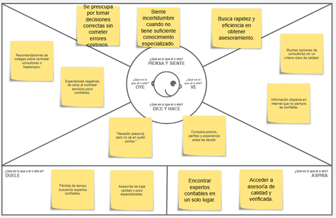

## 2.1. Competidores  
### 2.1.1. Análisis Competitivo  
**Competitive Analysis Landscape**

| Categoría | **Meal Flow (Nuestra Startup)** | Clarity.fm | Superpeer | Maven |
|------------|----------------------------|-------------|------------|--------|
| **Perfil / Overview** | Plataforma digital enfocada en la organización y optimización de comidas/servicios de alimentación, permitiendo a los usuarios gestionar, planificar o acceder a soluciones de comida de forma eficiente y personalizada. | Marketplace de expertos para asesorías 1 a 1 mediante llamadas pagadas por minuto. Enfoque en negocios, marketing y tecnología.     | Plataforma para creadores que ofrece videollamadas 1 a 1, eventos en vivo y suscripciones para monetizar audiencia.     | Plataforma de aprendizaje en cohortes con cursos en vivo guiados por expertos en distintas áreas profesionales.     |
| **Ventaja Competitiva** | Experiencia personalizada, enfoque en conveniencia y eficiencia, con potencial de recomendaciones inteligentes y optimización del servicio. | Red consolidada de expertos y modelo flexible de pago por minuto. | Fuerte enfoque en monetización de creadores y construcción de comunidad. | Aprendizaje estructurado en cohortes con alto valor educativo. |
| **Mercado Objetivo** | Usuarios que buscan soluciones prácticas relacionadas con alimentación: profesionales ocupados, estudiantes y familias que valoran eficiencia. | Emprendedores, freelancers y profesionales que requieren asesorías puntuales. | Creadores de contenido, coaches y profesionales con audiencia propia. | Profesionales y empresas interesadas en formación continua estructurada. |
| **Estrategias de Marketing** | Marketing digital (SEO, redes sociales), alianzas con servicios de alimentación, apps de bienestar y comunidades fitness/salud. | SEO, LinkedIn y contenido enfocado en negocios y startups. | Branding personal, redes sociales y crecimiento de comunidad. | Webinars, email marketing y alianzas con expertos educativos. |
| **Productos y Servicios** | Planificación de comidas, recomendaciones personalizadas, gestión de pedidos o suscripciones, optimización de hábitos alimenticios. | Llamadas 1 a 1 con expertos pagadas por minuto. | Videollamadas, eventos en vivo y suscripciones premium. | Cursos en vivo, materiales educativos y sesiones interactivas. |
| **Precios y Costos** | Modelo flexible (suscripción o comisión por servicio), con potencial de planes personalizados. | Pago por minuto según el experto. | Comisión por transacción + suscripciones mensuales. | Pago por curso (modelo premium). |
| **Canales de Distribución** | Aplicación móvil y web, optimizada para uso rápido y cotidiano. | Principalmente web. | Web y app móvil. | Plataforma web enfocada en educación. |
| **SWOT - Fortalezas** | Experiencia centrada en conveniencia, personalización y posible uso de tecnología para optimización. | Red de expertos consolidada y modelo simple de monetización. | Fuerte ecosistema de creadores y comunidad activa. | Alta calidad educativa y estructura sólida de aprendizaje. |
| **SWOT - Debilidades** | Baja presencia inicial en el mercado, necesidad de construir confianza y adopción del usuario. | Costos altos en sesiones largas. | Dependencia de creadores con audiencia previa. | Público más limitado y especializado. |
| **SWOT - Oportunidades** | Crecimiento del mercado food-tech, apps de bienestar y soluciones de conveniencia alimentaria. | Expansión hacia nuevos formatos de consultoría. | Expansión de monetización digital y nuevas audiencias. | Crecimiento de educación online profesional. |
| **SWOT - Amenazas** | Alta competencia en apps de comida, delivery y supermercados digitales. | LinkedIn, Upwork y plataformas de freelancing. | Patreon y plataformas similares. | Coursera, edX y plataformas educativas masivas. |

## 2.1.2. Estrategias y tácticas frente a competidores

### 1. Aprovechar la fortaleza: Verificación de expertos y asesoría personalizada
**Estrategia**  
Diferenciar la plataforma mediante un sistema de verificación más riguroso de expertos y la entrega de asesorías altamente personalizadas y de calidad superior.

**Tácticas**
- **Sistema de verificación reforzado:**  
  Implementar un proceso de selección exigente para garantizar que solo profesionales altamente calificados formen parte de la plataforma, diferenciándose de competidores como Clarity.fm.
- **Enfoque en asesoría personalizada:**  
  Diseñar campañas de marketing que resalten soluciones adaptadas a cada usuario, destacando un enfoque más profundo y específico frente a servicios más genéricos.
- **Control de calidad continuo:**  
  Evaluación constante de los expertos mediante calificaciones, feedback y métricas de satisfacción del usuario.

**Valor añadido**
- Mayor nivel de confianza en la plataforma.  
- Incremento en la fidelización y retención de usuarios.  
- Posicionamiento como servicio premium de asesoría.

---

### 2. Aprovechar la oportunidad: Crecimiento de la demanda de asesoría remota
**Estrategia**  
Posicionar la plataforma como una solución líder en asesoría remota, aprovechando el crecimiento sostenido de servicios digitales post-pandemia.

**Tácticas**
- **Campañas educativas multicanal:**  
  Generar contenido en redes sociales, blogs y webinars explicando los beneficios de la asesoría remota y el valor de la plataforma.
- **Alianzas estratégicas:**  
  Establecer convenios con empresas, colegios profesionales y asociaciones para ampliar la oferta de servicios y generar ingresos recurrentes.
- **Mejora de la experiencia digital:**  
  Incorporar videollamadas de alta calidad, chat en tiempo real y sistemas de pago seguros para una experiencia fluida y profesional.

**Valor añadido**
- Expansión del alcance del mercado.  
- Mayor adopción de la plataforma en entornos corporativos.  
- Incremento de ingresos por volumen de usuarios.

---

### 3. Afrontar la amenaza de competidores consolidados con grandes bases de usuarios
**Estrategia**  
Fortalecer el posicionamiento de la plataforma a través de confianza, especialización y valor agregado frente a competidores ya establecidos.

**Tácticas**
- **Enfoque en seguridad y confianza:**  
  Comunicar de forma clara el proceso de verificación de expertos como elemento diferenciador clave.
- **Modelo freemium:**  
  Ofrecer acceso gratuito básico con opciones premium para reducir la barrera de entrada y atraer nuevos usuarios.
- **Especialización por sectores:**  
  Desarrollar verticales específicos como asesoría legal, financiera, tecnológica y empresarial.

**Valor añadido**
- Mayor captación de usuarios nuevos.  
- Diferenciación frente a plataformas generalistas.  
- Incremento de conversiones a planes premium.

---

### 4. Mitigar la debilidad de dependencia del SEO y baja visibilidad inicial
**Estrategia**  
Implementar una estrategia integral de marketing digital para acelerar la visibilidad y adquisición de usuarios.

**Tácticas**
- **Marketing de contenido de alto valor:**  
  Publicación de artículos, videos y casos de éxito orientados a resolver problemas reales del usuario.
- **Publicidad segmentada:**  
  Campañas en redes sociales dirigidas a profesionales y empresas en sectores clave como tecnología, salud, derecho y negocios.
- **SEO + alianzas estratégicas:**  
  Optimización del posicionamiento orgánico y colaboración con instituciones, universidades y asociaciones profesionales.

**Valor añadido**
- Aumento rápido de visibilidad en el mercado.  
- Posicionamiento de marca en nichos específicos.  
- Generación constante de tráfico cualificado.

## 2.3. Needfinding

En esta sección se presenta el proceso de análisis de la información recolectada a partir de entrevistas y observación de usuarios potenciales. El objetivo es identificar necesidades, comportamientos, motivaciones y principales puntos de dolor, con el fin de sustentar el diseño de la solución.

Como resultado del proceso de needfinding, se desarrollan y presentan los siguientes artefactos de análisis:

- **User Personas:** representación de los perfiles de usuarios clave identificados, describiendo sus características, objetivos, necesidades y frustraciones.
- **User Task Matrix:** matriz que permite priorizar y analizar las tareas más relevantes que los usuarios realizan dentro del contexto del problema.
- **User Journey Maps:** mapeo de la experiencia del usuario a lo largo de su interacción con el servicio, identificando puntos de contacto, emociones y oportunidades de mejora.
- **Empathy Mapping:** herramienta que permite profundizar en lo que el usuario piensa, siente, dice y hace, facilitando una comprensión más humana de sus necesidades.
- **As-Is Scenario Mapping:** análisis del escenario actual del usuario antes de la solución, permitiendo identificar problemas, ineficiencias y oportunidades de innovación.

Este conjunto de artefactos permite construir una visión clara y estructurada del usuario, sirviendo como base fundamental para el diseño de la solución propuesta.

### 2.3.1. User Personas

A continuación, se presentan las fichas de **User Personas** elaboradas a partir del análisis de las entrevistas realizadas. Estas representaciones sintetizan los principales perfiles de usuarios identificados, sus necesidades, objetivos, motivaciones y principales puntos de dolor dentro del contexto de la solución.

---

#### Segmento #1: Solicitante de Servicios

Este perfil representa a los usuarios que buscan contratar servicios de asesoría o apoyo profesional de manera rápida, confiable y personalizada. Generalmente, son personas que valoran la eficiencia, la facilidad de uso de la plataforma y la seguridad al momento de seleccionar a un experto.

Sus principales necesidades se centran en encontrar profesionales calificados, reducir el tiempo de búsqueda y contar con una experiencia de servicio clara y sin fricciones. Entre sus principales frustraciones destacan la falta de confianza en plataformas poco verificadas y la dificultad para identificar expertos realmente confiables.

---

#### Segmento #2: Proveedores de Servicios

Este perfil corresponde a profesionales o expertos que ofrecen sus servicios dentro de la plataforma. Su principal objetivo es monetizar su conocimiento, ampliar su alcance y conectar con clientes potenciales de forma eficiente.

Entre sus necesidades destacan contar con una plataforma que les brinde visibilidad, un sistema de pagos seguro y herramientas que faciliten la gestión de sus servicios. Sus principales frustraciones incluyen la baja visibilidad en plataformas saturadas, la competencia elevada y la dificultad para captar clientes de calidad.

---

Estos dos segmentos permiten comprender de manera clara las dos partes fundamentales del ecosistema de la plataforma, facilitando el diseño de una solución equilibrada tanto para usuarios solicitantes como para proveedores de servicios.
  
### 2.3.2. User Task Matrix

A continuación se muestra el proceso para la realizacion del User Task Matrix para comprender las tareas que realizan los User Persona para cumplir sus objetivos.

**Segmento #1: Solicitante de Servicios**

| Tarea                         | Frecuencia    | Importancia      |
|-------------------------------|----------------|----------------|
| Buscar profesionales | Alta   | Alta   |
| Crear y configurar su perfil | Media   | Alta    |
| Realizar pagos por el servicio | Alta    | ALta   |
| Calificar al profesional | Media   | Media   |
| Coordinar fechas o entregas | Media  | Media  |
| Consultar opiniones o reseñas | Alta  | Alta  |

**Segmento #2: Proveedores de Servicios**

| Tarea                         | Frecuencia    | Importancia      |
|-------------------------------|----------------|----------------|
| Crear y configurar su perfil | Alta   | Alta   |
| Publicar servicios y actualizar info | Alta  | Alta    |
| Responder mensajes y consultas | Alta    | ALta   |
| Recibir pagos | Media   | Media   |
| Promocionar su perfil | Media  | Media  |
| Gestionar disponibilidad de horarios | Alta  | Alta  |

### 2.3.3. User Journey Mapping

A continuación se muestra el proceso para la realización del User Journey Mapping para los User Persona con el fin de entender las experiencias del usuario sin nuestra solución.

**Segmento #1: Solicitante de Servicios**

**Segmento #2: Proveedores de Servicios**

### 2.3.4. Empathy Mapping

A continuación se muestra el proceso para la realización del Empathy Mapping para los User Persona con el fin de entender lo que piensa, siente, oye, hace y observa.

**Segmento #1: Solicitante de Servicios**

Link del Empathy Mapping: https://docs.google.com/drawings/d/1ldThwGvffPsPR6Ea6FWCU5DBOGQAVvXugWDPmzPzgD8/edit?usp=sharing

**Segmento #2: Proveedores de Servicios**

Link del Empathy Mapping: https://docs.google.com/drawings/d/1iiU7QqJ-yt0utAPLlAPtQgQrVaNgFb6AWoq7JaNGiV0/edit

### 2.3.5. As-is Scenario Mapping

A continuación se muestra el proceso para la realización del As-Is Scenario Mapping para los User Persona.

**Segmento #1: Solicitante de Servicios**

**Segmento #2: Proveedores de Servicios**

